# 1. Indice

- [1. Indice](#1-indice)
- [2. Campionamento e Ricostruzione dei Segnali Lineari Stazionari](#2-campionamento-e-ricostruzione-dei-segnali-lineari-stazionari)
	- [2.1. Trasformata Discreta di Fourier - `TDF`](#21-trasformata-discreta-di-fourier---tdf)
	- [2.2. Condizione di Nyquist](#22-condizione-di-nyquist)
	- [2.3. Interpolatori](#23-interpolatori)
		- [2.3.1. Interpolazione a mantenimento](#231-interpolazione-a-mantenimento)
	- [2.4. Interpolatore Cardinale](#24-interpolatore-cardinale)
- [3. Teorema del Campionamento](#3-teorema-del-campionamento)
	- [3.1. Implementabilità](#31-implementabilità)

# 2. Campionamento e Ricostruzione dei Segnali Lineari Stazionari

Riprendendo la discussione che avevamo fatto [quando abbiamo studiato i segnali](./Segnali), adesso vedremo come effettivamente fare il passaggio **_da analogico a digitale_**.

Qualunque sia la natura di un segnale dobbiamo porci sempre la stessa domanda: _"Con quale frequenza dobbiamo campionare il segnale analogico per non avere perdita di informazione?"_

Prendendo i due segnali sulla destra, il segnale $x(t)$ varia **più rapidamente** rispetto ad $y(t)$, quindi richiede un **tempo di campionamento più piccolo**.

Ma se un segnale varia più velocemente di un altro nel tempo, vuol dire che in frequenza avrà **banda maggiore**.

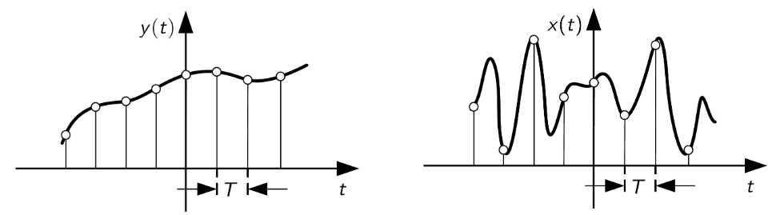

La seconda domanda fondamentale è _"Quale interpolatore usare per evitare perdita di informazione?"_
In altre parole, dobbiamo verificare se esiste un interpolatore $p(t)$ tale per cui il segnale interpolato $\hat x(t)$ è **uguale** al segnale iniziale $x(t)$.

## 2.1. Trasformata Discreta di Fourier - `TDF`

Per rispondere a queste due domande dobbiamo passare al **_dominio della frequenza_**.
Poiché lavoriamo con segnali discreti definiamo la **_Trasformata Discreta di Fourier_**:
$$
\Large
\boxed{
	\overline X(f) = \sum_n{x(nT) e^{-j2\pi f nT}}
}
$$

Analogamente definiamo l'**_AntiTrasformata Discreta di Fourier_**:
$$
\Large
\boxed{
	x(nT) = T \int_{-\frac{1}{2T}}^{1 \over 2T}{\overline{X}(f) e^{j2\pi fnT}\;df}
}
$$

È possibile dimostrare (la omettiamo per semplicità ma dovremmo essere in grado di comprenderla) che la `TDF` dipende dalla `TCF`:
$$
\LARGE
\boxed{
	\overline{X}(f) = \frac{1}{T} \sum_{k}{X\Biggl(f - \frac{k}{T}\Biggr) = f_c \sum_{k}}\Biggl(f - kf_c\Biggr)
}
$$

Quello che accade quindi è che la `TCF` $X(f)$ di un segnale analogico viene **periodicizzata** (_aliased_), ovvero replica il suo spettro (_aliasing_) ai multipli della frequenza di campionamento.

Assumendo di avere un segnale a _tempo continuo **limitato nella banda $B$**_.

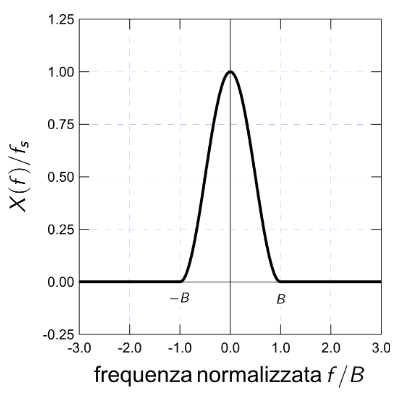

Nell'ipotesi in cui lo campioniamo con una frequenza $f_c \ge 2B$, otteniamo che la frequenza viene replicata **_senza avere sovrapposizione tra le repliche_**.
Questo significa che _**lo spettro in banda non viene distorto**_. Possiamo quindi dire di aver effettuato un **_buon campionamento_**.

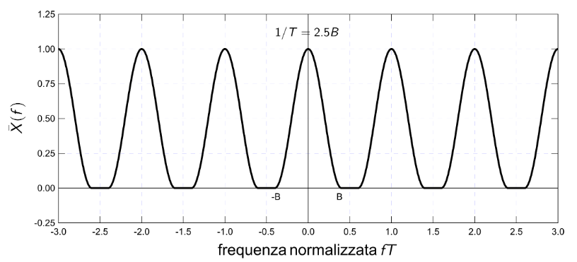

Se invece campionassimo ad una frequenza $f_c \le 2B$, otteniamo tante frequenze replicate che **si sovrappongono tra di loro**.

Questo segnale **_perde tutte le informazioni del segnale iniziale_**. In banda l'_aliasing_ rende _**lo spettro irriconoscibile in banda**_.

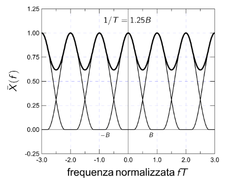

## 2.2. Condizione di Nyquist

Per segnali a banda limitata $B$ la _**Condizione di Nyquist**_ recita che:
> Per frequenze di campionamento $f_c \ge f_N = 2B$ l'_aliasing_ è **eliminata** e lo spettro $X(f)$ del segnale analogico è **preservato**.

La frequenza minima di campionamento è detta _**Frequenza di Nyquist**_:
$$
\large
	f_N = 2B
$$

Per limitare in banda i segnali reali si utilizzano dei speciali filtri detti **filtri anti-aliasing**.

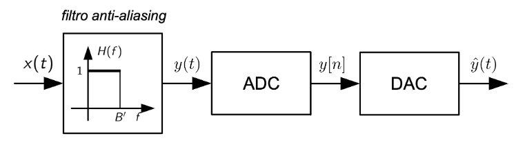

In questo caso la condizione di **Nyquist** diventa:
$$
	f_c \ge f_N = 2B'
$$

In questo caso il segnale ricostruito $\hat y(t)$ **_non potrà mai essere uguale al segnale originale_** $x(t)$, dal momento che il filtro elimina le frequenze $f > B'$.

Un esempio di questo è l'_orecchio umano_. Le nostre orecchie infatti percepiscono solo le frequenze tra $20$ $Hz$ e $20$ $kHz$.

Questo significa che possiamo considerare i segnali audio come se fossero **limitati in banda con** $B = 20$ $kHz$.

La condizione di Nyquist quindi recita che:
$$
	f_c \ge 2B = 40\;kHz
$$

Le frequenze di campionamento standard infatti sono per i _CD_ $44.1$ $kHz$ e per i _DVD_ $48$ $kHz$. Questi valori, leggermenti superiori a _Nyquist_, introducono un **margine di sicurezza** e permettono di **facilitare la ricostruzione del segnale**.

Se invece vogliamo salvare o trasmettere dei segnali audio, è utile **ridurre la frequenza di campionamento**, per due vantaggi principali:
1. Limitare la dimensione dei dati e il costo della trasmissione
2. Le componenti tra $15$ e $20$ $kHz$ sono spesso poco percepite, e quindi possono essere "perse" senza troppi problemi

In alcuni formati infatti si usa $f_c = 32$ $kHz < 2B$, **_inferiore a Nyquist_**.

Applicano quindi un _filtro anti-aliasing_ che limita la banda a $15$ $kHz$, così da soddisfare nuovamente la condizione di Nyquist. Questa scelta perde la qualità del segnale, ma anche la **_quantità dei dati_**, mantenendo comunque un ascolto accettabile.

## 2.3. Interpolatori

### 2.3.1. Interpolazione a mantenimento

Definiamo _**Interpolatore a mantenimento**_ la funzione _rect_:
$$
\begin{matrix}
	p(t) = \operatorname{rect}(\frac{t - T/2}{T}) & \Leftrightarrow & P(f) = T \operatorname{sinc}(fT)e^{-j\pi fT}
\end{matrix}
$$

Se utilizziamo questo interpolatore il segnale ricostruito avrà la forma:
$$
	\hat{x}(t) = \sum_{n }{x[n]p(t-nT)} = \sum_{n}{x[n]\operatorname{rect}(\frac{t - T/2 - nT}{T})}
$$

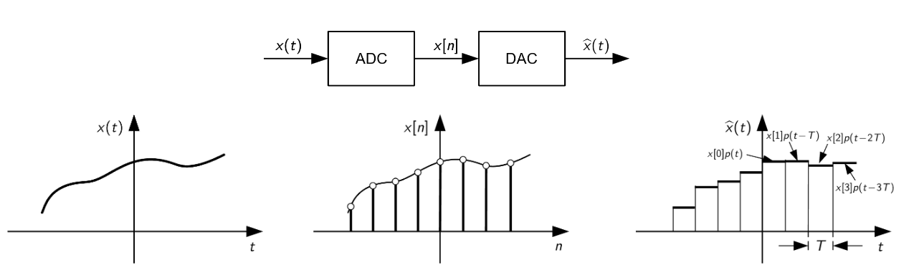

Queste ricostruzioni, come possiamo vedere, **non sono ricostruzioni fedeli del segnale**.

Infatti se calcoliamo la `TCF` $\hat{X}(f)$ del segnale ricostruito otteniamo che:
$$
\begin{align*}
	\hat{X}(f)  &= \sum_n{x(nT)P(f)e^{-2\pi fnT}} \\
				&= \sum_n{x(nT)e^{-2\pi fnT}P(f)} \\
				&= \overline{X}(f)P(f)
\end{align*}
$$

Otteniamo quindi che la trasformata del segnale $\hat{x}$ si ottiene moltiplicando la trasformata discreta $\overline{X}(f)$ per la trasformata continua dell'interpolatore $P(f)$.

Supponuamo che questa sotto sia la `TFC` del segnale analogico $x(t)$:

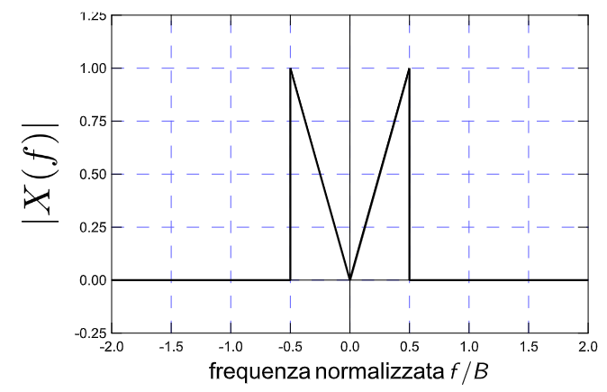

Nell'ipotesi in cui $f_c = \frac{1}{T} = 2.5B$, soddisfando quindi il criterio di Nyquist, il nostro interpolatore a manteniimento produce il segnale sulla destra.

Questo segnale produce:
- _**Distorsioni in Banda**_, va eliminare, almeno parzialmente, le immagini del nostro segnale
- **Distorsioni Fuori Banda**: anche gli _alias_ vengono distorti e passano il segnale.

Le distorsioni fuori banda possono però essere filtrati e cancellati. Nel tempo questa cancellazione provoca un effetto sulle _discontinuità del mantenimento_, che vengono smussate.

<figure class="100">
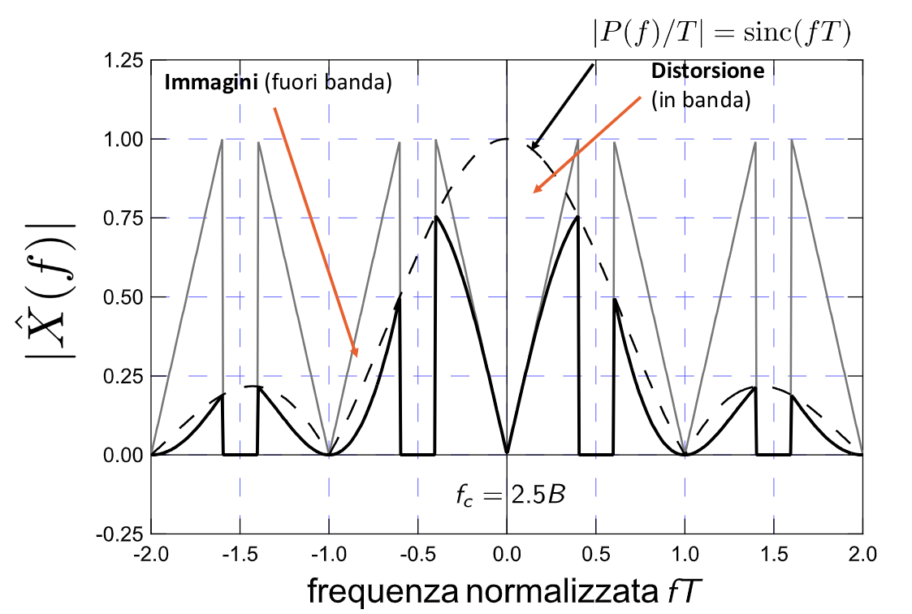
<figcaption>

Il segnale in grigio rappresenta la `TDF` $\bigl(\overline{X}(f)\bigr)$
Il segnale tratteggiato rappresenta la `TCF` dell'interpolatore $\bigl(P(f)\bigr)$
Il segnale nero rappresenta invece la `TFC` del segnale $\bigl(x(t)\bigr)$
</figcaption>
</figure>

## 2.4. Interpolatore Cardinale

Per evitare le distorsioni utilizziamo l'_**Interpolatore Cardinale**_:

$$
\begin{matrix}
	P(f) = T\operatorname{rect}(fT) & \Leftrightarrow & p(t)) = \operatorname{sinc}(\frac{t}{T})
\end{matrix}
$$

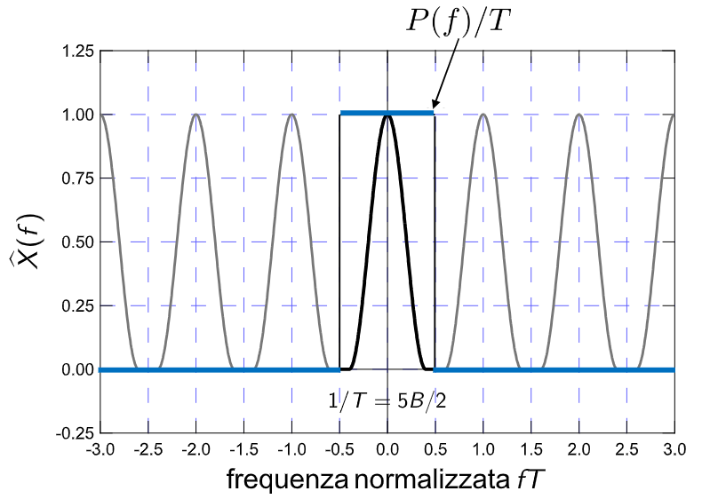

# 3. Teorema del Campionamento

> Se $x(t)$ è un segnale limitato in banda e campionato con $f_c \ge 2B$, allora **può essere ricostruito _esattamente_** dai suo campioni $x[n]$ tramite _**interpolazione cardinale**_
>
> $$
> \Large
> \boxed{
> 	\hat{x}(t) = \sum_n{x[n]\operatorname{sinc}\Biggl(\frac{t - nT}{T}\Biggr)} = x(t)
> }
> $$

## 3.1. Implementabilità

In pratica la ricostruzione ideale non è possibile se non nella teoria. Questo avviene per due motivi:
1. La banda finita implica _durata infinita_, che implica una somma infinita di campioni.
2. In _real-time_ non è possibile realizzare l'interpolatore, in quanto la $\operatorname{sinc}$ è un segnale **non causale** $(h(t) \ne h(t)u(t))$.

Infatti, in _real-time_ non conosciamo i segnali futuri, che però sono necessari per inteprolare l'istante attuale

Inoltre la $\operatorname{sinc}$ è un segnale di durata infinita nel tempo, con una trasformata in frequenza discreta. Questo tipo di segnali sono **impossibili da replicare**.

Per aggirare questi problemi possiamo modificare le nostre funzioni.

Ad esempio, per rendere la somma infinita una somma _finita_, è sufficiente **troncare l'interpolatore cardinale**:
$$
p_\Delta(t) = \operatorname{sinc}/\Bigl(\frac{t}{T}\Bigr)\operatorname{rect}\Bigl(\frac{t}{\Delta}\Bigr)
$$

<figure class="">
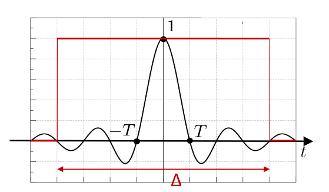
<figcaption>

La scelta di $\Delta$ è un compromesso tra la complessità e l'accuratezza.
Valori troppo piccoli, come ad esempio $\Delta = 2T$ non sono adeguati e provocano imprecisioni non ignorabili.
</figcaption>
</figure>

In questo caso la formula di ricostruzione del segnale diventa:
$$
\large
	\hat{x}(t) = \sum_n{x[n]p_\Delta(t - nT)}
$$

Per rendere la ricostruzione **causale**, dopo aver troncato l'interpolatore cardinale è necessario traslarlo nel tempo.
$$
p_\Delta \Bigl(t - \frac{\Delta}{2}\Bigr)
$$

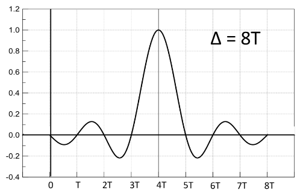

La formula di ricostruzione del segnale diventa quindi:
$$
\Large
\boxed{
	\hat{x}(t) = \sum_n{x[n]p_\Delta\Biggl(t - nT - \frac{\Delta}{2}\Biggr)}
}
$$

È importante fare attenzione al fatto che l'introduzione del traslamento introduce un ritardo iniziale di $\Delta / 2$ nella ricostruzione del segnale

