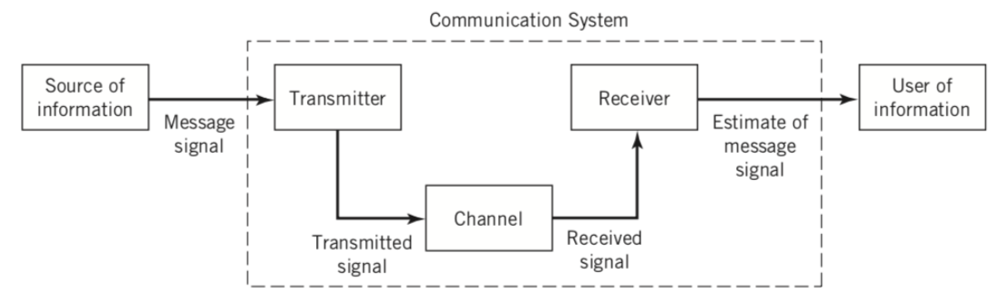
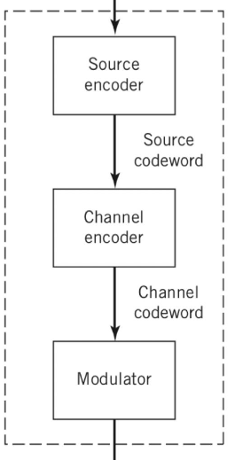
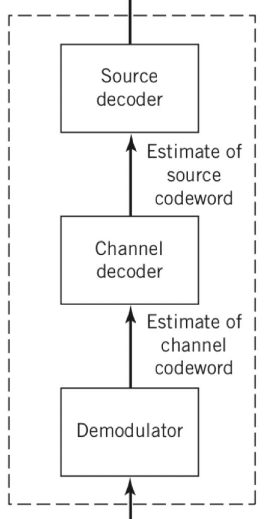

# 1. Indice

- [1. Indice](#1-indice)
- [2. Introduzione](#2-introduzione)
- [3. Elementi di un Sistema di Comunicazione](#3-elementi-di-un-sistema-di-comunicazione)
	- [3.1. Trasmettitore](#31-trasmettitore)
	- [3.2. Ricevitore](#32-ricevitore)
	- [3.3. Modelli di comunicazione](#33-modelli-di-comunicazione)
	- [3.4. Tecniche di Accesso Multiplo](#34-tecniche-di-accesso-multiplo)
	- [3.5. Spettro delle Frequenze Radio](#35-spettro-delle-frequenze-radio)

# 2. Introduzione

Nel 1948, il matematico _Claude Shannon_, scoprì che il _trasmission rate_ di un canale è minore o uguale alla capacità del mezzo.
La capacità massima del mezzo, intesa come il numero medio di bit trasmissibili in un secondo, è data dalla formula:
$$
C = \log_2{\Biggl(1 + \frac{\text{Signal}}{\text{Noise}}\Biggr)} \; [bit/s \cdot Hz]
$$

# 3. Elementi di un Sistema di Comunicazione

Gli elementi fondamentali di un canale di comunicazione sono tre:
1. **Trasmettitore**: connesso con la sorgente dell'informazione e propaga verso il canale di trasferimento
2. **Canale di trasferimento**: connette trasmettitore a ricevitore
3. **Ricevitore**: riceve messaggi dal canale di trasferimento e li propaga all'utilizzatore

## 3.1. Trasmettitore

Un trasmettitore è composto da ulteriori tre moduli:
- **Source Encoder**: è un dispositivo di **_compressione_**.
- **Channel Encoder**: è un dispositivo che _**introduce ridondanza**_ per aumentare la probabilità che il messaggio venga trasmesso correttamente
- **Modulatore**: è un dispositivo che trasforma i segnali digitali (_bit_) in segnali analogici (_waveform_)

Il ruolo del **Source Encoder** è quello di sfruttare la ridondanza all'interno di un messaggio per ridurne le dimensioni.
Se infatti avessimo un immagine di 100MB nera, è sufficiente inviare l'informazione di un pixel nero ripetuto $x$ volte, riducendo di molto l'invio.
È importante sottolineare che quseto passaggio **_deve avvenire senza perdite di informazioni_**.

Il **Channel Encoder** _introduce ridondanza nel messaggio_ per avere più garanzie nell'invio del messaggio così da mitigare le perdite di informazioni dovute all'invio di segnale attraverso il segnale di propagazione.

## 3.2. Ricevitore

Un ricevutore è composto a sua volta da tre blocchi:
- **Demodulatore**: converte segnali analogici in segnali digitali
- **Channel Decoder**: rimuove la ridondanza introdotta dal _channel encoder_ del trasmettitore
- **Source Decoder**: è un dispositivo di **_decompressione_**

## 3.3. Modelli di comunicazione

I modelli di comunicazione di base sono 3:
- **Broadcast**: utilizzata da televisioni e radio, un singolo trasmettitore trasmette un segnale a più ricevitori
- **Punto-Punto**: la comunicazione avviene su un mezzo condiviso tra un trasmettitore e un ricevitore
- **Punto-Multipunto**: utilizzata dai dispositivi cellulari e wifi, permette la comunicazione tra un singolo trasmettitore e più ricevutori attraverso un canale

## 3.4. Tecniche di Accesso Multiplo

L'**Accesso Multiplo** permette a più terminali di condividere il canale di comunicazione.

Per riuscire a trasmettere i segnali senza che questi facciano interferenza tra di loro si possono utilizzare diverse tecniche:
1. **_Time-Division Multiple Access_** `TDMA`: definito un periodo di tempo questo viene diviso in tante parti ugual quanti sono i dispositivi che vogliono comunicare. Successivamente viene permesso loro di comunicare solamente nell'intervallo assegnato, affinché, in un determinato istante, solo uno alla volta possa comunicare. Era utilizzato nelle reti 2G.
2. **_Code-Division Multiple Access_** `CDMA`: sfrutta le sequenze di codice. Assegna infatti ad ogni terminale un codice univoco così da poter trasmettere i vari messaggi come se fosse un unico grosso messaggio. Chi lo riceve recupera la porzione desiderata a partire dal codice del trasmettitore. Era utilizzato nelle reti 3G.
3. **_Frequency-Division Multiple Access_** `FDMA`: assegna ad ogni terminale una _frequenza dedicata_. È utilizzata nelle reti 4G ed è quella che vedremo in questo corso. Ne esiste anche una versione ibrida con la `TDMA`, che cambia le requenze per ogni intervallo di tempo.
5. **_Space-Division Multiple Access_** `SDMA`: sfrutta la divisione di tempo, frequenza e _spazio_ (ineso come posizione fisica) tra gli utenti. È utilizzata nelle reti 5G.

## 3.5. Spettro delle Frequenze Radio

I sistemi di comunicazioni radio operano nello spettro di comunicazioni che va da $3 Hz$ ai $300 GHz$.
La fisica non ci impedisce di utilizzare frequenze maggiori a $300GHz$, tuttavia a quelle frequenze le lunghezze d'onda delle trasmissioni sono paragonabili a quelle degli ostacoli fisici che incontrano. QUando queste due dimensioni sono nello stesso ordine di grandezza, l'onda non riesce a propagarsi attraverso l'ostacolo, ma piuttosto vi rimbalza.

- I sistemi WiFi comunicano nelle frequenze dei $2.4GHz$, $5.1GHz$.
- I sistemi cellulari comunicano invece nelle frequenze sotto i $6GHz$.
- Le reti 6G contano di poter operare tra i $7GHz$ e i $14GHz$.