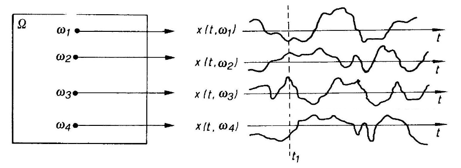
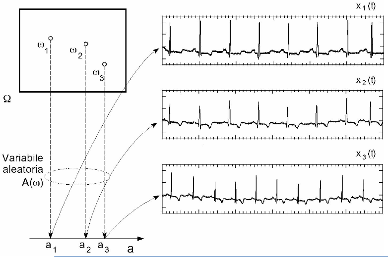
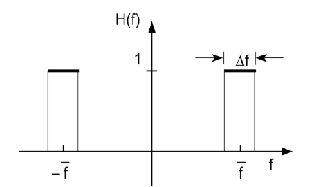
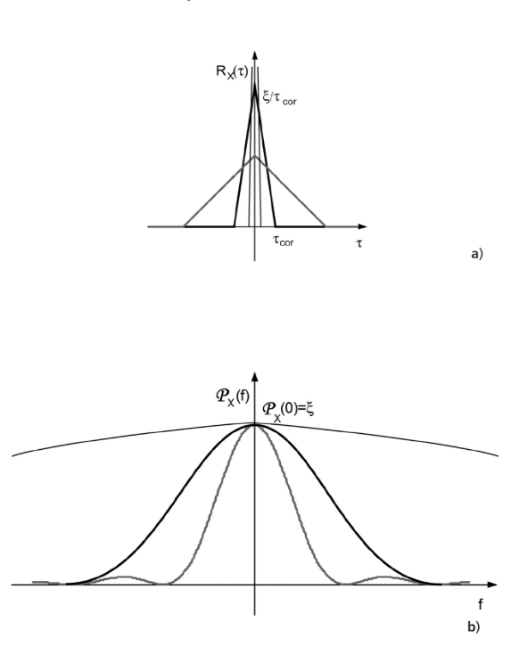
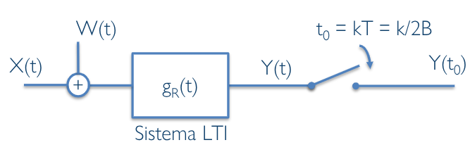
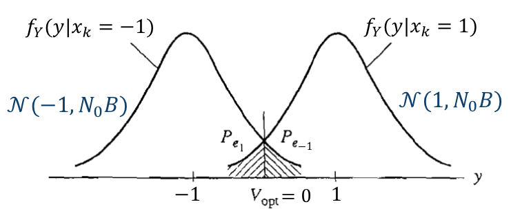

# 1. Indice

- [1. Indice](#1-indice)
- [2. Processi Aleatori](#2-processi-aleatori)
	- [2.1. Definizione Formale](#21-definizione-formale)
	- [2.2. Specificazioni](#22-specificazioni)
		- [2.2.1. Specificazione Diretta](#221-specificazione-diretta)
		- [2.2.2. Specificazione in Forma Parametrica](#222-specificazione-in-forma-parametrica)
	- [2.3. Descrizione Statistica](#23-descrizione-statistica)
		- [2.3.1. Primo Ordine](#231-primo-ordine)
		- [2.3.2. Secondo Ordine](#232-secondo-ordine)
	- [2.4. Descrizione in Potenza](#24-descrizione-in-potenza)
- [3. Stazionarietà dei Processi Aleatori](#3-stazionarietà-dei-processi-aleatori)
	- [3.1. Stazionarietà del Primo Ordine](#31-stazionarietà-del-primo-ordine)
	- [3.2. Stazionarietà del Secondo Ordine](#32-stazionarietà-del-secondo-ordine)
	- [3.3. Stazionarietà in Senso Lato](#33-stazionarietà-in-senso-lato)
- [4. Proprietà Funzione di Autocorrelazione](#4-proprietà-funzione-di-autocorrelazione)
- [5. Filtraggio di un Processo Aleatorio](#5-filtraggio-di-un-processo-aleatorio)
	- [5.1. Filtraggio Processi Aleatori Stazionari in Senso Lato](#51-filtraggio-processi-aleatori-stazionari-in-senso-lato)
- [6. Densità Spettrale di Potenza](#6-densità-spettrale-di-potenza)
- [7. Processo di Rumore bianco a Tempo Continuo](#7-processo-di-rumore-bianco-a-tempo-continuo)
	- [7.1. Esempio - Rumore Termico](#71-esempio---rumore-termico)
	- [7.2. Rumore Bianco Filtrato da Filtro LP Ideale](#72-rumore-bianco-filtrato-da-filtro-lp-ideale)
- [8. Processi Aleatorio Gaussiani a Tempo Continuo](#8-processi-aleatorio-gaussiani-a-tempo-continuo)
- [9. Riassunto finale](#9-riassunto-finale)
	- [9.1. Processi Aleatori Gaussiani](#91-processi-aleatori-gaussiani)
	- [9.2. Processi Aleatori Gaussiani Stazionari](#92-processi-aleatori-gaussiani-stazionari)
	- [9.3. Processi Aleatori Gaussian Bianchi](#93-processi-aleatori-gaussian-bianchi)
	- [9.4. Filtraggio di un Processo Gaussiano](#94-filtraggio-di-un-processo-gaussiano)
		- [9.4.1. Filtraggio di un Processo Gaussiano Stazionario](#941-filtraggio-di-un-processo-gaussiano-stazionario)

# 2. Processi Aleatori

Dato un **esperimento casuale** di modello di probabilità assegnato, ad ogni risultato $\omega_i$ si associ una funzione reale $x(t,\omega)$ della variabile $t$.

Risulta così definito un insieme di funzioni $X(t,\omega)$ detto _**Processo Aleatorio**_, o _causale_ o _stocastico_, che indiceremo in breve con $X(t)$, omettendo la dipendenza da $\omega$.

Nella maggior parte delle applicazioni $t$ rappresenterà il _tempo_.

Le funzioni $x(t,\omega)$ sono funzioni dterministiche, nelle quali la casualità risiede solo nella presentazione di un particolare risultato dell'esperimento. La funzione che si osserva in una data prova prende il nome di **relizzazione** del processo.

Qualora si fissi un determinato istante di tempo $t_1$, ad ogni risultato dell'esperimento viene associato il valore numerico $x(t_1,\omega)$ della corrispondente realizzazione in quell'istante.

Si ottiene quindi una quantità dipendente da $\omega$, ovvero una variabile aleatoria indicata con $X(t_1)$.

Possiamo quindi dire che:
> Fissato il valore $t$ il processo causale $X(t)$  una **variabile aleatoria** che indicheremo per semplicità con $X(t)$

Se si fissano due istanti distinti $t_1$ e $t_2$ si ottengono invece due distinte variabili aleatorie $X(t_1)$ e $X(t_2)$ che costituiscono un _**sistema di variabili aleatorie**_, descritte nel **vettore aleatorio**:
$$
	X = \begin{bmatrix}
		X(t_1) \\
		X(t_2)
	\end{bmatrix}
$$

Analogamente, fissando $N$ istanti $t_1, ..., t_N$, si ottiene un **vettore di $N$ variabili aleatorie**:
$$
	X = \begin{bmatrix}
		X(t_1) \\
		\vdots \\
		X(t_N)
	\end{bmatrix}
$$

La **descrizione statistica** del processo implica perciò la _**conoscenza della legge di distribuzioni di tutti i possibili sistemi così formati**_.

## 2.1. Definizione Formale

> Un **processo aleatorio** $X(t, \omega)$ è un insieme di funzioni delle variabili $t$ e $\omega$.
>
> Fissato un istante $t_k$ di un processo aleatorio, $X(t_k, \omega)$ è una _**variabile aleatoria**_

> Si dice **realizzazione del processo** la funzione deterministica $x(t, \omega_i)$ della variabile $t$ dato un $\omega$ fissato.
>
> Fissato anche l'istante $t_k$, $x(t_k, \omega_i)$ è un **numero reale**

In molte applicazioni i risultati degli esperimenti sono _già delle forme d'onda_ (tensione di rumore, segnale musicale, ...). In questi casi non abbiamo più distinzioni tra _risultato_ e _realizzazione_.

## 2.2. Specificazioni

### 2.2.1. Specificazione Diretta

Un processo $X(t)$ si dice **statisticamente determinato** se, per ogni $N$ e per ogni $N$-upla di istanti $t_1, ..., t_N$, sono note le sue funzioni di distribuzione:
$$
	F_X(x_1, x_2, ..., x_N; t_1, t_2, ..., t_N) = P\Set{X(t_1) \le x_1, X(t_2) \le x_2, ..., X(t_N) \le x_N}
$$

Nota la distribuzione di ordine $N$ è possibile ricavare tutte le distribuzioni di ordine inferiore mediante le **regole marginali**, ma _non il viceversa_.

La funzione di distribuzione di ordine $N$ del processo p ka funzione di distribuzione del vettore di variabili aleatorie $X = \begin{bmatrix}X(t_1) & \cdots & X(t_N)\end{bmatrix}^T$ ottenuto fissando $N$ istanti.

Ricordiamo che il comportamento statistico di un processo stocastico è **completamente determinato** solo quando _**sono note le distribuzioni di tutti i possibili ordini**_.
Tuttavia in alcune applicazioni è sufficente conoscere la _descrizione in potenza del processo_, ovvero alcune statistiche dei primi due ordini

### 2.2.2. Specificazione in Forma Parametrica

Un processo $X(t)$ si dice **_parametrico_** quando può essere specificato attraverso la forma delle sue realizzazione, che _dipende parametricamente_ da un certo numero di variabili aleatorie:
$$
	X(t) = s(t; \Theta_1, \Theta_2, ..., \Theta_K)
$$

La caratterizzazione statistica completa del processo richiede comunque la **conoscenza della distribuzione di probabilità congiunta** dei parametri aleatori:
$$
f_\Theta(\theta_1, \theta_2, ..., \theta_K)
$$

Tra i vari esempi di _processi aleatori parametrici_ troviamo:
- **Tensione costante di valore aleatorio**: $X(t) = A$ &emsp; $A \in U(-1, 1)$
- **Oscillazione cosinusoidale con fase iniziale ingognita**: $X(t) = a\cdot \cos{(2\pi f_0t + \Theta)}$ &emsp; $\Theta \in U(0, \pi)$
- **Oscillazione cosinusoidale con ampiezza e fase inizale aleatorie**: $X(t) = A\cdot \cos{(2\pi f_0t + \Theta)}$ &emsp; $A \in R(\sigma^2) \atop \Theta \in U(0, \pi)$

## 2.3. Descrizione Statistica

### 2.3.1. Primo Ordine

Sapendo che, fissato un istante $t$, $X(t)$ rappresenta una variabile aleatoria, chiamiamo la sua funzione di distribuzione _**Funzione di Distribuzione del Primo Ordine**_:
$$
	F_X(x;t) = P\Set{X(t) \le x}
$$

Naturalmente, questa funzione dipende anche da una _variabile temporale_, dato che le proprietà statistiche di $X(t)$, in generale, cambiano proprio al cambiare del tempo $t$ al quale si "campiona" il processo.

Analogamente definiamo la _**Funzione Densità di Probabilità del Primo Ordine**_ del processo $X(t)$:
$$
	f_X(x;t) = \frac{\partial F_X(x;t)}{\partial x}
$$

Allo stesso modo possiamo definire gli _**Indici Statistici del Primo Ordine**_, come la _**Funzione valor medio**_:
$$
	n_X(t) = E\Set{X(t)} = \int{xf_X(x;t)\;dx}
$$

La **_Funzione Potenza Media Statistica_**:
$$
P_X(t) = E\Set{X^2(t)} = \int{x^2 f_X(x;t)\;dx}
$$

E la _**Funzione Varianza**_:
$$
\begin{align*}
	\sigma_X^2(t) &= E\Set{(X(t) - \eta_X(t))^2} \\
				  &= \int{(x-\eta_X(t))^2f_X(x;t)\;dx} \\
				  &= P_X(t) - \eta_X^2(t)
\end{align*}
$$

Ancge se conosciamo $F_x(x;t_1) = P(\Set{X(t_1), x})$ questa **non è sufficiente a caratterizzare le proprietà del processo**.

Ad esempio, il valore di un titolo in borsa ha un andamento non prevedibile. Se chiamiamo $X(t)$ la quotazione del titolo, un investitore è interessato che la quotazione in un istante $t_2$ sia aggiore della quotazione all'istante $t_1$:
$$
	P(\Set{X(t_2) \ge X(t_1)})
$$

Queta probabilità _**non può essere ricavata dalla funzione di primo ordine**_ $F_X(x;t_1)$, perché richiede la considerazione _congiunta di due variabili aleatorie dello stesso processo in **due istanti diversi**_.

### 2.3.2. Secondo Ordine

In due istanti $t_1$ e $t_2$, consideriamo le variabili aleatorie $X(t_1)$ e $X(t_2)$, la loro funzione di distribuzione congiunta, dipendente da $t_1$ e $t_2$, è detta **Funzione di Distribuzione del Secondo Ordine** del processo $X(t)$:
$$
	F_X(x_1,x_2; t_1,t_2) = P\Set{X(t_1) \le x_1, X(t_2) \le x_2}
$$

Analogamente, definiamo la _**Funzione Densità Di Probabilità del Secondo Ordine**_ del processo $X(t)$:
$$
	f_X(x_1,x_2; t_1,t_2) = \frac{\partial^2 F_X(x_1,x_2;t_1,t_2)}{\partial x_1 \partial x_2}
$$

> Il ragionamento può essere esteso a piacere
> Diciamo la descrizione statistica di un processo _completa_ solo quando riusciamo a caratterizzare il comportamento statistico congiunto di un numero $N$ arbitrario di variabili aleatorie estratte da una $X(t)$ a $N$ istanti diversi, comunque sia grande $N$ e comunque si scelga la $N$-upla di istanti $(t_1, t_2, ..., t_N)$

Fissati due istanti di tempo arbitrari nel nostro processo e chiamando $Y=X(t_1)$ e $Z = X(t_2)$, diventa significativa la **correlazione** $r_{YZ} = E\Set{YZ}$ fra queste due variabili.

Il valore di questa correlazione risulterà _funzione dei due istanti_ ai quali le variabili sono state estratte, e può essere calcolata _**solo conoscendo la densità di probabilità del secondo ordine**_ del processo:
$$
R_X(t_1,t_2) = E\Set{X(t_1)X(t_2)} = \int_{x_1 = -\infty}^{+\infty}{\int_{x_2 = -\infty}^{+\infty}{x_1x_2 \cdot f_X(x_1,x_2;t_1,t_2)\;dx_2}\;dx_1}
$$

La funzione $R_X(t_1,t_2)$ si chiama _**Funzione di Autocorrelazione**_, perché le due variabili aleatorie di cui si calcola la correlazione sono estratte **dallo stesso processo aleatorio**.

Se invvece vogliamo calcolare la _covarianza_ tra $Y$ e $Z$ otteniamo la _**Funzione di Autocovarianza**_:
$$
\begin{align*}
	C_X(t_1, t_2) &= E\Set{\bigl(X(t_1) - \eta_X(t_1)\bigr) \cdot \bigl(X(t_2) - \eta_X(t_2)\bigr)} \\
			&= \int_{x_1 = -\infty}^{+\infty}{\int_{x_2 = -\infty}^{+\infty}{(x_1 - \eta_X(t_1))(x_2 - \eta_X(t_2)) \cdot f_X(x_1,x_2;t_1,t_2)\;dx_2}\;dx_1} \\
			&= R_X(t_1,t_2) - \eta_X(t_1)\eta_X(t_2)
\end{align*}
$$

Ponendo $t_1 = t_2 = t$:
- Autocorrelazione $\to$ Potenza media Statistica istantanea &emsp; $R_X(t,t) = E\Set{X^2(t)} = P_X(t)$
- Autocovarianza $\to$ Varianza &emsp; $C_X(t,t) = E \Set{\bigl(X(t) - \eta_X(t)\bigr)^2} = \sigma_X^2(t)$

## 2.4. Descrizione in Potenza

IN molti casi, ci si accontenta di studiare un processo $X(t)$ analizzandone solamente la **funzione valor medio** e la **funzione di autocorrelazione**:

Funzione Valor Medio

È un indice statistico di ordine 1.

Tipicamente funzione del tempo, è il valore medio della variabile aleatoria $X(t)$:
$$
\large
\eta_X = E\Set{X(t)} = \begin{cases}
	\sum_i{x_i P\Set{X(t) = x_i}} \\[1em]
	\int_{-\infty}^\infty{xf_X(x;t)\;dx}
\end{cases}
$$

Funzione di Autocorrelazione

È un indice statistico di ordine 2.

Funzione di $t_1$ e $t_2$, è la correlazione delle variabili aleatoria $X(t_1)$ e $X(t_2)$:
$$
\large
R_X(t_1,t_2) = E\Set{X(t_1)X(t_2)} = \begin{cases}
	\sum_i{\sum_j{x_ix_j P\Set{X(t_1) = x_i, X(t_2) = x_j}}} \\[1em]
	\int_{x_1 = -\infty}^{+\infty}{\int_{x_2 = -\infty}^{+\infty}{x_1x_2 \cdot f_X(x_1,x_2;t_1,t_2)\;dx_2}\;dx_1}
\end{cases}
$$

# 3. Stazionarietà dei Processi Aleatori

Un processo aleatorio si dice _**Stazionario in Senso Stretto**_ se il suo comportamento statistico è **invariante** rispetto ad una _traslazione dell'origine dei tempi_.

Ciò significa che due processi $X(t)$ e $X(t + \varepsilon)$ hanno le stesse statistiche _**per ogni valore $\varepsilon$**_ e _**per ogni ordine $N$**_, ovvero:
$$
\begin{matrix}
	f_X(x_1,..., x_N;t_1,...,t_N) = f_X(x_1,...,x_N;t_1+\varepsilon, ..., t_N+\varepsilon) && \forall\varepsilon,t_1,...,t_N,N
\end{matrix}
$$

I processi $X(t+\varepsilon)$ e $X(t)$ si dicono quindi _**statisticamente equivalenti**_, nel senso che, anche se le realizzazioni sono diverse, questi non sono distinguibili tramite le misurazioni delle loro statistiche

## 3.1. Stazionarietà del Primo Ordine

Un processo aleatorio si dice **stazionario di ordine 1**, se la _densità di probabilità_ del primo oriine soddisfa la seguente relazione:
$$
\begin{matrix}
	f_X(x; t) = f_X(x; t + \varepsilon) && \forall\epsilon, t
\end{matrix}
$$

Questo implica che la funzione di _densità di probabilità_ sia **indipendente da** $t$:
$$
\large
\boxed{
	f_X(x;t) = f_X(x)
}
$$

Ciò implica che gli indici di primo ordine sono **costanti**:
$$
\begin{align*}
	\eta_X(t) &= E\Set{X(t)} = \int{xf_X(x;t)\;dx} = \int{xf_X(t)\;dx} = \eta_X \\
	P_X(t) &= E\Set{X^2(t)} = \int{x^2f_X(x;t)\;dx} = \int{x^2f_X(t)\;dx} = P_X \\
	\sigma_X^2(t) &= P_X(t) - \eta_X^2(t) = P_X - \eta_X^2 = \sigma_X^2
\end{align*}
$$

## 3.2. Stazionarietà del Secondo Ordine

Un processo aleatorio si dice **stazionario di ordine 12*, se la _densità di probabilità_ del secondo oriine soddisfa la seguente relazione:
$$
\begin{matrix}
	f_X(x_1, x_2; t_1, t_2) = f_X(x_1, x_2; t_1 + \varepsilon, t_2 + \varepsilon) && \forall\epsilon, t_1, t_2
\end{matrix}
$$

Questo implica che la funzione di _densità di probabilità_ dipenda solo dalla differenza $\tau = t_2 - t_1$:
$$
\large
\boxed{
	f_X(x_1, x_2;t_1, t_2) = f_X(x_1, x_2; 0, t_2-t_1) = f_X(x_1,x_2, \tau)
}
$$

Le funzioni di autocorrelazione e autocovarianza di un processo stazionario di ordine superiore al secondo sono quindi **funzione di $\tau = t_2 - t_1$**:
$$
\begin{align*}
	R_X(t_1,t_2) &= E\Set{X(t_1), X(t_2)} = E\Set{X(t_1)X(t_1+\tau)} \\
				 &= \iint{x_1x_2 \cdot f_X(x_1,x_2;\tau)\;dx_1dx_2} = R_X(\tau) \\
	C_X(t_1,t_2) &= R_X(t_1,t_2) - \eta_X(t_1)\eta_X(t_2) = R_X(\tau) - \eta_X^2
\end{align*}
$$

## 3.3. Stazionarietà in Senso Lato

Un processo $X(t)$ si dice _**Stazionario in Senso Lato**_, o _Debolmente Srazionario_ se:
1. Il suo valore medio è costante
2. La sua funizione di autocorrelazione dipende soltanto da $\tau = t_2 - t_1$

$$
\begin{align*}
	\eta_X(t) &= E\Set{X(t)} = \eta_X \\
	R_X(t_1, t_2) &= E\Set{X(t_1),X(t_2)} = E(X(t_1)X(t_1+\tau)) = R_X(\tau)
\end{align*}
$$

La stazionarietà in senso lato riguarda soltanto le statistiche del primo e sel secondo ordine coinvolte nell'analisi in potenza, ed è una condizione **più debole della stazionarietà di ordine due**.

Se infatti un processo è staizonario di ordine 2+, allora **lo è anche in senso lato**, ma questo non è vero al contrario:

# 4. Proprietà Funzione di Autocorrelazione

La Funzione di Autocorrelazione, o `ACF` gode di diverse proprietà.

La prima:
> L'`ACF` di un processo reale stazionario almeno in senso lato, è una funzione **reale** e **pari**
> $$
> 	\begin{align*}
> 		R_X(\tau) &= E\Set{X(t)X(t+\tau)} = E \Set{X(t'-\tau)X(t')} \\
> 				  &= E\Set{X(t')X(t'-\tau)} = R_X(-\tau) \\[1em]
>
> 		R_X(0) = E\Set{X^2(t)} = P_X \ge 0
> 	\end{align*}
> $$

Chiamiamo $R_X(0)$ _**Potenza Media Statistica** (istantanea)_ del processo $X(t)$.

La secinda proprietà:
> L'`ACF` di un processo stazionario almeno in senso lato, assume **valore massimo nell'origine**
> $$
> 	|R_X(\tau)| \le R_X(0)
> $$

La dimostrazione è immediata:
$$
\begin{align*}
	E\Set{(X(t+\tau) \pm X(t))^2} &\ge 0 \\
	E\Set{X^2(t+\tau)} + E\Set{X^2(t)} \pm 2E\Set{X(t)X(t+\tau)} &\ge 0\\
	2R_X(0) \pm 2R_X(\tau) &\ge 0 \\
	\mp R_X(\tau) &\le R_X(0) \\
	|R_X(\tau)| \le R_X(0)
\end{align*}
$$

La terza:
> Se un processo casuale $X(t)$ contiene una componente periodica $X(t) = X(t+T_0)$, anche l'`ACF` contiene una componente periodica dello stesso periodo $T_0$
> $$
> 	R_X(\tau) = E\Set{X(t)X(t+\tau)} = E(X(t)X(t+ \tau + T_0)) = R_X(t + T_0)
> $$

L'ultima proprietà:
> Se l'`ACF` di un processo stazionario in senso lato non contiene componenti periodiche, vale:
> $$
> 	\lim_{\tau \to \infty}{R_X(\tau)} = \lim_{\tau\to\infty}{C_X(\tau)+\eta_X^2} = \eta_X^2
> $$

Al crescere di $tau$ infatti, aumento la distanza tra gli istanti $t$ e $t - \tau$, fornendo alle realizzazioni del processo "più tempo" per variare sensibilmente, al punto da rendere i valori di $X(t)$ e $X(t-\tau)$ sempre iù incorrelati.

L'autocorrelazione, con le sue proprietà, è utile per quantificare il **tempo di variazione del segnale aleatorio**.

Per quantificare con un singolo parametro la "velocità" del segnale, si introduce il _**Tempo di Correlazione**_ $\tau_{cor}$, definito come:
> La minima distanza che deve intercorrere tra due istanti di osservazioen affinché le variabili aleatorie estratte dal processo siano incorrelate

In pratica, estraendo due variabili aleatorie $A$ e $B$, rispettivamente ai tempi $t_A$ e $t_B$ che distano temporalmente:
$$
	t_A - t_B = \tau_{AB} > \tau_{cor}
$$

Allora:
$$
	C_{AB} = E\Set{AB} = R_X(t_A, t_B) = R_X(t_A-t_B) = R_X(\tau_{AB}) = 0
$$

Quindi, se due variabili sono estratte dallo stesso processo a distanza temporale superiore a $\tau_{cor}$, allora le variabili sono **incorrelate**.

# 5. Filtraggio di un Processo Aleatorio

Inviato un generico processo aleatorio $X(t)$ in ingresso ad un sistema _lineare tempo-invariante_ `LTI` di _risposta impulsiva_ $h(t)$, il segnale di uscita $Y(t)$ sarà _**un nuovo processo**_ le cui realizzazioni possono essere messe in corrispondenza con i risultati dell'espetimento che ha generato $X(t)$:
$$
	y(\overline{\omega};t) = x(\overline{\omega};t) \otimes h(t)
$$

Questo risultato vale **per qualsiasi realizzazione** di $X(t)$, possiamo quindi scrivere:
$$
	Y(t) = X(t) \otimes h(t)
$$

Data la distribuzione di probabilità al primo ordine $f_X(x;t)$, in generale non è possibile calcolare la $f_Y(y;t)$, ma possiamo calcolare gli indici statistici di $Y(t)$.

Ad esempio, la _funzione valor medio_:
$$
\begin{align*}
	\eta_Y(t) &= E\Set{Y(t)}
			  &= E\Set{X(t) \otimes h(t)} \\
			  &= E\Set{\int{h(\alpha)X(t-\alpha)\;d\alpha}} \\
			  &= \int{E\Set{h(\alpha)X(t-\alpha)\;d\alpha}} \\
			  &= \int{h(\alpha)\cdot E\Set{X(t-\alpha)\;d\alpha}} \\
			  &= \int{h(\alpha)\cdot \eta_X(t-\alpha)\;d\alpha} \\
			  &= \boxed{\eta_X(t) \otimes h(t)}
\end{align*}
$$

Abbiamo quindi dimostrato che la funzione valor medio del processo di uscita è la **convoluzione** del _valor medio del processo di ingresso con la risposta impulsiva del sistema_.

Se ad esempio definiamo il processo a media nulla $X_0 = X(t) - \eta_X$, possiamo pensare al processo di ingresso come la somma tra:
- Una componente _puramente aleatoria_ a valor medio nullo $X_0$
- Una componente _determinata_ pari alla funzione valor medio, che viene _filtrata_ come un qualsiasi segnale determinato

La funzione di autocorrelazione $R_Y(t_1,t_2)$ invece:
$$
\begin{align*}
	R_Y(t_1,t_2) &= E\Set{Y(t_1)Y(t_2)} \\
				 &= E\Set{[X(t_1)\otimes h(t_1)] \cdot [X(t_2)\otimes h(t_2)]} \\
				 &= E\Set{\int{X(\alpha)h(t_1-\alpha)\;d\alpha} \cdot \int{X(\beta)h(t_2-\beta)\;d\beta}} \\
				 &= \iint{E\Set{X(\alpha)h(t_1-\alpha)\cdot X(\beta)h(t_2-\beta)}\;d\alpha\;d\beta} \\
				 &= \int{(R_X(t_1,\beta)\otimes h(t_1))\cdot h(t_2-\beta)\;d\beta} \\
				 &= \boxed{R_X(t_1,t_2) \otimes h(t_1) \otimes h(t_2)}
\end{align*}
$$

L'integrale diventa quindi una **doppia convoluzione**:
- La prima solo nella variabile $t_1$ considerando $t_2$ come costante
- La seconda a ruoli invertiti

## 5.1. Filtraggio Processi Aleatori Stazionari in Senso Lato

Se abbiamo un processo d'ingresso $X(t)$ che è un **processo stazionario in senso lato**, la _funzione valor medio dell'uscita_ :
$$
\begin{align*}
	\eta_Y &= \eta_X \otimes h(t) \\
		   &= \int{h(\alpha) \eta_X(t-\alpha)\;d\alpha} \\
		   &= \eta_X \int{h(\alpha)\;d\alpha} \\
		   &= \boxed{\eta_X \cdot H(0)}
\end{align*}
$$

Dove $H(0)$ è la _**Risposta in Frequenza del Sistema**_, ovvero il **guadagno in continua**.

Per quanto riguarda la _funzione di autocorrelazione_:
$$
\begin{align*}
	R_Y(t, t-\tau) &= R_Y(\tau) \\
				   &= \int{h(\beta)(h(\tau) \otimes R_X(\tau + \beta))\;d\beta} \\
				   &= R_X(\tau) \otimes h(\tau) \otimes h(-\tau) \\
				   &= \boxed{R_X(\tau) \otimes r_h(\tau)}
\end{align*}
$$

Dove $r_h(\tau) = h(\tau) \otimes h(-\tau)$ è detta _**Funzione di Autoccorrelazione della Risposta Impulsiva del Filtro**_.

Di conseguenza, anche l'usicta **non dipende dal tempo $t$**, ma solo dalla differenza  $\tau$ tra gli istanti di campionamento.

Possiamo dire quindi che:
> Se in ingresso ad un filtro `LTI` si ha una processo aleatorio $X(t)$ _stazionario in senso lato_, allora l'uscita $Y(t)$ sarà **anch'essa stazionaria in senso lato**:
> $$
> 	\begin{cases}
> 		\eta_Y = \eta_X \cdot H(0) \\
>		R_Y(\tau) = R_X(\tau) \otimes r_h(\tau)
> 	\end{cases}
> $$

# 6. Densità Spettrale di Potenza

Ogni volta che si ha a che fare con questioni di filtraggio, è conveniente cercare, attravero l'_Analisi di Fourier_, una **descrizione frequenziale**.

Se prendiamo in esame i **processi stazionari in senso lato**, le sue realizzazioni _**non possono essere segnali a energia finita**_. Infatti, se fossero segnali a energia finita tenderebbero a zero quando $t\to\infty$. Ma se tutte le realizzazioni del processo tendessero a zero, allora anche la funzione valor medio del processo tenderebbe a zero, e non potrebbe risultare costante e diverso a zero

I processi stazionari non sono segnali a _energia finita_, ma segnali a **_Potenza Finita_**. Ammetteranno una **Densità Spettrale Di Potenza** calcolabile come trasformata di Fourier della funzione di autocorrelazione.

Possiamo quindi utilizzare il **teorema di Wiener-Khintchine**:
> La **Funzione Densità Spettrale Di Potenza** di un processo aleatorio $S_X(f)$ è definita come la trasformata di Fourier della sua funzione di autocorrelazione $R_X(\tau)$:
> $$
> 	S_X(t) = \int{R_X(\tau)e^{-j2\pi ft}\;d\tau} = 2 \int_{0}^{\infty}{R_X(\tau)cos(2\pi f\tau)\;d\tau}
> $$

Poiché $R_X(\tau)$ è una funzione reali e pari, allora _anche la densità spettrale di potenza_ sarà una funzione reale e pari.

La _potenza media statistica_ $P_X$ del processo $X(t)$ può qundi essere calcolata
integrando $S_X(f)$ su **tutto l’asse delle frequenze**:
$$
\begin{align*}
	P_X &= E\Set{X^2(t)} \\
		&= R_X(0) \\
		&= \int{S_X(f)\cdot e^{-j2\pi f \cdot 0} \;df} \\
		&= \int{S_X(f)\;df} \\
		&= \int_0^{+\infty}{S_X(f)\;df}
\end{align*}
$$

Possiamo quindi mettere in relazione le caratterisriche in frequenza dei processi di ingresso e uscita nel tempo $X(t)$ e $Y(t)$, entrambi **stazionari in senso lato**:
$$
\begin{align*}
	S_Y(f) &= F[R_Y(\tau)] \\
		   &= F[R_X(\tau)\otimes h(\tau) \otimes h(-\tau)] = S_X(f)H(f)H(-f)
\end{align*}
$$

Poiché $g(t)$ è un segnale reale, allora la sua trasformata gode della proprietà di **simmetria Hermitiana** $H(-f) = H^\ast(f)$:
$$
\Large
\boxed{
	S_Y(f) = S_X(f)H(f)H^\ast(f) = S_X(f)|H(f)|^2
}
$$

Lo spettro di potenza del processo di uscita può quindi essere ricavato da quello del processo d'ingresso, una volta note le caratteristiche di selettività in frequenza, riassunte nella _risposta in ampiezza al quadrato_.

La relazione del filtraggio ci permette quindi di dimostrare che $S_X(f)$, definita come `TCF` di $R_X(\tau)$ è una funzione **non negativa** e descrive la _**distribuzione della potenza sulle varie componenti frequenziali**_ nello spettro del segnale aleatorio $X(t)$.

Infatti, se filtriamo $X(t)$ con un **filtro Passa-Banda Ideale**, la potenza del processo di uscita $Y(t)$ può essere calcolata come:
$$
P_Y = \int{S_Y(f)\;df} = \int{S_X(f)|H(f)|^2\;df} = 2 \int_{\overline{f}-\Delta f/2}^{\overline{f}+\Delta f/2}{S_X(f)\;df}
$$

Se riduciamo progressivamente la banda passante $\Delta f$ del filtro, possiamo approssimare $S_X(f)$ all'interno della banda come _una costante_, che ci permette di approssimare:
$$
P_Y \approx 2\Delta f \cdot S_X(\overline{f})
$$

Ovvero, $P_Y$ rappresenta il _contributo_ alla potenza $P_X$ delle sole componenti del segnale $X(t)$ con le frequenze apartenenti alla banda passante del filtro.

Se invertiamo la relazione:
$$
S_X(\overline{f}) = \frac{P_Y}{2\Delta f}
$$

Notiamo come questa definizione _corrisponde_ alla classica definizione di **densità di una grandezza fisica** (la potenza) rispetto a una misura di **estensione** (l'ampiezza di una banda), giustificando il nome di _densità spettrale di potenza_.

# 7. Processo di Rumore bianco a Tempo Continuo

La grandezza corrispondente al tempo di correlazione in ambito freqeunziale è la **banda dello spettro di potenza** del processo.

Se la funzione di autocorrelazione di un processo decresce rapridamente, ovvero se il _tempo di correlazione è piccolo_, la densità spettrale corrispondente avrà una **banda grande**. Analogamente se il tempo di correlazione è grande, la banda sarà piccola.

In generale vale la regola che:
> Quanto maggiore è la rapidità di variazione delle realizzazioni di un processo, tanto più grande è la banda del suo spettro di potenza

Nell'immagine sulla destra possiamo infatti vedere come vengono trasformate in frequenza le varie funzioni di autocorrelazione, ogniuna che segue la seguente legge al variare di $\tau_{cor}$:

$$
\begin{align*}
	R_X(\tau) &= \frac{\xi}{\tau_{cor}} \cdot (1 - \frac{\vert \tau \vert}{\tau_{cor}}) \cdot \operatorname*{rect}(\frac{\tau}{2 \cdot \tau_{cor}}) \\
			&= \frac{\xi}{\tau_{cor}} \cdot \operatorname*{tri}(\frac{\tau}{\tau_{cor}})
\end{align*}
$$

La trasformata sarà:
$$
	S_X(f) = \xi \cdot \operatorname*{sinc^2}(f \cdot \tau_{cor})
$$

Se consideriamo una situazione in cui la banda dello spettro tende a crescere _illimitatamente_, mantenendo però sempre il medesimo valore per $f = 0$, la densità di potenza $S_X(f)$ del processo $X(t)$ tende a diventare **costante**:
$$
S_X(0) = \xi = \int{R_X(\tau)\;d\tau}
$$

Contemporaneamente, il tempo di correlazione $\tau_{cor}$ tende a ridursi sempre di più.

Al limite, si arriva a una situazione in cui _**la funzione di autocorrelazione è impulsiva**_:

$$
\begin{matrix}
	S_X(f) = S_X(0) = \xi  & \Leftrightarrow & R_X(\tau) = \xi \delta(\tau)
\end{matrix}
$$

Un processo aleatorio stazionario (almeno) in senso lato che presenta queste caratterisriche statistiche viene chiamato **$\delta$-correlato** o, più comunemente, _**Processo Di Rumore Bianco**_.

L'appellativo _bianco_ deriva dall'analogia dello spettro di potenza con quello della luce bianca. Infatti, il rumore bianco contiene componenti a **tutte le frequenze con la stessa intensità**, così come la luce bianca contiene "tutti i colori".

Si osserva inoltre che un processo bianco ha sempre **valor medio nullo**.

Un processo bianco è solo un _astrazione matematica_, infatti lo spettro di potenza costante comporterenne che la potenza del segnale nel tempo sia _infinita_, impossibile per un segnale fisico.
È inoltre problematico anche rappresentare una realizzazione di un processo bianco, ma è da intendersi come **caso-limite**, pensando di aumentare illimitatamente l'ampiezza e la velocità di variazione.

Nonostante ciò, il rumore bianco è usato molto frequentemente nell'ingegneria come **modello** per una varietà di segnali coinvolti in molti fenomeni fisici.

## 7.1. Esempio - Rumore Termico

Un comune resistore, oltre a presentare una resistenza $R$ al passagio della corrente, genera anche una debole **tensione di rumore**, dovuto all'_agitazione termica_ degli elettroni del materiale di cui è composto il resistore quando si trova a una temperatura $T_R$.

Quanto è maggiore $T_R$, tanto sarà più grande l'agitazione termica e anche la tensione di disturbo generata dal resistore, che viene chiamata _**Rumore Termico**_.

Per analizzare il comportamneto modelliamo la resistenza reale come una serie composta da:
- **Resistore Ideale**: privo di disturbi
- **Generatore di Tensione**: rappresenta il responsabile della produzione di rumore termico. È modellato come un _processo aleatorio stazionario_ $N(t)$

La descrizione è abbastanza complessa, e coinvolfe anche considerazioni di meccanica quantistica perciò la omettiamo. Ai nostri fini però ci  sufficiente sapere che l'espressione della densità spettrale di potenza della tensione di rumore termico ha la seguente forma:
$$
S_N(f) = 2kT_R R \cdot \frac{\vert f\vert/f_0}{e^{\vert f\vert/f_0} - 1}
$$

Dove la frequenza caratteristica $f_0$:
$$
f_0 = \frac{kT_R}{h}
$$

Dove:
- **Costante di Boltzman** &emsp;$k = 1.38 \cdot 10^{-23}$ $J/K$
- **Costante di Planck** &emsp;$h = 6.62 \cdot 10^{-33}$ $J\cdot s$

A temperatura ambiente, ovvero $T_R = 290$ $K$, la frequenza caratteristica dello spettro sarà quindi pari a:
$$
f_0 = 6.05\;THz = 6050\;GHz
$$

Dall'andamento normalizzato di questa densità spettrale si vede che per le freqeunze $f \ll f_0$ lo spettro di potneza del rumore termico è _praticamente costante_, infatti:
$$
\begin{align*}
	S_N(f) &= 2kT_R R \cdot \frac{\vert f\vert/f_0}{e^{\vert f\vert/f_0} - 1} && f \ll f_0 \\
		   &= 2kT_R R \cdot 1
\end{align*}
$$

Possiamo quindi dire che:
$$
	S_N(f) \approx S_N(0) = 2kT_R R
$$

Se supponiamo che il rumore termico si trovi all'ingresso di un qualche sistema filtrante con banda $B$, nella grande maggioranza dei casi pratici $B$ saà di alcuni ordini di grandezza **più piccola di** $f_0$.

Per calcolare gli effetti del rumore termico sull'uscita di un qualunque sistema filtrante, l'effettiva densità di potenza del rumore termico più tranquillamente essere sostituito da quella di un _**fittizio rumore bianco**_.

## 7.2. Rumore Bianco Filtrato da Filtro LP Ideale

Immaginiamo di avere un sistema più complesso di quelli visti fin'ora.

In ingresso al sistema abbiamo la somma tra due variabili aleatorie: il segnale Gaussiano indipendente $X(t)$ e il rumore bianco $W(t)$.

Al ricevitore quindi i campioni ricevuti sono del tipo:
$$
	Y(kT) = x_k + N(kT)
$$

I campioni di rumore sono tra loro indipendenti per la natura del rumore, quindi il ricevitore può effettuare una decisione campione per campione.

Se supponiamo che i segnali $x_k$ siano in _modulazione PAM_, e che assumano valore $x_k \in \Set{-1, 1}$, per interpretare i campioni al ricevitore negli istanti $kT_C$ **non abbiamo quindi necessità di avere memoria dei campioni precedenti**.

Per effettuare a decisione simbolo per simbolo e determinare una possibile espressione per la probabilità di errore ci basiamo proprio sull'utlima assunzione.

Le probabilità che dovremo calcolare sarà $P = (e \vert Y(kT))$

Se $x_K = -1$ allora $Y(kT_C) = -1 + N(kT_C)$, ovvero una **variabile aleatoria gaussiana** di valor medio $\eta_Y = -1$ e di varianza $\sigma_Y^2 = N_0 B$.

Nel caso complementare $x_k = 1$ avviene che $Y(kT_C) = 1 + N(kT_C)$, ovvero ancora una **variabile aleatoria gaussiana**, stavolta di valor medio $\eta_Y = +1$ e di varianza $\sigma_Y^2 = N_0 B$.

Abbiamo quindi due variabili normali, entrambe di varianza $N_0 B$ ma una di valor medio $-1$ e l'altra $+1$.

Chiamiamo $P_{e_{-1}}$ la probabilità di errore sapendo che è stato trasmesso $x_k = -1$:
$$
	P_{e_{-1}} = P(e \vert x_k = -1) = Q(\frac{V_{opt} + 1}{\sqrt{N_0 B}})
$$

Notiamo che per simmetria, se i due smboli sono equiprobabili, la probabilità di errore è indipendente dal fatto che sia stato trasmesso $x_k = \pm 1$, ovvero $P_{e_{-1}} = P_{e_1} = P_e$

Possiamo quindi riscrivere:
$$
	P_e = Q(\frac{1}{\sqrt{N_0B}}) = Q(\frac{1}{\sigma})
$$

Se quindi:
- $\sigma^2 \to 0$, allora $P_e \to Q(+\infty) = 0$.
- $\sigma^2 \to \infty$, allora $P_e \to Q(0) = 0.5$.

# 8. Processi Aleatorio Gaussiani a Tempo Continuo

Prendendo sempre come esempio il **Rumore Termico**, fissando l'istante $t_1$ ed estraendo la variabile aleatorio $X(t_1)$, possiamo notare che il particolare valore del rimore termico deriva da un _gran numero di contributi elementari indipendenti_ di tensione di rumore, ogniuno provocato dai singoli elettroni in agitazione termica.

Sfruttando quindi il teorema del limite centrale possiamo trattare, con ottima approssimazione, le statistiche di $X(t_1)$ come **Gaussiane**:

> Un processo aleatorio $X(t)$ si dice **Gaussiano**, se le $n$ variabili aleatorie $\Set{X(t_1), X(t_2), ..., X(t_n)}$ da esso estratte agli istanti $(t_1, t_2, ..., t_n)$, risultano _**Congiuntamente Gaussiane**_, comunque si scelga il valore del parametro intero $n$, e per qualunque $n$-upla di istanti $(t_1, t_2, ..., t_n)$.

Inoltre, se le $n$ variabili aleatorie Gaussiane sono incorrelate, allora **sono anche indipendenti**.

La particolare forma della densità di probabilità congiunta gaussiana comporta inoltre un altra proprietà dei processi Gaussiani:
> Se un processo Gaussiano $X(t)$ è **stazionario in senso lato**, allora _**lo è anche in senso stretto**_.

Il problema del _filtraggio_ di un processo aleatorio non è completamente risolubile. IN generale, è impossibile ottenere la descrizione completa del processo di uscita $Y(t)$ nota quella di ingresso $X(t)$.

Se supponiamo però che $X(t)$ sia **Gaussiano** allora possiamo dimostrare che anche $Y(t)$ è **Gaussiano**. Inoltre, se $X(t)$ è stazionario, allora anche il processo di uscita è **Gaussiano e Stazionario**.

Per questi processi è quindi possibile dare una descrizione statistica completa del processo all'uscita di un sistema _LTI_ note le caratteristiche di quello di ingresso.

# 9. Riassunto finale

## 9.1. Processi Aleatori Gaussiani

In generale, dato il processo aleatorio gaussiano $X(t)$:
$$
	X(t_0) \in \mathcal{N}(\eta_X(t_0), \sigma_X^2(t_0))
$$

Sappiamo che:
$$
\begin{align*}
	\sigma_X^2 &= P_X(t_0) - \eta_X^2(t_0) \\
			   &= R_X(t_0, t_0) - \eta_X^2(t_0)
\end{align*}
$$

Inoltre:
$$
\Large
f_X(x,t_0) = \frac{1}{\sqrt{2\pi\sigma_X^2(t_0)}} \cdot e^{-\frac{(x-\eta_X(t_0))^2}{2\sigma_X^2(t_0)}}
$$

## 9.2. Processi Aleatori Gaussiani Stazionari

Se il processo è Gaussiano e Stazionario:
$$
\begin{cases}
	\eta_X(t) = \eta_X \\
	R_X(t_1, t_2) = R_X(\tau)
\end{cases}
$$

Ne consegue che:
$$
\begin{align*}
	P_X &= E\Set{X^2(t)} = R_X(0) = \int{S_X(f)\;df} \\
	\sigma_X^2 = P_X - \eta_X^2
\end{align*}
$$

La distribuzione di probabilità vale quindi:
$$
\Large
	f_X(x,t_0) = f_X(x) = \frac{1}{\sqrt{2\pi\sigma_X^2}} \cdot e^{-\frac{(x-\eta_X)^2}{2\sigma_X^2}}
$$

## 9.3. Processi Aleatori Gaussian Bianchi

Il processo aleatorio **Gaussiano Bianco** $W(t)$:
$$
\begin{align*}
	\eta_W = 0 \\
	R_W(\tau) = k \cdot \delta(t) \\
	S_W(f) = k
\end{align*}
$$

Ne consegue che:
$$
P_W = \sigma_W^2 + \eta_W^2 = \sigma_W^2 = \int{S_W(f)\;df} = +\infty
$$

Le variabili estratte saranno quindi **sempre incorrelate**, e quindi **_indipendenti_**, in quanto congiuntamente Gaussiane.

## 9.4. Filtraggio di un Processo Gaussiano

Se abbiamo un processo Gaussiano $X(t)$ in entrata ad un sistema _LTI_ $h(t)$, l'uscita $Y(t)$ è anch'essa un processo gaussiano:
$$
\begin{CD}
	\begin{cases}
		\eta_X(t) \\
		R_X(t_1, t_2)
	\end{cases} @>>>
	\begin{cases}
		\eta_Y(t) \\
		R_Y(t_1, t_2)
	\end{cases}
\end{CD}
$$

Se campioniamo l'uscita in un istante $t_0$, $Y(t_0)$ sarà una **variabile Gaussiana**:
$$
\begin{matrix}
	Y(t_0) \in \mathcal{N}(\eta_Y(t_0), \sigma_Y^2(t_0)) \\[1em]
	\sigma_Y^2(t_0) = R_Y(t_0, t_0) - \eta_Y^2(t_0)
\end{matrix}
$$

### 9.4.1. Filtraggio di un Processo Gaussiano Stazionario

Se $X(t)$ fosse anche **stazionario** allora anche $Y(t)$ è stazionaria:
$$
\begin{CD}
	\begin{cases}
		\eta_X(t) \\
		R_X(\tau)
	\end{cases} @>>>
	\begin{cases}
		\eta_Y(t) \\
		R_Y(\tau)
	\end{cases}
\end{CD}
$$

L'uscita campionata sarà quindi:
$$
\begin{matrix}
	Y(t_0) \in \mathcal{N}(\eta_Y, \sigma_Y^2) \\[1em]
	\sigma_Y^2 = R_Y(0) - \eta_Y^2
\end{matrix}
$$

In questo caso la funzione di distribuzione $\forall t_0$:
$$
\Large
	f_Y(y, t_0) = f_Y(y) = \frac{1}{\sqrt{2\pi\sigma_Y^2}} \cdot e^{-\frac{(y-\eta_Y)^2}{2\sigma_Y^2}}
$$

