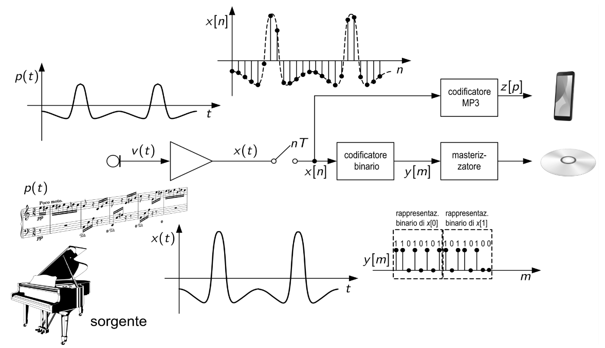
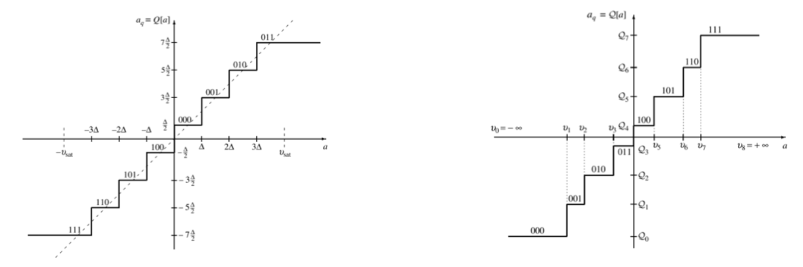
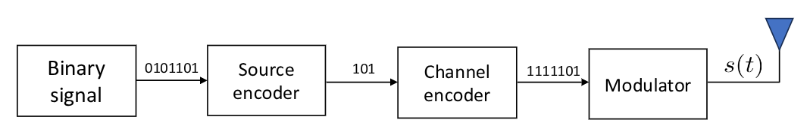
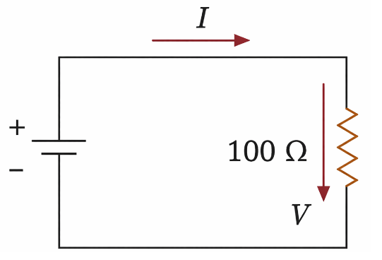
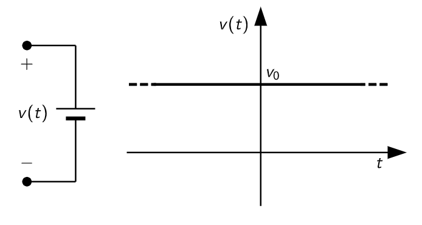
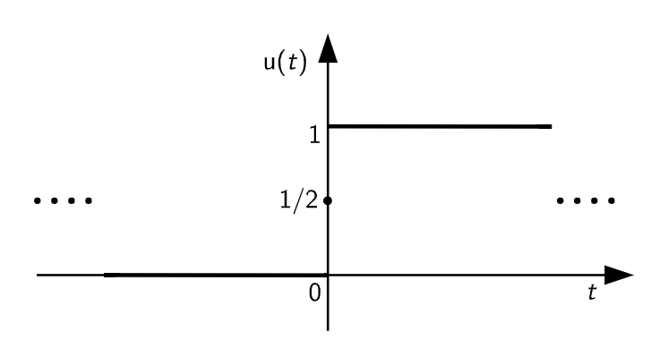
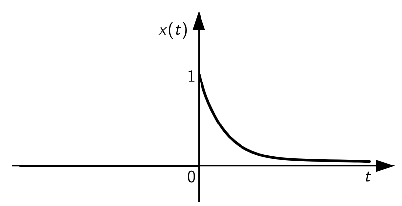
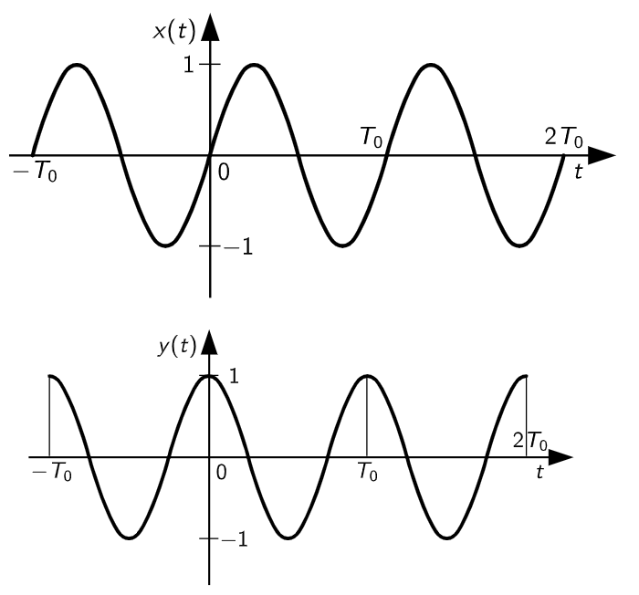
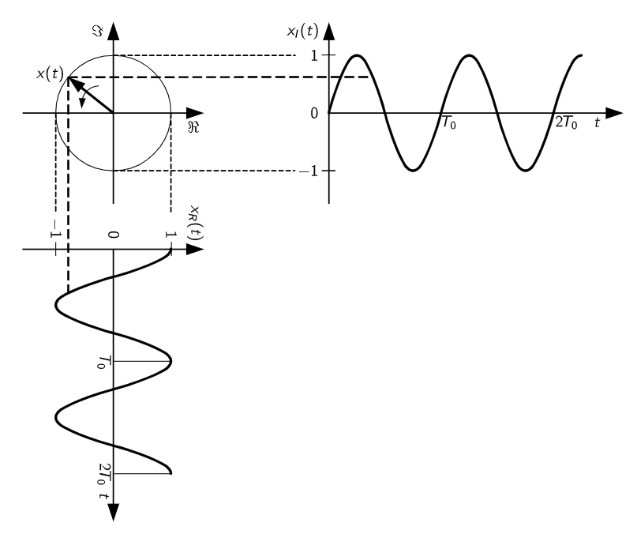
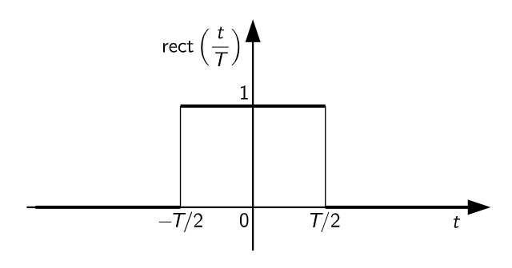

# 1. Indice

- [1. Indice](#1-indice)
- [2. Segnali](#2-segnali)
	- [2.1. Tipologie di Segnale](#21-tipologie-di-segnale)
	- [2.2. Segnali Complessi](#22-segnali-complessi)
	- [2.3. Potenza ed Energia](#23-potenza-ed-energia)
		- [2.3.1. Esempio - Batteria Ideale](#231-esempio---batteria-ideale)
	- [2.4. Potenza Media](#24-potenza-media)
		- [2.4.1. Esempio - Gradino Unitario](#241-esempio---gradino-unitario)
		- [2.4.2. Esempio - Esponenziale monolatero](#242-esempio---esponenziale-monolatero)
- [3. Segnali Periodici](#3-segnali-periodici)
	- [3.1. Lunghezza d'onda](#31-lunghezza-donda)
	- [3.2. Potenza Media](#32-potenza-media)
		- [3.2.1. Esempio - Esponenziale Complesso](#321-esempio---esponenziale-complesso)
		- [3.2.2. Esempio - Impulso Rettangolare](#322-esempio---impulso-rettangolare)
	- [3.3. Decibel](#33-decibel)
	- [3.4. Potenza trasmessa/ricevuta nei Sistemi di Comunicazione](#34-potenza-trasmessaricevuta-nei-sistemi-di-comunicazione)
	- [3.5. Guadagno di Antenna](#35-guadagno-di-antenna)
		- [3.5.1. Esempio - Esame 05-06-2025 n°5](#351-esempio---esame-05-06-2025-n5)
	- [3.6. Array di Antenne](#36-array-di-antenne)
	- [3.7. Teorema di Shannon](#37-teorema-di-shannon)

# 2. Segnali

Un **_segnale_** è una qualunque grandezza fisica variabile cui è associata una certa informazione.

I segnali si dividono in due categorie:

|                           | Segnali Deterministici  |  Segnali Aleatori   |
| :-----------------------: | :---------------------: | :-----------------: |
|    Sono noti a priori     |           Sì            |         No          |
|  Sono noti continuamente  |           Sì            | Non necessariamente |
| Come sono rappresentabili | Con funzioni analitiche |    Staticamente     |
|          Esempio          |   Onda quadra $x(t)$    | Elettrocardiogramma |

Un segnale può essere modellato come **funzione di una o più variabili indipendenti**, come ad esempio:
- _Elettrocardiogramma_: raccoglie la tensione attraverso elettrodi in funzione del tempo &emsp;	$x(t): \Reals \to \Reals$
- _Luminosità di un pixel_ in un immagine in funzione della sua posizione &emsp; $z(p_1, p_2): \Reals^2 \to \Reals$

I segnali, aleatori o deterministici che siano, si distinguono ulteeriormente in base a come si propagano nel tempo in:
- **Segnali a tempo continuo**: il segnale varia con _continuità_
- **Segnali a tempo discreto**: si ha una successione _discreta_ di segnali numerabili nel tempo, come ad esempio i fotogrammi in un segnale video.

## 2.1. Tipologie di Segnale

I segnali possono cambiare natura a seconda dell'utilizzo che ne vogliamo fare.

Noi identifichiamo quattro tipi di segnali:

|                 |  Tempo   | Ampiezze |
| :-------------: | :------: | :------: |
|  **Analogico**  | Continuo | Continuo |
|  **Sequenza**   | Discreto | Continuo |
| **Quantizzato** | Continuo | Discreto |
|  **Digitale**   | Discreto | Discreto |

Per capire come un segnale può essere trasformato nelle varie tipologgie analizziamo cosa accade in un sistema di registrazione audio:
1. Un cantante genera un segnale analogico acustico $p(t)$
2. Il microfono (attraverso il trasduttore) converte il suono in un segnale elettrico $v(t)$
3. Un amplificatore amplifica il segnale in un nuovo segnale elettrico $x(t)$
4. Un campionatore trasforma il segnale elettrico in un segnale discreto $x[n]$ con un certo tempo di campionamento $T$
	- Questo tipo di campionamento avviene **senza perdita di informazioni** se è rispettato il _Teorema di Shannon_, ovvero che la _frequenza di campionamento_ deve essere maggiore o uguale al doppio della banda del segnale, e che questo vengo interpolato con un interpolatore seno-cardinale, come vedremo più avanti nel corso
5.Infine un codificatore (_encoder_) codifica il segnale discreto $x[n]$ in un segnale digitale binario $y[m]$

La conversione analogico-digitale può avvenire in duo modi:
- **Quantizzazione uniforme**: Campiona il segnale in intervalli a periodo costante. È più semplice da implementare ma meno efficiente in termini di adattamento.
- **Quantizzazione non-uniforme**: Permette di adattare la precisione di quantizzazione a specifiche caratteristiche del segnale, riducendo l'errore di quantizzazione

I valori comuni di livelli di quantizzazione possono variare, ma tendono a utilizzare rappresentazioni da `8bit` a `24bit`.
Ricordiamo che per calcolare il numero di bit dato il numero di livelli di quantizzazione $L$ si utilizza la formula &emsp; $N = \lceil\log_2{L}\rceil$.

Un sistema di comunicazione può quindi avere questa forma:

## 2.2. Segnali Complessi

Definiamo un segnale complesso un segnale $z(t)$ tale che:
$$
\begin{CD}
{a(t) \quad t \in \R \atop b(t) \quad t \in \R}
@>>>
{z(t) = a(t) + ib(t) = c(t)e^{i\theta(t)}}
\end{CD}
$$

## 2.3. Potenza ed Energia

Prendiamo come esempio il seguente circuito:

La potenza istantanea dissipata su un resistore per l'effetto Joule è:
$$
	P(t) = RI^2(t)
$$

Mentre l'energia totale dissipata dallo resistore nel tempo è pari a:
$$
	E = \int_{-\infty}^{+\infty}{P(t)\;dt} = \int{RI^2(t)\;dt}
$$

Se estendiamo in maniera astratta la definizione di potenza ad un generico segnale $x(t)$, la _**Potenza Istantanea Normalizzata**_:
$$
	\boxed{P(t) = \vert x(t)\vert ^2}
$$

Analogamente, l'**_Energia Normalizzata_** assume la seguente forma:
$$
	\boxed{E = \int_{-\infty}^{+\infty}{P(t)\;dt} = \int{\vert x(t)\vert ^2\;dt}}
$$

### 2.3.1. Esempio - Batteria Ideale

Immaginiamo di avere un **Generatore di Tensione Costante** $v_0$:

<figure class="">

<figcaption>

Il segnale prodotto è continuo.
</figcaption>
</figure>

Se applichiamo la definizione di energia e risolviamo l'integrale otteniamo che questa batteria ha **_energia infinita_**.

La definizione di energia è quindi mal posta, perché non porta a un risultato utile né misura una proprietà caratteristica del segnale stesso.

## 2.4. Potenza Media

Considerato un segnale $x(t)$ avente energia infinita, definiamo il **segnale troncato**:
$$
	x_T(t) = \begin{cases}
		x(t) & \vert t\vert  \le \frac{T}{2} \\
		0 & \text{altrove}
	\end{cases}
$$

Se calcolassimo l'energia del segnale troncato, risulta chiaro che sarà **finita**, in quanto è composta da un segnale diverso da zero finito su un intervallo anch'esso finito.

Definiamo quindi la **_Potenza Media e l'Energia del segnale troncato nel tempo_**:
$$
\begin{matrix}
	\boxed{P_{x_T} = \frac{E_{x_T}}{T}} & \boxed{E_{x_T} = \int{\vert x_T(t)\vert ^2\;dt}}
\end{matrix}
$$

La **Potenza media** di _un segnale qualunque_ sarà quindi:
$$
	P_x = \lim_{T \to \infty}{P_{x_T}} = \lim_{T\to\infty}{\frac{E_{x_T}}{T}} = \lim_{T\to\infty}{\frac{1}{T} \int_{-\frac{T}{2}}^{T \over 2}{\vert x(t)\vert ^2\;dt}}
$$

Questa formulazione ci porta quindi a due deduzzioni:
- Un segnale ad **energia finita** avrà **_potenza media nulla_**
- Un segnale a **potenza media finita** avrà **_energia infinita_**

Se recuperiamo il segnale della batteria ideale, possiamo adesso calcolarne la potenza media:
$$
\begin{align*}
	P_x &= \lim_{T \to \infty}{\frac{1}{T} \cdot \int_{-{T \over 2}}^{T \over 2}{v_0^2\;dt}} \\
	 &= v_0^2 \lim_{T\to\infty}{\frac{1}{T} \cdot T} = v_0^2

\end{align*}
$$

### 2.4.1. Esempio - Gradino Unitario

Il gradino unitario:
$$
u(t) =
\begin{cases}
	1 & t > 0 \\
	\frac{1}{2} & t = 0 \\
	0 & t < 0
\end{cases}
$$

Questo segnale ha $E_u = 0$, e potenza media:
$$
P_u = \lim_{T\to\infty}{\frac{1}{T} \int_{-{T\over 2}}^{T \over 2}{\vert u(t)\vert ^2\;dt}} = \frac{1}{2}
$$

### 2.4.2. Esempio - Esponenziale monolatero

L'esponenziale monolatero
$$
	x(t) = \begin{cases}
		e^{-\frac{t}{T}} \cdot u(t) & t > 0 \\
		1 & t = 0 \\
		0 & t < 0
	\end{cases}
$$

Per questo segnale l'energia:
$$
\begin{align*}
	E_x &= \int{\vert x(t)\vert ^2\;dt} \\
	&= \int_0^{+\infty}{e^{-\frac{2t}{T}\;dt}} \\
	E_x &= \frac{T}{2} < \infty
\end{align*}
$$

La potenza media vale quindi:
$$
P_x = \lim_{T\to\infty}{\frac{E_x}{T}} = \frac{1}{2}
$$

# 3. Segnali Periodici

Quando andremo ad analizzare segnali cosinusoidali lo faremo **_in relazione al tempo_** e non agli angoli:
$$
	\begin{cases}
		x(t) = A \cdot \sin{\Bigl(\frac{2\pi t}{T_0}\Bigr)} = A \cdot \sin{(2\pi f_0t)} \\[1em]
		y(t) = A \cdot \cos{\Bigl(\frac{2\pi t}{T_0}\Bigr)} = A \cdot \cos{(2\pi f_0t)}
	\end{cases}
$$

La relazione che rispetteremo è:
$$
	x(t) = y\Biggl(t - \frac{T_0}{4}\Biggr)
$$

Dove:
- $A$ &emsp; ampiezza del segnale
- $T_0$ &emsp; periodo del segnale
- $f_0 = \frac{1}{T_0}$ &emsp; frequenza di oscillazione

## 3.1. Lunghezza d'onda

Definiamo lunghezza d'onda di un segnale periodico:
$$
\begin{CD}
	{\lambda = \frac{c}{f_0}\; [m]} @>>>
	\begin{cases}
		c = 3 \cdot 10^8\;m/s & \text{Velocità della luce} \\
		f_0 & \textbf{Frequenza Portante}

	\end{cases}

\end{CD}
$$

Alcuni esempi al variare della frequenza:

|  frequenza $f_0$ | lunghezza d'onda $\lambda$ |
| :-------------: | :------------------------: |
|   $2.4\;Ghz$    |         $0.125\;m$         |
|    $3\;Ghz$     |          $0.1\;m$          |
|   $5.1\;Ghz$    |         $0.06\;m$          |
|    $30\;Ghz$    |         $0.01\;m$          |

## 3.2. Potenza Media

Dato un generico segnale periodico $x(t) = x(t+T_0)$, definiamo la sua potenza media come:
$$
P_x = \frac{1}{T_0} \int_{-\frac{T_0}{2}}^{T_0 \over 2}{\vert x(t)\vert ^2\;dt}
$$

### 3.2.1. Esempio - Esponenziale Complesso

Definito dalle _formule di Eulero_, l'esponenziale complesso ha la seguente forma:
$$

\begin{CD}
	{x(t) = x_R(t) + jx_I(t) = e^{j2\pi f_0 t}}
	@>>>
	\begin{cases}
		x_R(t) = \cos{(2\pi f_0 t)} \\[0.5em]
		x_I(t) = \sin{(2\pi f_0 t)}
	\end{cases}
\end{CD}
$$

Le due componendi periodiche sono le proiezioni sul piano complesso di $x(t)$, che rappresenta il vettore rotante in senso antiorario con velocità $f_0$. Questa velocità determina infatti la frequenza delle componenti.

Se provassimo a calcolarne l'energia:
$$
\begin{align*}
	E(t) &= \int_{-{T_0 \over 2}}^{T_0 \over 2}{e^{j\pi f_0 t}\;dt} \\
	\vdots \quad &= {\frac{e^{j\pi f_0 t}}{j \cdot \pi \cdot f_0} } \Biggr]_{-{T_0 \over 2}}^{T_0 \over 2} \\
	\vdots \quad &= \frac{1}{\pi f_0} \cdot \Biggl(\frac{e^{j\cdot \pi f_0 T_0} - e^{-j \cdot \pi f_0 T_0}}{2j}\Biggr) \\
	E(t) &= \frac{1}{\pi f_0} \cdot \sin{(\pi f_0 T_0)} = \frac{1}{\pi f_0} \cdot \sin{(\pi)} = 0
\end{align*}
$$

Diventa quindi banale dimostrare che la potenza media è nulla:
$$
	P_x = 0
$$

### 3.2.2. Esempio - Impulso Rettangolare

L'impulso rettangolare ha questa forma:
$$
	x(t) = rect\Biggl(\frac{t}{T}\Biggr) = \begin{cases}
		1 & \vert t\vert  < \frac{T}{2} \\
		\frac{1}{2} & \vert t\vert  = \frac{T}{2} \\
		0 & \vert t\vert  > \frac{T}{2}
	\end{cases}
$$

L'energia di questo segnale:
$$
E(t) = \int_{-{T \over 2}}^{T \over 2}{x(t)\;dt} = T < +\infty
$$

La potenza media di questo segnale è quindi nulla.

## 3.3. Decibel

In molti fenomeni fisici, l'ampiezza dei segnali varia su molti ordini di grandezza.
Il **_decibel_** $dB$ è un _unità logaritmica_ che esprime il rapporto tra due grandezza:
$$
\begin{CD}
	{P_{dB} = 10 \cdot \log_{10}\Biggl(\frac{P}{P_0}\Biggr)} @>>>
	\begin{cases}
		P & \textbf{Potenza Misurata} \\
		P_0 & \textbf{Potenza di Riferimento}
	\end{cases}

\end{CD}
$$

Per un generico segnale $x(t)$ otteniamo:
$$
	P_{x,dB} = 10 \cdot \log_{10}{\Biggl(\frac{\vert x(t)\vert ^2}{\vert x(t_0)\vert ^2}\Biggr)}  \Leftrightarrow 20 \cdot \log_{10}{\Biggl(\frac{\vert x(t)\vert }{\vert x(t_0)\vert }\Biggr)}
$$

Poiché la potenza di riferimento è arbitrariamente scelta possiamo notare che:

|       $P$        | $P_{dBW} = 10 \cdot \log_{10}{\Biggl(\frac{P}{1W}\Biggr)}$ | $P_{dBm} = 10 \cdot \log_{10}{\Biggl(\frac{P}{1mW}\Biggr)}$ |
| :--------------: | :--------------------------------------------------------: | :---------------------------------------------------------: |
|      $1\;W$      |                          $0\;dBW$                          |                          $30\;dBm$                          |
|      $2\;W$      |                          $3\;dBW$                          |                          $33\;dBm$                          |
|      $4\;W$      |                          $6\;dBW$                          |                          $36\;dBm$                          |
|      $8\;W$      |                          $9\;dBW$                          |                          $39\;dBm$                          |
|     $10\;W$      |                         $10\;dBW$                          |                          $40\;dBm$                          |
|     $100\;W$     |                         $20\;dBW$                          |                          $50\;dBm$                          |
|     $20\;W$      |                         $13\;dBW$                          |                          $43\;dBm$                          |
| $\frac{1}{2}\;W$ |                         $-3\;dBW$                          |                         $-27\;dBm$                          |
| $\frac{1}{4}\;W$ |                         $-6\;dBW$                          |                         $-24\;dBm$                          |
|   $10^{-2}\;W$   |                         $-20\;dBW$                         |                         $-10\;dBm$                          |
|   $10^{-3}\;W$   |                         $-30\;dBW$                         |                          $0\;dBm$                           |

## 3.4. Potenza trasmessa/ricevuta nei Sistemi di Comunicazione

Un antennna isotropica irradia, in uno spazio libero senza ostacoli, una potenza $P_t$. Questa potenza è irradiata in maniera **isotropica**, ovvero ugualmente in ogni direzione.

La potenza in un punto a distanza $d$ è:
$$
	\quad \frac{P_t}{4 \pi d^2}\;[W/m^2]
$$

La potenza raccolta da un antenna di _area efficace_ $A$, ovvero l'area che può raccogliere segnale, sarà quindi:
$$
	\quad P_r = \frac{P_t}{4\pi d^2}A\;[W]
$$

Nell'ipotesi in cui $A = \frac{\lambda^2}{4\pi}$ si ottiene l'**_Equazione di Friis in spazio libero_**:
$$
	P_r = \frac{P_t}{4\pi d^2}\cdot \frac{\lambda^2}{4\pi} = \frac{P_t}{\Bigl(\frac{4\pi d}{\lambda}\Bigr)^2} = \beta \cdot P_t
$$

$\beta$ equivale al rapporto tra la potenza ricevuta e quella trasmessa, ed è detta **attenuazione** (_pathloss_):
$$
	\beta = \frac{P_r}{P_t} = \Biggl(\frac{4 \pi d}{\lambda}\Biggr)^{-2}
$$

Osserviamo quindi che:
- Nello spazio libero $P_r$ diminuisce con il quadrato della distanza. Vedremo che in condizione diverse dallo spazio libero il coefficiente potenza è maggiore di 2
- $P_r$ varia con il quadrato della lunghezza d'onda

Se analizziamo la potenza ricevuta in _decibel_:
$$
	P_r\;[dBm/dBW] = P_t\;[dBm / dBW] + \beta \;[dB]
$$

## 3.5. Guadagno di Antenna

Le antenne in trasmissione e ricezione, oltre a trasmettere in modo isotropico, possono concentrare la potenza in direzioni specifiche.

In tal caso, si può compensare la perdita della propagazione, ottenendo un **guadagno**:
$$
\begin{matrix}
	{P_r = \beta \cdot G_r \cdot G_t \cdot P_t} & \Leftrightarrow &
	{P_r\;[dBm] = P_t\;[dBm] + G_r\;[dB] + G_t\;[dB] + \beta\;[dB]}

\end{matrix}
$$

Notiamo che se $G_r = G_t = 1 = 0\;[dB]$ otteniamo il caso **isotropico**.

### 3.5.1. Esempio - Esame 05-06-2025 n°5

> Un sistema wireless opera a $3GHz$ e $5GHz$, con potenza trasmessa di $-20\;dBW$. La potenza ricevuta minima necessaria è pari a $-100\;dBW$, in condizioni di spazio libero.
>
> 1) Calcolare la massima distanza (in metri) tra il trasmettitore e il ricevitore per ciscuna frequenza
> 2) Con antenne da $10\;dBW$ di guadagno in trasmissione e ricezione, calcolare la nuova distanza massima

Essendo in condizioni di spazio libero possiamo usare la relazione di Finn (in decibel):
$$
	P_r = P_t + \beta
$$

Calcoliamo il $\beta$ massimo come:
$$
\begin{CD}
	{\beta = P_r - P_t = -80\;dB} @>\text{In Watt}>>
	{\beta = 10^{-8}\;W}
\end{CD}
$$

Sapendo la relazione tra lunghezza d'onda e frequenza otteniamo le lunghezze d'onda delle due frequenze:
$$
\begin{CD}
	{\lambda = \frac{c}{f_0}} @>>>
	\begin{cases}
		\lambda_1 = \frac{c}{3GHz} = 0.1\;m \\[0.5em]
		\lambda_2 = \frac{c}{5GHz} = \frac{3}{5} \cdot 10^{-1} = 0.06\;m
	\end{cases}
\end{CD}
$$

Otteniamo la distanza massima per l'onda a $3GHz$, $d_1$, come quella distanza tale che:
$$
\begin{CD}
	{\frac{\lambda_1^2}{(4\pi d)^2} = 10^{-8}} @>>>
	{d^2 = \frac{\lambda_1^2 \cdot 10^8}{16\pi^2}} @>>>
	\begin{cases}
		d_1 = \frac{\lambda_1 \cdot 10^4}{4\pi} = 79,58\;m \\[0.75em]
		d_2 = \frac{\lambda_2 \cdot 10^4}{4\pi} = 47,75\;m
	\end{cases}

\end{CD}
$$

Utilizzando le antenne con guadagno otteniamo che:
$$
\begin{CD}
	{\beta' = P_r - P_t - G_r - G_t = -100\;dB} @>>> {\beta' = 10^{-10}\;W}
	
\end{CD}
$$

Rieseguendo gli stessi calcoli con $\beta'$:
$$
\begin{cases}
	d_1 = \frac{\lambda_1 \cdot 10^5}{4\pi} = 795,77\;m \\[0.75em]
	d_2 = \frac{\lambda_2 \cdot 10^5}{4\pi} = 477,46\;m
\end{cases}
$$

## 3.6. Array di Antenne

Invece di utilizzare un unica antenna con ampia area, possiamo utilizzare un _array di antenne_, composto da $N$ antenne ogniuna di area $A_i$, per ampliare la superficie utile di ricezione.

Ipotizzando che ogni antenna abbia la stessa superficie utile $A = \frac{\lambda^2}{4\pi}$, se volessimo coprire l'intera area otteniamo che:
$$
	N = \frac{4\pi d^2}{A} = \frac{16\pi^2 d^2}{\lambda^2} = \frac{1}{\beta}
$$

Gli array sferici non sono praticamente costruibili, e quello che si fa è quello di utilizzare un _array planare_.

Se questo _array planare_ fosse di dimensione infinite, si potrebbe comunque recuperare solamente **_metà della potenza trasmessa_**.

In pratica vengono utilizzati _array_ di dimensioni $2^x \times 2^x$, come $4\times4$, $8\times 8$ oppure $16\times 16$.

Basta pensare che con un antenna $2\times 2$, con 4 antenne, la potenza ricevuta complessiva è $4 \cdot \beta P_t$.

## 3.7. Teorema di Shannon

Nei sistemi di comunicazione non importa la potenza del segnale ricevuto, bensì il **_rapporto-segnale-rumore_** $snr$:
$$
\begin{CD}
	{snr = \frac{\text{Potenza del segnale ricevuto}}{\text{Potenza del rumore termico}} = \frac{P_r}{P_n}} \\
	@VVV \\
	{C = \log_2{(1+snr)}\;[b/s \cdot Hz]}

\end{CD}
$$

Valori tipici di potenza di rumore, che dipendono da diversi fattori come la _banda_ del sistema di comunicazione, $K_B = 1,38 \cdot 10^{-23}$ (costante di Boltzman), la temperatura equivalente $T \approx 300°K$ dell'antenna.

In particolare:

|         |         $P_n$         | $P_{n,dB}$  |
| :-----: | :-------------------: | :---------: |
| $3Ghz$  | $8 \cdot 10^{-14}\;W$ | $-130\;dBW$ |
| $30Ghz$ | $8 \cdot 10^{-12}\;W$ | $-110\;dBW$ |

