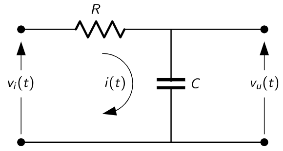
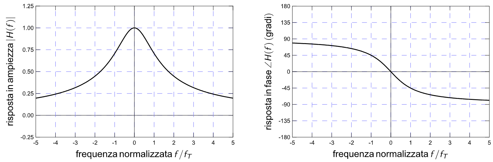
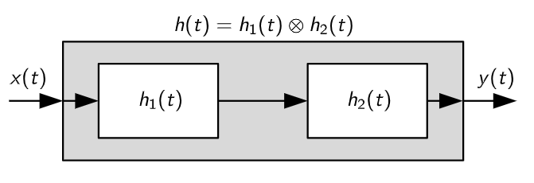
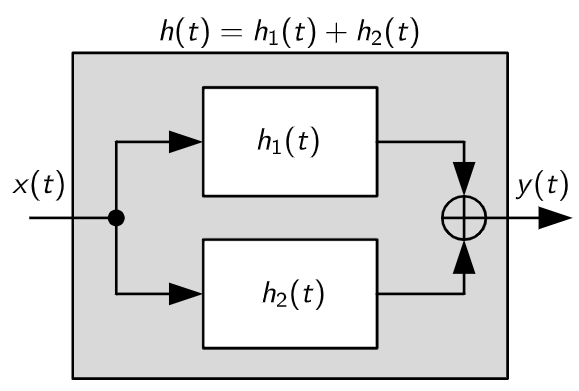
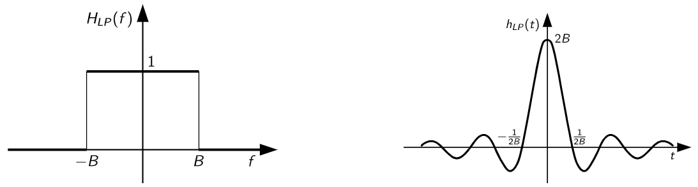
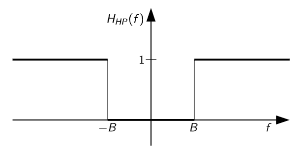
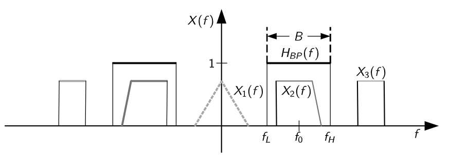
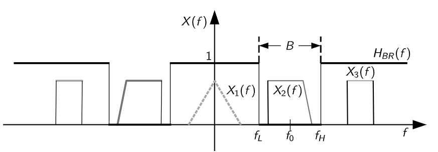
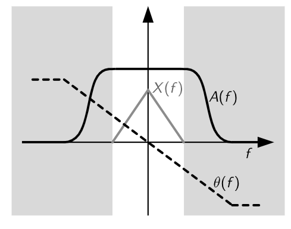
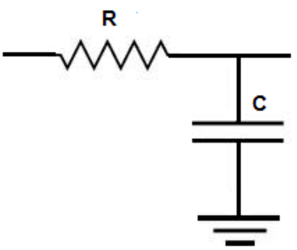

# 1. Indice

- [1. Indice](#1-indice)
- [2. Sistemi Monodimensionali a Tempo Continuo](#2-sistemi-monodimensionali-a-tempo-continuo)
	- [2.1. Proprietà dei Sistemi](#21-proprietà-dei-sistemi)
		- [2.1.1. Sistemi Lineari](#211-sistemi-lineari)
		- [2.1.2. Sistemi Stazionari](#212-sistemi-stazionari)
		- [2.1.3. Sistemi Causali e Senza Memoria](#213-sistemi-causali-e-senza-memoria)
	- [2.2. Sistemi Lineari Stazionari - `SLS`](#22-sistemi-lineari-stazionari---sls)
		- [2.2.1. Esempio - Circuito RC](#221-esempio---circuito-rc)
		- [2.2.2. Sistemi Causali](#222-sistemi-causali)
		- [2.2.3. Composizione di `SLS`](#223-composizione-di-sls)
	- [2.3. Filtri](#23-filtri)
		- [2.3.1. Filtro Passa-Basso Ideale](#231-filtro-passa-basso-ideale)
		- [2.3.2. Filtro Passa-Alto Ideale](#232-filtro-passa-alto-ideale)
		- [2.3.3. Filtro Passa-Banda Ideale](#233-filtro-passa-banda-ideale)
		- [2.3.4. Filtro Elimina-Banda Ideale](#234-filtro-elimina-banda-ideale)
		- [2.3.5. Filtri Non Distorcenti](#235-filtri-non-distorcenti)
		- [2.3.6. Filtri Passa-Basso Non Ideali](#236-filtri-passa-basso-non-ideali)

# 2. Sistemi Monodimensionali a Tempo Continuo

Un sistema può essere definito come una _trasformazione_, un _funzionale_ o un _operatore_ di un segnale in ingresso dipendente dal tempo che produce un **unico segnale di uscita**:

$$
\large
y(t) = \cal{T}\mathnormal{[x(\alpha); t]}
$$

Il segnale di uscita al tempo $t$ può dipendere dai valori del segnale di ingresso ad **istanti diversi da $t$**.

Ad esempio, l'integrale è caratterizzato dal seguente operatore:
$$
	y(t) = \int_{-\infty}^{t}{x(\alpha)\;d\alpha}
$$

In questo caso il segnale $y(t)$ non dipende solo dal valore ottenuto in $t$, ma per tutti i valori $\Set{x(\alpha) : \alpha \le t}$

## 2.1. Proprietà dei Sistemi

### 2.1.1. Sistemi Lineari

Un sistema si dice _**Lineare**_ quando:
$$
\begin{align*}
\cal{T}\mathnormal{[a_1x_1(\alpha) + a_2x_2(\alpha); t]} &= \cal{T}\mathnormal{[a_1x_1(\alpha); t]} + \cal{T}\mathnormal{[a_2x_2(\alpha); t]} \\
&= a_1\cal{T}\mathnormal{[x_1(\alpha); t]} + a_2\cal{T}\mathnormal{[x_2(\alpha); t]} \\
		&= a_1y_1(t) + a_2y_2(t)

\end{align*}
$$

Alcuni esempi di sistemi lineari sono:
- Polinomi di primo grado a termine noto nullo $\bigl(y(t) = ax(t) + b\bigr)$
- Integrali $\bigl(y(t) = \int_{-\infty}^t{x(\alpha)\;d\alpha}\bigr)$

### 2.1.2. Sistemi Stazionari

Un sistema si dice _**Stazionario**_ se è _tempo invariante_:
$$
	y(t-t_0) = \cal{T}\mathnormal{[x(\alpha - t_0); t]}
$$

Alcuni esempi di sistemi stazionari sono:
- Potenze $\bigl(y(t) = ax^n(t)\bigr)$
- Integrali $\bigl(y(t) = \int_{-\infty}^t{x(\alpha)\;d\alpha}\bigr)$

### 2.1.3. Sistemi Causali e Senza Memoria

Un sistema si dice _**Causale**_ se l'uscita dipende solo da valori presenti o passati dell'ingresso:
$$
y(t) = \cal{T}\mathnormal{[x(\alpha - t_0); \alpha \le t]}
$$

Un sistema si dice invece _**Senza Memoria**_ se l'uscita dipende solo dall'ingresso nello stesso istante:
$$
y(t) = \cal{T}\mathnormal{[x(\alpha - t_0); \alpha = t]}
$$

## 2.2. Sistemi Lineari Stazionari - `SLS`

I _**Sistemi Lineari Stazionari**_, detti anche **_Sistemi Lineari a Tempo Invariante_** (`LTI`), producono un'uscita che ha la seguente forma:
$$
\large
y(t) = x(t) \otimes h(t) = \int{x(\beta)g(t-\beta)\;d\beta}
$$

Dove $h(t)$ si dice **_Risposta Impulsiva Del Sistema_**:
$$
	h(t) = \cal{T}\mathnormal{[\delta(\alpha); t]}
$$

Questa affermazione è semplicemente dimostrabile:
$$
\begin{align*}
	y(t) = \cal{T}\mathnormal{[x(\alpha); t]} &= \cal{T}\mathnormal{[x(\alpha) \otimes \delta(\alpha); t]} & & \text{Proprietà di Invarianza}\\
	&= \cal{T}\mathnormal{\Biggl[\int{x(\beta)\delta(\alpha-\beta)\;d\beta ; t}\Biggr]} \\
	&= \int{\cal{T}\mathnormal{[x(\beta)\delta(\alpha-\beta); t]}\;d\beta} & & \text{Proprietà di linearità della trasformazione e dell'integrale} \\
	&= \int{x(\beta)\cal{T}\mathnormal{[\delta(\alpha-\beta); t]}\;d\beta} \\
	&= \int{x(\beta)h(t-\beta)\;d\beta} & & \text{Proprietà di stazionarietà} \\
	&= x(t) \otimes h(t)
\end{align*}
$$

L'**integrale** rappresenta un sistema sia lineare che stazionario. Sapendo ciò possiamo quindi calcolarne la risposta impulsiva:
$$
\begin{align*}
	y(t) = x(t) \otimes h(t) &= \int_{-\infty}^t{x(\alpha)\;d\alpha} \\[0.8em]
		\vdots \qquad&= \int_{-\infty}^t{x(\alpha)u(-\alpha+t)\;d\alpha} \\[0.8em]
		\vdots \qquad&= \int_{-\infty}^{+\infty}{x(\alpha)u(t-\alpha)\;d\alpha} \\[0.8em]
		x(t) \otimes h(t) &= x(t) \otimes u(t)
	\end{align*}
$$

Perciò la risposta impulsiva dell'integrale è $h(t) = u(t)$

Applicando il _Teorema Della Convoluzione_ otteniamo quindi che:
$$
\begin{matrix}
	y(t) = x(t) \otimes h(t) & \Leftrightarrow & Y(f) = H(f)X(f)
\end{matrix}
$$

Dove $H(f)$ è la trasformata della funzione $h(t)$, e si chiama **_Risposta in Frequenza_** del sistema `SLS`.

Questa operazione ci fornisce un grosso vantaggio.
Se infatti nel tempo dobbiamo inviare un segnale _delta di dirac_ per poter capire la risposta impulsiva, operazione impossibile nel mondo reale, in frequenza ci è sufficiente:
1. Inviare un **qualsiasi segnale** $x(t)$
2. Registrare la risposta $y(t)$
3. Mettere a rapporto le loro _TCF_ per ottenere la **risposta in frequenza** in quanto: $H(f) = \frac{Y(t)}{X(t)}$
4. Applicare l'antitrasformata a $H(f)$ per ricavare la **risposta impulsiva**

Questo ragionamento ovviamente si può applicare anche al contrario, permettendoci di racave la _risposta in frequenza_ a partire da quella _impulsiva_.
Nel caso dell'integrale otteniamo che la **risposta in frequenza** non è altro che la trasformata della funzione gradino:
$$
\begin{align*}
  h(t) = u(t) &= \frac{1}{2} + \frac{1}{2}\operatorname{sgn}(t) \\
  H(f) = U(f) &= \frac{1}{2}\delta(f) + \frac{1}{j2\pi f}
\end{align*}
$$

Abbiamo quindi che:
$$
\large
\begin{matrix}
  y(t) = \int_{-\infty}^t{x(\alpha)\;d\alpha} & \Leftrightarrow & Y(f) = U(f)X(f) = \frac{1}{2}\delta(f)X(f) + \frac{X(f)}{j2\pi f} = \frac{1}{2}X(0) + \frac{X(f)}{j2\pi f}
\end{matrix}
$$

Se prendiamo funzioni $x(t)$ tali che $X(0) = 0$, ovvero segnali per i quali $\int_{-\infty}^{+\infty}{x(t)\;dt} = 0$, il segnale in uscita si semplifica:
$$
Y(f) = \frac{X(f)}{j2\pi f}
$$

Questa proprietà prende il nome di **Teorema di Integrazione**.

Analogamente il esiste anche il **Teorema di Derivazione**:
$$
\Large
\begin{matrix}
  \frac{dx(t)}{dt} & \Leftrightarrow & j2\pi f \cdot X(f)
\end{matrix}
$$

Possiamo quindi ricavare la derivata di un qualsiasi segnale:
- Applicando la `TCF`
- Moltiplicando il segnale per $j2\pi f$
- Applicando l'antitrasformata al prodotto

Questo significa che:
> Operatori **differenziali nel tempo** si trasformano in semplici _**operatori algebrici**_ nella frequenza

### 2.2.1. Esempio - Circuito RC

> Dimostrare che, sapendo $T = RC$, la risposta impulsiva del sistema `SLS` è:
> $$
> \begin{matrix}
>   h(t) = \frac{1}{T}e^{-t/T}u(t) & \Leftrightarrow & H(f) = \frac{1}{1 + j2\pi fT}
> \end{matrix}
> $$

La tensione di uscita del cirucito vale:
$$
\begin{align*}
V_u(t) &= V_i - R\cdot i(t) && \text{Kirchoff applicato alla maglia}\\
V_u(t) &= \frac{q(t)}{C} && \text{Tensione ai capi del condensatore}
\end{align*}
$$

Per ricavare dalla seconda la corrente sappiamo che:
$$
\begin{CD}
{\dot V_u(t) = \frac{\dot q(t)}{C} = \frac{i(t)}{C}} \\
@VVV \\
{i(C) = C \cdot \dot V_u(t)}

\end{CD}
$$

Otteniamo quindi che:
$$
V_u(t) = V_i(t) - RC\cdot \dot V_u(t) = V_i(t) - T\cdot \dot V_u(t)
$$

Piuttosto che risolvere l'equazione differenziale possiamo **passare in frequenza**:
$$
V_u(f) = V_i(f) - T \cdot j2\pi f V_u(f)
$$

A questo punto possiamo risolvere _l'equazione lineare_:
$$
\begin{CD}
{
  V_u(f) = \frac{V_i}{1 + j2\pi fT}
} \\
@VVV \\
{
  H(f) = \frac{V_u(f)}{V_i(f)} = \frac{1}{1 + j2\pi fT}
}
\end{CD}
$$

Se operiamo la trasformata su $H(f)$ otteniamo la conferma che $h(t)$ è la stessa di quella che ci ha fornito il testo.

Se grafichiamo la risposta in frequenza ci rendiamo conto che:

### 2.2.2. Sistemi Causali

Avevamo già definito che un sistema si dice _causale_ se:
$$
y(t) = \cal{T}\mathnormal{[x(\alpha - t_0); \alpha \le t]}
$$

Nei sistemi lineari stazionari invece sappiamo che:
> UN SLS è _**Causale**_ **se e solo se** la risposto impulsiva $h(t)$ è causale
> $$
> 	h(t) = h(t)u(t)
> $$

### 2.2.3. Composizione di `SLS`

Due sistemi in cascata **sono equivalenti ad un unico sistema con risposta impulsiva**:
$$
y(t) = h_2(t) \otimes z(t) = h_2(t) \otimes h_1(t) \otimes x(t) = h(t) \otimes x(t)
$$

Ovvero:
$$
	h(t) = h_1(t) \otimes h_2(t)
$$

Da qui segue che in frequenza:
$$
	Y(f) = X(f) \cdot H_1(f) \cdot H_2(f)
$$

Se i due sistemi operano in parallelo allora abbiamo che:
$$
\begin{CD}
	\begin{aligned}
	y(t) &= h_1(t) \otimes x(t) + h_2(t) \otimes x(t)  \\
		 &= \bigl(h_1(t) + h_2(t)\bigr) \otimes x(t)
	\end{aligned} \\
	@VVV \\
	\begin{aligned}
		Y(f) &= \bigl(H_1(f) + H_2(f)\bigr) \cdot X(f)
	\end{aligned}
\end{CD}
$$

## 2.3. Filtri

Nelle applicazioni pratiche ci sarà richiesto di **selezionare solo alcune frequenze** di un segnale.

Per potero fare è quindi è possibile mettere in cascata al nostro segnale un sistema `SLS` che:
- Nelle frequenze desiderate ha &emsp; $H(f) = 1$
- Nelle frequenza che vogliamo rimuovere &emsp; $H(f) = 0$

L'uscita di questa cascata sarà quindi **il prodotto tra le due trasformate**, che equivale al nostro segnale _**solo negli intervalli desiderati**_.

Questa operazione si chiama _**Filtraggio**_.

### 2.3.1. Filtro Passa-Basso Ideale

Questo tipo di filtro (_low-pass_) permette di mantenere solamente le _**basse frequenze del nostro segnale**_.

Un esempio di questo filtro è la **Funzione Rettangolare**, che permette solamente alle frequenze minori di un certo valore di banda $B$ di poter passare:
$$
  H_{LP}(f) = rect\biggl(\frac{f}{2B}\biggr)
$$

Nel tempo quindi il filtro è rapresentato da:
$$
  h_{LP}(t) = 2B \cdot \operatorname{sinc}(2Bt)
$$

### 2.3.2. Filtro Passa-Alto Ideale

Questo tipo di filtro (_high-pass_) permette di mantenere solamente le _**frequenze elevate del nostro segnale**_.
Per ottenere questo risultato è sufficiente utilizzare:
$$
	H_{HP}(f) = 1 - H_{LP}(f)
$$

Che nel tempo:
$$
  h_{HP}(t) = \delta(t) - 2B \operatorname{sinc}(2Bt)
$$

### 2.3.3. Filtro Passa-Banda Ideale

Questo tipo di filtro (_band-pass_) permette di _**selezionare delle bande generiche del nostro segnale**_.
$$
	H_{BP}(f) = rect\Bigl(\frac{f-f_0}{B}\Bigr) + rect\Bigl(\frac{f+f_0}{B}\Bigr)
$$

Che nel tempo equivale a:
$$
	h_{BP}(t) = 2B \operatorname{sinc}(2B t) \cdot \cos{(2\pi f_0 t)}
$$

### 2.3.4. Filtro Elimina-Banda Ideale

Questo tipo di filtro (_band-remove_) è l'inverso del filtro _Passa-Banda ideale_, permettendo di _**rimuovere bande generiche del nostro segnale**_.

$$
  H_{BE}(f) = 1 - rect\Bigl(\frac{f-f_0}{B}\Bigr) - rect\Bigl(\frac{f+f_0}{B}\Bigr)
$$

Che nel tempo equivale a:
$$
	h_{BP}(t) = \delta(t) - 2B \operatorname{sinc}(2B t) \cdot \cos{(2\pi f_0 t)}
$$

### 2.3.5. Filtri Non Distorcenti

Si dicono **Filtri Non Distorcenti** quei filtri nei quali il segnale, dopo il filtraggio, è una _replica fedele del segnale di ingresso_:
$$
	y(t) = K \cdot x(t-t_0)
$$

Per replica fedele si intende un segnale che rispetto all'originale è _al più ritardato e/o attenuato/amplificato_.

In frequenza questa proprietà si traduce in:
$$
\begin{CD}
  {Y(f) = K \cdot X(f) \cdot e^{-2\pi ft_0}} @>>> {H(f) = K \cdot e^{-2j\pi ft_0}}
\end{CD}
$$

Questo tipo di _risposta in frequenza_ è:
- **Piatta in ampiezza**
- **Lineare in fase**

I segnali non distorcenti **non sono quindi producibili nella realtà**, tuttavia è sufficiente che siano rispettate queste affermazioni _nella banda del segnale_.

### 2.3.6. Filtri Passa-Basso Non Ideali

Il circuito RC è un esempio di _**Filtro Passa-Basso non ideale**_.

Il filtro RC infatti dimezza i segnali fino alla sua **frequenza di taglio**, oltre la quale vengono attenuati di più della metà.

Allo stesso modo un _filtro CR_ rappresenta un **Filtro Passa-Alto non ideale**, proprio perché produce un segnale che è il simmetrico di quello _RC_ rispetto all'asse passante per la frequenza di taglio.