# 1. Indice

- [1. Indice](#1-indice)
- [2. Modulatore](#2-modulatore)
- [3. Sistemi di Comunicazione in Banda Base](#3-sistemi-di-comunicazione-in-banda-base)
	- [3.1. Riassunto](#31-riassunto)
	- [3.2. Propagazione in spazio libero - `AWGN`](#32-propagazione-in-spazio-libero---awgn)
		- [3.2.1. Presenza di Ostacoli](#321-presenza-di-ostacoli)
	- [3.3. Ricevitore](#33-ricevitore)
		- [3.3.1. Criterio di Nyquist per l'ISI](#331-criterio-di-nyquist-per-lisi)
		- [3.3.2. Moltiplicatore](#332-moltiplicatore)
			- [3.3.2.1. Rimozione Del Rumore](#3321-rimozione-del-rumore)
			- [3.3.2.2. Condizioni sui filtri](#3322-condizioni-sui-filtri)
			- [3.3.2.3. Filtro a Coseno Rialzato](#3323-filtro-a-coseno-rialzato)
		- [3.3.3. Demapper](#333-demapper)
			- [3.3.3.1. Efficienza Energetica](#3331-efficienza-energetica)
			- [3.3.3.2. Efficienza Spettrale](#3332-efficienza-spettrale)
- [4. Sistemi di Comunicazione in Banda Passante](#4-sistemi-di-comunicazione-in-banda-passante)
	- [4.1. Trasmettitore](#41-trasmettitore)
	- [4.2. Ricevitore](#42-ricevitore)
- [5. Sistema di Comunicazione QAM](#5-sistema-di-comunicazione-qam)
	- [5.1. Trasmettitore](#51-trasmettitore)
		- [5.1.1. Densità Spettrale di Potenza](#511-densità-spettrale-di-potenza)
	- [5.2. Ricevitore](#52-ricevitore)
		- [5.2.1. Probabilità di Errore](#521-probabilità-di-errore)

# 2. Modulatore

Il modulatore non è da intedersi come un circuito che moltiplica solo per un coseno il segnale.
Infatti, ciò che il modulatore riceve in entrata sono dei **bit**.

Possiamo quidni descrivere il modulatore scomponendolo in tre blocchi:

- **Mappatore**: prende in ingresso i bit $\Set{d_k}$ produce un segnale in uscita che chiamiamo $\Set{a_i}$ temporizzati $T_S$
- **Filtro di Trasmissione $g_T(t)$**: prendei in ingresso il segnale $\Set{a_i}$ e produce un segnale in uscita che chiamiamo $S_T(t)$
- **Modulazione di Segnale $\cos{(2\pi f_0 t)}$**: produce un segnale che chiamiamo $S_T^{RF}(t)$. _RF_ sta per _Radio-Frequency_

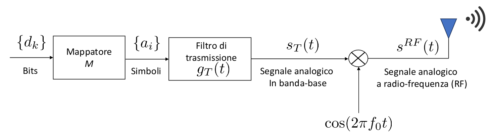

Il **Mappatore**:
> È un dispositivo che **mappa i bit su dei simboli**. L'insieme dei simboli $\Set{a_i}$ appartengono ad un _**alfabeto**_, che ha tipicamente cardinalità _potenza di 2_.
>
> $$
> \Set{a_i} \in M \qquad #M = 2^Q
> $$

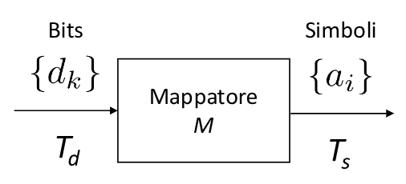

Un esempio di _mappa binaria_, mappa i bit su due simboli, ad esempio:

- `0` $\to$ $-1$
- `1` $\to$ $1$

Una mappa _a quattro livelli_, mappa le coppie di bit su quattro simboli, ad esempio:

- `00` $\to$ $-3$
- `01` $\to$ $-1$
- `10` $\to$ $1$
- `11` $\to$ $3$

Per generare un simbolo il mappatore necessita di $Q$, perciò possiamo dire che:
$$
 T_S = Q \cdot T_d = \log_2{(M)} \cdot T_d\;[]
$$

Ovviamente possiamo ricavare il _rate_:
$$
 R_S = \frac{R_d}{\log_2{(M)}} = \frac{R_d}{Q} < R_d
$$

L'unita di misura del rate in questo contesto si chiama _**Baud**_, ovvero _simboli al secondo_

Il rate dei simboli è **più piccolo** di quello dei bit che arrivano.

Il filtro di trasmissione produce un sengale $S_T(t)$ che non è altro che un interpolazione dei simboli che li rende un segnale analogico:
$$
 S_T(t) = \sum_i{a_i \cdot g_T(t-iT_S)}
$$

Questo è un **segnale analogico**, che successivamente verrà modulato alla frequenza desiderato.

Un esempio di funzione di interpolazione $g_T(t)$ può essere la funzione rettangolo:
$$
 g_T(t) = \operatorname*{rect}\Biggl(\frac{t}{T_S}\Biggr)
$$

Questa funzione produce un segnale $S_T$:
$$
 S_T(t) = \sum_i{a_i \cdot \operatorname*{rect}\Biggl(\frac{t - iT_S}{T_S}\Biggr)}
$$

Questo tipo di segnale è **aleatorio**, in quanto i _simboli sono processi aleatori_, dato che non sappiamo a priori il loro valore nel tempo.

Del segnale $S_T$ quindi ci interesserà studiare il suo **valor medio**, la sua **Funzione Di Autocorrelazione** e il suo **Spettro Di Potenza**.

Risulta quindi immediato capire perché utilizziamo un mappatore.
Infatti mappando una sequenza di $Q$ bit in un solo simbolo, otteniamo un aumento del tempo di trasmissione $T_S = Q \cdot T_d$. L'aumento di questo tempo, in frequenza, implica una **riduzione di banda**.

Vedremo successivamente che l'aumento della cardinalità della mappa implicherà anche un **aumento della probabilità di errore**.

# 3. Sistemi di Comunicazione in Banda Base

Un sistema di comunicazione è rappresentato dal seguente schema a blocchi:

I bit in uscita dalla _codifica sorgente_ sono identificati da $\Set{b_n}$ e sono trasmessi con _rate_ $R_b$.
I bit in uscita dalla _codifica di canale_ sono identificati da $\Set{d_k}$ e sono trasmessi con _rate_ $R_d$.

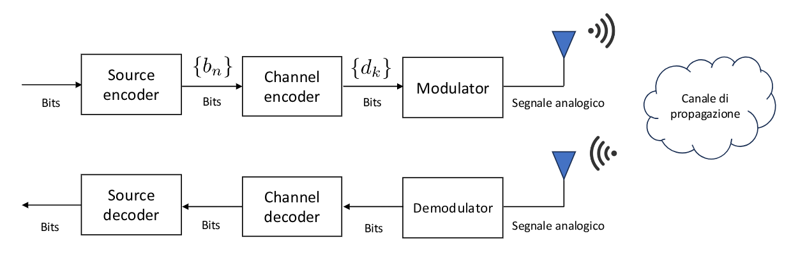

Il tempo di trasmissione dei bit in entrata al modulatore sarà:
$$
T_d = \frac{k}{n} T_b = r \cdot T_b < T_b
$$

Analogamente il _rate_:
$$
R_d = \frac{1}{r} R_b > R_b
$$

I Sistemi di Communicazione in Banda Base, detti anche _Pulse Amplitude Modulation_ o

`PAM`, sono i più semplici sistemi di comunicazione, in quanto rimuovono la modulazione in frequenza, trasmettendo direttamnete sul mezzo.
Alcuni esempi pratici di sistemi che operano in banda base sono _Ethernet_ o i _bus di comunicazione_ tra dispositivi elettronici.

Questi sistemi modulano i simboli che ricevono in ingresso **in ampiezza**, operando con **costellazioni simmetriche centrate in 0**, dette _antipodali_.

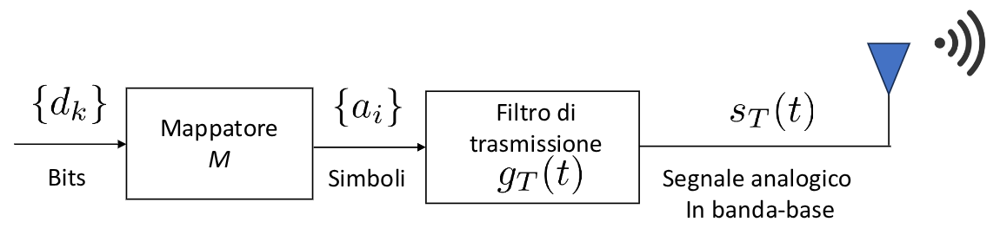

Definiamo quindi le caratteristiche di prim'ordine:

- **Aspettazione** o **Valor Medio** &emsp; $\eta_a = E\Set{a_i} = \sum_{l = 1}^M{Pr(a_i = a^{(l)}) \cdot a^{(l)}}$
- **Autocorrelazione** &emsp; $R_a(m) = E \Set{a_i \cdot (a_i + m)}$

Per calcolare quindi il valor medio non solo è necessario conoscere i simboli, ma anche le loro probabilità.
Facciamo l'ipotesi che i simboli siano **equiprobabili**, potendo quindi esprimere:
$$
 \eta_a = \frac{1}{M} \sum_{l = 1}^M{a^{(l)}}
$$

Su una mappa di 4 livelli $\Set{a_i} = \Set{-3, -1, 1, 3}$ il valor medio vale $\eta_a = 0$.

L'autocorrelazione invece:
$$
R_a(m) = \begin{cases}
 E\Set{a_i^2} & m = 0 && \text{Valor quadratico medio} \\
 E\Set{a_i \cdot (a_i + m)} & m \ne 0
\end{cases}
$$

Il **Valor quadratico medio** è relativamente semplice da calcolare:
$$
 E\Set{a_i^2} = \sum_{l = 1}^{M}{Pr(a_i = a^{(l)}) \cdot (a^{(l)})^2}
$$

Per quanto riguarda invece l'aspettazione generalizzata, per semplificare la trattazione, facciamo l'ipotesi che i simboli siano **incorrelati tra di loro** (ipotesi molto forte dato che di solito questa non è vera senza l'_interliver_ che mischia i simboli per evitare errori in blocco non recuperabili). L'autocorrelazione diventa quindi:
$$
\begin{align*}
 R_a(m) &= E\Set{a_i(a_i + m)}  \\
	 &= E\Set{a_i} \cdot E\Set{a_i + m} && \text{Segnale stazionario} \\
	 &= \eta_a^2
\end{align*}
$$

Ricordando che l'espressione della varianza è:
$$
\begin{align*}
 \sigma_a^2 &= E\Set{(a_i - \eta_a)^2} \\
	  &= E\Set{a_i^2 - 2a_i\eta_a + \eta_a^2} \\
	  &= E\Set{a_i^2} - 2\eta_a \cdot E\Set{a_i} + \eta_a^2 \\
	  &= E\Set{a_i^2} - \eta_a^2
\end{align*}
$$

Nel nostro caso particolare, dove $\eta_a = 0$, possiamo dire che il **Valor Quadratico Medio** è uguale alla **Varianza**.

Quindi, per `PAM` simmetriche con simboli equiprobabili e incorrelati:
$$
\begin{align*}
 \eta_a &= 0 \\
 R_a(m) &= \begin{cases}
  \sigma_a^2 & m = 0 \\
  0 & m \ne 0
 \end{cases}
\end{align*}
$$

O in forma compatta:
$$
\begin{align*}
 \eta_a &= 0 \\
 R_a(m) &= \sigma_a^2 \cdot \delta(m)
\end{align*}
$$

Dove $\delta(m)$ si chiama **Delta di Kromeker**, che si comporta come la _Delta di Dirac_ ma in campo discreto.

A questo punto possiamo quindi calcolare la trasformata dell'autocorrelazione, ovvero la **Densità Spettrale di Potenza** del segnale $S$:
$$
\begin{CD}
 \begin{align*}
  S_S(f) &:= \frac{1}{T_S} \cdot S_a(f) \cdot \vert G_T(f) \vert^2 \\
  S_a(f) &= \sum_m{R_a(m) e^{-j2\pi mf T_S}} = \sigma_a^2 \cdot e^{0} = \sigma_a^2
 \end{align*} \\
 @VVV \\
 \Large
 \boxed{
  S_S(f) := \frac{1}{T_S} \cdot \delta_a^2 \vert G_T(f) \vert^2
 }
\end{CD}
$$

La potenza del segnale varrà ovviamente:
$$
\begin{align*}
 P_S &= \int{S_S(f)\;df} \\
  &= \frac{\sigma_a^2}{T_S} \int{\vert G_T\vert^2\;df} && \text{Teorema di Parseval} \\
  &= \boxed{\frac{\sigma_a^2}{T_S} \cdot E_{g_T}}
\end{align*}
$$

Nel caso di una $\operatorname*{rect}$ sappiamo che l'energia è $T_S$, quindi il segnale avrà potenza $\sigma_a^2$.

La varianza viene calcolata a partire dalla costellazione. E si può dimostrare per induzione che:
$$
\sigma_a^2 = E\Set{a_i^2} := \frac{M^2 - 1}{3}
$$

All'aumentare della cardinalità della mappa quindi aumenta anche la potenza del segnale.

Se invece volessimo calcolare l'_Energia per Simbolo_:
$$
 E_S = P_S \cdot T_S = \sigma^2 \cdot E_{g_T} = \frac{M^2 - 1}{3} \cdot E_{g_T}
$$

A questo punto ricavare l'_Energia per bit codificato_ è una formalità:
$$
 E_d = \frac{E_S}{Q} = \frac{M^2 - 1}{3 \cdot \log_2{(M)}} \cdot E_{g_T}
$$

Analogamente possiamo calcolare l'_Energia per bit di canale_:
$$
 E_b = \frac{n}{k} E_d = \frac{1}{r} \cdot E_d = \frac{M^2 - 1}{3r \cdot \log_2{(M)}} \cdot E_{g_T}
$$

## 3.1. Riassunto

Abbiamo quindi defiito i seguenti parametri:
$$
\begin{align*}
 P_S &= \frac{\sigma_a^2}{T_S} \cdot E_{g_T}
 E_S &= P_S \cdot T_S = \sigma_a^2 \cdot E_{g_T}
 P_S &= \frac{\sigma_a^2}{T_S} \cdot \vert G_T(f)\vert^2
\end{align*}
$$

Se supponiamo che il filtro sia:
$$
g_T(t) = \operatorname*{rect}\Biggl(\frac{t}{T_S}\Biggr)
$$

Quindi:
$$
 G_T = T_S \cdot \operatorname*{sinc}(f T_S)
$$

Allora lo spettro di densità di potenza:
$$
\begin{align*}
 S_S(f) &= \frac{\sigma_a^2}{T_S} \cdot T_S^2 \cdot \operatorname*{sinc^2}(f T_S) \\
	 &= \sigma_a^2 \cdot T_S \cdot \operatorname*{sinc^2}(f T_S) \\
\end{align*}
$$

A questo punto possiamo calcolare la **Banda del segnale**. Non è strano definire come banda nei _sistemi di comunicazione_ il **primo nullo**, ovvero $\frac{1}{T_S}$.

Possiamo quindi trovare la banda in _funzione della velocità di trasmissione dei bit di canale_:
$$
\begin{align*}
 B_S &\approx \frac{1}{T_S} \\
  &= \frac{1}{\log_2{(M)} \cdot T_d} \\
  &= \frac{R_d}{\log_2{(M)}} \\
  &= \frac{R_b}{r \cdot \log_2{(M)}}
\end{align*}
$$

Aumentare $M$, a parità di $R_d$, ha quindi come vantaggio _**diminuire la banda del segnale**_, ma come primo svantaggio quello di **_aumentare l'energia del segnale_** e, vedremo di seguito, anche quello di _**aumentare la probabilità di errore**_.

Analogamente diminuire il rate $r$ provoca un **aumento della banda**, tuttavia risulta complesso avere dei codici con rate prossimi a $1$ che mantengono basse probabilità di errore.

Se andiamo ancora più a ritroso sappiamo che il quantizzatore riceve i segnali con una banda analogica pari al doppio del periodo di campionamento $T$.

Per campione di ingresso al quantizzatore su $L$ livelli quindi e i bit in uscita al quantizzatore deve valere la relazione:
$$
\begin{CD}
 {
  T = T_b \cdot \log_2{(L)}
 } \\
 @VVV \\
 {
  R_b = \frac{\log_2{(L)}}{T}
 }
\end{CD}
$$

Quindi la **Banda di Trasmissione** in funzione della **Banda Di Campionamento**:
$$
 B_S = \frac{R_b}{r \cdot \log_2{(M)}} = \frac{\log_2{(L)}}{r \cdot \log_2{(L)}} \cdot \frac{1}{T}
$$

## 3.2. Propagazione in spazio libero - `AWGN`

Immaginiamo quindi di trasmettere un segnale $s_T(t)$ da un trasmettitore, e di ricerverlo su un ricevitore, chiamandolo $r(t)$, attraverso lo _spazio libero_.

La propagazione del segnale comporta una perdita di potenza, in quanto questa si distribuisce sfericamente rispetto al trasmettitore. Avevamo [visto precedentemente](./Trasformata%20Continua%20di%20Fourier#28412-radar)

Il segnale ricevuto varrà quindi qualcosa nella forma:
$$
 r(t) = \sqrt{\beta} \cdot s_T(t)
$$

La Densità Spettrale di Potenza varrà quindi:
$$
 S_r(f) = \beta \cdot S_s(f)
$$

La potenza del segnale ricevuto varrà quindi:
$$
 P_r = \int{S_r(f)\;df} = \beta \cdot P_s
$$

I segnali elettromagnetici, anche nel vuoto, sono però legati alla velocità della luce $c$, che significa che il segnale ricevuto avrà un ritardo rispetto a quello inviato dovuta legato alla distanza $d$ tra le due antenne:
$$
\begin{matrix}
 r(t) = \sqrt{\beta} \cdot s_T(t - \tau) \\
 \tau = \frac{d}{c}
\end{matrix}
$$

Questo ritardo, per quanto è tendenzialmente piccolo, è trascurabile _**solo se è trascurabile rispetto al tempo di segnalazione dei simboli**_ del segnale originale $T_S$.

$$
\begin{align*}
 B_S = \frac{1}{T_S} &= \frac{R_b}{r \cdot \log_2{(M)}} \\
  T_S &= \frac{r \cdot \log_2{(M)}}{R_b} \\
\end{align*}
$$

Se ipotizziamo $R_b = 10$ $MHz$, $r = \frac{4}{7}$ e $M = 8$, otteniamo che:
$$
 T_S = \frac{12}{70} \approx \frac{1}{7} \cdot 10^{-6}\; s \approx \frac{1}{7} \;\mu s
$$

Si trova quindi nell'ordine di grandezza dei _micro-secondi_. I temi di ritardo in quest'ordine, o in ordini superiori _**non possono quindi essere ignorati**_.

Il canale quindi opera come un **Filtro Non Distorcente** sul segnale.

Se teniamo conto anche del _**Rumore Termico**_ $w(t)$ prodotto dall'antenna del ricevitore, il segnale ricevuto avrà la forma:
$$
\LARGE
\boxed{
 r(t) = \sqrt{\beta} \cdot s_T(t) \cdot w(t)
 }
$$

Se dovessimo fare lo uno schema a blocchi:

Possiamo rappresentare il canale come un blocco _LTI_ con funzione $c(t)$:
$$
 c(t) = \sqrt{\beta} \cdot \delta(t - \tau)
$$

All'uscita di questo blocco andiamo quindi ad aggiungere del **Rumore Termico**.
Il rumore termico è considerabile come **Rumore Gaussiano Bianco**, dato che la sua _Densità Spettrale Di Potenza_, sotto certe condizioni vale:
$$
 S_W(f) = \frac{N_0}{2} = \frac{K_B \cdot T_A}{2}
$$

Dove $K_B$ è la **Costante di Boltzman** e $T_A$ è la temperatura equivalente dell'antenna misurata in gradi _Kelvin_.

Questo tipo di modello è chiamato con la sigla `AWGN` ovvero _Additive Wide Gaussian Noise_, ed è il più semplice tipo di canale che possiamo modellare.

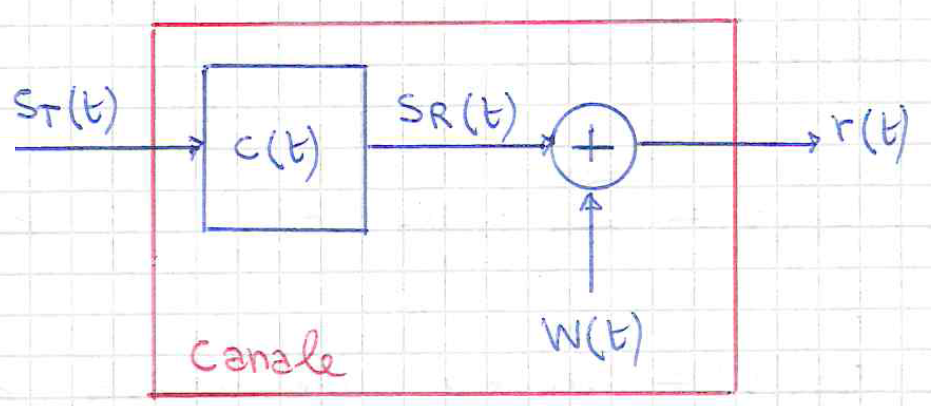

### 3.2.1. Presenza di Ostacoli

Nella realtà però la situazione è più complessa. Infatti, l'ipotesi che la comunicazione avvvenga in spazio libero senza ostacoli.

Se fossero invece presenti degli ostacoli, anche non necessariamente nella linea d'aria tra trasmettitore e ricevitore, le onde elettromagnetiche del segnale andranno a colpire gli ostacoli che, se la loro lunghezza d'onda è comparabile con l'ostacolo, le **rifletteranno**. <small>(ignoriamo fenomeni di diffrazione e assorbimento per semplicità)</small>

Ciò che accade quindi è che il ricevitore riceve:

- Il segnale diretto: segue il percorso in linea d'aria. Arriva con un ritardo $\tau_0$ attenuato di un fattore $\sqrt{\beta_0}$
- I segnali riflessi: in particolare riceviamo un segnale riflesso per ogni ostacolo, ogniuno con un ritardo diverso $\tau_i$, dovuto alle distanze aggiuntive che questi segnali hanno dovuto percorrere, e ognuno con un attenuazione diversa $\sqrt{\beta_i}$

Il ricevitore quindi riceve quindi una sovrapposizione di questi segnali, modellabile:
$$
\Large
\boxed{
 r(t) = \sum_{i}{\sqrt{\beta_i} \cdot s_T(t - \tau_i)} + w(t)
}
$$

Se volessimo quindi modellare il canale come un blocco _LTI_:
$$
 c(t) = \sum_i{\sqrt{\beta_i} \cdot \delta(t - \tau_i)}
$$

Un canale reale è quindi un _**Canale Ideale Distorcente**_. Per ricondurci ad un canale _non distorcente_ dobbiamo porci sotto le condizioni fisiche che gli ostacoli siano posti in modo che i **Ritardi siano simili tra loro**, ovvero valga la relazione che $\forall i$ valga $\tau_i \approx \tau_0$, così da avere nuovamente:
$$
\begin{align*}
 c(t) &= \sum_i{\sqrt{\beta_i}} \cdot \delta(t-\tau_0) \\
   &= \sqrt{\beta} \cdot \delta(t - \tau_0)
\end{align*}
$$

## 3.3. Ricevitore

Abbiamo quindi capito che il ricevitore riceve un segnale:
$$
\Large
\boxed{
 r(t) = \sqrt{\beta} \cdot S_T(t-\tau) + w(t) \qquad\wedge\qquad S_w(f) = \frac{N_0}{2}
}
$$

Possiamo schematizzare il ricevitore in tre parti:

- **Demodulatore**: riceve il segnale $r(t)$, applica un _Filtro di Ricezione_ $g_R(t)$ ottenendo $x(t)$ e procede a campionarlo per ottenere i campioni $x[k]$. La frequenza di campoinamento non è in questo caso legata alla banda del segnale $r(t)$, ma legata all'istante di trasmissione di ogni singolo bit, ovvero ogni $k \cdot T_S + \tau$
- **Moltiplicatore**: a partire dai campioni $x[k]$ ricava un segnale $z(k)$ rappresentato dai segnali della mappa, ancora disturbati dal rumore termico
- **Demapper**: riceve il segnale $z(k)$ e ricava da esso i vari simboli $\Set{\hat{a}_n}$
- **Channel Decoder**: Dati i simboli $\Set{\hat{a}_n}$ ne ricava i bit $\Set{\hat{b}_i}$

La funzione $x(t)$ è quindi ottenuta come:
$$
\begin{align*}
 x(t) &= r(t) \otimes g(t) \\
   &= (\sqrt{\beta} s_T(t-\tau) + w(t)) \otimes g_R(t) \\
   &= \sqrt{\beta} s_T(t-\tau) \otimes g_R(t) + w(t) \otimes g_R(t) \\
   &= \sqrt{\beta} \sum_{i}{a_i \cdot g_T(t-iT_S - \tau) \otimes g_R(t)} + n(t)
\end{align*}
$$

Definiamo quindi $g(t) = g_T(t) \otimes g_R(t)$, ottenendo quindi il segnale:
$$
\LARGE
\boxed{
 x(t) = \sqrt{\beta} \sum_{i}{a_i \cdot g(t-iT_S - \tau)} + n(t)
}
$$

Dove il rumore, identificato adeso da $n(t) = w(t) \otimes g_R(t)$, **non è più un Rumore Gaussiano Bianco**, dato che la sua risposta:
$$
 S_n(f) = S_W(f) \cdot \vert G_R(f) \vert^2 = \frac{N_0}{2} \vert G_R(f) \vert^2
$$

Se andiamo adesso a calcolare la sua potenza:
$$
 P_n = \int{S_n(f)\;df} = \frac{N_0}{2} E_{g_R}
$$

Il suo valor medio invece contnua ad essere nullo:
$$
\begin{align*}
 E\Set{n(t)} &= E\Set{w(t) \otimes g_R(t)} \\
	&= E\Set{w(t)} \otimes g_R(t) \\
	&= 0 \otimes g_R(t) = 0
\end{align*}
$$

Il segnale campionato $x[k]$ invece ha forma:
$$
\begin{align*}
 x[k] &= x(kT_S + \tau) \\
   &= \sqrt{\beta} \sum_i{a_i \cdot g(kT_S +\tau - iT_S - \tau)} + n(t) \\
   &= \sqrt{\beta} \sum_i{a_i \cdot g((k-i)T_S)} + n(t) && \text{Chiamiamo } m = k-i \\
   &= \sqrt{\beta} \sum_m{a_{k-m} \cdot g(mT_S)} + n(t) \\
   &= \sqrt{\beta} \cdot \Biggl(a_kg(0) + \sum_{m \ne 0}{a_{k-m}g(mT_S)} + \frac{n(t)}{\sqrt{\beta}}\Biggr)
\end{align*}
$$

Per decodificare il simbolo trasmesso all'istante $k$-esimo

- **Componente Utile**: $a_k \cdot g(0)$
- **Interferenza Inter-Simbolica** (`ISI`): $\sum_{m \ne 0}{a_{k-m}g(mT_S)}$
- **Rumore Termico**: $\frac{n(t)}{\sqrt{\beta}}$

### 3.3.1. Criterio di Nyquist per l'ISI

Al fine di permettere il corretto funzionamento del sistema di comunicazione, dobbiamo adesso **Dimensionare I Filtri** $g_T(t)$ e $g_R(t)$, al fine di _**cancellare l'ISI**_ (_InterSymbolic Interference_), così da non avere interferenza dovuta agli altri simboli, ovvero:
$$
\begin{align*}
  \sum_{m \ne 0}{a_{k-m}g(mT_S)} &= 0 \\
  g(mT_S) &= 0 & \forall m \ne 0
\end{align*}
$$

In particolare quindi vogliamo una funzione che:
$$
\begin{cases}
  g(0) \ne 0 \\
  g(mT_S) = 0 & m \ne 0
\end{cases}
$$

Alcune possibili soluzioni sono:

- $\operatorname*{sinc}({t \over T_S})$
- $\operatorname*{tri}(\frac{t}{2T_S})$
- $\operatorname*{tri}(\frac{t}{T_S})$
- ...

Se quindi dobbiamo verificare che due filtri $g_T(t)$ e $g_R(t)$ rispettino la condizione ci è sufficiente calcolare:
$$
 g(mT_S) = \int{g_T(\alpha)g_R(mT_S - \alpha)\;d\alpha}
$$

Se calcoliamo la _Trasformata Discreta_ dei campioni:
$$
\begin{cases}
	\overline{G}(f) &= \sum_m{g(mT_S)e^{-j2\pi fmT_S}} \\
	 &= g(0) \cdot e^{0} = g(0)
\end{cases}
$$

Ricordiamo però che è possibile ricavare la Trasformata Discreta a partire da quella continua campionandola ad ogni periodo:
$$
 \overline{G}(f) = \frac{1}{T_S} \sum_k{G\Biggl(f - \frac{k}{T_S}\Biggr)}
$$

Vale quindi che:
$$
\Large
g(0) = \frac{1}{T_S} \sum_k{G\Biggl(f - \frac{k}{T_S}\Biggr)}
$$

Ciò significa che l'assenza di Interferenza Inter-Simbolica richiede:

- **Nel tempo**: una funzione diversa da $0$ nell'origine, e sempre nulla per ogni $mT_S$ con $m \ne 0$
- **In frequenza**: una trasformata discreta costante

Queste due condizioni _**sono la stessa condizione**_, ma vista in due domini diversi.

Nyquist ha dimostrato che queste condizioni sono rispettate se la banda del filtro $B_G$:
$$
\LARGE
\boxed{
 B_G \ge \frac{1}{2T_S}
}
$$

Possiamo notare come questa condizione sia l'inversa del criterio di Nyquist per il campionamento $B \le \frac{1}{2T_S}$

Rimuovendo l'_ISI_ abbiamo quindi che il segnale dopo il demodulatore:
$$
\Large
\boxed{
 x(k) = \sqrt{\beta}\Biggl(a_kg(0) + \frac{n(k)}{\sqrt{\beta}}\Biggr)
}
$$

### 3.3.2. Moltiplicatore

I vari campioni $x[k]$ vanno adesso in ingresso al _demapper_, che produce un uscita:
$$
 z(k) = \frac{x[k]}{\sqrt{\beta} g(0)} = a_k + \frac{n(k)}{\sqrt{\beta} g(0)}
$$

È importante dividere per $\sqrt{\beta}g(0)$ perché altrimenti avrei che tutti i segnali vengono moltiplicati per questo valore molto piccolo. Perciò sarebbe molto più difficie distinguere il segnale, dato che valori come $-1$ e $-3$ verrebbero mappati in valori molto simili. È quindi necessario conoscere $\beta$ e $g(0)$.

In aggiunta al segnale non dobbiamo poi scordarci della presenza del rumore $n(k)$, che provoca una traslazione rispetto al segnale originale.

Nella migliore delle ipotesi $z(k)$ starà in un intorno del singolo trasmesso $a_k$, tale per cui la distanza euclidea $\vert z(k) - a(k) \vert < \vert z(k) - b(k) \vert$ dove $b(k)$ indica tutti gli altri simboli della mappa, avremo che il nostro segnale ricostruito $\hat{a_k}$ sarà (sperabilmente) corretto.

La scelta di utilizzare la distanza euclidea ha come ipotesi sottostante che **i simboli siano equiprobabili**.

#### 3.3.2.1. Rimozione Del Rumore

Abbiamo quindi trovato dei segnali $z(k)$ che sono però ancora soggetti a del rumore termico:
$$
	n(k) = n(kT_S)
$$

Questo rumore termico ha come proprietà:

- $S_n(f) = \frac{N_0}{2}\vert G_R(f) \vert^2$
- $\eta_n = E\Set{n(k)} = 0$

È quindi una variabile Gaussiana $n(k) \in \mathcal{N}(0,\sigma_n^2)$, dove
$$
\begin{align*}
 	\sigma_n^2 &= E\Set{n^2(k)} - \eta_n^2 \\
			   &= E\Set{n^2(k)} \\
			   &= P_n = \frac{N_0}{2}E_{g_R}
\end{align*}
$$

La sua distribuzione di probabilità:
$$
\begin{align*}
	f_n(k) &= \frac{1}{\sigma_n \cdot \sqrt{2\pi}} \cdot e^{-\frac{k - \eta_n}{\sigma_n}} \\
		   &= \frac{2}{N_0 E_{g_R}\sqrt{2\pi}} \cdot e^{-\frac{2k}{N_0 E_{g_R}}}
\end{align*}
$$

Abbiamo quindi che, condizionatamente alla trasmissione di un simbolo $a_k$, sapendo quindi che il rumore è una variabile Gaussiana così dimensionata, allora la probabilità di errore è rappresentata dalla probabilità di ricevere un valore oltre il punto medio tra $a_k$ e i suoi simboli adiacenti.

Avevamo detto ad inizio corso, che questo valore è relazionato al **Rapporto Segnale-Rumore**:
$$
	\operatorname*{SNR} = {E\Set{a_k^2}} \cdot \Biggl(\frac{N_0}{2}E_{g_R} \cdot \frac{1}{\beta g^2(0)}\Biggr)^-1 = \frac{2\beta E\Set{a_k^2}}{N_0} \cdot \frac{g^2(0)}{E_{g_R}}
$$

Poiché i primi termini sono fissi, per riuscire a massimizzare il rapporto segnale-rumore dovremo quindi scegliere opportunamente i filtri, tenendo a mente che questi devono anche annullare l'_ISI_.

Possiamo riscrivere il rapporto:
$$
\begin{align*}
  \operatorname*{SNR} &= c \cdot \frac{g^2(0)}{E_{g_R}} \\
					  &= c \cdot \frac{\int{(g_T(\alpha)g_R(-\alpha))^2\;d\alpha}}{\int{\vert g_R^2(\alpha) \vert\;d\alpha}}
\end{align*}
$$

Per massimizzare qeusto rapporto usiamo la **Disuguaglianza di Cauchy-Swarz**:
$$
  \vert x^T y \vert^2 \le \parallel x \parallel^2 \parallel y \parallel^2
$$

Che ci permette di dire che:
$$
  \Biggl(\int{x(t)y(t)\;dt}\Biggr)^2 \le \int{x^2(t)\;dt} \cdot \int{y^2(t)\;dt}
$$

In particolare questa relazione è vera in uguaglianza quando $x = \gamma \cdot y$.

Possiamo quindi dire che:
$$
\begin{align*}
	\operatorname*{SNR} &= c \cdot \frac{\int{(g_T(\alpha)g_R(-\alpha))^2\;d\alpha}}{\int{\vert g_R^2(\alpha) \vert\;d\alpha}} \\
						&\le  c \cdot \frac{\int{g_T^2(\alpha)\;d\alpha} \cdot \int{g_R^2(-\alpha)\;d\alpha}}{\int{\vert g_R^2(\alpha) \vert\;d\alpha}} \\
						&= c \cdot \int{g_T^2(\alpha)\;d\alpha}
\end{align*}
$$

Per riuscire quindi a massimizzare il rapporto segnale rumore dobbiamo avere dei filtri tali che:
$$
\LARGE
\boxed{
	g_T(t) = \gamma \cdot g_R(-t) \qquad\Rightarrow\qquad g_R(t) = g_T(-t)
}
$$

Il filtro di ricezione si chiama proprio per questo _**Filtro Adattato**_, perché si deve adattare al filtro di trasmissione.

Nel caso in cui il _filtro di trasmissione_ fosse una _funzione pari_, allora il _filtro di ricezione_ **dovrà essere uguale a quello di trasmissione**.

#### 3.3.2.2. Condizioni sui filtri

Abbiamo quindi che i filtri di trasmissione e ricezione devono rispettare le due condizioni:
$$
\begin{cases}
	g_R(t) = g_T(-t) \\
	g(mT_s) = 0 & \forall m \ne 0 \\
	g(0) \ne 0
\end{cases}
$$

Per risolvere questo sistema passiamo in frequenza sulla prima equazione:
$$
	G_R(f) = G_T^\ast(f) \\
$$

Di conseguenza abbiamo che:
$$
\begin{align*}
	G(f) &= G_T(f)G_R(f) \\
		 &= G_T(f)G_T^\ast(f) = G_R^\ast(f)G_R(f) \\
		 &= \vert G_T(F) \vert^2 = \vert G_R(F) \vert^2
\end{align*}
$$

Scelto quindi il filtro del trasmettitore come un **Filtro di Nyquist** $g_N$, il filtro del ricevitore dovrà avere, in frequenza, le seguenti caratteristiche:
$$
\LARGE
\boxed{
	\begin{cases}
		\vert G_T(F) \vert = \vert G_R(F) \vert = \sqrt{G_N(f)} \\
		\phase{G_R} = -\phase{G_T}
	\end{cases}
}
$$

Ovvero:
$$
\Large
\begin{cases}
	G_T(f) = \sqrt{G_N} \cdot e^{+j \phase{G_N}} \\
	G_R(f) = \sqrt{G_N} \cdot e^{-j \phase{G_N}}
\end{cases}
$$

Con questa condizione abbiamo anche trovato l'espressione del **Rapporto Segnale Rumore Massimo**:
$$
\large
	\operatorname*{SNR}_{MAX} := \frac{M^2-1}{3} \cdot \frac{2\beta}{N_0} \cdot \int{G_N(f)\;df}
$$

#### 3.3.2.3. Filtro a Coseno Rialzato

Immaginiamo di avere un filtro di trasmissione:
$$
g_T(t) = \operatorname*{rect}\Biggl(\frac{t}{T_S}\Biggr)
$$

Il nostro filtro di trasmissione dovrà essere (per simmetria):
$$
	g_R(t) = g_T(-t) = g_T(t)
$$

Nel tempo, il filtro di Nyquist $g(t) = g_R(t) \otimes g_T(t)$ sarà la funzione _triangolo_:
$$
	g(t) = \operatorname*{tri}\Biggl(\frac{t}{2T_S}\Biggr)
$$

In questo caso la banda del filtro di Nyquist **rispetta la condizione di Nyquist per l'assenza di ISI**.

In frequenza il filtro equivale quindi ad una $\operatorname*{sinc^2}$.

Questa funzione ha però il problema che ha **banda illimitata**. Se il nostro sistema ha assegnato un certo intervallo frequenziale, questo filtro produce delle **_emissioni fuori-banda_**, con contributi che vanno ad "inquinare" le altre frequenze.

Dobbiamo quindi trovare un filtro che rispetti la condizione di Nyquist per l'_ISI_ e che massimizzi il rapporto $\operatorname*{SNR}$ avente **banda limitata**.

Un filtro che ha queste caratteristiche si chiama _**Filtro a Coseno Rialzato**_ $G_{RCR}(f)$:

<figure class="">
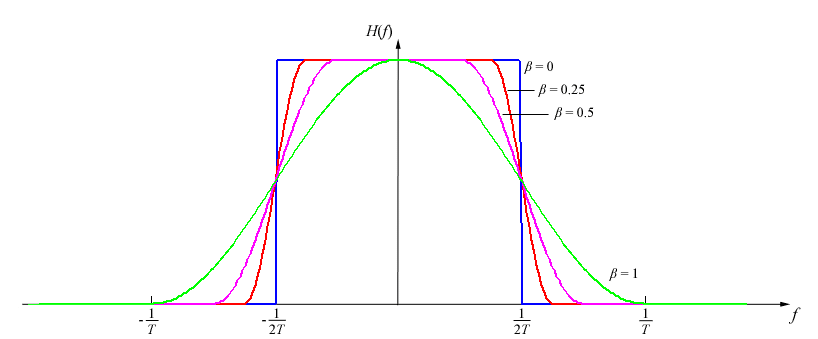
<figcaption>

Il $\beta$ nell'immagine è equivalente a quello che noi chiamiamo $\alpha$

</figcaption>
</figure>

Dove $\alpha$ si chiama _**Fattore di Roll-Off**_ ed è compreso tra $0$ e $1$. Se $\alpha = 0$ in frequenza equivale alla $\operatorname*{rect()}$. Valori tipici di $\alpha$ sono $0.25 \sim 0.3$, in quanto cerchiamo di mantenerlo non distorcente.

Questo filtro ha banda minima, ottenibile per $\alpha = 0$, $\frac{1}{2T_S}$, e banda massima, ottenibile per $\alpha = 1$, $\frac{1}{T_S}$.

È quindi un filtro con **banda limitata** che rispetta il criterio di Nyquist per l'_ISI_ (la verifica sulla periodicità è facilmente intuibile).

L'espressione analitica della funzione nel tempo è la seguente: <small>(non è necessario ricordarla)</small>
$$
\large
	g_{RCR}(t) = \operatorname*{sinc}\Biggl(\frac{t}{T_S}\Biggr) \cdot \frac{\cos{\Biggl(\alpha\pi \frac{t}{T_S}\Biggr)}}{1 - \Biggl(2\alpha  \frac{t}{T_S}\Biggr)^2}
$$

Al variare di $\alpha$ quasta funzione continua a rispettare il criterio di Nyquist nel tempo.

I valori di $\alpha$ si scelgono come compromesso tra:
- **Banda minima**: vorremmo $\alpha \to 0$
- **Robustezza nell'intervallo di campionamento**: il campionamento nel ricevitore è intrinsecamente legato a commettere errori, dovuti a ritardi nella sincronizzazione. Necessitiamo quindi di un $\alpha \to 1$ che permetta di approssimare a $0$ il segnale nel tempo negli intorni di $mT_S$

Essendo il filtro **reale**, allora i filtri di trasmissione e ricezione saranno dei _**Filtri a Radice di Coseno Rialzato**_:
$$
\LARGE
\boxed{
	G_R(f) = G_T(f) = \sqrt{G_{RCR}(f)}
}
$$

### 3.3.3. Demapper

Abbiamo quindi un sengale di ingresso:
$$
\begin{matrix}
	z(k) = a_k + n'(k) \sim \mathcal{N}(0, \sigma_{n'}^2) \\[1em]
	\sigma_{n'}^2 = \frac{\sigma_n^2}{\beta g^2(0)} \\[1em]
	\sigma_n^2 = \frac{N_0}{2}E_{g_R} = P_n = \frac{N_0}{2}\int{\vert G_R(f) \vert^2\;df}
\end{matrix}
$$

Conoscendo la mappa di trasmissione, dobbiamo adesso tradurre il segnale ricevuto nel corrispettivo simbolo. Questa scelta è sogetta ovviamente ad errore dovuto alla presenza di **rumore termico**.

Partendo dal _Teorema Della Probabilità Totale_:
$$
	P(e) = \sum_{l = 1}^M{P(e \vert a_k = a^{(l)})}\cdot P(a_k = a^{(l)})
$$

Ipotizziamo che i simboli siano **equiprobabili** (introduzione del _interliver_):
$$
	P(e) = \frac{1}{M} \cdot \sum_{l = 1}^M{P(e \vert a_k = a^{(l)})}
$$

Ipotizzando di utilizzare in trasmissione una mappa con cardinalità $M = 2$, la probabilità di errore è:
$$
	P(e) = \frac{1}{2} \cdot P(e \vert a_k = -1) + \frac{1}{2} \cdot P(e \vert a_k = +1)
$$

La nostra strategia sulla traduzione di un solo simbolo quindi si basa ancora una volta sulla **distanza minima**, che in questo caso ha punto medio in $\lambda = 0$:
$$
\begin{cases}
	z(k) \ge 0 & \hat{a}_k = 1
	z(k) < 0 & \hat{a}_k = -1
\end{cases}
$$

Nell'ipotesi in cui sia trasmesso $a_k = +1$, la forma di $z(t)$ è:
$$
	z(t) = 1 + n'_k(k) \sim \mathcal{N}(1, \sigma_{n'}^2) \\
$$

Commetteremo errore quando $z(k) < 0$, che avviene con probabilità:
$$
	Q\Biggl(\frac{\lambda - \eta}{\sigma}\Biggr) = 1 - Q \Biggl(\frac{-1}{\sigma_{n'}}\Biggr) = \Phi\Biggl(\frac{-1}{\sigma_{n'}}\Biggr)
$$

Se invece avessimo trasmesso $a_k = -1$, la forma di $z(t)$ è simmetrica:
$$
	z(t) = -1 + n'_k(k) \sim \mathcal{N}(-1, \sigma_{n'}^2) \\
$$

L'errore verrà commesso quando $z(k) \ge 0$, che avviene con probabilità:
$$
	Q\Biggl(\frac{\lambda - \eta}{\sigma}\Biggr) = Q \Biggl(\frac{1}{\sigma_{n'}}\Biggr)
$$

Per proprietà della funzione $Q$ e $\Phi$ $(\Phi(-x) = Q(x))$ le due aree sono uguali:
$$
	1 - Q(- \frac{1}{\sigma_{n'}}\Biggr) = Q\Biggl(\frac{1}{\sigma_{n'}}\Biggr)
$$

La probabilità di errore sul simbolo per $M = 2$ (e di conseguenza sul _bit_) è quindi:
$$
	P(e) = \frac{1}{2} \cdot P(e \vert a_k = -1) + \frac{1}{2} \cdot P(e \vert a_k = +1) = Q\Biggl(\frac{1}{\sigma_{n'}}\Biggr)
$$

Se invece prendessimo un $M = 2^n$, non abbiamo più un unico punto medio $\lambda$, ma ne abbiamo $n - 1$.

La probabilità generale sarà:
$$
	P(e) = \frac{1}{2^n} \sum_{l = 1}^{2^n}{P(e \vert a_k = a^{(l)})}
$$

Se ipotizziamo che i simboli $a_0 < a_1 < ... < a_M$ e che $a_i < \lambda_i < a_{i+1}$ sia vero $\forall i = 0, ..., M-1$, otteniamo che la probabilità di errore per il singolo $k$-esimo simbolo vale:
$$
\begin{cases}
	Q(\frac{\lambda_k - a_k}{\sigma_{n'}}) & k = 0 \\
	Q(\frac{\lambda_k - a_k}{\sigma_{n'}}) + (1 - Q(\frac{\lambda_{k-1} - a_k}{\sigma_{n'}})) & k = 1, ..., M-1
	1 - Q(\frac{\lambda_k - a_k}{\sigma_{n'}}) & k = M
\end{cases}
$$

Per simmetria della mappa però possiamo dire, analogamente al caso $M = 2$ che:
$$
	P(e \vert a_k) =  P(e \vert a_{M-k})
$$

Quindi possiamo riassumere le singole probabilità in:
$$
\begin{cases}
	P(e \vert a_0) =  P(e \vert a_{M}) = Q(\frac{\lambda_k - a_k}{\sigma{n'}}) \\
	P(e \vert a_k) =  P(e \vert a_{M-k}) = Q(\frac{\lambda_k - a_k}{\sigma{n'}}) + Q(\frac{\lambda_{k+1} - a_k}{\sigma{n'}}) & k = 1, ..., M-1
\end{cases}
$$

Ipotizzando però di utilizzare mappe per le quali $\vert \lambda_i - a_i \vert = \vert \lambda_i - a_{i+1} \vert$, questa relazione diventa:
$$
\begin{cases}
	P(e \vert a_0) =  P(e \vert a_{M}) = Q(\frac{\lambda_k - a_k}{\sigma{n'}}) \\
	P(e \vert a_k) =  P(e \vert a_{M-k}) = 2\cdot Q(\frac{\lambda_k - a_k}{\sigma{n'}})
\end{cases}
$$

La probabilità complessiva di errore sarà quindi:
$$
\begin{align*}
	P(e) &= \frac{1}{M} \sum_{l = 1}^{M}{P(e \vert a_k = a^{(l)})} \\
		 &= \frac{1}{M} \Biggl(4\frac{M-2}{2} \cdot Q(\frac{\lambda_k - a_k}{\sigma{n'}}) + 2 \cdot Q(\frac{\lambda_0 - a_0}{\sigma{n'}})\Biggr) && k = 1,...,M-1 \\
		 &= \frac{1}{M} \Biggl(2(M-2) \cdot Q(\frac{\lambda_k - a_k}{\sigma{n'}}) + 2 \cdot Q(\frac{\lambda_0 - a_0}{\sigma{n'}})\Biggr) && k = 1,...,M-1 \\
		 &= \frac{1}{2^{n-1}} \Biggl((2^{n} - 2) Q(\frac{\lambda_k - a_k}{\sigma{n'}}) + Q(\frac{\lambda_0 - a_0}{\sigma{n'}})\Biggr) && k = 1,...,M-1 \\
\end{align*}
$$

Se utilizziamo mappe _PAM_, nelle quali due simboli $\vert a_i - a_{i + 1} \vert = 2$, l'espressione si semplifica ulteriormente in:
$$
\large
\boxed{
	P(e) = \frac{1}{2^{n-1}} \Biggl(2(2^{n} - 2) Q(\frac{1}{\sigma{n'}}) + Q(\frac{1}{\sigma{n'}})\Biggr)
}
$$

La probabilità di errore sul simbolo invece vale:
$$
	\frac{P(e)}{\log_2{(M)}} \le P_{bit}(e) \le P(e)
$$

Sotto la condizione che **simboli adiacenti mappino sequenze di bit diverse per un solo bit**. Questo tipo di mappe si dicono _**Mappe di Gray**_.

In questo tipo di mappe, se il rumore non è elevato, l'errore non trascurabile diventa solamente quello per il quale confondiamo il simbolo $a_i$ con $a_{i \pm 1}$, che in queste mappe corrispondere dopo la decodifica a sbagliare _un singolo bit_. IN altri tipi di mappa questo non è garantito per ogni coppia di simboli.

In generale, in caso di mappe di gray _PAM_, possiamo approssimare la probabilità di errore sul simbolo a:
$$
\begin{align*}
	P(e) &= c \cdot Q(\frac{1}{\sigma{n'}}) \\
		 &\approx Q(\frac{1}{\sigma{n'}})
\end{align*}
$$

Prendendo come filtro $G_R$ il filtro a **Coseno Rialzato**, otteniamo che:
$$
	E_{g_R} = \int{\vert G_R(f) \vert ^2\;df} = \int{G_{RCR}(f)\;df} = 1 \\[1em]
	g_R(0) = g_{RCR}(0) = 1
$$

Di conseguenza otteniamo che la varianza vale:
$$
\large
\sigma_{n'}^2 = \frac{N_0}{2\beta}
$$

L'energia del segnale vale:
$$
\begin{align*}
	E_S = P_ST_S &= T_S \int{S_S(f)\;df} \\
			&= \frac{M^2 - 1}{3} \int{\vert G_R(f) \vert ^2\;df} \\
			&= \frac{M^2 - 1}{3} \int{G_{RCR}(f)\;df} \\
			&= \frac{M^2 - 1}{3}\\
\end{align*}
$$

La densità spettrale del segnale trasmesso sarà:
$$
S_S(f) = \frac{1}{T_S} \sigma_n^2 \vert G_T{f} \vert^2 = \frac{1}{T_S} \cdot \frac{M^2 - 1}{3} \vert G_T(f) \vert^2
$$

Poiché il segnale al ricevitore è:
$$
	r(t) = \sqrt{\beta} s_T(t-\tau) + w(t)
$$

Possiamo dire che l'energia del segnale ricevuto:
$$
	E_R = \beta E_S
$$

Dove $E_S$ è l'energia del segnale trasmesso e $\beta$ è l'attenuazione del mezzo.

Se rapportiamo l'energia del segnale ricevuto alla costante $N_0 = K_B \cdot T_A = 1.38 \cdot 10^{-23}\cdot 990$, ottenniamo che:
$$
\begin{align*}
	\frac{E_R}{N_0} &= \beta \frac{E_S}{N_0} \\
					&= \beta \frac{\sigma_a^2}{N_0} \cdot \vert G_T(f) \vert^2 \\
					&= \beta \frac{\sigma_a^2}{N_0} \cdot 1 \\
				    &= \beta \frac{M^2 - 1}{3} \frac{1}{N_0} \\
					&\Downarrow
	N_0 &= \beta \cdot \frac{M^2 - 1}{3} \frac{1}{\frac{E_R}{N_0}}
\end{align*}
$$

Se la sostituiamo quindi all'interno dell'espressione della **varianza**:
$$
\begin{align*}
	\sigma_{n'}^2 &= \frac{N_0}{2\beta} \\
				  &= \frac{1}{2\beta} \cdot \beta \cdot \frac{M^2 - 1}{3} \frac{1}{\frac{E_R}{N_0}} \\
				  &= \frac{M^2 - 1}{6} \frac{1}{\frac{E_R}{N_0}} \\
\end{align*}
$$

Possiamo quindi esprimere la probabilità di errore come:
$$
\Large
\boxed{
	P(e) \approx Q\Biggl(\sqrt{\frac{6}{M^2-1} \cdot \frac{E_R}{N_0}})
}
$$

Possiamo quindi approssimare velocemente la probabilità di errore in relazione alla mappa e all'energia:
$$
\begin{align*}
	P(e)\vert_{M = 2} &= Q\Biggl(\sqrt{2 \cdot \frac{E_R}{N_0}}\Biggr) \\
	P(e)\vert_{M = 4} &= Q\Biggl(\sqrt{\frac{2}{5} \cdot \frac{E_R}{N_0}}\Biggr) \\
	&\vdots
\end{align*}
$$

È possibile mettere in relazione la probabilità di errore sul simbolo anche con l'_energia per bit codificato_ $E_a$ o con l'_energia per bit non codificato_ $E_b$:
$$
\begin{align*}
	P(e) &= Q\Biggl(\sqrt{\frac{6}{M^2-1} \cdot \frac{E_R}{N_0}}) \\
		 &= Q\Biggl(\sqrt{\frac{6 \log_2{(M)}}{M^2-1} \cdot \frac{E_a}{N_0}}) \\
		 &= Q\Biggl(\sqrt{\frac{6r \log_2{(M)}}{M^2-1} \cdot \frac{E_b}{N_0}}) \\
\end{align*}
$$

#### 3.3.3.1. Efficienza Energetica

Se graifchiamo le probabilità di errore al variare del rapporto $E_R \over N_0$ $dB$:

<figure class="">
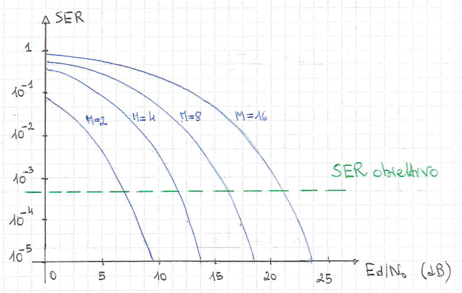
<figcaption>

Nel grafico la probabilità di errore è chiamata $SER$, ovvero _Signal Error at Receiver_.
</figcaption>
</figure>

Dal grafico capiamo come, per avere la stessa probabilità di errore utilizzando due mappature diverse, è necessario che quella che utilizza più bit abbia più energia.

In particolare:

$$
\begin{align*}
	P_{M}(e) &= P_{M'}(e) \\
	Q\Biggl(\sqrt{\frac{6}{M^2-1} \cdot \frac{E_R}{N_0}}) &= Q\Biggl(\sqrt{\frac{6}{M'^2-1} \cdot \frac{E_R'}{N_0}}) \\
	\sqrt{\frac{6}{M^2-1} \cdot \frac{E_R}{N_0}} &= \sqrt{\frac{6}{M'^2-1} \cdot \frac{E_R'}{N_0}} \\
	\frac{6}{M^2-1} \cdot \frac{E_R}{N_0} &= \frac{6}{M'^2-1} \cdot \frac{E_R'}{N_0} \\
	\frac{E_R'}{N_0} &= \frac{M'^2 - 1}{M^2 - 1} \cdot \frac{E_R}{N_0}
\end{align*}
$$

Ad esempio, la _quadernaria_ rispetto alla _binaria_ dovrebbe utilizzare $5$ volte più energia.

In _dB_ le distanze quindi sono:
$$
\Delta = 10 \cdot \log_{10}{\Biggl(\frac{M'^2 - 1}{M^2 - 1}\Biggr)}
$$

Capiamo quindi perché anche se sapevamo che la banda di trasmissione diminuiva all'aumentare della mappa:
$$
B_S = \frac{R_d}{r \log_2{(M)}}
$$

Se vogliamo contenere l'energia dobbiamo quindi limitare l'aumento di $M$.

#### 3.3.3.2. Efficienza Spettrale

Definiamo **Efficienza Spettrale** $\eta_{SP}$:
$$
	\eta_{SP} := \frac{R_S}{B_G} = \frac{\textit{Rate } \text{dei bit non codificati}}{\textit{Banda }\text{del segnale trasmesso}} \;[\text{bit/s/Hz}]
$$

La banda che il segnale trasmesso occupa è legato alla densità spetrale del segnale:
$$
\begin{align*}
	S_S(f) &= \frac{1}{T_S} \sigma_a^2 \vert G_T(f) \vert^2 \\
		   &= \frac{1}{T_S} \sigma_a^2 G_{RCR}(f) \\
\end{align*}
$$

La banda vale quindi:
$$
\large
	B_S = \frac{1+ \alpha}{2T_S}
$$

Se scriviamo $T_S$ in funzione del tempo di trasmissione dei bit _non codificati_:
$$
\begin{align*}
	B_S &= \frac{1+ \alpha}{2T_S} \\
		&= \frac{1+ \alpha}{2 \log_2{(M)}T_d} \\
		&= \frac{1+ \alpha}{2 r\log_2{(M)}T_b} = \frac{1+ \alpha}{2 r\log_2{(M)}}R_b\\
\end{align*}
$$

Se sostituiamo quindi troviamo che, utilizzando un _filtro a coseno rialzato_:
$$
\Large
\boxed{
	\eta_{SP} = \frac{2r \cdot \log_2{(M)}}{1 + \alpha}
}
$$

Ciò implica che, dal punto di vista spettrale, mappe di **ordine maggiore** _**sono più efficienti**_ <small>(occupano meno banda)</small>
.
Inoltre, se utilizzassimo un _rate_ $r$, poiché $0 < r \le 1$, l'efficienza spettrale _diminuisce_.

# 4. Sistemi di Comunicazione in Banda Passante

Sono sistemi di comunicazione il cui segnale trasmesso ha _densità spettrale di partenza_ di tipo **passa-banda**, centrata su una frequenza $f_0$ detta _**frequenza portante**_.

## 4.1. Trasmettitore

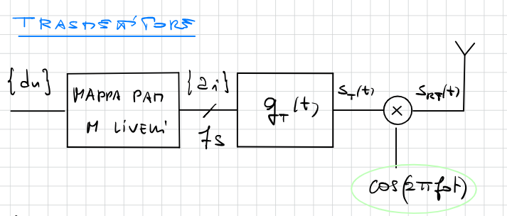

Questo tipo di sistemi aggiungono un **modulatore di segnale** $\cos{(2\pi f_0 t)}$ se ci permette di modulare il nostro segnale trasmesso $s_T(t)$ alla frequenza portante:
$$
\begin{align*}
	s_{RF}(T) &= s_T(t) \cos{(2\pi f_0 t)} \\
			  &= \sum_i{a_i g_T(t - iT_s) \cdot \cos{(2\pi f_0 t)}} \\
			  &= \sum_i{a_i g_{RF}(t - iT_s)}
\end{align*}
$$

La densità di potenza di $s_{RF}$ è legata alla **densità spettrale di potenza** $S_T(f)$ del segnale $s_T(t)$:
$$
\begin{align*}
	S_{RF}(f) &= \frac{S_T(f - f_0) + S_T(f + f_0)}{4} \\[1em]
			  &= \frac{1}{T_S} \sigma_a^2 \cdot \frac{\vert G_T(f - f_0) \vert^2 + \vert G_T(f + f_0)\vert^2}{4} && \text{Ipotizziamo } G_T(f) = \sqrt{G_{RCR}(f)}\\[1em]
			  &= \frac{1}{T_S} \sigma_a^2 \cdot \frac{G_{RCR}(f - f_0) + G_{RCR}(f + f_0)}{4} && \text{Utilizziamo una PAM a M livelli} \\[1em]
			  &= \frac{1}{T_S} \frac{M^2 - 1}{3} \cdot \frac{G_{RCR}(f - f_0) + G_{RCR}(f + f_0)}{4}
\end{align*}
$$

Graficamente otteniamo che:

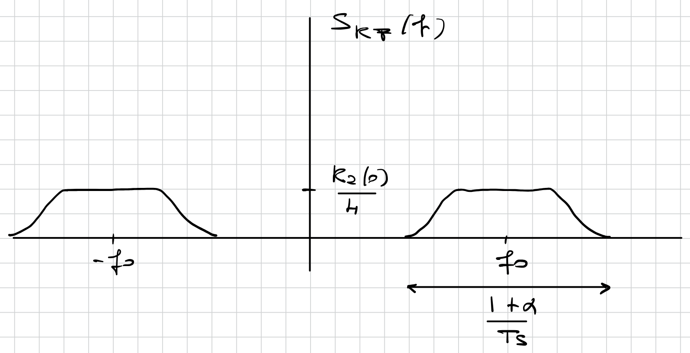

Quindi ne concludiamo che:
$$
\begin{cases}
	B_{RF} = 2 \cdot B_T = \frac{1 + \alpha}{T_S} & \text{Banda doppia} \\[1em]
	\eta_{SP} = \frac{R_d}{B_{RF}} = \frac{\log_2{(M)}}{1 + \alpha} & \text{Efficienza spettrale dimezzata}
\end{cases}
$$

Per quanto riguarda la potenza del segnale questa è **la metà**:
$$
\begin{align*}
	P_{RF} &= \int{S_{RF}(f)\;df} \\
		   &= \frac{1}{4} \cdot 2 \cdot \int{S_T(f)\;df}
		   &= \frac{1}{2} \cdot \int{S_T(f)\;df}
		   &= \frac{P_S}{2}
\end{align*}
$$

L'_energia_ del segnale in banda passante è a questo punto ovvia:
$$
	E_{RF} = P_{RF}T_S = \frac{P_ST_S}{2}
$$

In un sistema `PAM` con filtro a Coseno rialzato:
$$
	E_{RF} = \frac{\sigma^2}{2} = \frac{M^2 - 1}{6}
$$

## 4.2. Ricevitore

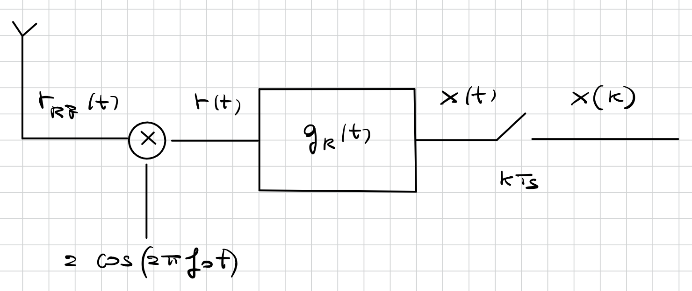

Il segnale ricevuto $r_{RF}(t)$ è pari a:
$$
	r_{RF}(t) = s_{RF}(t) \otimes c(t) + w_{RF}(t)
$$

Supponiamo che il canale sia **non distorcente**  con $c(t) = \delta(t)$:
$$
\begin{align*}
	r(t) &= 2 \cdot r_{RF}(t) \cos{(2\pi f_0 t)} \\
		 &= 2 \cdot s_{RF}(t) \cos{(2\pi f_0 t)} + 2 \cdot w_{RF}(t)\cos{(2\pi f_0 t)} \\
		 &= 2 \cdot s_{RF}(t) \cos{(2\pi f_0 t)} + w(t) \\
\end{align*}
$$

In questo caso la **densità spettrale di potenza** del rumore è pari a :
$$
\begin{align*}
	S_w(f) &= 4 \cdot \frac{S_{w_{RF}}(f - f_0) + S_{w_{RF}}(f + f_0)}{4}
		   &= \frac{N_0}{2} + \frac{N_0}{2} = N_0
\end{align*}
$$

Segue quindi che $w(t)$ è ancora un **Rumore Gaussiano Bianco**, con _densità spettrale_ $N_0$.

Dal filtro di ricezione $g_R(t)$, applicando il _teorema della modulazione_:
$$
\begin{align*}
	x(t) &= r(t) \otimes g_R(t) \\[0.8em]
		 &= 2 \cdot s_{RF}(t) \cos{(2\pi f_0 t)} \otimes g_R(t)  + w(t) \otimes g_R(t) \\[0.8em]
		 &= 2 \cdot s_{T}(t) \cos^2{(2\pi f_0 t)} \otimes g_R(t)  + w(t) \otimes g_R(t) \\[0.8em]
		 &= 2 \cdot s_{T}(t) \Biggl(\frac{1 + \cos{(4\pi f_0 t)}}{2}\Biggr) \otimes g_R(t)  + w(t) \otimes g_R(t) \\[0.8em]
		 &= (s_{T}(t) + s_{T}(t) \cdot \cos{(4\pi f_0 t)}) \otimes g_R(t)  + w(t) \otimes g_R(t) \\[0.8em]
		 &= s_{T}(t) + w(t) \otimes g_R(t) \\[0.8em]
		 &= s_T(t) + n(t)
\end{align*}
$$

Il rumore termico $n(t)$ avrà denstità spettrale:
$$
	S_n(f) = S_w(f) \cdot \vert G_R(f) \vert^2 = N_0 G_{RCR}^2
$$

In uscita del campionatore avremo quindi:
$$
	x(k) = a_k + n(k)
$$

Dove $n(k)$ sarà una _**Variabile Gaussiana a media nulla e varianza**_:
$$
	\sigma_n^2 = \int{S_n(f)\;df} = N_0 \int{G_{RCR}(f)\;df} = N_0
$$

Ne consegue che, tenendo conto che $x(k) \sim \mathcal{N}(0, N_0)$, la **probabilità di errore** utilizzando `PAM` a $M$ livelli
$$
\begin{align*}
	P(e) &= 2 \cdot \frac{M- 1}{M} Q(\frac{1}{\sigma_n}) \\
		 &= 2 \cdot \frac{M- 1}{M} Q(\frac{1}{N_0}) \\
\end{align*}
$$

Avendo però energia $E_S = \frac{M^2 - 1}{6}$, si ottiene che:
$$
	N_0 = \frac{M^2 - 1}{6 \frac{E_S}{N_0}}
$$

Sostituendo otteniamo _**la stessa probabilità di errore delle PAM in banda base**_:
$$
	P(e) = 2 \frac{M - 1}{M} \cdot Q\Biggl(\sqrt{\frac{6}{M^2-1} \cdot \frac{E_s}{N_0}}\Biggr)
$$

# 5. Sistema di Comunicazione QAM

I sistemi in **Modulazione in Quadratura di Ampiezza**, o `QAM`, appartengono ad una costellazione di ordine $M$ generata da **_due mappe `PAM` di ordine $\sqrt{M}$_**.

Di seguito possiamo vedere due esempi di `QAM`, entrambi in _**Codifica di Gray**_, che associa ad ogniun simbolo una coppia di bit con la regola che:
> Simboli adiacenti (su un asse o sull'altro) devono variare di esattamente `1 bit`.

4-QAM

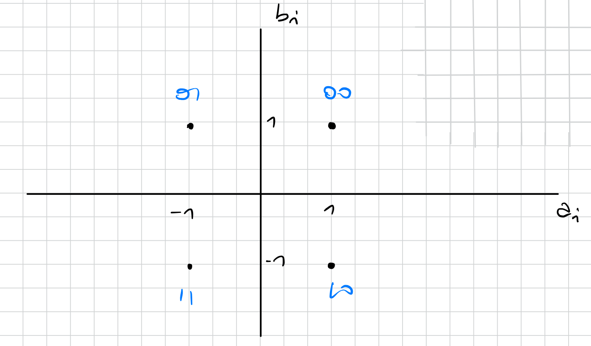

16-QAM

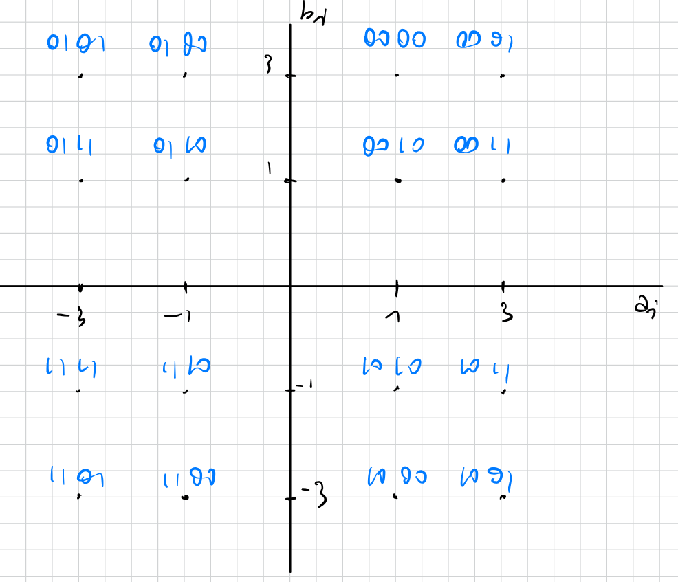

Per costruire una `QAM` di dimensioni $n^2$ a partire da una di dimensioni $n$ il trucco è:
- Copiarla nel primo quadrante
- Nel secondo quadrante copiare la simmetrica rispetto al primo
- Nel terzo e nel quarto copiare la simmetrica rispetto al secondo e al quarto
- Aggiungere come _MSD_ `00` al primo quadrante, `10` al secondo, `11` al terzo e `01` al quarto

## 5.1. Trasmettitore

Lo schema a blocchi di un **Trasmettitore QAM** è rappresentato da una mappa bidimensionale a `M` punti con due uscite: $\Set{a_i}$ e $\Set{b_i}$.

A questo punto ogni set è mandato all'ingresso di un filtro, producendo:
$$
\begin{cases}
	I(t) = \sum_i{a_i g_T(t - iT_S)} & \textit{\textbf{Fase}}\\
	Q(t) = \sum_i{b_i g_T(t - iT_S)} & \textit{\textbf{Quadratura}}
\end{cases}
$$

Queste sono poi modulati in frequenza:
- $I(t)$, detto _**Fase**_, viene modulato da un $\cos{(2\pi f_0t)}$
- $Q(t)$, detto _**Quadratura**_, viene modulato da un $-\sin{(2\pi f_0t)}$

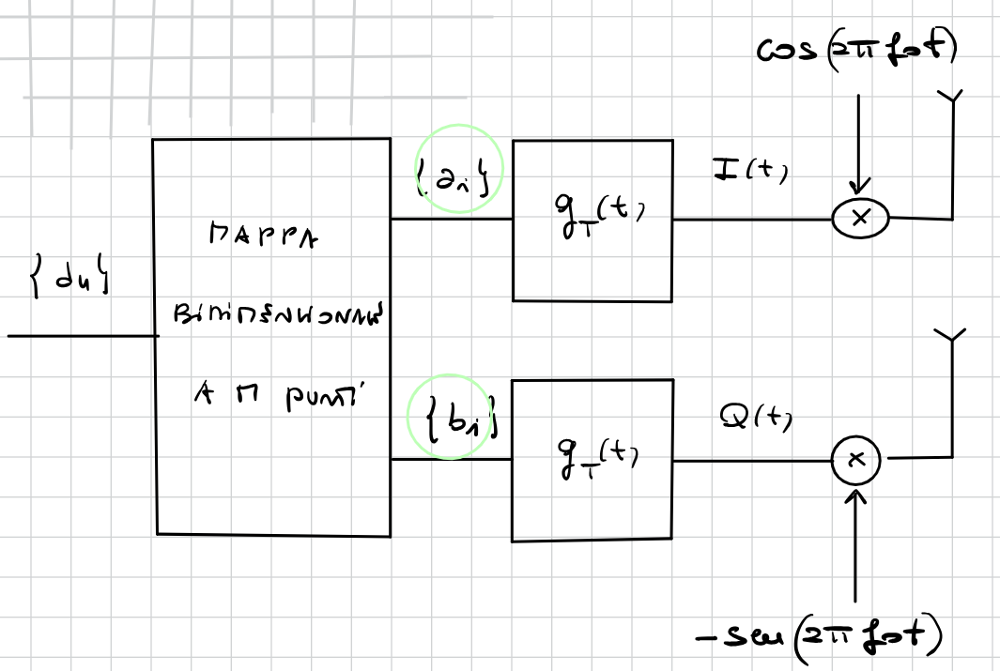

Il segnale trasmesso _passa-banda_ è quindi dato da:
$$
\Large
\boxed{
	s_{RF}(t) = I(t) \cdot \cos{(2\pi f_0t)} - Q(t) \sin{(2\pi f_0t)}
}
$$

Sfruttando l'_**Analisi Complessa**_, possiamo riscrivere il segnale come:
$$
\def\arraystretch{1.25}

\large
\begin{matrix}
		s_{RF}(t) = Re \Set{\vec{s}_T(t) e^{j2\pi f_0 t}} \\
		\vec{s}_T(t) = I(t) + jQ(t)
\end{matrix}
$$

Dove possiamo chiamare $\vec{s}_T(T)$ _**Inviluppo Complesso**_

Sostituendo otteniamo che, definendo i simboli complessi $c_i = a_i + jb_i$:
$$
\vec{s}_T(t) = I(t) + jQ(t) = \sum_i{c_i g_T(t - iT_S)}
$$

Possiamo quindi dire che $\vec{s}_T(t)$ è _**matematicamente equivalente**_ ad un segnale `PAM` con **simboli complessi** $\Set{c_i}$.

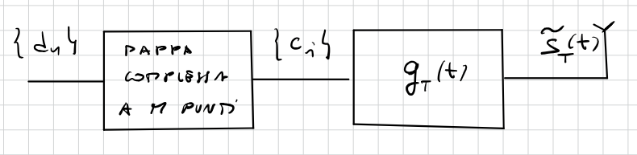

### 5.1.1. Densità Spettrale di Potenza

La densità spettrale di potenza di un segnale `QAM` è legata a quello dell'_inviluppo complesso_:
$$
	S_{RF}(f) = \frac{\vec{S}_T(f-f_0) + \vec{S}_T(f + f_0)}{4}
$$

In analogia con la `PAM` si ha che:
$$
	\vec{S}_T(f) = \frac{1}{T_S} \cdot R_c(0) \vert G_T(f) \vert^2
$$

Dove, se le due `PAM` hanno entrambi $\sqrt{M}$ liveli:
$$
\begin{align*}
	R_C(0) &= E\Set{\vert c_i \vert ^2} \\
		   &= E \Set{(a_i + jb_i)(a_i + jb_i)^\ast} \\
		   &= E \Set{\vert a_i \vert^2} + E \Set{\vert b_i \vert^2} \\
		   &= \frac{\sqrt{M}^2 - 1}{3} + \frac{\sqrt{M}^2 - 1}{3} \\
		   &= \frac{M - 1}{3} + \frac{M - 1}{3}
		   &= 2 \frac{M - 1}{3}
\end{align*}
$$

In analogia alla `PAM` in banda passante, si ottiene che la _banda_ di segnali `QAM`, con filtro $G_T(f) = \sqrt{G_{RCR}(f)}$, è pari a:
$$
\Large
\boxed{
	B_{RF} = 2 \cdot 2 B_T = \frac{1 + \alpha}{T_S}
}
$$

L'_efficienza spettrale_:
$$
\begin{align*}
	\eta_{RF} &= \frac{R_b}{B_s} \\
			  &= R_b \cdot \Biggl(\frac{1 + \alpha}{\log_2{(M^2)}} \frac{1}{T_d}\Biggr)^{-1} \\
			  &= R_b \cdot \Biggl(\frac{1 + \alpha}{2r \log_2{(M)}} \frac{1}{T_b}\Biggr)^{-1} \\
			  &= R_b \cdot \frac{2r \log_2{(M)}}{1 + \alpha} \frac{1}{R_b} \\
			  &= \frac{2r \log_2{(M)}}{1+\alpha}
\end{align*}
$$

La banda di una $M^2$-`QEM` è _**la metà**_ di una $M$-`PAM`.

L'_Energia Del Segnale_ diventa quindi:
$$
\begin{align*}
	E_{RF} &= \frac{P_{\vec{s}}T_S}{2} \\
		   &= \frac{T_S}{2} \frac{1}{T_S} \int{R_c(0) \vert G_T(t) \vert^2\;df} \\
		   &= \frac{R_c(0)}{2} = \frac{M - 1}{3}
\end{align*}
$$

## 5.2. Ricevitore

Il segnale ricevuto $r_{RF}(t)$ è pari a:
$$
\large
	r_{RF}(t) = s_{RF}(t) + w_{RF}(t)
$$

Supponendo sempre che il canale sia non distorcente $(c(t) = \delta(t))$, consideriamo i due rami separatamente.

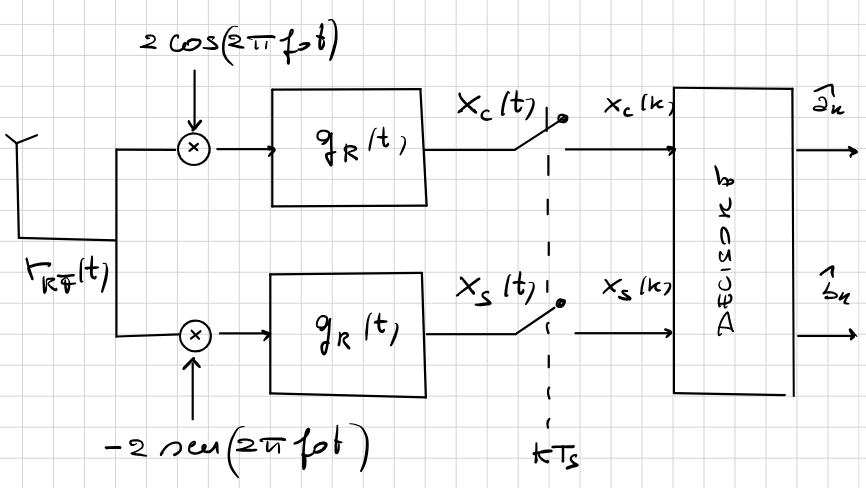

Nel ramo superiore:
$$
\begin{align*}
	x_c(T) &= 2 \cdot r_{RF}(t) \cos{(2\pi f_0t)} \\
		   &= 2 \cdot s_{RF}(t) \cos{(2\pi f_0t)} + 2 \cdot w_{RF}(t) \cos{(2\pi f_0t)}  \\
		   &= 2 \cdot s_{RF}(t) \cos{(2\pi f_0t)} + w_c(t)  \\
\end{align*}
$$

Il rumore è trattato esattamente come nelle `PAM` in _banda-passante_. Quindi, in uscita dal filtro di ricezione il rumore è una _**Variabile Gaussiana a Media Nulla**_, con varianza:
$$
\begin{align*}
	\sigma_{n'_c}^2 = \frac{\sigma_{n_c}^2}{\beta} &= \frac{1}{\beta}\int{S_{n_c}(f)\;df} \\
				   &= \frac{N_0}{\beta} \int{G_{RCR}(f)\;df} \\
				   &= \frac{N_0}{\beta}
\end{align*}
$$

Per quanto riguarda il segnale utile invece, se teniamo conto che:
$$
	s_{RF}(t) = I(t) \cos{(2\pi f_0t)} - Q(t) \sin{(2\pi f_0t)}
$$

Otteniamo che, applicando le regole trigonometriche:
$$
2 I(t) \cos^2{(2\pi f_0t)} - 2 Q(t) \sin{(2\pi f_0t)}\cos{(2\pi f_0t)} \\
I(t) + I(t) \cos{(4\pi f_0t)} -  Q(t) \sin{(4\pi f_0t)}
$$

Di questi segnali, le densità spettrali del secondo e del terzo termine sono centrate in $2f_0$, perciò vengono _**filtrate dal filtro di ricezione**_.

Sul ramo superiore otteniamo quindi:
$$
\LARGE
\boxed{
	x_c(k) = a_k + n'_c(k) \sim \mathcal{N}(0, \frac{N_0}{\beta})
}
$$

Per quanto riguarda il ramo inferiore invece:
$$
\begin{align*}
	x_s(T) &= -2 \cdot r_{RF}(t) \sin{(2\pi f_0t)} \\
		   &= -2 \cdot s_{RF}(t) \sin{(2\pi f_0t)} - 2 \cdot w_{RF}(t) \sin{(2\pi f_0t)}  \\
		   &= -2 \cdot s_{RF}(t) \sin{(2\pi f_0t)} + w_c(t)  \\
\end{align*}
$$

Trattiamo il rumore ancora una volta come nelle `PAM` in _banda-passante_, ovvero una _**Variabile Gaussiana a Media Nulla**_, con varianza:
$$
\begin{align*}
	\sigma_{n'_c}^2 = \frac{\sigma_{n_c}^2}{\beta} &= \frac{1}{\beta} \int{S_{n_c}(f)\;df} \\
				   &= \frac{N_0}{\beta} \int{G_{RCR}(f)\;df} \\
				   &= \frac{N_0}{\beta}
\end{align*}
$$

Per quanto riguarda il segnale utile, tenendo sempre conto che:
$$
	s_{RF}(t) = I(t) \cos{(2\pi f_0t)} - Q(t) \sin{(2\pi f_0t)}
$$

E riapplicando le regole trigonometriche:
$$
-2 I(t) \cos{(2\pi f_0t)}\sin{(2\pi f_0t)} + 2 Q(t) \sin^2{(2\pi f_0t)} \\
-I(t) \sin{(4\pi f_0t)} + Q(t)  - Q\cos{(4\pi f_0t)}
$$

Di questi segnali, le densità spettrali del primo e del terzo termine sono centrate in $2f_0$, perciò vengono _**filtrate dal filtro di ricezione**_.

Sul ramo inferiore otteniamo quindi:
$$
\LARGE
\boxed{
	x_s(k) = b_k + n'_s(k) \sim \mathcal{N}\Biggl(0, \frac{N_0}{\beta}\Biggr)
}
$$

Il segnale ricostruito è quindi:
$$
\LARGE
\boxed{
	x(k) = x_c(k) + j x_s(k) = c(k) + n'_c(k) + jn'_s(k) = c(k) + n'(k) \sim \mathcal{N}\Biggl(0, 2\frac{N_0}{\beta}\Biggr)
}
$$

### 5.2.1. Probabilità di Errore

Nel nostro segnale ricostruito:
$$
x(k) = c(k) + n(k)
$$

$n(k)$ è costruita a partire da due _Variabili Aleatorie Gaussiane Indipendenti_ $n_c(k)$ e $n_s(k)$:
$$
	n_c(k), n_s(k) \sim \mathcal{N}(0,N_0)
$$

Quando effettuiamo la decisione, se ci basassimo ancora una volta sulle traduzioni a **distanza minima**, dovremmo applicare le reogle geometriche su più dimensioni, prendendo distanze concentriche.

Per semplificare i calcoli, invece di trattare distanze concentriche, effettuiamo le scelte trattando le due dimensioni indipendentemente, ottenendo non dei cerchi, ma dei _**rettangoli**_ (o _quadrati_ nel caso di mappe `QAM` basate su `PAM`).

Nelle `4-QAM` la probabilità di errore :
$$
	P(e) = \frac{1}{4} \sum_i{P(e \vert c_k = c^{(i)})}
$$

Grazie alla simmetria delle costellazioni, possiamo limitarci a calcolare una sola probabilità, ad esempio:
$$
	P(e \vert c_k = c^{(1)}) = 1 - P(c \vert c_k = c^{(1)})
$$

Dove $P(c \vert c_k = c^{(1)})$ rappresenta la _**Probabilità di Corretta Ricezione**_:
$$
\begin{align*}
	P(c \vert c_k = c^{(1)}) &= P(x_c(k) \ge 0, x_s(k) \ge 0 \vert c_k = c^(1)) && x_c(k),x_s(k) \text{ sono indipendenti} \\
		&= P(x_c(k) \ge 0 \vert a_k = a^(1)) \cdot P(x_s(k) \ge 0 \vert b_k = b^(1)) \\
		&= Q\Biggl(-\frac{1}{\sqrt{N_0}}\Biggr) \cdot Q\Biggl(-\frac{1}{\sqrt{N_0}}\Biggr)
		&= Q\Biggl(-\frac{1}{\sqrt{N_0}}\Biggr)^2
		&= \Biggl(1 - Q\Biggl(\frac{1}{\sqrt{N_0}}\Biggr))^2
		&= 1 - 2 Q\Biggl(\frac{1}{\sqrt{N_0}}\Biggr) + Q^2\Biggl(\frac{1}{\sqrt{N_0}}\Biggr)
\end{align*}
$$

A questo punto la _**Probabilità di Errore**_:
$$
\begin{align*}
	P(e) &= 2 Q\Biggl(\frac{1}{\sqrt{N_0}}\Biggr) - Q^2\Biggl(\frac{1}{\sqrt{N_0}}\Biggr) \\
		 &\approx 2 Q\Biggl(\frac{1}{\sqrt{N_0}}\Biggr)
\end{align*}
$$

Se teniamo conto che nelle `4-QAM` vale:
$$
	\frac{E_s}{N_0} = \frac{M - 1}{3N_0} = \frac{4 - 1}{3N_0} = \frac{1}{N_0}
$$

Otteniamo:
$$
\Large 
\boxed{
	P(e) = Q\Biggl(\sqrt{\frac{E_S}{N_0}}\Biggr)
}
$$

Nelle `16-PAM` la situazione è più complessa.

Infatti non vale una simemtria totale come nel caso precedente, ma abbiamo tre probabilità diverse. Nell'immagine sotto è possibile visualizzare come queste sono distribuite.

<figure class="">
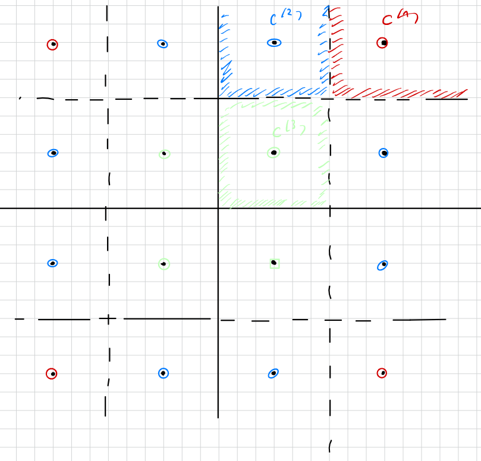
<figcaption>

Simboli dello stesso colore hanno la stessa probabilità di errore
</figcaption>
</figure>

La probabilità di errore è quindi pari a:
$$
P(e) = \frac{1}{16} \Biggl(
	4 P(e \vert c_k = c^{(1)}) +
	8 P(e \vert c_k = c^{(2)}) +
	4 P(e \vert c_k = c^{(3)})
\Biggr)
$$

La probabilità $P(e\vert c_k = c^{(1)})$ è analoga a quella della `4-QAM`, perciò il calcolo è omesso.

Calcoliamo quella del secondo termine:
$$
\begin{align*}
	P(e \vert c_k = c^{(2)}) &= 1 - P(c \vert c_k = c^{(2)}) \\
		&= 1 - \Biggl(1 - Q\Biggl(\frac{1}{\sqrt{N_0}}\Biggr)\Biggr)\Biggl(1 - 2 Q\Biggl(\frac{1}{\sqrt{N_0}}\Biggr)\Biggr) && \text{Il secondo termine è limitato da entrambi i lati, ergo il fattore } \times 2 \\
		&= 3 Q\Biggl(\frac{1}{\sqrt{N_0}}\Biggr) - 2 Q^2\Biggl(\frac{1}{\sqrt{N_0}}\Biggr)
\end{align*}
$$

Il terzo termine analogamente:
$$
\begin{align*}
	P(e \vert c_k = c^{(2)}) &= 1 - P(c \vert c_k = c^{(2)}) \\
		&= 1 - \Biggl(1 - 2 Q\Biggl(\frac{1}{\sqrt{N_0}}\Biggr)\Biggr)^2 && \text{Entrambi i termini sono limitati da entrambi i lati, ergo il fattore } \times 2 \\
		&= 4 Q\Biggl(\frac{1}{\sqrt{N_0}}\Biggr) - 4 Q^2\Biggl(\frac{1}{\sqrt{N_0}}\Biggr)
\end{align*}
$$

Mettendo insieme otteniamo che la _**Probabilità di Errore**_:
$$
\begin{align*}
	P(e) &= \frac{1}{16} \Biggl(
		8 Q\Biggl(\frac{1}{\sqrt{N_0}}\Biggr) - 4 Q^2\Biggl(\frac{1}{\sqrt{N_0}}\Biggr) +
		24 Q\Biggl(\frac{1}{\sqrt{N_0}}\Biggr) - 16 Q^2\Biggl(\frac{1}{\sqrt{N_0}}\Biggr) +
		16 Q\Biggl(\frac{1}{\sqrt{N_0}}\Biggr) - 16 Q^2\Biggl(\frac{1}{\sqrt{N_0}}\Biggr)
	\Biggr) \\
			&= 3 Q\Biggl(\frac{1}{\sqrt{N_0}}\Biggr) - \frac{9}{4} Q^2\Biggl(\frac{1}{\sqrt{N_0}}\Biggr) \\
			&\approx 3 Q\Biggl(\frac{1}{\sqrt{N_0}}\Biggr)
\end{align*}
$$

Se terniamo conto che in questo caso:
$$
	\frac{E_s}{N_0} = \frac{M - 1}{3 N_0} = \frac{16 - 1}{3 N_0} = \frac{5}{N_0}
$$

La _**Probabilità di Errore nelle `16-QAM`**_:
$$
\Large 
\boxed{
	P(e) = 3 Q\Biggl(\sqrt{\frac{1}{5} \frac{E_S}{\sqrt{N_0}}}\Biggr)
}
$$
