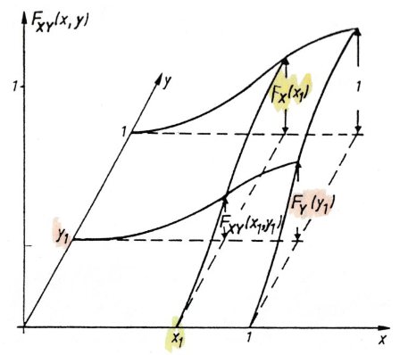
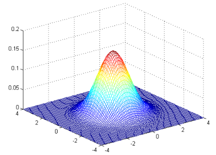
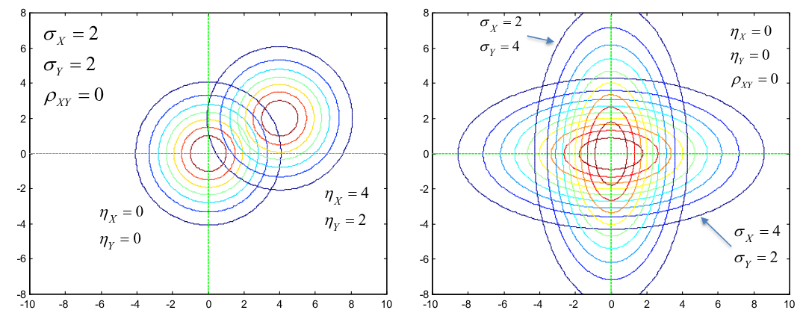
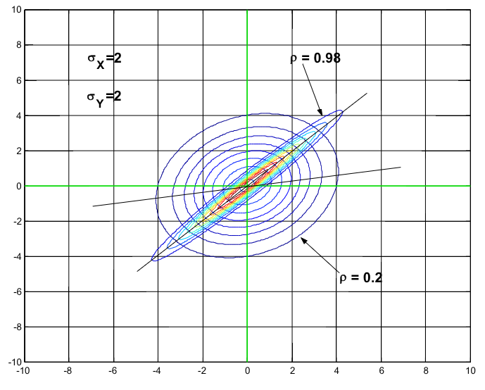

# 1. Indice

- [1. Indice](#1-indice)
- [2. Sistemi di Variabili Aleatorie](#2-sistemi-di-variabili-aleatorie)
	- [2.1. Funzione Densità di Probabilità Congiunta](#21-funzione-densità-di-probabilità-congiunta)
	- [2.2. Variabili aleatorie indipendenti](#22-variabili-aleatorie-indipendenti)
	- [2.3. Momenti Congiunti](#23-momenti-congiunti)
		- [2.3.1. Correlazione e Covarianza](#231-correlazione-e-covarianza)
		- [2.3.2. Varianza della Somma](#232-varianza-della-somma)
		- [2.3.3. Coefficiente di Correlazione](#233-coefficiente-di-correlazione)
- [3. Sistemi di Variabili Congiuntamente Gaussiane](#3-sistemi-di-variabili-congiuntamente-gaussiane)
- [4. Teorema del Limite Centale](#4-teorema-del-limite-centale)

# 2. Sistemi di Variabili Aleatorie

Siano $X$ e $Y$ due variabili aleatorie definite _**sullo stesso sistema di probabilità**_ $(\Omega, S, P)$.
Esse costituiscono un _sistema di 2 variabili aleatorie_ che trasforma gli elementi del'insieme $\Omega$ in dei punti $(x,y)$.

Poiché $X$ e $Y$ sono variabili aleatorie, gli insiemi $\Set{X \le x}$ e $\Set{Y \le y}$ costituiscono due eventi.

La loro intersezione è quindi un **evento:**
$$
\Set{X \le x} \cap \Set{Y \le y} = \Set{X \le x, Y \le y}
$$

La probabilità associata a questo evento è nota come _**Funzione Di Distribuzione Di Probabilità Congiunta**_ delle due variabili aleatorie:
$$
\begin{matrix}
	F_{XY}(x,y): R^2 \to R && F_{XY}(x,y) = P(X \le x, Y \le y)
\end{matrix}
$$

Le proprierà della funzione di distribuzione di probabilità congiunta sono le seguenti:
$$
\begin{align*}
	& 0\le F_{XY}(x,y) \le 1 \\
	& F_{XY}(x,y) \text{ funzione monotona non decrecente di ciascuna delle due variabili} \\
	& F_{XY}(-\infty, -\infty) = F_{XY}(-\infty, y) = F_{XY}(x, -\infty) = 0 \\
	& F_{XY}(+\infty, +\infty) = 1
\end{align*}
$$

Le funzioni di distribuzione delle **singole variabili aleatorie** si chiamano _**Regole Marginali**_:
$$
\begin{align*}
	F_X(x) &= F_{XY}(x, \infty) \\
	F_Y(y) &= F_{XY}(\infty, y)
\end{align*}
$$

## 2.1. Funzione Densità di Probabilità Congiunta

La funzione di densità di probabilità congiunta è definita, se la funzione è derivabile fino al secondo ordine:
$$
\large
\boxed{
	f_{XY}(x,y) = \frac{\partial^2 F_{XY}(x,y) }{\partial x \partial y}
}
$$

Esiste quindi la correlazione:
$$
\large
\begin{CD}
	{
		f_{XY}(x,y)dxdy = P(x < X \le x + dx, y < Y \le y + dy)
	} \\
	@VVV \\
	\boxed{
		P[(X,Y) \in D] = \iint_{D}{f_{XY}(x,y)\;dxdy}
	}
\end{CD}
$$

Le _Densità Di Probabilità Marginali_ sono quindi:
$$
\begin{align*}
	f_X(x) &= \int_{-\infty}^{\infty}{f_{XY}(x,y)\;dy} & \text{Variabile Aleatoria } X
	f_Y(y) &= \int_{-\infty}^{\infty}{f_{XY}(x,y)\;dx} & \text{Variabile Aleatoria } Y
\end{align*}
$$

## 2.2. Variabili aleatorie indipendenti

Le variabili $X$ e $Y$ si dicono _**statisticamente indipendenti**_ se gli eventi $\Set{X \le x}$ e $\Set{Y \le y}$ sono _indipendneti_, overo:
$$
\begin{align*}
F_{XY}(x,y) &= P(X\le x, Y \le y) \\
			&= P(X\le x) P(Y \le y) \\
			&= F_X(x)F_Y(y)
\end{align*}
$$

Segue quindi che anche la _densità di probabilità congiunta_ si fattorizza nel prodotto delle due _densità marginali_:
$$
	f_{XY}(x,y) = \frac{\partial^2 F_{XY}(x,y)}{\partial x\partial y} = \frac{\partial F_X(x)}{\partial x} \cdot \frac{\partial F(Y)}{\partial y} = f_X(x) \cdot f_Y(y)
$$

Sapendo quindi che le variabili sono indipendenti, per descrivere statisticamente il sistema **sono sufficienti le densità di probabiiltà marginali**.

## 2.3. Momenti Congiunti

### 2.3.1. Correlazione e Covarianza

Abbiamo visto come il comportamento statistico di una variabile aleatoria $X$ può essere caratterizzato in maniera incompleta, ma _talvolta sufficiente_, da alcuni parametri caratteristici (varianza, valor medio, ...).

Per una coppia di variabili aleatorie $(X,Y)$ possiamo quindi determinare alcuni _parametri statistici semplificati_ che forniscono utili indicazioni per la compressione del loro _comportamento statistico congiunto_.

Definiamo _**Correlazione**_:
$$
	r_{XY} = E\Set{XY} = \int_{-\infty}^{\infty}{\int_{-\infty}^{\infty}{xyf_{XY}(x,y)\;dx}\;dy}
$$

Se la $r_{XY} = 0$, allora le due variabili si dicono _**Ortogonali**_.

Definiamo _**Covarianza**_:
$$
\begin{align*}
	c_{XY} 	&= E\Set{(X-\eta_X)(Y-\eta_Y)} \\
			&= \int_{-\infty}^{\infty}{\int_{-\infty}^{\infty}{(x-\eta_X)(y-\eta_Y)f_{XY}(x,y)\;dx}\;dy} \\
			&= r_{XY} - \eta_X \eta_Y
\end{align*}
$$

La covarianza $c_{XY}$ è un parametro che **acceta se tra due variabili $X$ e $Y$ esiste una relazione di dipendenza lineare**, e ne misura la variazione congiunta, detta  appunto _covarianza_, delle due.

Se la **Covarianza è Grande e Positiva** significa che le due variabili si discostano dal rispettivo valor medio _nella stessa direzione_, ovvero che $\operatorname*{sgn}(X-\eta_X) = \operatorname*{sgn}(Y - \eta_Y)$

Se invece $c_{XY} = 0$ allora le due variabili si dicono _**incorrelate**_.

### 2.3.2. Varianza della Somma

La varianza della somma di due variabili aleatore correlate è **diversa** dalla somma delle due varianze, in particolare vige la relazione:
$$
\operatorname*{Var}(X + Y) = \operatorname*{Var}(X) + \operatorname*{Var}(Y) + 2c_{XY}
$$

Questa relazione è facilmente deducibile:
$$
\begin{align*}
	\operatorname*{Var}(X + Y) &= E[(X+Y)^2] - E^2(X+Y) \\
		&= E(X^2) + E(Y^2) + 2E(XY) - E^2(X) + E^2(Y) - 2E(X)E(Y) \\
		&= E(X^2) - E^2(X) + E(Y^2) - E^2(Y) + 2(E(XY) - E(X)(Y)) \\
		&= \operatorname*{Var}(X) + \operatorname*{Var}(Y) + 2c_{XY}
\end{align*}
$$

Se le due variabili sono _incorrelate_, allora la varianza della somma coincide effettivamente con la somma delle varianza.

### 2.3.3. Coefficiente di Correlazione

Possiamo definire un ulteriore coefficente, detto **Coefficiente di Correlazione**, o _covarianza normalizzata_:
$$
\large
	\rho_{XY} = E \Set{\frac{X-\eta_X}{\sigma_X} \cdot \frac{Y-\eta_Y}{\sigma_Y}} = \frac{c_{XY}}{\sigma_X\sigma_Y} = \frac{r_{XY} - \eta_X\eta_Y}{\sigma_X\sigma_Y}
$$

Questo coefficiente gode di tre proprietà principali:
$$
\begin{align*}
c_{XY}^2 \le \sigma_X^2\sigma_Y^2 &\rArr |\rho_{XY}| \le 1 \\[1em]
c_{XY} = 0 &\rArr rho_{XY} = 0 \\[1em]
Y = aX + b &\rArr |\rho_{XY}| = 0 & a \ne 0
\end{align*}
$$

La terza proprietà elencata ci permette di dimostrare che se il coefficiente di correlazioen è 1, allora le variabili aleatorie sono _linearmente dipendenti_.
In questi casi possiamo effettuare una _previsione perfetta_: noto $X$ si ricava esattamente $Y = aX + b$

Il coefficiente di correlazione ci fornisce in tutti i casi una misura della dipendenza lineare tra le due variabili aleatorie.

Nel caso di variabili aleatore **indipendenti**:
$$
\begin{align*}
r_{XY} = E\Set{XY} &= \int_{-\infty}^{\infty}{\int_{-\infty}^{\infty}{xyf_{XY}(x,y)\;dx}\;dy} \\
		&= \int_{-\infty}^{\infty}{\int_{-\infty}^{\infty}{xyf_{X}(x)f_Y(y)\;dx}\;dy} \\
		&= \int_{-\infty}^{\infty}{xf_{X}(x)\;dx} \cdot \int_{-\infty}^{\infty}{yf_Y(y)\;dy} \\
		&= \eta_X \cdot \eta_Y
\end{align*}
$$

Otteniamo quindi che:
$$
\begin{align*}
	c_{XY} &= r_{XY} - \eta_X\eta_Y = 0 \\
	\rho_{XY} &= \frac{c_{XY}}{\sigma_X\sigma_Y} = 0
\end{align*}
$$

Possiamo quindi dire che:
> Due variabili aleatore **indipendenti** sono anche _**incorrelate**_.
> Viceversa, se la covarianza è nulla _**non è detto**_ che $X$ e $Y$ siano indipendenti

Possiamo vedere il controesempio prendendo la variabile aleatoria uniformemente distribuita $\theta \in [0, 2\pi)$, e le due ulteriori variabili aleatore
$$
\begin{matrix}
	X = \sin{(\theta)} & & Y = \cos{(\theta)}
\end{matrix}
$$

Se calcoliamo la correlazione tra $X$ e $Y$:
$$
\begin{align*}
	r_{XY}  &= E\Set{XY}  \\
			&= E\Set{\sin{(\theta)}\cos{(\theta)}} && \text{Teorema dell'aspettazione} \\
			&= \int_{-\infty}^{+\infty}{\sin{(\theta)}\cos{(\theta)} \cdot f_\theta(\theta)\;d\theta} \\
			&= \int_{0}^{2\pi}{\sin{(\theta)}\cos{(\theta)} \frac{1}{2\pi}\;d\theta} \\
			&= \frac{1}{2pi}\int_{0}^{2\pi}{\frac{\sin{(2\theta)}}{2}\;d\theta} \\
			&= \frac{1}{2\pi} \cdot 0 && \text{Funzione periodica simmetrica}
			&= 0
\end{align*}
$$

Se volessimo calcolare la Correlazione e il coefficiente di Correlazione, dobbiamo prima calcolare i valori medi:
$$
\begin{align*}
	\eta_X &= \int_{0}^{2\pi}{\frac{\cos{(\theta)}}{2\pi}} = 0 \\
	\eta_Y &= \int_{0}^{2\pi}{\frac{\sin{(\theta)}}{2\pi}} = 0 \\
\end{align*}
$$

Possiamo quindi dire:
$$
\begin{align*}
	c_{XY} &= r_{XY} - \eta_X\eta_Y = 0 - 0 = 0 \\
	\rho_{XY} &= \frac{c_{XY}}{\sigma_X\sigma_Y} = 0
\end{align*}
$$

Abbiamo quindi scoperto che $X$ e $Y$ _**sono incorrelate**_.

Tuttavia sappiamo però che:
$$
\cos{(\theta)}^2 + \sin{(\theta)}^2 = 1
$$

Abbiamo quindi che le due variabili, anche se _incorrelate_, _**non sono indipendenti**_:
$$
	X^2 + Y^2 = 1
$$

# 3. Sistemi di Variabili Congiuntamente Gaussiane

Due variabili aleatorie continue si dicono _**Congiuntamente Gaussiane**_, se la distribuzione di probabilità congiunta ha la seguente espressione:
$$
\Large
\boxed{
	f_{XY}(x,y) = \frac{1}{2\pi\sigma_X\sigma_Y\sqrt{1-\rho^2}}\cdot e^{-\frac{1}{2(1-p^2)}Q(x,y)}
}
$$

Dove il termine $Q(x,y)$:
$$
\large
\boxed{
	Q(x,y) = \frac{(x-\eta_X)^2}{\sigma_X^2} - \frac{2\rho(x-\eta_X)(y-\eta_Y)}{\sigma_X\sigma_Y} + \frac{(y-\eta_Y)^2}{\sigma_Y^2}
}
$$

<figure class="">

<figcaption>

Grafico del caso $\eta_X = \eta_Y = 0, \sigma_X = \sigma_Y = 1, \rho_{XY} = 0$
</figcaption>
</figure>

Questo tipo di variabili godono di una proprietà importante:
> Se due variabili aleatorie sono _congiuntamente Gaussiane_ e _incorrelate_ allora _**sono indipendenti**_

Infatti, se il coefficiente di correlazione $\rho = 0$, la distribuzione di probabilità congiunta à il prodotto di quelle marginali:
$$
\large
\begin{align*}
	f_{XY}(x,y) &= \frac{1}{2\pi\sigma_X\sigma_Y}\cdot e^{-\frac{(x-\eta_X)^2}{\sigma_X^2} - \frac{(y-\eta_Y)^2}{\sigma_Y^2}} \\
				&= 	\frac{1}{\sqrt{2\pi}\sigma_X}\cdot e^{-\frac{(x-\eta_X)^2}{\sigma_X^2}} \cdot \frac{1}{\sqrt{2\pi}\sigma_Y}\cdot e^{-\frac{(y-\eta_Y)^2}{\sigma_Y^2}} \\
				&= f_X(x)\cdot f_Y(y)
\end{align*}
$$

<figure class="100">

<figcaption>

Esempi con $\rho = 0$
</figcaption>
</figure>

<figure class="90">

<figcaption>

Esempio con $\rho \ne 0$
</figcaption>
</figure>

# 4. Teorema del Limite Centale

Consideriamo la variabile aleatoria:
$$
Y_n = \sum_{i=1}^n{X_i}
$$

Supponiamo che le $n$ variabili aleatore $\Set{X_1, X_2, ..., X_n}$ siano _indipendenti_ e con la _stessa densità di probabilità_ (_identicamente distribuite_), con valor medio $\eta$ e varianza $\sigma^2$, allora:
$$
\begin{matrix}
	E\Set{Y_n} = \eta_n = n \cdot \eta && E\Set{(Y_n-\eta_n)^2} = \sigma_n^2 = n \cdot \sigma^2
\end{matrix}
$$

Se consideriamo quindi un numero $n$ di variabili _man mano crescente_, la densità di probabilità della _**variabile aleatora normalizzata**_:
$$
S_n = \frac{Y_n - \eta_n}{\sigma_n} = \frac{Y_n - n\cdot \eta}{\sqrt{n}\cdot \sigma}
$$

Questa quantità tende ad una **densità notmale standard**:
$$
\begin{CD}
	{\lim_{n\to+\infty}{f_{S_n}(s)} = f_Z(s) = \frac{1}{\sqrt{2\pi}}\cdot e^{-\frac{s^2}{2}}} @>>> {\begin{cases}
		\eta = 0 \\
		\sigma^2 = 1
	\end{cases}}
\end{CD}
$$

