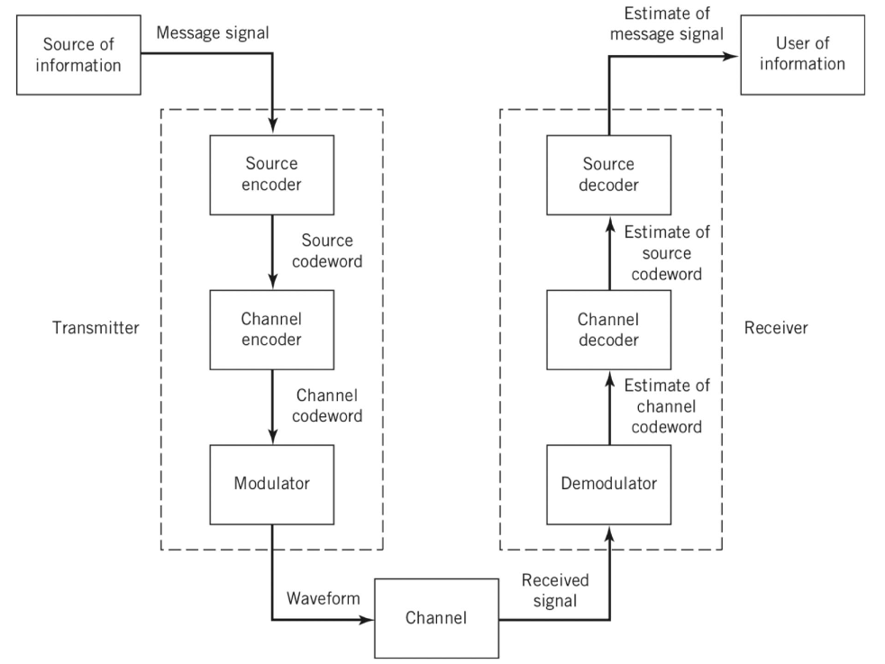
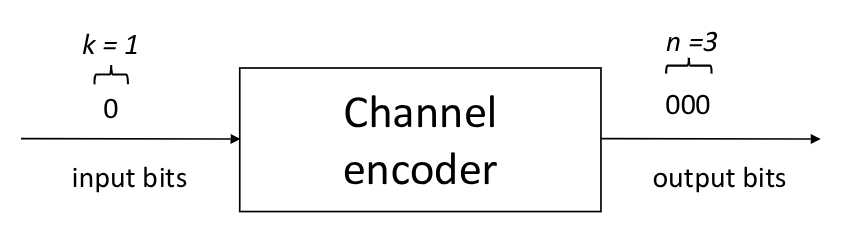
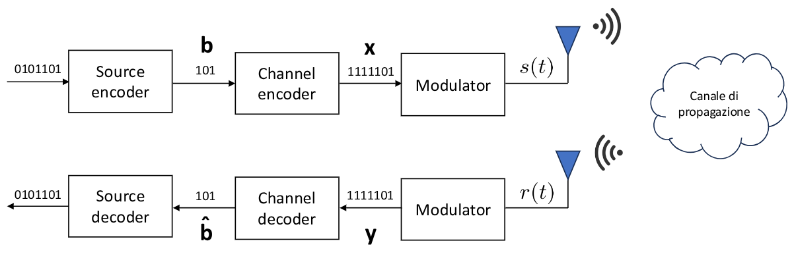

# 1. Indice

- [1. Indice](#1-indice)
- [2. Teoria Dei Codici](#2-teoria-dei-codici)
	- [2.1. Relazione Tempo - Velocità di Trasmissione di bit](#21-relazione-tempo---velocità-di-trasmissione-di-bit)
- [3. Introduzione ai Codici di Canale](#3-introduzione-ai-codici-di-canale)
	- [3.1. Codici A Blocco](#31-codici-a-blocco)
		- [3.1.1. Codice a Ripetizione](#311-codice-a-ripetizione)
		- [3.1.2. Codici a Controllo di Parità](#312-codici-a-controllo-di-parità)
	- [3.2. Codici a Blocco Lineari](#32-codici-a-blocco-lineari)
		- [3.2.1. Distanza Minima di un Codice](#321-distanza-minima-di-un-codice)
		- [3.2.2. Codice A Blocco Lineare Sistematico](#322-codice-a-blocco-lineare-sistematico)
	- [3.3. Codici di Hamming](#33-codici-di-hamming)
	- [3.4. Rivelazione e Correzione degli Errori](#34-rivelazione-e-correzione-degli-errori)
		- [3.4.1. Decodifica A Massima Verosimiglianza](#341-decodifica-a-massima-verosimiglianza)
		- [3.4.2. Decodifica a Sindrome](#342-decodifica-a-sindrome)
	- [3.5. Prestazione dei codici a Blocco](#35-prestazione-dei-codici-a-blocco)

# 2. Teoria Dei Codici

Abbiamo già visto come è composto un **Sistema di Comunicazione Digitale**:

Avevamo anche introdotto per la trasmissione i concetti di:
1. **Source Encoder** (_Codifica di Sorgente_): rimuove la ridondanza per comprimere le dimensioni del segnale da inviare
2. **Channel Encoder** (_Codifica di Canale_): introduce delle ridondanza controllata per proteggere dagli errori

Nella ricezione si effettuano le operazioni inverse, ovvero prima _channel decoder_ e poi _source decoder_.

## 2.1. Relazione Tempo - Velocità di Trasmissione di bit

Supponiamo di avere in ingresso ad un sistema $k$ bit, e che lui ne produca $n > k$ in uscita.

Chiamiamo $T_b$ il tempo necessario per inviare in ingresso un bit, e $T_c$ il tempo necessario per ricevere in uscita un bit.

È valida la relazione:
$$
	kT_b = nT_c
$$

Di conseguenza abbiamo che:
$$
	T_c = \frac{k}{n}T_b \le T_b
$$

Chiamando $R_c$ la velocità di trasmissione di output, e $R_b$ la velocità di trasmissione di input:
$$
R_c = \frac{1}{T_c} = \frac{n}{k}\frac{1}{T_b} = \frac{n}{k}R_b \ge R_b
$$

Di conseguenza abbiamo che, se un sistema privo di bufferizzatore **produce in uscita più bit di quelli in entrata**:
- Il tempo di trasmissione bit in uscita è _minore_ rispetto a quello di entrata
- La velocità di trasmissione di bit in uscita è _maggiore_ rispetto a quella di trasmissione in ingresso

# 3. Introduzione ai Codici di Canale

I codici di canale si dividono in due categorie, ogniuna con una proprietà:
- _**Codici a Rivelazione di Errore**_: individua la presenza di errori _senza correggerli_. Alcuni esempi sono l'`ISBN`, le carte di credito, il _checksum_, il bit di parità, ...
- _**Codici a Correzione di Errore**_: individua la presenza di errori e li _corregge_. Alcuni esempi sono le memorie digitali, le comunicazioni cellulari e satellitari, ...

Di tutti i codici che esistono, noi tratteremo i **codici di canale lineari**, che sono basati su una combinazione lineare di bit.

Esistono di due categorie:
- **Codici a Blocco**: i più semplici, operano su blocchi finiti di bit
- **Codici Convoluzionali**: operano su sequenze con memoria, ovvero _stream di bit_

## 3.1. Codici A Blocco

Il codice a Blocco, dato un blocco di $k$ bit in ingresso, produce un blocco di $n > k$ bit

Definiamo **Rate del codice** il rapporto:
$$
\begin{matrix}
	R = \frac{k}{n} & k < n
\end{matrix}
$$

Un codice con **rate ottimo** ha $R \to 1$, in quanto ci permette di trasmettere un segnale che introduce una minima ridondanza senza perdita di _performance_.

Se ad esempio abbiamo un sistema che ha rate $R = \frac{4}{7}$, con un flusso di bit in ingresso $R_b = 10$ $Mbps$:
1. **Il tempo di durata di un bit in ingresso**: $T_b = \frac{1}{R_b} = 0.1$ $\mu s$
2. **La velocità di trasmissione in uscita dal codificatore:** $R_c = \frac{R_b}{R} = \frac{7 \cdot 10}{4} = 17.5$ $Mbps$
3. **Il tempo di durata di un bit in uscita**: $T_c = \frac{1}{R_c} = 57.1$ $ns$
4. **Il tempo necessario per trasmettere un file di $S = 50$ $Mb$ prima della codifica**: $T = \frac{S}{R_b} = 5$ $s$

### 3.1.1. Codice a Ripetizione

Sono i **più semplici codici a blocco che esistono**.

Introducono ridondanza **ripetendo i bit in ingresso**:
$$
\begin{matrix}
	m = 0 & \to & c = [000] \\
	m = 1 & \to & c = [111]
\end{matrix}
$$

Il problema nell'introduzione di troppa ridondanza è che il tempo di trasmissione di ogni singolo _bit_ ridondante diminuisce di un fattore $R$.
Conseguentemente quando dovremo trasmetterlo **la banda di trasmissione aumenta di un fattore** $R$.

Poiché è la banda che "costa", cerchiamo di trovare uno _sweet-spot_ tra riduzione dell'_error-rate_ (che vedremo più avanti) e aumento della banda.

La decodifica di questi codici è detta **Decodifica a Maggioranza/Minoranza**, che avviene _scegliendo il bit più/meno freqeuente_.

Si sceglie se decodificare a maggioranza se la probabilità di inviare un bit errato è minore di quella di inviare un bit correttamente.
Se la probabilità di ricevere un bit errato fosse più alta, allora procediamo a scegliere la minoranza.

Nel caso di **Decodifica a Maggioranza**:
$$
\begin{matrix}
	r = [000] & \to & \to & \hat{c} = [000], \hat{m} = 0\\
	r = [010] & \to & \to & \hat{c} = [000], \hat{m} = 0\\
	r = [101] & \to & \to & \hat{c} = [111], \hat{m} = 1\\
\end{matrix}
$$

Definendo **rilevazione**, il processo per il quale ci rendiamo conto che un codice ricevuto _**non fa parte delle parole del codice che stiamo utilizzando**_, il codice a ripetizione con $R = \frac{1}{n}$, permette di _**rilevare fino a**_ $n - 1$ errori.

Ad, esempio se $R = \frac{1}{3}$:
$$
\begin{matrix}
	m = 0 & \to & c = [000] & \to & \hat{c} = [001] & \text{Errore Rilevato!} \\
	m = 0 & \to & c = [111] & \to & \hat{c} = [101] & \text{Errore Rilevato!} \\
	m = 0 & \to & c = [111] & \to & \hat{c} = [111] & \textbf{Errore Non Rilevato}
\end{matrix}
$$

Il codice riesce quindi a **_correggere_** fino a $\frac{n - 1}{2}$ errori:
$$
\begin{matrix}
	m = 0 & \to & c = [000] & \to & \hat{c} = [001] & \to & \hat{m} = 0 & \text{Corretto!} \\
	m = 0 & \to & c = [111] & \to & \hat{c} = [100] & \to & \hat{m} = 0 & \text{Corretto!} \\
	m = 0 & \to & c = [111] & \to & \hat{c} = [101] & \to & \hat{m} = 1 & \textbf{Non corretto!}
\end{matrix}
$$

La probabilità di sbagliare $t$ bit in una parola di $n$ è data dalla _Formula di Bernoulli_:
$$
	p(t, n) = \binom{n}{t}p^t(1-p)^{n-t}
$$

Dove $p$ rappresenta la _probabilità di sbagliare un bit_. Nei sistemi di comunicazione ben fatti, $p \in [10^{-2} \div 10^{-5}]$.

Poiché siamo in grado di correggere $\frac{n - 1}{2}$ bit, la probabilità di errore della parola di codice sarà pari alla somma delle probabilità di avere errore non recuperabile:
$$
\large
\begin{align*}
	P_{e,c} &= \sum_{t = \frac{n + 1}{2}}^n{\binom{n}{t}p_{e,b}^t(1-p_{e,b})^{n-t}} \\
			&= \binom{n}{\frac{n+1}{2}}{p_{e,b}^{\frac{n+1}{2}}(1-p_{e,b})^{\frac{n-1}{2}}} + \sum_{t = \frac{n + 3}{2}}^n{\binom{n}{t}p_{e,b}^t(1-p_{e,b})^{n-t}} \\
			&\approx \binom{n}{\frac{n+1}{2}}{p_{e,b}^{\frac{n+1}{2}}(1-p_{e,b})^{\frac{n-1}{2}}} && p_{e,b}\text{ è un valore molto picolo quindi possiamo approssimare al valore più significativo}\\[1.3em]
			&\approx \binom{n}{\frac{n+1}{2}}p_{e,b}^{\frac{n+1}{2}} && \text{Omettiamo gli eventi meno probabili}
\end{align*}
$$

Ad esempio, con $R = \frac{1}{3}$ abbiamo $n = 3$ e di conseguenza $\frac{n+1}{2} = 2$, otteniamo quindi:
$$
\begin{align*}
	P_{e,c} &= \sum_{t = 2}^{3}{\binom{3}{t}p^t_{e,b}(1-p_{e,b})^{3-t}} \\
			&= 3p_{e,b}^2(1-p_{e,b}) + p_{e,b}^3 \\
			&\approx 3p_{e,b}^2(1-p_{e,b}) \approx 3p_{e,b}^2
\end{align*}
$$

Nell'ipotesi in cui $p_{e,b} = 10^{-3}$, introducendo la ripetizione abbiamo una probabilità di errore sulla parola di codice:
$$
	P_{e,b} \approx 3p_{e,b}^2 = 3 \cdot 10^{-6} < 10^{-3}
$$

### 3.1.2. Codici a Controllo di Parità

Sono dei codici che, dati $k$ bit, ne aggiungie $1$, calcolato **facendo la somma modulo $2$ dei bit della stringa**

|  $k$  |  $n$  | Stringa di bit | Bit di Parità | Parola Codificata |
| :---: | :---: | :------------: | :-----------: | :---------------: |
|  $2$  |  $3$  |     $[10]$     |      $1$      |      $[101]$      |
|  $7$  |  $8$  |  $[1010101]$   |      $0$      |   $[10101010]$    |

Ha quindi **rate** $R = \frac{k}{k + 1}$

Ad esempio, trasmettendo parole di `11bit` con rate $R_b = 10$ $Mbps$ e $p_{e,b} = 10^{-8}$

Senza bit di parità, con un solo bit sbagliato sbagliamo tutta la parola:
$$
P_{e,c} = \sum_{t = 1}^{11}{\binom{11}{t}p_{e,b}^{t}(1-p_{e,b})^{11-t}} \approx 11p_{e,b} = 11 \cdot 10^{-8}
$$

Il **rate di parole sbagliate al secondo** è quindi:
$$
R_{e,c} = \frac{R_b}{11} \cdot P_{e,c} \approx \frac{10^7}{11} \cdot 11p_{e,b} = 0.1 s^{-1}
$$

Questo significa che statisticamente sbagliamo **una parola ogni** $T_{e,c} = \frac{1}{R_{e,c}} = 10$ $s$

Se invece aggiungiamo **un bit di parità** la parola diventa di `12bit`, ma **sbagliamo quando facciamo _almeno 2 errori_**, poiché gli errori di un bit vengono rilevati e corretti tramite ritrasmissione:
$$
P_{e,c} = \sum_{t = 2}^{11}{\binom{11}{t}p_{e,b}^{t}(1-p_{e,b})^{11-t}} \approx 66p_{e,b}^2 = 66 \cdot 10^{-16}
$$

Il **rate di parole sbagliate al secondo** diventa quindi:
$$
R_{e,c} = \frac{R_b}{12} \cdot P_{e,c} \approx \frac{10^7}{12} \cdot 66p_{e,b}^2 = 5.5 \cdot 10^{-9} s^{-1}
$$

Sbagliamo quindi **una parola ogni** $T_{e,c} = \frac{1}{R_{e,c}} = 1.82 \cdot 10^8$ $s$, ovvero circa ogni _6 anni_.

## 3.2. Codici a Blocco Lineari

Sia $b = [b_1, b_2, ..., b_k]$ una parola di $k$ bit.

Si definisce _**Codice A Blocco Lineare**_:
> L'insieme delle $2^k$ parole $c = [c_1, c_2, ..., c_n]$ generate dalla _trasgormazione lineare_ della stringa di bit $b$:
> $$
> 	c = [c_1, c_2, ..., c_n] = bG = \sum_{i=1}^k{b_ig_i}
> $$
>
> Dove $G \in \R^{k\times n}$ si dice _**Matrice Generatrice del codice**_, e $g_i$ sono le $k$ righe della matrice.

Questo tipo di codici a blocco godono delle seguenti proprietà:
1. Ogni parola di codice è _combinazione lineare_ delle righe di $G$
2. Il codice è costituito **da tutte le possibili combinazioni** delle righe di $G$
3. La **somma di due parole** di codice è **_ancora una parola di codice_**
4. La $n$-upla **di tutti zeri** _**è sempre una parola di codice**_

### 3.2.1. Distanza Minima di un Codice

Definiamo _**Distanza di Hamming**_ tra due parole $c_1$ e $c_2$:
$$
	d_H(c_1,c_2)
$$

Questa _distanza_ rappresenta il **numero di posizioni in cui le parole sono diverse tra loro**.

Definiamo inoltre **Peso di Hamming** di $c$:
$$
	w(c) = d_H(c, 0)
$$

La _**distanza minima di un codice**_ è la minima distanza di Hamming:
$$
	d_{\min} = \min_{i \ne j}{d_H(c_i, c_j)} = \min_k{d_H(c_k, 0)}
$$

Dove $c_k = c_i + c_j$

È quindi sufficiente calcolare la distanza tra le parole e la parola di riferimento composta da tutti zeri.

Più è **alta** la distanza minima, più è efficace il codice.

### 3.2.2. Codice A Blocco Lineare Sistematico

Questo tipo di codice si trova in _forma sistematica_ `[bit_informazione, bit_parità]`.

La matrice $G$ diventa quindi:
$$
	G = [I_k, P]
$$

Dove $P \in \R^{k \times (n - k)}$ è la **Matrice Di Parità**.

Perciò:
$$
	c = bG = b[I_k, P] = [b, bP] = [\overbrace{b}^{\text{Bit di Informazione}}, \underbrace{p}_{\text{Bit di Parità}}]
$$

Definiamo _**Matrice Controlo Di Parità**_, la matrice:
$$
	H = [P^T, I_{n-k}]
$$

Per ciascuna parola di codice, si ottiene:
$$
	cH^T = bGH^T = 0
$$

Prendiamo ad esempio un _codice a ripetizione_ con $R = \frac{1}{3}$:

|  $b$  |  $c$  |
| :---: | :---: |
|  `0`  | `000` |
|  `1`  | `111` |

La matrice generatrice del codice sarà quindi:
$$
G = \begin{bmatrix}
	1 & 1 & 1
\end{bmatrix}
$$

Il codice a ripetizione è quindi

La distanza minima sarà $d_{min} = 3$

Per il codice a ripetizione $R = \frac{1}{3}$, si ha che:
$$
	H = \begin{bmatrix}
		1 & 1 & 0 \\
		1 & 0 & 1
	\end{bmatrix}
$$

Analogamente possiamo determinare la matrice generatrice a partire dalla matrice di controllo di parità, infatti:
$$
\begin{CD}
	{
		H = \begin{bmatrix}
			0 & 1 & 1 & 1 & 1 & 0 & 0 \\
			1 & 1 & 1 & 0 & 0 & 1 & 0 \\
			1 & 1 & 0 & 1 & 0 & 0 & 1 \\
		\end{bmatrix} = [P^T, I_3]} \\
	@VVV \\
	{
		P = \begin{bmatrix}
			0 & 1 & 1 \\
			1 & 1 & 1 \\
			1 & 1 & 0 \\
			1 & 0 & 1 \\
		\end{bmatrix}
	} \\
	@VVV \\
	{
		G = [I_4, P] = \begin{bmatrix}
			1 & 0 & 0 & 0 & 0 & 1 & 1 \\
			0 & 1 & 0 & 0 & 1 & 1 & 1 \\
			0 & 0 & 1 & 0 & 1 & 1 & 0 \\
			0 & 0 & 0 & 1 & 1 & 0 & 1 \\
		\end{bmatrix}
	}
\end{CD}
$$

Per verificare la distanza minima verifichiamo le possibili parole che sono tutte le permutazioni su `4bit`, ovvero $2^4 = 16$ parole di codice.

$$
\begin{align*}
	b_1 &= 0000 & c_1 = b_1 \cdot G = \dots \\
	b_2 &= 0001 & c_2 = b_2 \cdot G = \dots \\
	&\vdots \\
	b_{15} &= 1111 & c_{15} = b_{15} \cdot G = \dots \\
\end{align*}
$$

Se si fanno i calcoli ricaviamo che $d_{min} = 3$

## 3.3. Codici di Hamming

I codici di _Hamming_ sono definiti da un parametro $m \ge 2$.

In particolare in questi codici:
$$
\begin{cases}
	n = 2^m - 1 \\
	k = 2^m - m - 1
\end{cases}
$$

La matrice di parità $P$ viene costruita in modo che le colonne di $H = [P^T, I_{n-k}]$ siano _**tutte le possibili $2^m - 1$ combinazioni di $m$ bit**_ <small>(escluso l'$n$-upla di tutti $0$)</small>

La distanza di un **_qualsiasi codice di Hamming_** è $d_{min} = 3$

Ad esempio, il codice di _Hamming_ con $m = 2$, è il codice a ripetizione:
$$
\begin{CD}
	\begin{cases}
		n = 2^2 - 1 = 3 \\
		k = 2^2 - 2 - 1 = 1
	\end{cases} @>>>
	{
		H = \begin{bmatrix}
			1 & 1 & 0 \\
			1 & 0 & 1
		\end{bmatrix}
	}
\end{CD}
$$

Le colonne sono infatti _**tutte le possibili combinazioni di $2$ bit**_.

Se prendiamo $m = 3$, quindi $n = 7$ e $k = 4$, ritroviamo l'esempio di prima:
$$
H = \begin{bmatrix}
	0 & 1 & 1 & 1 & 1 & 0 & 0 \\
	1 & 1 & 1 & 0 & 0 & 1 & 0 \\
	1 & 1 & 0 & 1 & 0 & 0 & 1 \\
\end{bmatrix}
$$

Ritroviamo quindi coerenza con il fatto che la $d_{min} = 3$.

## 3.4. Rivelazione e Correzione degli Errori

La $n$-upla $y$ a valle del modulatore di ricezione può essere rappresentata come:
$$
	y = x + e
$$

Dove $e$ è il _**Vettore di Errori**_ introdotti dal canale di propagazione.

Nel caso in cui non si sono errori nella propagazione $e = 0$

Se utilizziamo la matrice di parità, supponendo che il canale d  comunicazione introduca un certo numero di errori, tali per cui:
$$
	\omega(e) > 0
$$

La rivelazione avviene mediante la matrice di parità, calcolando proprio $yH^T$:
- $yH^T \ne 0$&emsp; allora $y$ non è una parola di codice, abbiamo un **errore rilevabile**
- $yH^T = 0$&emsp; allora $y$ è una parola di codice. Se $y \ne x$ abbiamo un **errore NON rilevabile**

Per quanto riguarda la rilevazione degli errori un teorema ci dice che:
> Un codice è in grado di **rilevare con certezza** fino a $d_{min} - 1$ errori

Infatti, se $d_H(x,y) < d_{min}$ allora sicuramente $y$ _**non può essere una parola di codice**_, altrimenti vorrebbe dire che esistono due parole con distanza minore di $d_{min}$.

Se invece $d_H(x,y) = d_{min}$, allora vuol dire che **esiste almeno una parola** di codice $c \ne x$ tale per cui $d_H(x,c) = d_{min}$. Se $y = c$, allora **l'errore non può essere rivelato**.

### 3.4.1. Decodifica A Massima Verosimiglianza

La _Decodifica A Massima Verosimiglianza_ o `ML` (_maximum likelihood_) è:ù
$$
\hat{x} = \arg{\max_{x \in C}{P(y\vert x)}}
$$

Ovvero consiste nel trovare il vettore $\hat{x}$ che tra _tutte le $2^k$ possibili parole di codice $x$_, **massimizza la probabilità condizionata $P(y\vert x)$**.

Nell'ipotesi in cui _gli eventi sono indipendenti bit a bit_:
$$
P(y \vert x) = \prod_{l = 1}^{n}{P(y_l \vert x_l)}
$$

Quest'ipotesi è molto forte, in quanto quando facciamo un errore su un bit è molto probabile che il mezzo faccia un errore anche sui seguenti.

La singola probabilità $P(y_l \vert x_l)$ può assumere due valori:
$$
P(y_l \vert x_l) = \begin{cases}
	1 - p & P(y_l = x_l \vert  x_l) \\
	p & P(y_l \ne x_l \vert  x_l)
\end{cases}
$$

Dove $p$ è la _**probabilità che si sono verificati errori nella trasmissione del singolo bit**_.

Sappiamo inoltre che la _distanza di Hamming_ $d_H(x, y)$ misura il **numero di posizioni diverse** tra $x$ e $y$.

Otteniamo quindi che:
$$
	P(y\vert x) = p^{d_H(x,y)}\cdot (1-p)^{n - d_H(x,y)} = (1-p)^n\Bigl(\frac{p}{1-p}\Bigr)^{d_H(x,y)}
$$

Poiché il termine $\frac{p}{1- p} < 1$, se consegue che la massimizzazione di $P(y\vert x)$ equivale quindi alla _**minimizzazione di $d_H(x,y)$**_.

Ne consegue che il _ricevitore ML_ **è il ricevitore a distanza minima**.

$$
\hat{x} = \arg{\max_{x \in C}{P(y\vert x)}} = \arg{\min_{x \in C}{d_H(y, x)}}
$$

Operativamente quindi, ricevuto un vettore $y$, per ricavare $\hat{x}$ confrontiamo le distanze di Hamming tra $y$ e _**tutti i possibili**_ $x$, per poi selezionare quello con distanza minima.

Se consideriamo invece una matrice generatirce tipo la seguente:
$$
	G = \begin{bmatrix}
		1 & 0 & 0 & 0 & 1 & 1 \\
		0 & 1 & 0 & 1 & 0 & 1 \\
		0 & 0 & 1 & 1 & 1 & 0
	\end{bmatrix}
$$

Se volessimo decodificare la parola ricevuta $y = x + e = \begin{bmatrix}1 & 1 & 0 & 1 & 0 & 1\end{bmatrix}$ sfruttando la decodifica _ML_, il primo passo è calcolare **tutte le parole del dizionario**.

Dato che $G$ ha _rate_ $\frac{3}{6}$ allora le parole di codice sono $2^3 = 8$.

A quel punto procediamo a calcolare le $c_i = b_i G$ per tutti le $i = 1, ..., 8$ e successivamente selezionare quella per cui $d_H(y, c_i)$ è minimizzata.

Nel caso ci fossero più parole $b_i$ con lo stesso costo minimo allora **l'unica cosa che possiamo fare è selezionarle casualmente una**.

Esiste infatti un teorema che ci dice che:
> Un codice lineare a blocco può correggere **fino a** $\bigl\lfloor\frac{d_{min} - 1}{2}\bigr\rfloor$ errori

### 3.4.2. Decodifica a Sindrome

Si definisce **sindrome** di $y$ il vettore:
$$
	s = yH^T = (x+e)H^T = xH^T + eH^T = eH^T
$$

Questo vettore ha due proprietà fondamentali:
- È composto da $n-k$ cifre binarie
- Ciascuna sindrome è associata a $2^k$ pattern di errore, ognuno ottenuto sommando al vettore $e$ le $2^k$ parole di codice. Questo accade perché se sommiamo ad una parola trasmessa uan qualsiasi parola del codice, continuiamo ad avere lo stesso risultato. Le parole del codice sono in totale proprio tutte le permutazioni $2^k$

Il decodificatore a sindrome compie quindi le seguenti operazioni:
1. Calcola la _sindrome_ &emsp; $s = yH^T$
2. Associa la _sindrome_ all'errore di peso minimo a cui corrisponde la sindrome (detto _coset leader_) corrispondente &emsp; $s \to e_{CL}*(s)$
3. Corregge l'errore sommando il _coset leader_ alla $n$-upla $y$

Associare la _sindrome_ al _coset leader_ significa, partendo da $i = 1$:
1. Selezionare **tutti gli errori di peso $i$** e per ogniuno calcolare $e_iH^T$
2. Se la sindrome ottenuta è uguale a $yH^T$ allora abbiamo trovato il nostro $e_{CL}$
3. Se non otteniamo sindrome uguale, allora passiamo agli errori di peso $i \to i + 1$ e ricominciamo

Otteniamo quindi che la nostra decodifica sarà:
$$
\Large
\boxed{
	\hat{x} = y + e_{CL}(s)
}
$$

Per costruzione, questa decodifica **_coincide con la Decodifica a Massima Verosimiglianza_**.

## 3.5. Prestazione dei codici a Blocco

La parola $y = x + e$ risulta quindi errata **solo se** il canale introduce più di $t$ errori, in quanto un codice a blocco con $d_{min} = 2t + 1$ è in grado di correggere fino a $t$ errori.

Ne segue che la **Probabilità** di errore di una parola è:
$$
\begin{align*}
	P_w(e) = Pr\Set{w(e) > t} &= \sum_{j=t+1}^n{\binom{n}{j}p^j(1-p)^{n-j}} \\
			&\approx \binom{n}{t+1}p^{t+1}(1-p)^{n-(t+1)}
\end{align*}
$$

Ipotizzando che la probabilità di effettuare errore su un bit sia _indipendente_ rispetto agli altri bit, possiamo approssimare la probabilità di errore sul singolo bit sfruttando la relazione con la distanza minima che abbiamo dimostrato precedentemente:
$$
	P_b(e) \approx \frac{d_{min}}{n}P_w(e) \approx \frac{d_{min}}{n}\binom{n}{t+1}p^{t+1}(1-p)^{n-(t+1)}
$$