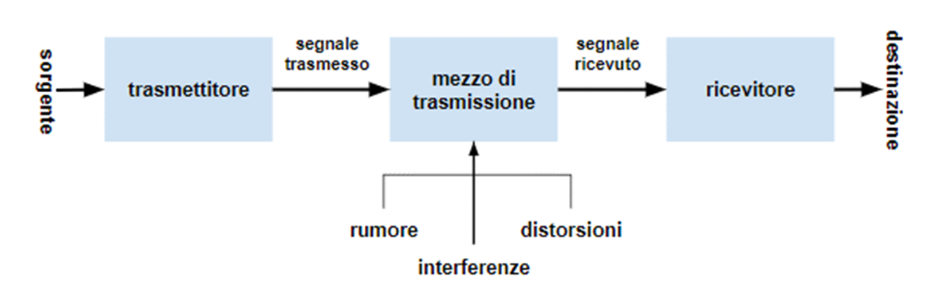
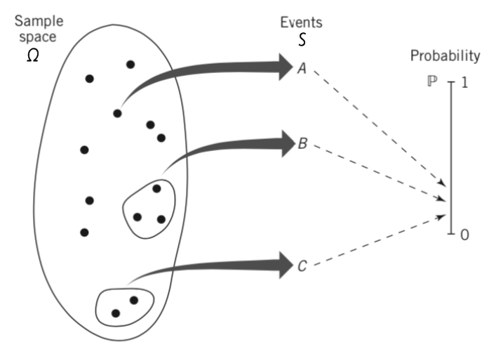

# 1. Indice

- [1. Indice](#1-indice)
- [2. Teoria della Probabilità](#2-teoria-della-probabilità)
	- [2.1. Teoria degli insieme](#21-teoria-degli-insieme)
	- [2.2. Teoria della probabilità](#22-teoria-della-probabilità)
		- [2.2.1. Concetto di Probablitità](#221-concetto-di-probablitità)
			- [2.2.1.1. Esercizio](#2211-esercizio)
		- [2.2.2. Esperimenti Casuali](#222-esperimenti-casuali)
			- [2.2.2.1. Spazio Campione Finito](#2221-spazio-campione-finito)
			- [2.2.2.2. Modello uniforme di probabilità](#2222-modello-uniforme-di-probabilità)
		- [2.2.3. Probabilità Condizionata](#223-probabilità-condizionata)
	- [2.3. Teorema della probabilità totale](#23-teorema-della-probabilità-totale)
		- [2.3.1. Esempio](#231-esempio)
	- [2.4. Teorema di Bayes](#24-teorema-di-bayes)
		- [2.4.1. Esempio](#241-esempio)
	- [2.5. Eventi Indipendenti](#25-eventi-indipendenti)
- [3. Calcolo Combinatorio](#3-calcolo-combinatorio)
	- [3.1. Disposizioni, Permutazioni e Combinazioni](#31-disposizioni-permutazioni-e-combinazioni)
- [4. Esperimento Aleatorio Composto](#4-esperimento-aleatorio-composto)
	- [4.1. Esperimenti Indipendenti](#41-esperimenti-indipendenti)
		- [4.1.1. Esempio 1](#411-esempio-1)
		- [4.1.2. Esempio 2](#412-esempio-2)
	- [4.2. Prove ripetute binarie e indipendenti](#42-prove-ripetute-binarie-e-indipendenti)
	- [4.3. Esperimenti non indipendenti](#43-esperimenti-non-indipendenti)
		- [4.3.1. Esempio](#431-esempio)
	- [4.4. Canale di comunicazione binario simmetrico](#44-canale-di-comunicazione-binario-simmetrico)
	- [4.5. Codice a Ripetizione](#45-codice-a-ripetizione)
		- [4.5.1. Esempio](#451-esempio)

# 2. Teoria della Probabilità

Esistono due classi di modelli matematici:
- _**Deterministici**_: se non vi è alcuna incertezza riguardo il suo comportamento ad ogni istante di tempo. Un esempio sono i _sistemi lineari tempo-invarianti_ (_LTI_), poiché le uscito possono essere determinate a priori.
- _**Probabilistici**_: sono i problemi reali, nel quale l'uso di un modello deterministico è inappropriato se il fenomeno coinvolge troppi fattori sconosciuti. Questo tipo di problemi tiene conto dell'incertezza in termini matematici

I modelli probabilistici sono necessari per la progettazione di sistemi che:
- Abbiano prestazioni affidabili a fronte dell'incertezza
- Siano computazionalmente efficienti
- Siano convenienti dal punto di vista economico

Se consideriamo un sistema di comunicazione digitale su un canale wireless come quello in figua sotto:

Il mezzo di trasmissione è caratterizzato da diversi agenti esterni che provocano incertezza:
- **rumore**: generato all'interno dei dispositivi elettronici nel trasmettitore e nel ricevitore
- **interferenze**: provenienti da altri trasmettitori
- **distorsioni**: sono esterne e possono avere cause diverse

Il segnale ricostruito al ricevitore è quindi tipicamente una replica attenuata del segnale trasmesso più un contenuto di disturbo. Possiamo quindi modellarlo come se fosse un **_Processo Aleatorio_**.

Possiamo considerare il sistema realizzato dall'interconnessione dei componenti, come se ogni componente avesse esplicitamente una **certa probabilità di guasto**.
La teoria della probabilità consente di calcolare la probabilità che il sistema complessivo funzioni.

Vediamo un esempio pratico dell'applicazione della teoria della probabilità.
Ipotizziamo di avere un canale wireless condiviso con protocollo _Slotted ALOHA_ con $N$ nodi identici. In ogni slot, ciascun nodo trasmette indipendentemente con probabilità $p$.

Sapendo che la trasmissione è di successo se esattamente un nodo trasmette nello slot, calcolare:
1. La probabilità di successo in uno slot $P_S$
2. Il valore ottimale di $p$, detto $p_o$, che massimizza la probabilità di successo in uno slot, e calcolare la probabilità massima $P_S^{MAX}$

Vedremo in questo corso che le risposte a queste domande sono:
1. $P_S = Np(1-p)^{N-1}$
2. $p_0 = \frac{1}{N}$ &emsp; $P_S^{MAX} = (1-\frac{1}{N})^{N-1}$

La teoria della probabilità è quindi duplice:
- La descrizione matematica di modelli probabilistici
- Lo sviluppo di procedure di ragionamento probabilistico per gestire l'incertezza

## 2.1. Teoria degli insieme

Un insieme è una collezione di oggetti, nel nostro caso avremo degli **eventi** che sono delle _collezioni di risultati di un esperimento aleatorio_.

Gli oggetti che costituiscono un insieme sono detti **elementi dell'insieme**.
- Scriviamo $x \in A$ se $x$ appartiene a $A$, altrimenti $x \not\in A$
- Se $A$ è vuoto scriviamo $A = \emptyset$
- Se $x_1, x_2, ..., x_n$ sono tutti elementi di $A$ indichiamo $A = \Set{x_1, x_2, ..., x_n}$
- Se tutti gli elementi condividono una proprietà $A = \Set{x \vert  0 \le x \le 1}$
- Se ogni elemento di $A$ è anche elemento di un insieme $B$: $A \subset B$
- Esiste la proprietà transitiva: $C \subset B$, $B \subset A$ allora $C \subset A$
- Se $A \subset B$ e $B \subset A$, allora gli insiemi si dicono **identici** e si scrive $A = B$
- Ogni insieme è un sottoinsieme dell'insieme $\Omega$, detto **_Insieme Universale_** o **Universo** o **Spazio Campione**

Se lo spazio $\Omega$ è costituito da un numero finito di $N$ elementi, allora il numero di possibili sottoinsiemi di $\Omega$ è pari a $2^N$.

Se ad esempio il nostro $\Omega$ consistesse nelle sei facce di un dado da gioco:
$$
	\Omega = {f_1, f_2, f_3, f_4, f_5, f_6}
$$

Il numero di possibili sottoinsiemi è in questo caso $2^6 = 64$, ovvero:
$$
	\emptyset, {f_1}, ..., {f_6}, {f_1, f_2}, ..., {f_5, f_6}, {f_1,f_2,f_3}, ..., \Omega
$$

L'**unione** $A \cup B$ è definita dall'insieme di elementi che appartengono a $A$, a $B$ o ad entrambi
L'**insersezione** $A \cap B$ è l'insieme di elementi che appartengono sia ad $A$ che a $B$

Si dice **insieme complementare** di $A$, $A^C$ (rispetto ad $\Omega$), l'insieme di tutti gli elemeni di $\Omega$ che non appartengono ad $A$.

Due insiemi si dicono **disgiunti** se $A \cap B = \emptyset$.

La **partizione** di un insieme $A$ si riferisce a una collezione di insiemi disgiunti, _non vuoti_, tali che la loro unione è l'insieme $A$

## 2.2. Teoria della probabilità

L'obiettivo è quello di fornire un elemento matematico per modellare fenomeni **senza un regolarità deterministica**.

Questi fenomeni possono essere studiati con un **_approccio a posteriori_**, che analizzano le regolarità dopo un numeoro sufficiente di accadimenti.

Ad esempio, se lanciamo una moneta (non truccata), pur non sapendo a priori il risultato del lancio, se effetuiamo il lancio un _numero di elevato di volte_, possiamo prevedere che si presenterà testa circa la metà delle volte.

Prima di procedere definiamo alcuni termini **_Esperimento Casuale/Aleatorio_**:
> Procedimento di osservazione dello _stato finale_ del sistema sottoposto all'esperimento, che deve ipotizzato ripetibile un numero indefinito di volte con le stesse modalità di esecuzione

Definiamo come **_Risultato_**:
> È l'esito singolo dell'esecuzioen dell'esperimento

L'insieme dei possibili _risultati_ è specificato da un **parametro**/**attributo** che viene preso in esame in un dato esperimento.

Tutti i possibili risultati dell'esperimenti si trovano nello **_Spazio Campione_** $\Omega$.

Introduciamo il concetto di **_Evento_**
> Insieme dei risultati individuabili attraverso una loro caratteristica comune.
> Un evento è un sottoinsieme dello spazio campione

Possiamo quindi avere tre tipi di eventi
- **Evento certo**: è lo spazio campione $\Omega$.
- **Evento impossibile**: è l’insieme vuoto $\emptyset$
- **Evento elementare $a$**: è un elemento di $\Omega$, cioè un singolo risultato dell’esperimento

Definiamo come **_Prova_**:
> La singola esecuzione dell’esperimento da cui si ottiene un singolo risultato $a$

A partire dal risultato della _prova_ diremo che **_si è verificato l'evento $A$_** se $a \in A$.

L’**Evento Certo** si verifica _**in ogni Prova**_, mentre l’**Evento Impossibile** _**non si verifica mai**_.

Le operazioni tra _eventi_ sono _operazioni tra insiemi_:
- $A \cup B$ è l'evento di unione (somma) che si verifica quando il risultato è un elemento di $A$ **oppure** $B$
- $A \cap B$ è l'evento intersezione (prodotto) che si verifica quando il risultato è un elemento **sia** di $A$ **che** di $B$

### 2.2.1. Concetto di Probablitità

Con il termine **probabilità di un evento $A$**, detto $P(A)$, indicheremo una **_valutazione quantitativa_** della _possibilità_ che quell'evento si verifichi

Dal punto di vista matematico $0 \le P(A) \le 1$. Valori prossimi a $0$ indicano che $A$ si verifica raramente, mentre valori prossimi ad 1 indicano un'alta probabilità che $A$ si verifichi.

È difficile dare una definizione di probabilità.

In base al primo approccio di _Pascal_ e _Fermat_ nel XVII secolo, che la studiarono in relazione al gioco d'azzardo, la probabilità venne definita così:
> Ipotizzando che i risultati dell'esperimento sono **ugualmente verosibili**, definendo come:
> - $M$: il numero di leemnti dello spazio campione
> - $m_A$: il numero di elementi favorevoli all'evento $A$
>
> Definiamo la **Probabilità dell'evento $A$**:
> $$
> 	P(A) = \frac{m_A}{M}
> $$

Questa definizione ha il vantaggio di definisce la probabilità **in modo aprioristico**, senza ricorrere a nessuna prova sperimentale.

Tuttavia in questa definizione assumiamo che _i risultati siano tutti ugualmente verosimili_, cioè _**equiprobabili**_. Inoltre con questa definizione non si possono gestire quei casi in cui i risultati non sono equiprobabili (ad esempio il lancio di un dado truccato).

La definizione di probabilità in termici di _frequenza relativa_ fu proposta da **Von Mises** nel 1936:
> Si supponga di ripetere $N$ volte un dato esperimento. Se l'evento $A$ si presenta $n_A$ volte, si definisce **_frequenza relativa_** attinente l'evento A la quantità:
> $$
> 	f_n(A) = \frac{n_A}{N}
> $$
>
> La **_probabilità dell'evento_** $A$ è definita come il limite, per $N$ tendente all'infinito, della _frequenza relativa_
> $$
> 	P(A) = \lim_{N\to\infty}{f_N(A)} = \lim_{N\to\infty}{\frac{n_A}{N}}
> $$

Questa definizione ha un problema: in pratica il limite non è calcolata. Quello che facciamo quindi è approssimare la frequenza relativa valutata su un numero _opportunamente elevato_ di prove.

Il valore della _frequenza relativa_ dipende infatti da $N$ e dalla particolare sequenza di risultati dell’esperimento messo in atto per valutarela.

Ad esempio, ripetendo 1000 volte il lancio di una moneta si ottiene "Croce" in 495 prove e "Testa" nelle restanti 505.
Possiamo quindi dire che $P(\text{Croce}) = 0.495$.

Se ripetessimo altre 1000 volte l’esperimento la probabilità potrebbe cambiare.

I vantaggi di questa definizione sono due:
- **Non si basa su ipotesi a priori**: fa affidamento esclusivamente alla _conoscenza a posteriori_ di un dato fenomeno ottenuta in maniera induttiva sulla scorta di dati sperimentali
- Definisce la probabilità anche se i possibili risultati dell’esperimento non sono egualmente probabili

Ha però anche lei degli svantaggi:
- Da un punto di vista matematico il limite non si può calcolare analiticamente
- Da un punto di vista pratico non è sempre possibile osservare un fenomeno per un numero di volte sufficientemente grande

Proprio da questi limiti del **modello induttivo**, deriva l'opportunità di ricorrere al **modello deduttivo**, associata al matematico _Andrej Nikolaevič Kolmogorov_.

Ricordando che un _**assioma**_:
> È un’affermazione che non si dimostra in quanto principio di base universalmente accettato

Utilizziamo quindi un impostazione deduttiva basata su assiomi. Questa impostazione non dà una definizione diretta della probabilità, ma accetta qualunque approccio, purché questo rispetti le proprietà fondamentali (assiomi).
Da questi, con l’ausilio della logica e della matematica, si deducono le altre proprietà come **teoremi**.

Secondo la **_definizione assiomatica di probabilità_**, per specificare in modo corretto un esperimento casuale deve essere definita la terna $(\Omega, S, P(\cdot))$ detta **_spazio (o sistema) di probabilità_** composta dalle seguenti entità:
- **Spazio Campione** $(\Omega)$: è l'insieme di tutti gli esiti ipotizzabili di un esperimento casuale oggetto di studio
- **Eventi** $(S)$: è un opportuna classe di sottoinsiemi di $\Omega$
- **Probabilità** $(P(\cdot))$: funzione a valori reali definita sugli eventi di $S$, che associa ad ogni evento $A$ di $S$ un numero **non negativo**.

<figure class="">

<figcaption>

Un singolo evento puù convolgere un singolo risultato o un sottoinsieme dei possibili risultati in $\Omega$
</figcaption>
</figure>

Gli assiomi sui quali ci basiamo sono 3, il primo è quello della **_Normalizzazione_**:
> La probabilità dell'intero spazio campione $\Omega$ è uguale all'unità
> $$
> 	P(\Omega) = 1
> $$

Il secondo assioma è quello della **_Non Negatività_**:
> La probabilità dell'evento $A$ è un **numero non-negativo**
> $$
> 	P(A) \ge 0, \qquad \forall A \subset \Omega
> $$

Il terzo e ultimo assioma è quello dell'**_Additività_**:
> Se $A$ e $B$ sono due eventi **disgiunti** $(A\cap B = \emptyset)$ allora la probabilità della loro unione soddisfa la seguente uguaglianza:
> $$
> 	P(A\cup B) = P(A) + P(B)
> $$

Da questi tre assiomi possiamo ottenere alcune proprietà di base della probabilità:
- $P(A^C) = 1 - P(A)$ &emsp; $\forall A \subset \Omega$
- La probabilità di un evento impossibile è pari a zero $(P(\emptyset) = 0)$
- Se l'evento $B$ si trova nel sottospazio di un altro evento $A$, ovvero $B \subseteq A$, allora $P(B) \le P(A)$
- Siano $A_1, ..., A_N$ $N$ eventi disgiunti che soddsfano la condizione $\bigcup_{i=1}^{N}{A_i} = \Omega$, allora $\sum_{i=1}^{N}{A_i} = 1$
- Se due eventi $A$ e $B$ non sono disgiunti, allora $P(A\cup B) = P(A) + P(B) - P(A\cap B)$

#### 2.2.1.1. Esercizio

Ipotizziamo di produrre dei condensatori che hanno le seguenti probabilità:
1. la capacità sia entro i limiti di tolleranza $P(A) = 0.96$
1. la tensione di isolamento superi un certo valore minimo $P(B) = 0.97$
1. almeno una delle condizioni sia soddisfatta $P(A \cup B) = 0.98$

Calcolare la probabilità che il condensatore non sia commerciabile perché non soddisfa il requisito sulla capacità o quello sulla tensione di isolamento $P(C)$

Il terzo evento è l'equivalente di $P(A \cup B) = P(A) + P(B) - P(A \cap B)$.

La probabilità che il nostro condensatore sia non commercializzabile equivale al complementare di dire che il nostro condensatore sia commercializzabile, ovvero che rispetti entrambe le condizioni:
$$
	P(C) = 1 - P(\overline{C}) = 1 - P(A \cap B)
$$

Ricaviamo quindi il valore di $P(A \cap B)$ dalla terza condizione:
$$
	P(A \cap B) = P(A) + P(B) - 0.98 = 0.95
$$

Ottenuto questo valore, la probabilità che accada che il condensatore non sia commerciabile è $1 - 0.95 = \boxed{0.05}$.

### 2.2.2. Esperimenti Casuali

Utilizzeremo adessoo la **definizione assiomatica di probabilità**, che per specificare in modo corretto un **_esperimento casuale_** necessita che sia dato lo **_spazio di probabilità_** $(\Omega, S, P(\cdot))$.

Quando per un esperimento casuale si scelgie una particolare funzione di probabilità (che ovviamente soddisfi gli assiomi) si dice che si adotta un **_modello di probabilità_**.

La definizione assiomatica non suggerisce una particolare scelta della funzione probabilità, ma ci lascia liberi di scegliere una qualunque $P(A)$ **che soddisfi gli assiomi**.
In particolare notiamo he la definizione di _probabilità frequentista_ e quella _classica_ soddisfano gli assiomi e rappresentano due possibili scelte di $P(A)$.

In particolare possiamo dimostrare la definizione frequentista: $f_N(A) = \frac{n_A}{N}$

Dimostriamo gli assiomi:
1. $f_N(\Omega) = \frac{N}{N} = 1$
2. $f_N(A) \ge 0, \forall A$
3. Se $A \cap B = \emptyset: f_N(A \cup B) = \frac{n_A + n_B}{N} = f_N(A) + f_N(B)$

#### 2.2.2.1. Spazio Campione Finito

Dato un $\Omega = \Set{a_1, ..., a_M}$ finito.

In questo modello $S$ viene scelta come **la totalità dei $2^M$ sottoinsiemi di $\Omega$**.

La probabilità degli eventi elementari $a_i$ è scelta in modo da soddisfare i tre assiomi, ovvero:
1. $P(\Omega) = \sum_{i=1}^M{P(a_i)} = 1$
2. $P(a_i) \ge 1, \forall i$

Dunque, per il generico evento $A = \Set{a_{k_1}, ..., a_{k_m}}$, la probabilità di $A$ è data da:
$$
	P(A) = P\Biggl(\bigcup_{i=1}^m{a_{k_i}}\Biggr) = \sum_{i=1}^m{P(a_{i})}
$$

In tal modo, un _sistema di probabilità finito_ è **_completamente specificato assegnando l'alfabeto e la probabilità degli eventi elementari_** $P(a_i)$, ovvero:
$$
	(\Omega, S, P) = (\Omega, P(a_i))
$$

Se studiamo infatti il lancio di una moneta abbiamo che:
- $t, c$ sono gli eventi elemntari
- $\emptyset, t, c, \Set{t, c}$ sono tutti i $2^2$ possibili eventi

Se quindi la moneta **_non truccata_** è lanciata un numero di volte sufficientemente elevato:
$$
\begin{CD}
	{f_N(t) \cong f_N(c) \cong \frac{1}{2}}
	@>>>
	{P(t) = P(c) = \frac{1}{2}}
\end{CD}
$$

#### 2.2.2.2. Modello uniforme di probabilità

Dato $\Omega = \Set{a_1, ..., a_M}$ finito.

Il modello utilizza $P(a_i) = \frac{1}{M}, \forall i$.

Sia $A$ il generico evento $A = \Set{a_{i_1}, .., a_{i_K}}$

La probabilità di $A$ è quindi data da:
$$
	P(A) = p\Biggl(\bigcup_{k_1}^K{a_{i_K}}\Biggr) = \sum_{k_1}^K{P(a_{i_K})} = \frac{K}{M}
$$

In questo modello, $K$ rappresenta il anche il numero di risultati favorevoli all'evento $A$.
Perciò questo modello è **_equivalente alla definizione classica della probabilità_**.

In questo modello, il calcolo della probabilità di un evento si riduce al **_conteggio del numero di risultati ad esso favorevoli_**, sfruttando i concetti del **_calcolo combinatorio_**.

L'ipotesi di equiprobabilità viene quindi fatta in base a considerazioni si _simmetrica_, e viene applicata ad esempio al gioco dei dadi, del lotto, delle carte, ...

È importante sottolineare che questo modello è utilizzabile **_solamente_** per spazi finiti.

### 2.2.3. Probabilità Condizionata

Suppuniamo di eseguire un esperimento che coinvolga una coppia di eventi $A$ e $B$.

Sia $P[A\vert B]$ la probabilita dell'evento $A$ dato che l'evento $B$ si è verificato, chiamata **_probabilità condizionata di $A$ dato $B$_**.

Assumento che $B$ abbia una probabilità non nulla, allora:
$$
	P[A\vert B] = \frac{P[A \cap B]}{P[B]}
$$

Questa probabilità condizionata cattura l'informazione parziale che il verificarsi dell'evento $B$ fornisce sull'evento $A$.

La probabilità condizionata definisce quindi unn nuovo sistema di probabilità caratterizzato dallo **stesso spazio campione**, la **stessa classe di eventi** ma una **_diversa legge di probabilità_**.

Fissato un evento $B$, $P[A\vert B]$  una legge di probabilità in quanto soddisfa gli assioni:
1. **Normalizzazione**: considerando $\Omega$ come $A$ e notando che $\Omega \cap B = B$, allora possiamo dire che $P[\Omega \vert  B] = \frac{P[\Omega \cup B]}{P[B]} = \frac{P[B]}{P[B]} = 1$
2. **Non negatività**: soddifatta per la definizione
3. **Additività** dati $A_1$ e $A_2$ disgiunti:

$$
\begin{align*}
	P[A_1 \cup A_2 \vert  B] = \frac{P[(A_1 \cup A_2) \vert  B]}{P[B]} &= \frac{P[(A_1 \cap B) \cup (A_2 \cap B)]}{P[B]} \\
	&= \frac{P[A_1 \cap B] + P[A_2 \cap B]}{P[B]} \\
	&= \frac{P[A_1 \cap B]}{P[B]} + \frac{P[A_2 \cap B]}{P[B]} \\

\end{align*}
$$

Se utilizzassimo l'interpretazione in termini di _frequenza relativa_, la probabilità condizionata sarebbe definita come:
$$
	P(A\vert B) = \frac{P(A \cap B)}{P(B)} \approx {\frac{n_{A \cap B}}{N} \over \frac{n_B}{N}} = \frac{n_{A \cap B}}{n_B}
$$

Se quindi consideriamo solo la sequenza degli $n_B$ risultato in cui si è verificato l'evento $B$, $P(A\vert B)$ approssima la frequenza di presentazione dell'evento $A$ in tale sequenza.

La probabilità condizionata ha diverse proprietà:
1. $A \cap B = \emptyset \to P(A\vert B) = 0$
2. $A \subset B \to A \cap B = A \to P(A\vert B) = \frac{P(A)}{P(B)} \ge P(A)$
2. $B \subset A \to A \cap B = B \to P(A\vert B) = \frac{P(B)}{P(B)} = 1$

## 2.3. Teorema della probabilità totale

Dati $A_1, ..., A_K$ eventi che costituiscono una partizione di $\Omega$:
$$
	B = B \cap \Omega = B \cap \bigcup_{i=1}^{K}{A_i} = \bigcup_{i=1}^K{B \cap A_i}
$$

Da cui, per l'incopatibilità degli eventi $\Set{B \cap A_i}$:
$$
P(B) = P\Biggl(\bigcup_{i=1}^{K}{(B \cap A_i)}\Biggr) = \sum_{i=1}^K{P(B \cap A_i)} = \sum_{i=1}^K{P(B\vert A_i)P(A_i)}
$$

Questa relazione si chiama **_Teorema della probabilità totale_**:
$$
\boxed{
	P(B) = \sum_{i=1}^K{P(B\vert A_i)P(A_i)}
}
$$

Questo teorema i permette di calcolare la probabilita di un evento $B$ a partire dalle probabilità condizionate $P(B\vert A_i)$ e dalle probabilità $P(A_i)$ degli eventi condizionati.

In altre parole, permette di calcolcare la probabilità di un **effetto** $\biggl(P(B)\biggr)$ a partire dalle probabilità di tutte le sue possibile **cause** $\bigl(P(A_i)\bigr)$ e dalle probabilità delle diverse combinazioni **causa/effetto** $\bigl(P(B\vert A_i)\bigr)$

### 2.3.1. Esempio

> Per la produzione di un certo componente vengono impiegate tre catene di produzione distinte:
> - $A_1 \to 45\%$ della produzione totale
> - $A_2 \to 30\%$ della produzione totale
> - $A_3 \to 25\%$ della produzione totale
>
> Dal collaudo a cui è sottoposta la produzione si ha che:
> - L'$8\%$ della produzione di $A_1$ è difettosa
> - Il $6\%$ della produzione di $A_2$ è difettosa
> - Il $5\%$ della produzione di $A_3$ è difettosa
>
> Scegliendo in modo casuale un componente, qual è la probabilità che esso sia difettoso?

Indicando con $D$ l'evento "il componente è difettoso", i dati sono:
$$
\begin{cases}
	P(A_1) = 0.45  & P(D\vert A_1) = 0.08 \\
	P(A_2) = 0.30 & P(D\vert A_2) = 0.06 \\
	P(A_3) = 0.25 & P(D\vert A_3) = 0.05
\end{cases}
$$

Applicando il teorema possiamo quindi risolvere il problema:
$$
P(D) = \sum_{i=1}^{3}{P(D\vert A_i)P(A_i)} = 0.0665
$$

## 2.4. Teorema di Bayes

Il teorema di bayes ci dice come calcolare la probabilià $P(B\vert A)$ avendo note le probabilità $P(A), P(B), P(A\vert B)$ (con $P(A),P(B) \ne 0$)

Infatti dalla definizione di probabilità condizionata possiamo dire che:
$$
	P[A\vert B]P[B] = P[A\cap B] = P(B \cap A) = P(B\vert A)P(A)
$$

Perciò otteniamo:
$$
\boxed{
	P[B\vert A] = \frac{P[A\vert B]P[B]}{P[A]}
}
$$

### 2.4.1. Esempio

> Riferendoci all'[esempio precedente](#231-esempio), qual è la probabilità che una volta estratto un componente difettoso, questo sia stato prodotto dalla macchina $A_1$?

Dall'esercizio precedente abbiamo che:
$$
\begin{cases}
	P(D) = 0.0665 \\
	P(D\vert A_1) = 0.08 \\
	P(A_1) = 0.45
\end{cases}
$$

Applicando il teorema di Bayes:
$$
	P(A_1 \vert  D) = \frac{P(A_1)P(D\vert A_1)}{P(D)} = \frac{0.45 \cdot 0.08}{0.0665} \approx 0.54
$$

## 2.5. Eventi Indipendenti

Supponiamo che il verificarsi dell'evento $A$ non fornisca alcuna informazione sull'evento $B$, ovvero: &emsp; $P[B\vert A] = P[B]$

Dal teorema di Bayas però abbiamo anche che: &emsp; $P[A\vert B] = \frac{P[B\vert A]P[A]}{P[B]} = \frac{\cancel{P[B]}\cdot P[A]}{\cancel{P[B]}} = P[A]$.

In questo caso speciale, notiamo che _la conoscenza del verificarsi di uno dei due eventi non ci die nulla di più sula probabilitàà di verificarsi dell'altro evento_ rispetto a quanto non sapevamo prima.

Eventi $A$ e $B$ che soddisfano questa condizione sono detti **_Eventi indipendenti_**.

Sapendo quindi che $P[A\vert B] = \frac{P[A \cap B]}{P[B]}$, la condizione $P[A\vert B] = P[A]$ è equivalente a dire:
$$
	\boxed{P[A\cap B] = P[A] \cdot P[B]}
$$

Applicando l'interpretazione frequentista abbiamo che, in termini di frequenza di presentazione:
- $\frac{n_{A\cap B}}{n_A} \approx \frac{n_B}{N}$ &emsp; La frequenza di $B$ nella sequenza di $N$ ripetizioni dell'esperimento **approssima la frequenza di** $B$ nella sequenza di $n_B$ ripetizioni in cui si è presentato $B$
- $\frac{n_{A\cap B}}{n_B} \approx \frac{n_A}{N}$ &emsp; La frequenza di $A$ nella sequenza di $N$ ripetizioni dell'esperimento **approssima la frequenza di** $A$ nella sequenza di $n_A$ ripetizioni in cui si è presentato $A$

# 3. Calcolo Combinatorio

Il **_Principio fondamentale del calcolo combinatorio_**:
> Se una procedura è composta da $N$ passi, il primo dei quali può essere svolto in $k_1$ modi diversi, il secondo in $k_2$ modi diversi, e così via...
>
> Allora il numero $M$ di modi in cui la porcedura può essere realizzata è:
> $$
> 	\boxed{M = \prod_{i=1}^{N}{k_i}}
> $$
>
> Nel caso in cui $k_1 = \dots = k_N = K$, la formula si semplifica in:
> $$
> 	\boxed{M=K^N}
> $$

Il numero di modi con cui si possono combinare 8 cifre binarie è quindi $2^8$, mentre il numero di modi con cui si possono combinare 4 cifre decimali è $10^{4}$.

## 3.1. Disposizioni, Permutazioni e Combinazioni

Definiamo _**disposizione di $N$ oggetti presi $k$ a $k$**_, una sequenza <u>ordinata</u> di $k$ oggetti scelti tra gli $N$ assegnati.

Il numero delle **disposizioni semplici**, ovvero _senza ripetizioni_, di $N$ oggetti presi $k$ a $k$ è:
$$
\boxed{D_{N,k} = N\cdot(N-1)\dots (N-k+1) = \frac{N!}{(N-k)!}}
$$

Se $k = N$  e _disposizioni semplici_ prendono il nome di **_permutazioni semplici_** di $N$ oggetti:
$$
\boxed{P_N = D_{N,N} = N\cdot(N-1)\dots 2 \cdot 1 = N!}
$$

Definiamo _**combinazione di $N$ oggetti presi $k$ a $k$**_ una sequenza <u>non ordinata</u> di $k$ oggetti scelti fra gli $N$ dati.
Trattiamo come indistinguibili due sequenze formate dagli stessi elementi ma in ordine diverso.

Il numero delle combinazioni semplici di $N$ oggetti presi $k$ a $k$ è:
$$
\boxed{C_{N,k} = \frac{D_{N,k}}{k!} = \frac{N!}{k!(N-k)!} = \dbinom{N}{k}}
$$

# 4. Esperimento Aleatorio Composto

Consideriamo due _diversi_ esperimenti aleatori caratterizzati dagli spazi campione $	\Omega_1$ e $\Omega_2$ con:
$$
\Omega_1 = \Set{\xi_1, ..., \xi_N} \atop \Omega_2 = \Set{\lambda_1, ..., \lambda_N}
$$

Indichiamo con $A_1$ il generico evento del primo esperimento e con $A_2$ il generico evento del secondo esperimento.

Indichiamo inoltre con $P_1[\cdot]$ e $P_2[\cdot]$ le rispettive funzioni di probabilità.

**_È possibile definie un esperimento composto con_**:
- **Risultati**: coppie ordinate $(\xi_i, \lambda_j)$ dei risultati degli esperimenti
- **Spazio campione**: $\Omega$ pari al _prodotto cartesiano_ degli spazi degli esperimenti componenti $(\Omega = \Omega_1 \times \Omega_2)$
- **Eventi**: tutti i sottinsiemi di $\Omega$ del tipo $A = A_1 \times A_2$

Ad esempio, si consideri l'esperimento costituito dal lancio di una moneta ripetuto due volte:
$$
\begin{CD}
	{\Omega_1 = \Set{\xi_1 = T, \xi_2 = C} \atop \Omega_2 = \Set{\lambda_1 = T, \lambda_2 = C}}
	@>>>
	{\Omega = \Omega_1 \times \Omega_2 = \Set{(T,T), (T,C), (C,T), (C,C)}}
\end{CD}
$$

Per calcolare la probabilità dell'evento $A = A_1 \times A_2$ nello spazio campione $\Omega = \Omega_1 \times \Omega_2$ a partire dalla conoscenza di $P_1(A_1)$ e $P_2(A_2)$ **_non abbiamo una soluzione generale_**.

Un eccezione è però rappresentata dagli **esperimenti indipendenti**, ovvero quegli esperimenti dove il risultato del primo non influenza l'altro.

## 4.1. Esperimenti Indipendenti

Dati:
- Uno spazio campione composto $\Omega = \Omega_1 \times \Omega_2$
- Come eventi _tutti i sottoinsiemi_ di $\Omega$ del tipo $A = A_1 \times A_2 = \Set{(\xi, \lambda) \vert  \xi \in A_1, \lambda = A_2}$
- Una funzione di probabilità $P(\cdot)$

Possiamo osservare che:
$$
P(A_1 \times \Omega_2) = P_1(A_1) \atop
P(\Omega_1 \times A_2) = P_2(A_2)
$$

Infatti, l'evento $A \times \Omega_2$ è formato da tutte le coppie $(\xi, \lambda)$ per le quali $\xi \in A_1$ e $\lambda$ è un qualsiasi elemento in $\Omega_2$, ovvero quando si presenta un risultato di $A_1$ ed un qualsiasi risultato nel secondo esperimento.

Sapendo che:
$$
	A_1 \times A_2 = (A_1 \times \Omega_2) \cap (\Omega_1 \times A_2)
$$

Assumendo che gli **esperimenti siano indipendenti**, si ottiene:
$$
\begin{align*}
P(A) &= P(A_1 \times A_2) = P((A_1 \times \Omega_2) \cap (\Omega_1 \times A_2)) \\
	 &= P(A_1 \times \Omega_2)P(\Omega_1\times A_2) = P_1(A_1)P_2(A_2)
\end{align*}
$$

Ovvero, la condizione di indipendenza tra i due **esperimenti**, equivale ad assumere indipendenti tutti gli eventi del tipo $(A_1 \times \Omega_2)$ e $(\Omega_1 \times A_2)$, definiti nello spazio campione $\Omega$ dell'esperimento composto.

### 4.1.1. Esempio 1

> Qual è la probabilità che lanciando due dadi perfettamente simmetrici, entrambi presentino o la faccia 4 o la 5?

Questo problema può essere risolto in due modi.

Il primo, applicabile solo se i dadi non sono truccati e ogni faccia ha la stessa probabilità di uscire, calcola le combinazioni favorevoli $(2)$ sulle totali $(36)$:
$$
P((\xi_4, \lambda_4) \cup (\xi_5, \lambda_5)) = \frac{2}{36} = \frac{1}{18}
$$

Il secondo metodo, che si bassa sugli esperimenti indipendenti, permette il calcolo **anche nel caso di dadi truccati**.

Verifichiamo comunque nel caso di dadi non truccati:
$$
\begin{CD}
\begin{matrix}
P_1(\xi_i) = \frac{1}{6} & P_2(\lambda_j) = \frac{1}{6}
\end{matrix} \\
@VVV \\
{P((\xi_i, \lambda_j)) = P_1(\xi_i)P_2(\lambda_j) = \frac{1}{36}} \\
@VVV \\
\begin{align*}
	P((\xi_4, \lambda_4) \cup (\xi_5, \lambda_5)) &= \overbrace{P((\xi_4, \lambda_4)) + P((\xi_5, \lambda_5))}^{\text{Eventi disgiunti dell'esperimento congiunto}} \\ 
	&=  P(\xi_4)\cdot P(\lambda_4) + P(\xi_5)\cdot P(\lambda_5) \\
	&= \frac{1}{36} + \frac{1}{36} = \frac{1}{18}
\end{align*}
\end{CD}
$$

### 4.1.2. Esempio 2

> Un apparecchio è formato da due componenti identici collegati in serie, per ognuno dei quali si sa che la probabilità di guastarsi entro $1000$ ore di funzionamento è $P(G) = 0.1$
> Si suppone che i guasti dei due componenti si verifichino in modo indipendente
> 
> Quale è la probabilità $P(G)$ che l’apparecchio si guasti entro $1000$ ore?

I dati del problema sono:
$$
\begin{cases}
	P_1(G_1) = 0.1 & P_2(G_2) = 0.1 \\
	P_1(F_1) = 0.9 & P_2(F_2) = 0.9
\end{cases}
$$

La probabilità che il sistema non si guasti:
$$
	P(\overline{G}) = P((F_1,F_2)) = P(F_1)P(F_2) = 0.9^2 = 0.81
$$

Di conseguenza la probabilità che il sistema si guasti:
$$ 
	P(G) = 1 - P(\overline{G}) = 0.19
$$

Un altro modo per risolvere questo problema è:
$$
\begin{align*}
P(G) &= P[(G_1 \times \Omega_2) \cup (\Omega_1 \times G_2)] \\
	 &= P[(G_1 \times \Omega_2)] + P[(\Omega_1 \times G_2)] - P[(G_1 \times \Omega_2) \cap (\Omega_1 \times G_2)] \\
	 &= P_1(G_1) + P_2(G_2) - P_1(G_1)P_2(G_2) = 0.1+0.1 - 0.01 = 0.19
	
\end{align*}
$$

## 4.2. Prove ripetute binarie e indipendenti

Considerimaom un esperimento con uno spazio campione $\Omega = \Set{A, \overline{A}}$ costituito da _due risultati_:
$$
	P(A) = p \atop P(\overline{A}) = 1 - p = q
$$

Consideriamo poi l'esperimento composto ottenuto **ripetendo** $N$ volte lo stesso esperimento e facendo in modo che ciascuna prova sia **_indipendente dalle altre_**, come ad esempio il lancio di una moneta ripetuto $N$ volte.

Siamo quindi interessati a calcolare la **_probabilità che $A$ si verifica $k$ volte in un ordine qualsiasi_**.

Ad esempio, proviamo a calcolare la probabilità che, lanciano una moneta $N = 5$ volte, si verifichi l'evento testa 3 volte.

Tutte le sequenze che soddisfano la richiesta sono $E = \Set{\text{"TTTCC"}, \text{"TTCTC"}, ..., \text{"CTCTT"}, \text{"CCTTT"}}$

Ciascuna sequenza è un evento dell'esperimento composto, _disgiunto_ da tutti gli altri eventi.

Poiché ogni prova è **indipendente dalle altre**, ogniuna si verifica con probabilità $P(E_i)$:
$$
	P(E) = \sum_{i=1}^{R}{P(E_i)}
$$

Possiamo quindi dire che $E = \bigcup_{i=1}^{R}{E_i}$, dove $R$ rappresenta il numero di sequenze distinte che contengono $k$ eventi $A$:
$$
E_1 = \underbrace{A\times A \times \dots \times A}_{k} \times \underbrace{\overline{A}\times \overline{A} \times \dots \times \overline{A}}_{N-k}
$$

Gli altri eventi $E_2, E_3, ..., E_R$ sono altre sequenze **con diverso ordine** che contengono $k$ eventi $A$ e $N-k$ eventi $\overline{A}$:
$$
\begin{CD}
\begin{matrix}
	P(E_i) = \underbrace{p\times p \times \dots \times p}_{k} \times \underbrace{q\times q \times \dots \times q}_{N-k} = p^kq^{N-k} & i = 1,..., R
\end{matrix} \\
@VVV \\
{P(E) = \sum_{i=1}^R{P(E_i)} = R\cdot p^k \cdot q^{N-k}}\\ @VVV \\
{P(E) = R\cdot p^k \cdot (1-p)^{N-k} \atop R = C_{N,k} = \dbinom{N}{k} = \frac{N!}{k!(N-k)!}} \\
@VVV \\
\boxed{P(E) = \frac{N!}{k!(N-k)!}\cdot p^k \cdot (1-p)^{N-k}} \\
\end{CD}
$$

Quest'ultima formula è nota come **_Formula di Bernulli_**.

## 4.3. Esperimenti non indipendenti

Nella pratica si verificano spesso esperimenti **non indipendenti**, ovvero quei casi in cui:
> L'esecuzione del primo esperimento modifica lo spazio $\Omega_2$ del secondo esperimento.

Ad esempio, l'estrazione di due biglie da una scatola che contiene due biglie bianche e due nere.

Se dopo la prima estrazione, reinserissimo la biglia all'intenro del sacchetto, allora potremmo considerare i due esperimenti come _indipendenti_. 

Se invece **non rimpiazzassimo la biglia**, allora lo spazio campione del secondo esperimento viene modificata dal risultato del primo.

### 4.3.1. Esempio

> Si calcoli la probabilità che estraendo due carte da un mazzo di 40, entrambe risultano di fiori, assumendo un mazzo non truccato

Esistono diversi metodi per risolvere questo problema.

Nel primo metodo possiamo vedere l'esperimento della doppia estrazione, come due esperimenti singoli, costituiti dall'estrazione di una singola carta dal mazzo.

Sapendo che la carta non viene rimpiazzata, abbiamo due **esperimenti dipendenti**.

Poiché il mazzo non è truccato, possiamo applicare il _modello uniforme_:
$$
\begin{CD}
	\begin{cases}
	A & \text{Ottenere fiori nella prima estrazione}  \\
	B & \text{Ottenere fiori nella seconda estrazione} \\
	B\vert A & \text{Ottenere fiori dopo aver ottenuto fiori}
\end{cases}	\\
@VVV \\
\begin{matrix}
	P(A) = \frac{10}{40} = \frac{1}{4} & & P(B\vert A) = \frac{9}{39}
\end{matrix} \\
@VVV \\
{
	P(A \cap B) = P(B\vert A)P(A) = \frac{9}{39} \cdot \frac{1}{4} = \frac{3}{52}
}
\end{CD}
$$

Un altro modo per vedere il problema è quello di sfruttare il _modello uniforme_ e il calcolo combinatorio, dato che il mazzo **non è truccato**.

In particolare possiamo calcolare il numero di possibili risultati:
$$
C_{40,2} = \binom{40}{2} = \frac{40!}{2!(40-2)!} = \frac{40\cdot 39}{2} = 780
$$

Il numero di risultati favorevoli è invece dato dal numero in cui possiamo combinare le carte di fiori nelle coppie:
$$
C_{10,2} = \binom{10}{2} = \frac{10!}{2!(10-2)!} = \frac{10\cdot 9}{2} = 45
$$

La probabilità complessiva sarà quindi:
$$
	P(\text{estrarre 2 carte di fiori}) = \frac{\binom{10}{2}}{\frac{40}{2}} = \frac{45}{780} = \frac{3}{52}
$$

## 4.4. Canale di comunicazione binario simmetrico

Immaginiamo di avere un sistema di comunicazione dove:
- `1` è trasmesso con probabilità $p = 0.3$
- `0` è trasmesso con probabilità $1-p = 0.7$

Sapendo di avere un probabilità di errore di $P_e = 0.01$ e di aver ricevuto `0`: _"Qual è la probabilità che sia stato effettivamente trasmesso `0`?"_

Per risolvere questo tipo di problemi definiamo prima gli eventi:
$$
\begin{matrix}
	T_0 = \Set{\text{è stato trasmesso 0}} & T_1 = \Set{\text{è stato trasmesso 1}} \\[0.5em]
	R_0 = \Set{\text{è stato ricevuto 0}} & R_1 = \Set{\text{è stato ricevuto 1}}
\end{matrix}
$$

Dobbiamo quindi calcolare la probabilità $P[T_0 \vert  R_0]$.

Per farlo dobbiamo analizzare le **probabilità di transizione**, ovvero la probabilità che un segnale $T_i$ generi un effetto $R_j$, ovvero calcolare: &emsp; $P(R_0\vert T_0), P(R_0\vert T_1), P(R_1\vert T_0), P(R_1\vert T_1)$

Possiamo infatti considerare l'esperimento trasmissione-ricezione come due esperimenti separati, ovvero la trasmissione di un simbolo e la ricezione di un simbpolo.

Nel caso in cui si abbia $P_e = 0$ allora le probabilità sarebbero:
$$
\begin{align*}
	P(R_0\vert T_0) &= (1-P_e) = 1 \\
	P(R_0\vert T_1) &= P_e = 0 = 0 \\
	P(R_1\vert T_0) &= P_e = 0 = 0 \\
	P(R_1\vert T_1) &= (1-P_e) = 1 = 1
\end{align*}
$$

La probabilità di ricevere $R_0$ è quindi:
$$
	P(R_0) = P(R_0 \vert  T_0)\cdot P(T_0) + P(R_0\vert T_1)\cdot P(T_1) = 1 \cdot 0.7 + 0 \cdot 0.3 = 0.7
$$

La probabilità $P(T_0\vert R_0)$ di conseguenza:
$$
P(T_0\vert R_0) = \frac{P(R_0\vert T_0)\cdot P(T_0)}{P(R_0)} = \frac{1 \cdot 0.7}{0.7} = 1
$$

Nel caso descritto quindi abbiamo $P_e = 0.01$:
$$
\begin{align*}
	P(R_0\vert T_0) &= (1-P_e) = 0.99 \\
	P(R_0\vert T_1) &= P_e = 0.01 \\
	P(R_1\vert T_0) &= P_e = 0.01 \\
	P(R_1\vert T_1) &= (1-P_e) = 0.99
\end{align*}
$$

La probabilità di ricevere $R_0$ è quindi:
$$
	P(R_0) = P(R_0 \vert  T_0)\cdot P(T_0) + P(R_0\vert T_1)\cdot P(T_1) = 0.99 \cdot 0.7 + 0.01 \cdot 0.3 = 0.696
$$

La probabilità $P(T_0\vert R_0)$ di conseguenza:
$$
P(T_0\vert R_0) = \frac{P(R_0\vert T_0)\cdot P(T_0)}{P(R_0)} = \frac{0.99 \cdot 0.7}{0.696} = 0.996
$$

Se avessimo addirittura $P_e = 0.5$:
$$
\begin{align*}
	P(R_0\vert T_0) &= (1-P_e) = 0.5 \\
	P(R_0\vert T_1) &= P_e = 0.5 \\
	P(R_1\vert T_0) &= P_e = 0.5 \\
	P(R_1\vert T_1) &= (1-P_e) = 0.5
\end{align*}
$$

La probabilità di ricevere $R_0$ è quindi:
$$
	P(R_0) = P(R_0 \vert  T_0)\cdot P(T_0) + P(R_0\vert T_1)\cdot P(T_1) = 0.5 \cdot 0.7 + 0.5 \cdot 0.3 = 0.5
$$

La probabilità $P(T_0\vert R_0)$ di conseguenza:
$$
	P(T_0\vert R_0) = \frac{P(R_0\vert T_0)\cdot P(T_0)}{P(R_0)} = \frac{0.5 \cdot 0.7}{0.5} = 0.7 = P(T_0)
$$

Quest'ultima casistica è la peggiore, in quanto ci dice che la probabilità di ricevere un bit **_è indipendente da quello che è stato mandato_**.

## 4.5. Codice a Ripetizione

Nelle applicazioni in cui la probabilità di errore sul canale è particolarmente elevata si utilizza una **_codifica di canale_**, ovvero si _aggiunge ridondanza al messaggio trasmesso per rilevare o correggere eventuali errori al ricevitore_

Una prima codifica a ripetizione utilizza _parole di codice_ che ripetono $n$ volte $(n = 2k + 1)$ il bit di informazione che si vuole trasmettere:
$$
\begin{matrix}
	0 &\to & 000...00 \\
	1 &\to & \underbrace{111...11}_{n}
\end{matrix}
$$

Questa azione viene compiuta dall'**encoder**, mentre il _decoder_ eseguirà una **_decodifica a maggioranza_**.
In questo modo è possibile correggere fino a $\frac{n-1}{2}$ errori nella parola trasmessa.

### 4.5.1. Esempio

> Calcolare la probabilità di errore residua $P_r$ per un codice a ripetizione $3:1$, in presenza di una probabilità di errore sul bit $P_e = p$.

In questo caso abbiamo quindi che il codice è in grado di correggere **un singolo errore**, infatti:

| Messaggio | Parola di Codice |   Singolo Errore    |    Doppio Errore    | Triplo Errore |
| :-------: | :--------------: | :-----------------: | :-----------------: | :-----------: |
|    `0`    |      `000`       | `100`, `010`, `001` | `110`, `101`, `011` |     `111`     |
|    `1`    |      `111`       | `110`, `101`, `011` | `100`, `010`, `001` |     `000`     |

Abbiamo quindi che la probabilità di ricevere un codice errato è:
$$
\begin{CD}
	{P_r(n=3) = P(\text{2 errori}) + P(\text{3 errori}) = \binom{3}{2}p^2(1-p)+\binom{3}{3}p^3} \\
	@VVV \\
	\boxed{
		P_r(n=3) = 3p^2(1-p) + p^3 = 3p^2 - 2p^3
	}
\end{CD}
$$

Generalizzando abbiamo quindi che con il codice a ripetizione di ordine $n$, la probabilità di errore residua è:
$$
\boxed{
	P_r(n) = \sum_{k=\frac{n+1}{2}}^n{P(k \text{ errori})} = \sum_{k=\frac{n+1}{2}}^n{ \binom{n}{k}p^k(1-p)^{n-k}
	}
}
$$

