# 1. Indice

- [1. Indice](#1-indice)
- [2. Trasformata Continua di Fourier](#2-trasformata-continua-di-fourier)
	- [2.1. Simmetria degli spettri per segnali reali](#21-simmetria-degli-spettri-per-segnali-reali)
	- [2.2. Funzione Seno Cardinale](#22-funzione-seno-cardinale)
		- [2.2.1. Esempio - Funzione Rettangolare](#221-esempio---funzione-rettangolare)
		- [2.2.2. Funzione esponenziale monolatera](#222-funzione-esponenziale-monolatera)
	- [2.3. Teorema di Parseval](#23-teorema-di-parseval)
	- [2.4. Densità spettrale di potenza](#24-densità-spettrale-di-potenza)
	- [2.5. Relazione tempo-banda](#25-relazione-tempo-banda)
	- [2.6. Spectrum Analyzer](#26-spectrum-analyzer)
	- [2.7. Calcolo Numerico della TCF](#27-calcolo-numerico-della-tcf)
		- [2.7.1. Fast Fourier Transform - `FFT`](#271-fast-fourier-transform---fft)
		- [2.7.2. Calcolo numerico della `ATCF`](#272-calcolo-numerico-della-atcf)
	- [2.8. Teoremi](#28-teoremi)
		- [2.8.1. Linearità](#281-linearità)
		- [2.8.2. Dualità](#282-dualità)
			- [2.8.2.1. Esempio - Funzione Rettangolare](#2821-esempio---funzione-rettangolare)
			- [2.8.2.2. Esempio - Funzione Esponenziale](#2822-esempio---funzione-esponenziale)
		- [2.8.3. Teorema del ritardo](#283-teorema-del-ritardo)
		- [2.8.4. Teorema della modulazione](#284-teorema-della-modulazione)
			- [2.8.4.1. Applicazioni del Teorema](#2841-applicazioni-del-teorema)
				- [2.8.4.1.1. Radio](#28411-radio)
				- [2.8.4.1.2. Radar](#28412-radar)
		- [2.8.5. Teorema del prodotto](#285-teorema-del-prodotto)
			- [2.8.5.1. Integrale di Convoluzione](#2851-integrale-di-convoluzione)
		- [2.8.6. Teorema della convoluzione](#286-teorema-della-convoluzione)
	- [2.9. Definizione e Calcolo della banda di un segnale](#29-definizione-e-calcolo-della-banda-di-un-segnale)
		- [2.9.1. Banda a `-3dB`](#291-banda-a--3db)
			- [2.9.1.1. Banda a `-3dB` - Segnali Modulati](#2911-banda-a--3db---segnali-modulati)
		- [2.9.2. Banda al 99% dell'energia](#292-banda-al-99-dellenergia)

# 2. Trasformata Continua di Fourier

Dato un segnale $x(t)$ ad _energia finita_, si definisce **_Trasformata Continua di Fourier (TCF)_**:
$$
	\boxed{X(f) = \int{x(t)\cdot e^{-j2\pi ft}\;dt}}
$$

Questa è chiamata **equazione di analisi**, poiché i permette di analizzare le componenti frequenziali del segnale nel tempo.

Definiamo invece **_Anti-trasformata continua di Fourier_**:
$$
	\boxed{x(t) = \int{X(f)\cdot e^{j2\pi ft}\;df}}
$$

Questa è chiaamta **equazione di sintesi**, poiché permette di sintetizzare le componenti frequenziali per ottenere un segnale nel tempo.

Simbolicamente abbiamo che:
$$
	x(t) \Leftrightarrow X(f)
$$

Ad ogni segnale $x(t)$ corrisponde **_una e una sola TCF_**, e **_viceversa_**.

Vale per segnali $x(t)$ ad energia finita, siano questi _reali_ o _complessi_. Ovviamente i segnali fisici sono tutti segnali reali.

Notiamo subito che nel caso $f = 0$:
$$
	X(0) = \int{x(t) \;dt}
$$

La _TCF_ si può applicare sia a $x(t) \in \R$ che a $x(t) \in \Complex$, e produrrà una $X(f) \in \Complex$. In alcuni casi particolari può comunque capitare che $X(f) \in \R$.

La funzione $X(f)$, tiicamente complessa, può quindi essere espressa in notazione polare, scomponendosi in:
$$
	X(f) = \vert X(f)\vert \cdot e^{j\phase{X(f)}}
$$

Chiamiamo $\vert X(f)\vert $ **_Spettro di Ampiezza_** e $\phase{X(f)}$ come **_Spettro di Fase_**. Queste quantità rappresentano ampiezza/fase delle componenti frequenziali in cui il segnale è scomposto.

## 2.1. Simmetria degli spettri per segnali reali

Dato un segnale reale $x(t) \in \R$, la TCF gode delle seguenti proprietà:
- **_Spettro di Ampiezza a simmetria pari_**: &emsp; $\vert X(-f)\vert  = \vert X(f)\vert $
- **_Spettro di Fase a simmetria dispari_**: &emsp; $\phase{X(-f)} = -\phase{X(f)}$

La dimostrazioni di queste proprietà è relativamente semplice:
$$
\begin{CD}
	{X(f) = \int{x(t)\cdot e^{-j2\pi ft} \; dt}} \\
	@V\text{Prendiamo il coniugato}VV \\
	\begin{align*}
		X(f)^\ast &= \Biggl(\int{x(t)\cdot e^{-j2\pi ft} \; dt}\Biggr)^\ast \\
		&= \int{x^\ast(t)\cdot e^{j2\pi ft} \; dt} \\
		&= \int{x(t)\cdot e^{j2\pi ft} \; dt} \\
		X(f)^\ast = \vert X(f)\vert \cdot e^{-j\phase{X(f)}} &= X(-f) \\
		\vert X(f)\vert \cdot e^{-j\phase{X(f)}} &= \vert X(-f)\vert \cdot e^{j\phase{X(-f)}} \\
	\end{align*} \\
	@VVV \\
	\begin{cases}
		\vert X(f)\vert  = \vert X(-f)\vert  \\
		-\phase{X(f)} = \phase{X(-f)}
	\end{cases}
\end{CD}
$$

Questa simmetria **_non è rispettata per segnali complessi_**.

## 2.2. Funzione Seno Cardinale

La funzione **_Seno Cardinale_** è definita:

$$
\operatorname{sinc}(\alpha) =
\begin{cases}
	\frac{\sin(\pi \alpha)}{\pi \alpha} & \alpha \ne 0 \\
	1 & \alpha = 0
\end{cases}
$$

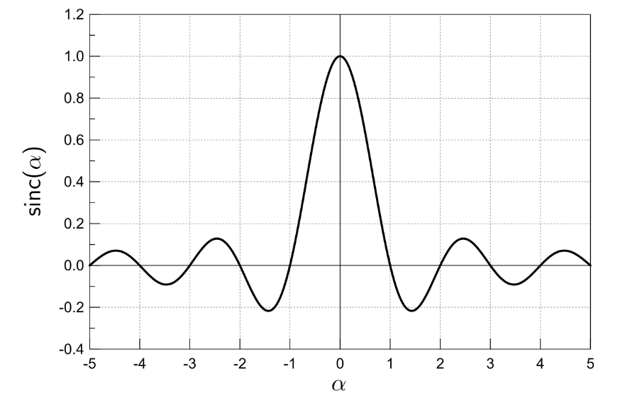

Possiamo quindi procedere a disegnare il modulo e la fase della funzione cardinale:

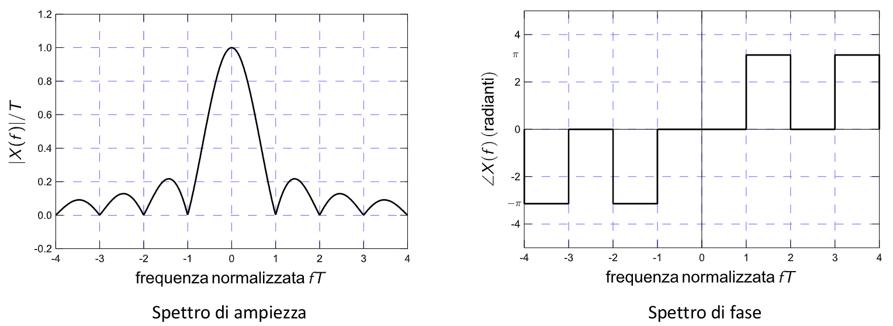

### 2.2.1. Esempio - Funzione Rettangolare

Riprendiamo la funzione rettangolare:
$$
x(t) = rect\Biggl(\frac{t}{T}\Biggr) = \begin{cases}
		1 & \vert t\vert  < \frac{T}{2} \\
		\frac{1}{2} & \vert t\vert  = \frac{T}{2} \\
		0 & \vert t\vert  > \frac{T}{2}
	\end{cases}
$$

La trasformata sarà quindi:
$$
\begin{align*}
X(f) &= \int_{-\infty}^{+\infty}{x(t)\cdot e^{-j2\pi ft}\;dt} \\
	 &= \int_{-\frac{T}{2}}^{T \over 2}{e^{-j2\pi ft}\;dt} \\
	 &= -\frac{e^{-j2\pi ft}}{j2\pi ft}\Biggr]_{-\frac{T_2}{2}}^{T \over 2} \\
	 &= -\frac{1}{j2\pi f} \cdot \Bigl(e^{-j\pi fT} - e^{j\pi fT}\Bigr) \\[1em]
	 &= -\frac{1}{j2\pi f} \cdot \Bigl(-2j \sin{(\pi fT)}\Bigr) \\[1em]
	 &= \frac{\sin{(\pi fT)}}{\pi f} \\[1em]
X(f) &= T \cdot \operatorname{sinc}(fT)
\end{align*}
$$

### 2.2.2. Funzione esponenziale monolatera

Se calcoliamo la TCF per la funzione esponenziale monolatera:
$$
	x(t) = \begin{cases}
		e^{-\frac{t}{T}} \cdot u(t) & t > 0 \\
		1 & t = 0 \\
		0 & t < 0
	\end{cases}
$$

Per trovare la _TCF_ applichiamo la definizione:
$$
\begin{align*}
	X(f) &= \int_0^{+\infty}{e^{-\frac{t}{T}} \cdot e^{-j2\pi ft}\;dt} \\
		 &= \int_0^{+\infty}{e^{-t(\frac{t}{T} + j2\pi f)}\;dt} \\
		 &= -\frac{e^{-t(\frac{t}{T} + j2\pi f)}}{\frac{1}{T} + j2\pi f}\Biggr]_0^{\infty} \\[1em]
		 &= \frac{T}{1 + j2\pi fT}
\end{align*}
$$

Definendo $f_T := \frac{1}{2\pi T}$ otteninamo:
$$
X(f) = \frac{T}{1 + f/f_T}
$$

Per calcolarne il modulo ci basta fare il rapporto tra i moduli di numeratore e denominatore.

$$
\vert X(f)\vert  = \frac{T}{\sqrt{1 + (f/f_T)^2}}
$$

Per la fase invece ci basta fare la differenza delle fasi:
$$
\phase{X(f)} = \phase{T} - \phase{1 + f/f_T} = -\arctan{\Biggl({f \over f_T}\Biggr)}
$$

I grafici che rappresentano queste quantità sono quindi i seguenti:

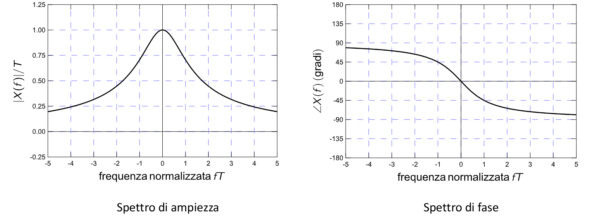

Per rappresentare il valore dello spettro possiamo utilizzare ancora una volta la rappresentazione in _decibel_:
$$
	\vert X(f)\vert _{dB} = 10 \cdot \log_{10}{\Bigl(\frac{\vert X(f)\vert ^2}{\vert (X(f_0)\vert ^2)}\Bigr)}
$$

<figure class="90">
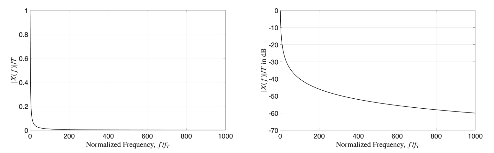
<figcaption>

Scala decimale
</figcaption>
</figure>

<figure class="90">
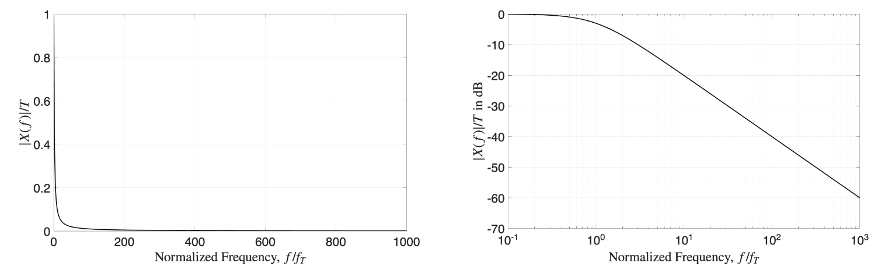
<figcaption>

Scala logaritmica
</figcaption>
</figure>

## 2.3. Teorema di Parseval

Il **Teorema di Parseval** dice che:
> L'energia di un segnale _nel tempo_ è **uguale** all'energia del segnale _in frequenza_
> $$
> 	E_x = \int{\vert x(t)\vert ^2\;dt} = \int{\vert X(f)\vert ^2\;df}
> $$

Si definisce $\varepsilon_x(f) = \vert X(f)\vert ^2$ come **_Densità Spettrale di Energia_**.

La dimostrazione è molto semplice:
$$
\begin{align*}
	E_x &= \int{\vert x(t)\vert ^2\;dt} \\
		&= \int{x(t) \cdot x^\ast(t)\;dt} \\
		&= \int{x(t) \cdot \Biggl(\int_{-\infty}^{+\infty}{X(f)\cdot e^{j2\pi ft}\; df}\Biggr)^\ast\;dt} \\
		&= \int{x(t) \cdot \Biggl(\int_{-\infty}^{+\infty}{X^\ast(f)\cdot e^{-j2\pi ft}\; df}\Biggr)\;dt} \\
		&= \int_{-\infty}^{+\infty}{X^\ast(f) \cdot \Biggl(\int{x(t)\cdot e^{-j2\pi ft}\; dt}\Biggr)\;df} \\
		&= \int_{-\infty}^{+\infty}{X^\ast(f) \cdot X(f)\;df} \\
		&= \int{\vert X(f)\vert ^2\;df} \\
\end{align*}
$$

Questa relazione ci aiuta a calcolare l'energia di funzioni nella frequenza, ad esempio:
$$
E_X = \int{\vert T\cdot \operatorname{sinc}(fT)\vert ^2\;df} \Leftrightarrow \int{\vert rect(t/T)\vert ^2\;dt} = T
$$

## 2.4. Densità spettrale di potenza

Per i segnali a potenza mediafinita si ha che:
$$
\begin{align*}
	P_x = \lim_{T \to \infty}{\frac{E_{x_T}}{T}} &= \lim_{T\to\infty}{\int{\frac{\vert X(f)\vert ^2}{T}\;df}} \\
	&= \int{\lim_{T\to\infty}{\frac{\vert X(f)\vert ^2}{T}\;df}} \\
	&= \int{\cal{P}_\mathnormal{x(f)}\;df}
\end{align*}
$$

Chiamiamo **Densità spettrale di potenza** la quantità
$$
\cal{P}_\mathnormal{x(f)} := \mathnormal{\lim_{T\to\infty}{\frac{\vert X(f)\vert ^2}{T}}}
$$

## 2.5. Relazione tempo-banda

Un segnale di _breve durata_ ha nel tempo uno **spettro largo in frequenza**.
Un segnale con _spettro stretto_ ha in frequenza una **lunga durata nel tempo**.

La durata nel tempo $\Delta_t$ e la durata in frequenza $\Delta_f$ sono legate da:
$$
\Delta_t\cdot\Delta_f = \text{ costante}
$$

Inolte più un segnale varia velocemente nel tempo, meno saranno significative le componenti frequenziali che descrivono queste variazioni.

Le componenti ad alta frequenza sono quindi **responsabili delle variazioni "veloci" del segnale**.

## 2.6. Spectrum Analyzer

Sono dispositivi che ricevono in entrata un segnale analogico/digitale e restituiscono **_lo spettro di ampiezza e di fase della trasformata_**.

In particolare restituisce informazioni relative a:

|      Specifica      |             Cosa Indica             |
| :----------------: | :---------------------------------: |
|  Frequency range   |    Banda di frequenze misurabili    |
|        RBW         | Capacità di separare segnali vicini |
| Noise Floor (DANL) |     Sensibilità dello strumento     |
|   Dynamic Range    |  Differenza tra segnale max e min   |
|  Max input level   |     Potenza massima in ingresso     |
| Frequency accuracy |       Precisione della misura       |

## 2.7. Calcolo Numerico della TCF

I calcolatori non sono in grado di risolvere in forma chiusa l'integrali analiticamente, ma sfruttano algoritmi di calcolo numerico per approssimarne il risultato.

In particolare si basano sull'assunzione che:
$$
	\int{x(t)\;dt} \approx \sum_n{x(n\Delta)\Delta}
$$

L'errore di questa approssimazione tende a $0$ quando $\Delta \to 0$.

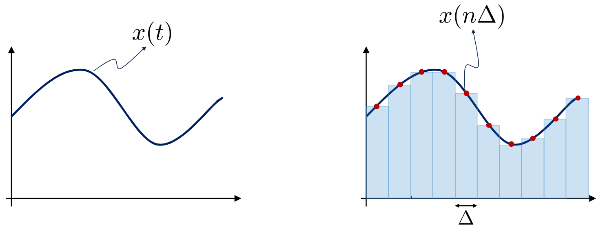

Se calcolassimo quindi la TCF in corrisponenza di una generica frequenza $kF$:
$$
	X(kF) = \int{x(t)\cdot e^{-j2\pi kFt}} \approx T \sum_n{x(nT)\cdot e^{-j2\pi kF nT}}
$$

I valori $F$ e $T$ possono essere scelti indipendentemente l'uno dall'altro, in quanto $T$ è l'intervallo di campionamento del segnale temporale, mentre $F$ è quello del segnale frequenziale.

L'operazione di calcoo può essere scirtta in forma compatta attraverso l'utilizzo delle matrici:
$$
\Chi = \overbrace{\begin{bmatrix}
	X(-\frac{K}{2}F) \\
	\vdots \\
	X(\frac{K}{2}F)
 \end{bmatrix}}^{(2K+1)\times 1} =
 \underbrace{T\bold{F}}_{(2K+1)\times(2N+1)} \cdot \overbrace{\begin{bmatrix}
	x(-\frac{N}{2}T)\\
	\vdots \\
	x(\frac{N}{2}T)
 \end{bmatrix}}^{(2N+1)\times 1} = T\bold{Fx}
$$

Definendo la matrice $\bold{F}$ come:
$$
[\bold{F}]_{kn} = e^{-j2\pi kn FT}
$$

La complessità di calcolo della trasformata è pari a $O(KN) \rArr O(N^2)$.

Se immaginiamo quindi di svolgere le operazioni con un clock pari a $1Ghz$, e scegliendo $N = 2^{12} = 4096$, il tempo necessario per il calcolo sarà:
$$
T_N \approx \frac{N^2}{10^9} = \frac{2^{24}}{10^9} \approx 0.016\;s
$$

Per operare in _tempo reale_, i campioni devono quindi essere generati ad una frequenza:
$$
f_N \le \frac{N}{T_N} = 256\;kHz
$$

### 2.7.1. Fast Fourier Transform - `FFT`

Se scegliamo $F = \frac{1}{NT}$ con $N = 2^k$, otteniamo che:
$$
X(kF) \approx T \sum_n{x(nT) \cdot e^{-j\frac{2\pi}{N}kn}}
$$

Possiamo utilizzare quindi un algoritmo noto come `FFT`, che riduce la complessità di calcolo a $O\bigl(N \log_2{(N)}\bigr)$.

Con riferimento all'esempio precedente otteniamo che:
$$
\begin{matrix}
	T_N \approx \frac{N \log_2{(N)}}{10^9} \approx 50\;\mu s & & f_N \le \frac{N}{T_N} \approx 80\;GHz
\end{matrix}
$$

Di seguito possiamo vedere la differenza delle prestazioni al variare di $N$:

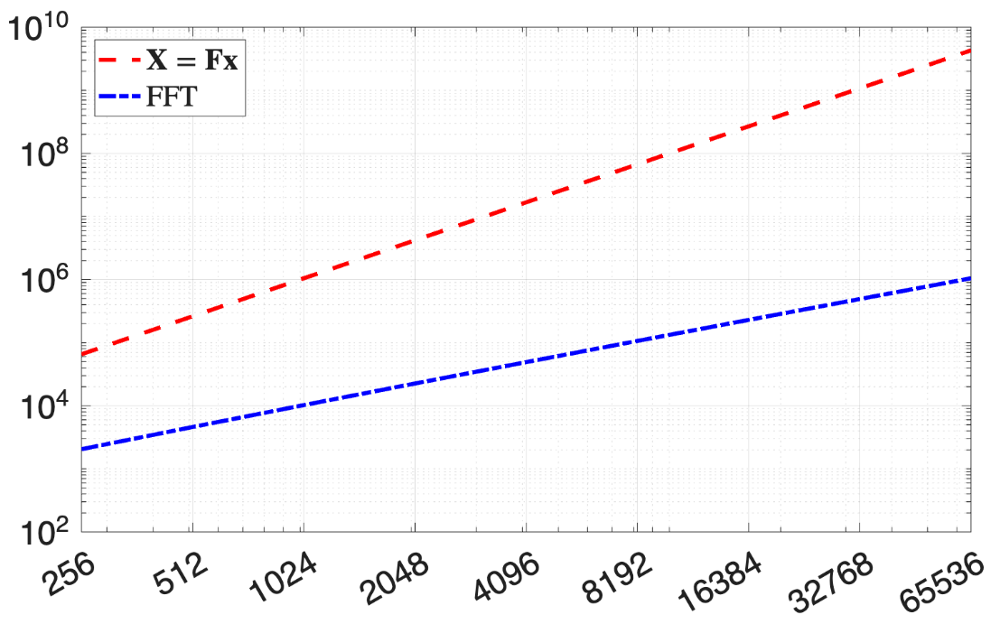

### 2.7.2. Calcolo numerico della `ATCF`

La `ATCF` (_AntiTrasformata Continua di Fourier_) si calcola nello stesso modo, utilizzando la _matrice hermitiana_:
$$
\begin{matrix}
	\bf{x} = \mathnormal{F}F^H\Chi \\
	\\
	[\bf{F}]_\mathnormal{kn} = \mathnormal{e^{-j2\pi knFT}}
\end{matrix}
$$

La `ACTF` si calcola in modo efficiente con l'algoritmo di _Inverse FFT_ (`IFFT`).

## 2.8. Teoremi

### 2.8.1. Linearità

$$
\boxed{
	\begin{matrix}
	x(t) = ax_1(t) + bx_2(t) & \Leftrightarrow & X(f) = aX_1(f) + bX_2(f)
	\end{matrix}
}
$$

La dimostrazione è banale:
$$
\begin{align*}
X(f) &= \int{x(t) \cdot e^{-j2\pi ft}\;dt} = \int{[ax_1(t) + bx_2(t)] \cdot e^{-j2\pi ft}\;dt} \\
&= a \cdot \int{x_1(t) \cdot e^{-j2\pi ft}\;dt} + b \cdot \int{x_2(t) \cdot e^{-j2\pi ft}\;dt} \\
X(f) &= aX_1(f) + bX_2(f)
\end{align*}
$$

### 2.8.2. Dualità

$$
\boxed{
	\begin{matrix}
		x(t) \Leftrightarrow X(f) & \leftrightarrow & X(t) \Leftrightarrow x(-f)
	\end{matrix}
}
$$

Dimostriamo quindi la relazione invertendo $t$ e $f$ nella equazione di sintesi:
$$
x(f) = \int{X(t) \cdot e^{j2\pi tf}\;dt}
$$

Sostituendo $f \to -f$:
$$
x(-f) = \int{X(t) \cdot e^{-j2\pi ft}\;dt}
$$

#### 2.8.2.1. Esempio - Funzione Rettangolare

Abbiamo già visto che:
$$
\begin{matrix}
	x(t) = rect\Bigl(\frac{t}{T}\Bigr) & \Leftrightarrow & X(f) = T \cdot \operatorname{sinc}(fT)
\end{matrix}
$$

Applicando il teorema della dualità otteniamo che:
$$
\begin{matrix}
	T \cdot \operatorname{sinc}(tT) & \Leftrightarrow & rect\Bigl(-\frac{f}{T}\Bigr)
\end{matrix}
$$

Da questa formula, ponendo $T = 2B$ e sfruttando la **parità della funzione** $rect$ otteniamo la seguente _trasformata notevole_:
$$
\begin{matrix}
	\operatorname{sinc}(2Bt) & \Leftrightarrow & \frac{1}{B} \cdot rect\Bigl(\frac{f}{2B}\Bigr)
\end{matrix}
$$

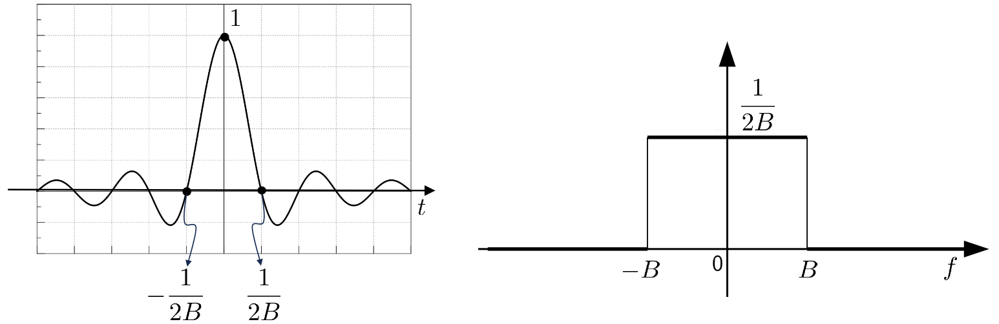

L'energia del segnale $\operatorname{sinc}(2Bt)$ sarà quindi la stessa di $\frac{1}{2B} \cdot rect\Bigl(\frac{f}{2B}\Bigr)$ per il teorema di Parseval, ovvero:
$$
	E_x = \int_{-B}^{B}{\Biggl\vert \frac{1}{2B} \cdot rect\Biggl(\frac{f}{2B}\Biggr)\Biggr\vert ^2\;df} = \frac{1}{4B^2} \cdot 2B = \frac{1}{2B}
$$

#### 2.8.2.2. Esempio - Funzione Esponenziale

Sappiamo già che:
$$
\begin{matrix}
	x(t) = e^{-t/T}\cdot u(t) & \Leftrightarrow & X(f) = \frac{T}{1+j2\pi fT}
\end{matrix}
$$

Applicando il teorema della dUalità otteniamo quindi:
$$
\begin{matrix}
	X(t) = \frac{T}{1+j2\pi tT} & \Leftrightarrow & x(-f) = e^{f/T}\cdot u(-f)
\end{matrix}
$$

Se sostituissimo $T \to \frac{1}{T}$:
$$
\begin{matrix}
	\frac{1}{1 + j2\pi t/T} & \Leftrightarrow & Te^{fT} \cdot u(-f)
\end{matrix}
$$

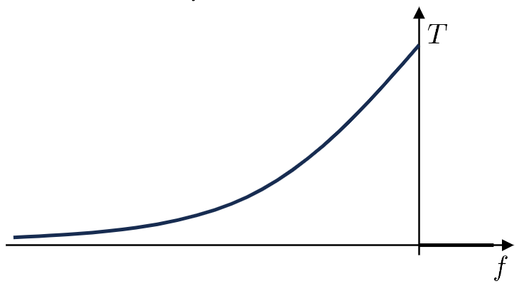

### 2.8.3. Teorema del ritardo

$$
\boxed{
	\begin{CD}
		\begin{matrix}
			y(t) = x(t-t_0) & \Leftrightarrow & Y(f) = X(f)\cdot e^{-j2\pi ft_0}
		\end{matrix}
		@>>>
		\begin{align*}
			\vert Y(f)\vert  &= \vert X(f)\vert  \\
			\phase{Y(f)} &= \phase{X(f)} - 2\pi ft_0
		\end{align*}
	\end{CD}
}
$$

Quello che ne deduciamo quindi è che un ritardo temporale:
- Modifica lo spettro di fase, introducendo una fase che **cresce linearmente con la frequenza**
- **Mantiene invariato** lo spettro di ampiezza

La dimostrazione è banale:

$$
\begin{CD}
	\int_{-\infty}^{+\infty}{x(t-t_0)\cdot e^{-j2\pi ft}\;dt} \\
	@V{\alpha = t - t_0}VV \\
	\int_{-\infty}^{+\infty}{x(\alpha)\cdot e^{-j2\pi f(\alpha - t_0)}\;d\alpha}\\
	@VVV \\
	e^{-j2\pi ft_0} \cdot \int_{-\infty}^{+\infty}{x(\alpha)\cdot e^{-j2\pi f\alpha}\;d\alpha}\\
	@VVV \\
	e^{-j2\pi ft_0} \cdot X(f)
\end{CD}
$$

Ad esempio, se studiassimo la funzione rettangolare traslata:
$$
	x(t) = rect\Biggl(\frac{t-T/2}{T}\Biggr)
$$

Se plottiamo gli spettri della trasformata otteniamo:

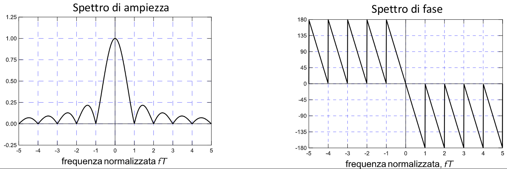

### 2.8.4. Teorema della modulazione

$$
\boxed{
	\begin{matrix}
		y(t) = x(t) \cdot \cos{(2\pi f_0t)} & \Leftrightarrow & Y(f) = \frac{X(f-f_0) + X(f+f_0)}{2}
	\end{matrix}
}
$$

La dimostrazione non è complessa:
$$
\begin{CD}
{\int{x(t) \cdot \cos(2\pi f_0t)\cdot e^{-j2\pi ft}\; dt}} \\
@V{cos(\alpha) = \frac{e^{j\alpha} + e^{-j\alpha}}{2}}VV \\
\end{CD} \\
{\int{x(t) \cdot \frac{e^{j2\pi f_0t} + e^{-j2\pi f_0t}}{2}\cdot e^{-j2\pi ft}\; dt}} \\
\frac{1}{2} \Biggl(
	\int{x(t) \cdot e^{-j2\pi (f-f_0)t}\;dt} + \int{x(t) \cdot e^{-j2\pi (f+f_0)t}\;dt}
\Biggr) \\
\frac{X(f-f_0) + X(f+f_0)}{2}
$$

Possiamo quindi notare cosa accade nella traslazione in frequenza dello spettro per la funzione:
$$
	x(t) = rect\Biggl(\frac{t}{T}\Biggr) \cdot \cos{(2\pi f_0t)}
$$

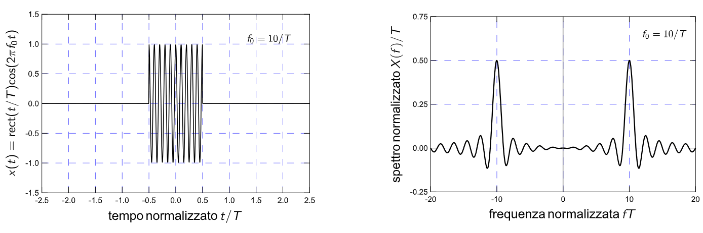

#### 2.8.4.1. Applicazioni del Teorema

Il _teorema della modulazione_ è utilizzato nei sistemi di comunicazione per riuscire a evitare che più segnali che naturalmente operano alla stessa frequenza si sovrappongano.

Infatti, se più segnali si sovrapponessero sulle stesse frequenze sarebbe **_impossibile separarli_**.

Nei sistemi di comunicazione quindi, prima di trasmettere un segnale, lo si modula utilizzando una funzione sinusoidale.

Quando è necessario trasmettere l'$i$-esimo segnale, quello che si fa è modularlo attraverso la funzione $\cos(2\pi f_i t)$. L'unico accorgimento necessario è che $f_i \ne f_j$ &emsp; $\forall i \ne j$.

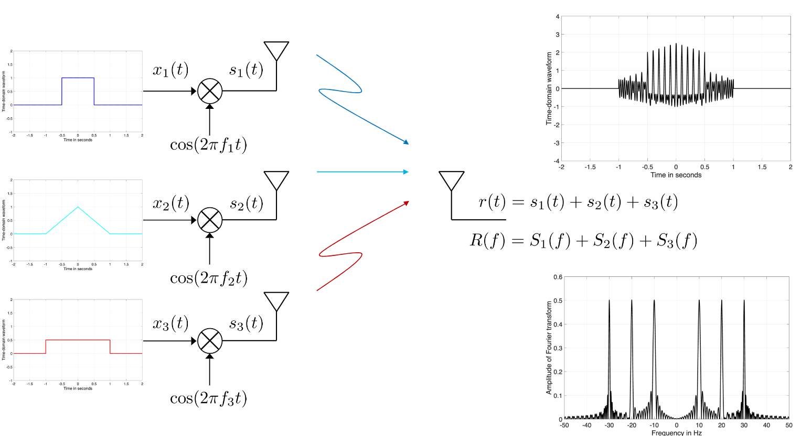

Analogamente è possibile, avendo un segnale in entrata, effettuare l'operazione di **_demodulazione_**, ovvero ricavare dai tanti segnali solamente uno centrato nella frequenza $f = 0$:

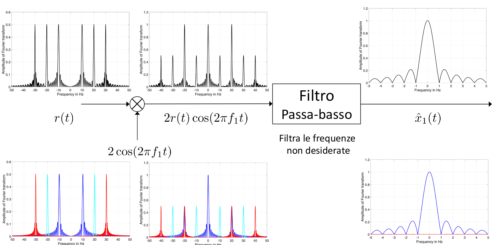

Introducendo una demodulazione paria al _doppio della modulazione_, abbiamo infatti che:
$$
2r(t)\cdot \cos{(2\pi f_1 t)} = 2s_1(t) \cdot \cos{(2\pi f_1t)} = 2x_1(t) \cos^2{(2\pi f_1t)} = x_1(t) + x_1(t) \cdot \cos(4\pi f_1t)
$$

Questo comporta che il segnale finale sarà **quello trasmesso** sommato a qualcosa modulato al doppio della frequenza di modulazione.

##### 2.8.4.1.1. Radio

Questa tecnica è quella utilizzata nella comunicazione in _broadcast FM_  nella radio analogica.
In quel caso la banda di frequenza va da $87.5$ $MHz$ fino a $108$ $MHz$, suddividendola in circa $205$ canali.

La moderna radio digitale invece sfrutta frequenza tra $174 - 230$ $MHz$ (con accesso possibile anche alla banda $56$ $MHz$) suddivisa in circa $41$ canali che possono trasportare tra le 10 e le 20 stazioni radio.

##### 2.8.4.1.2. Radar

I sistemi radar funzionano inviando un segnale $x(t)$ e attendendo che questo venga riflesso dalle superfici, così da tornare alla sorgente come segnale $y(t)$.

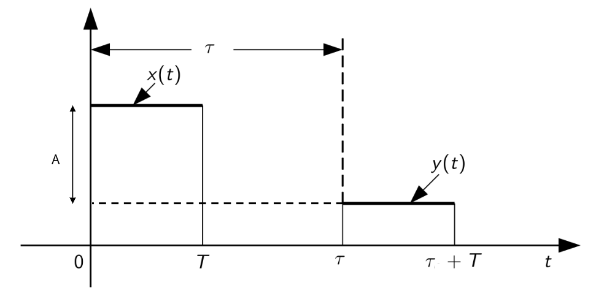

Il segnale $y(t)$ arriva con un ritardo $\tau$ dovuto alla distanza dell'oggetto, e attenuato di un fattore $A = \sqrt{\beta} = \frac{\lambda}{4\pi d}$ dovuto ad un assorbimento parziale dell'energia del segnale della superficie.

Il sistema radar funziona quando **_i due impulsi non si sovrappongono_**, o in generale quando $T \ll \tau$.

Ad esempio, se avessimo un oggetto distante $15$ $m$:
$$
	\tau = 2 \cdot \frac{15}{3 \cdot 10^8} = 10^{-7}\;s = 100\;ns
$$

Dovremo quindi inviare un segnale molto minore di $100$ $ns$. Nell'ipotesi in cui $T = 1$ $ns$, otteniamo il seguente spettro di ampiezza:

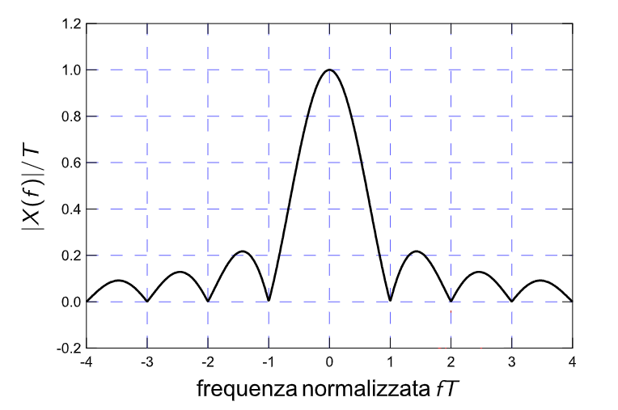

La frequenza di questo segnale è quindi &emsp; $f = \frac{1}{T} = 1$ $GHz$

I valori di frequenza sono comunque relativamente bassi, basta considerare che il WiFi opera a $2.4$ $GHz$, e questo consente loro di **propagarsi senza troppi problemi nelle superfici**.

Se invece desiderassimo una **_riflessione adeguata_** del segnale radio, è necessario trovare un modo di _aumentare la frequenza del segnale_.

La soluzioen consiste proprio nel sfruttare la modulazione del segnale, così da aumentarne la frequenza:
- **Short Range Radar (SRR)** : $24.0 - 24.25$ $GHz$
- **Medium Range Radar (MRR)** : $76 - 81$ $GHz$

### 2.8.5. Teorema del prodotto

$$
\boxed{
	\begin{matrix}
		z(t) = x(t) \cdot y(t) \\ \Updownarrow \\
		Z(f) = \int_{-\infty}^{+\infty}{X(\nu)Y(f - \nu)\;d\nu} = X(f) \otimes Y(f)
	\end{matrix}
}
$$

La dimostrazione è più semplice di quanto non possa sembrare:
$$
\begin{align*}
	Z(f) &= \int_{t=-\infty}^{+\infty}{z(t) e^{-j2\pi ft}\;dt} \\
		 &= \int_{t=-\infty}^{+\infty}{x(t)y(t) e^{-j2\pi ft}\;dt} \\
		 &= \int_{t=-\infty}^{+\infty}{\overbrace{\Biggl[\int_{\nu = -\infty}^{+\infty}{X(\nu)e^{j2\pi \nu} \;d\nu}\Biggr]}^{x(t)}y(t) e^{-j2\pi ft}\;dt} & \text{Inverto gli integrali} \\
		 &= \int_{\nu=-\infty}^{+\infty}{X(\nu)\overbrace{\Biggl[\int_{t = -\infty}^{+\infty}{y(t)e^{-j2\pi (f - \nu)t} \;dt}\Biggr]}^{Y(f - \nu)}\;d\nu} \\
		 &= \int_{}
		 &= \int_{\nu=-\infty}^{+\infty}{X(\nu)\cdot Y(f - \nu)\;d\nu} \\
		 &= X(f) \otimes Y(f)
\end{align*}
$$

L'operazione $X(f) \otimes Y(f)$ si chiama **_Integrale di Convoluzione_**.

#### 2.8.5.1. Integrale di Convoluzione

Definiamo convoluzione tra due funzioni (per comodità lavoriamo nel dominio del tempo):
$$
	\boxed{z(t) = x(t) \otimes y(t) = \int_{\alpha = -\infty}^{+\infty}{x(\alpha \cdot y(t-\alpha)\;d\alpha)}}
$$

Proviamo a calcolare il valore dell'_integrale di convoluzione per_ $t = t_0$ delle due funzioni di seguito:

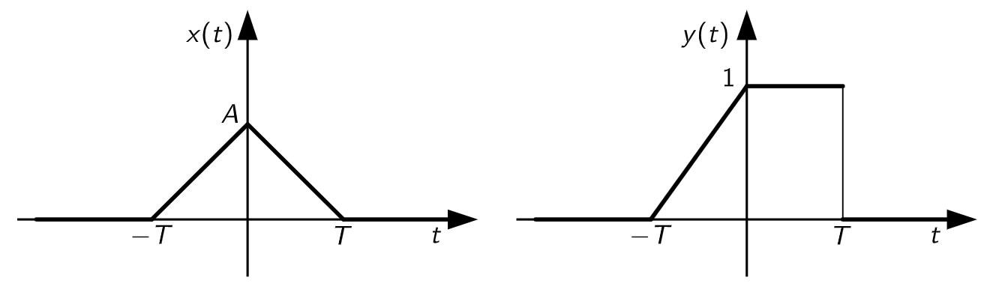

Innanzitutto capiamo che $y(t_0 - \alpha)$ non è altro che la funzione **simmetrica rispetto all'asse delle ordinate** di $y(t)$, che ha subito una traslazione lungo l'asse delle ascisse di $t_0$.

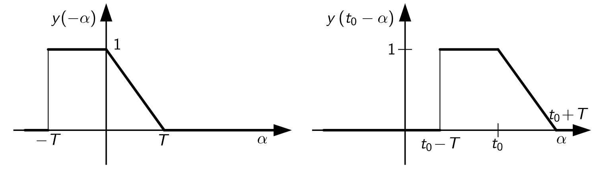

A questo punto si provede eseguendo il prodotto tra $z(t_0) = x(\alpha) \cdot y(t_0 - \alpha)$ su tutto l'asse $\alpha$, ponendo attenzione a quegli intervalli dove il prodotto **non è nullo**.

Su questi intervalli procediamo quindi a calcolare l'integrale, ovvero:
$$
	z(t_0) = \int_{\alpha = -\infty}^{\infty}{x(\alpha) \cdot y(t_0-\alpha)\;d\alpha}
$$

Il supporto dell'integrale di convoluzione tra due funzioni aventi _estensione_ limitata è data dalla **somma delle due estensioni**.

Immaginiamo di avere:
$$
\begin{matrix}
	x(t) = y(t) = \operatorname{sinc}(2Bt) & \Leftrightarrow & Y(f) = X(f) = \frac{1}{2B} rect\Bigl(\frac{f}{2B}\Bigr)
\end{matrix}
$$

E di voler calcolare $Z(f) = X(f) \otimes Y(f) = \int{X(\nu) \cdot Y(f_0 - \nu)\;d\nu}$

$$
\begin{align*}
	Z(f) &= \int_{-\infty}^{+\infty}{\frac{1}{2B} rect\Biggl(\frac{\nu}{2B}\Biggr) \cdot \frac{1}{2B} rect\Biggl(\frac{f - \nu}{2B}\Biggr) \; d\nu} \\\
		 &= \frac{1}{4B^2}\int_{-\infty}^{+\infty}{rect\Biggl(\frac{\nu}{2B}\Biggr) \cdot rect\Biggl(\frac{f - \nu}{2B}\Biggr)\;d\nu} \\
\end{align*}
$$

A questo punto dobbiamo distigguere iuattro casi:

Nel caso `a)` abbiamo che $\vert \nu\vert  > 2B$. In questo caso quando $X(\nu) \ne 0$ allora $Y(f - \nu) = 0$ e viceversa.
In questi intervalli avremo quindi che $Z(\nu) = 0$

Successivamente studiamo il caso `b)` quando $-2B \le \nu < 0$.
In questo caso avremo un prodotto $X(\nu) \cdot Y(f - \nu)$ che costruisce un rettangolo di altezza $\frac{1}{4B^2}$ e larghezza variabile con $\nu$:
$$
	l_b(\nu) = \vert -B - (\nu + B)\vert  = \vert -\nu - 2B\vert  = \nu + 2B
$$

L'area totale sarà quindi:
$$
	Z_b(\nu) = \frac{1}{4B^2} (\nu + 2B) = \frac{\nu}{4B^2} + \frac{1}{2B}
$$

Il caso `c)` identifica la sovrapposizione massima, nella quale $Z_c(\nu) = 2B \cdot \frac{1}{4B^2} = \frac{1}{2B}$

Il caso `d)` è il simmetrico rispetto al caso `b)`, dove adesso avremo:
$$
	Z_d(\nu) = \frac{1}{4B^2} (-\nu + 2B) = -\frac{\nu}{4B^2} + \frac{1}{2B}
$$

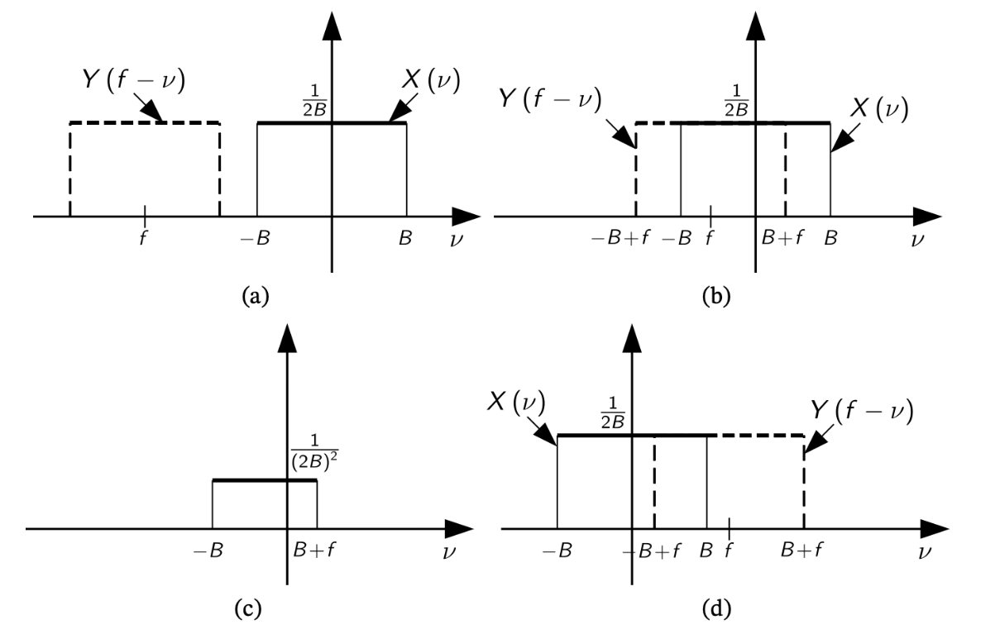

Il risultato sarà quindi:
$$
\begin{matrix}
	Z(f) = \begin{cases}
	0 & \vert f\vert  \ge 2B \\
	\frac{f}{4B^2} + \frac{1}{2B} & -2B < f \le 0 \\
	-\frac{f}{4B^2} + \frac{1}{2B} & 0 < f < 2B \\
\end{cases} & \Leftrightarrow & \frac{1}{2B} tri\Biggl(\frac{f}{4B}\Biggr)
\end{matrix}
$$

### 2.8.6. Teorema della convoluzione

$$
\boxed{
	\begin{matrix}
		z(t) = x(t) \otimes y(t) = \int_{-\infty}^{+\infty}{x(\alpha)t(t-\alpha)\;d\alpha} & \Leftrightarrow & Z(f) = X(f) \cdot Y(f)
	\end{matrix}
}
$$

Ovvero, alla convoluzione nel tempo corrisponde il **prodotto delle trasformate**

## 2.9. Definizione e Calcolo della banda di un segnale

Tutti i segnali $x(t)$ ottenibili in natura sono segnali a _durata finita_. Quello che possiamo fare però è immaginare che quel segnale in realtà non sia altro che un **segnale infinito troncato in un intervallo**, ovvero immaginare che:
$$
	x(t) = x(t) \cdot rect\Bigl(\frac{t}{2T}\Bigr)
$$

Ma se questo è vero allora abbiamo che:
$$
	X(f) = X(f) \otimes 2T\cdot \operatorname{sinc}(2fT)
$$

La funzione $\operatorname{sinc}$ ha durata infinita, quindi, indipendentemente dalla durata di $Y(f)$, sappiamo che la durata dell'integrale tra convoluzioni è la **somma delle durate**, ovvero il segnale finito ha intervallo frequenziale infinito.

Questo ci rende problematico individuare la **banda del segnale**, definita come:
> Intevallo frequenziale nel quale si trovano le componenti frequenziali _più significative_

Dobbiamo quindi trovare un modo per definire e calcolare la banda di un segnale.

### 2.9.1. Banda a `-3dB`

La definizione più comune di banda è la **Banda a -3dB**:
$$
\begin{CD}
	{
		10 \log_{10}{\frac{\vert X(B_{-3dB}\vert ^2)}{X(f_0)\vert ^3}} \approx -3dB
	} @>>>
	{\frac{\vert X(B_{-3dB}\vert ^2)}{X(f_0)\vert ^3} = \frac{1}{2}}
\end{CD}
$$

La banda a `-3dB` identifica la frequenza $f$ tale per cui il valore dell'ampiezza viene dimezzato rispetto al valore massimo.

Le frequenze _inferiori_ $(0 < f \le B_{-3dB})$ sono ritenute **importanti** , poiché l'attenuazione è inferiore alla metà, mentre quelle superiori sono ritenute **trascurabili**, in quanto l'attenuazione è superiore alla metà.

Questa necessità nasce proprio per quei segnali a **banda infinita**.

Prendiamo ad esempio la funzione esponenziale monolatera:
$$
\begin{matrix}
	x(t) = e^{-t/T}u(t) & \Leftrightarrow & X(f) = \frac{T}{1 + j{f/f_T}} & f_T = \frac{1}{2\pi T}
\end{matrix}
$$

La risposta in ampiezza in $f_0 = 0$:
$$
	X(0) = T
$$

Otteniamo quindi:
$$
\begin{CD}
	{\vert X(B_{-3dB})\vert ^2 = \frac{T^2}{2}} \\
	@VVV \\
	{\frac{T^2}{1+(f/f_T)^2} = \frac{T^2}{2}} \\
	@VVV \\
	{1+(f/f_T)^2 = 2} \\
	@VVV \\
	((f/f_T)^2 = 1) \\
	@VVV \\
	\boxed{f = f_T = \frac{1}{2\pi T}}
\end{CD}
$$

La banda a `-3dB` di una funzione esponenziale monolatera è quindi $f = \frac{1}{2\pi T}$

Altre bande, come a `-1dB` o `-20dB`, sono definite con lo stesso criterio

#### 2.9.1.1. Banda a `-3dB` - Segnali Modulati

Nei segnail modulati possiamo identificare **due** limiti di banda a `-3dB`. Definiamo quindi l'ampiezza di banda a `-3dB` come l'intervallo frequenziale come la **_differenza tra i due limiti_**, prendendo come riferimento **_la frequenza di modulazione_**.

Notiamo quindi che la banda di un segnale modulato è quindi **doppia di quella del segnale non modulato**:
$$
	f_0 - B_{-3dB} \le f \le f_0 + B_{-3dB}
$$

### 2.9.2. Banda al 99% dell'energia

La definizione di banda basata su criterio energetico è così definita:
$$
	\int_{-B_{99}}^{B_{99}}{\vert X(f)\vert ^2\;df} = 0.99E_x = 0.99 \int{\vert X(f)\vert ^2\;df}
$$

A differenza della banda a `-XdB`, questa definizione tiene in considerazione le caratteristiche del segnale originale.