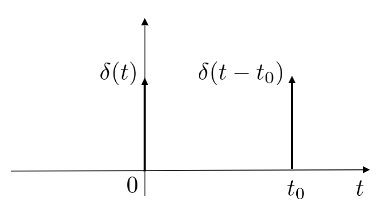

# 1. Indice

- [1. Indice](#1-indice)
- [2. Trasformate Continue di Fourier Generalizzate](#2-trasformate-continue-di-fourier-generalizzate)
	- [2.1. Delta di Dirac](#21-delta-di-dirac)
	- [2.2. Esercizio - TCFG della funzione gradino](#22-esercizio---tcfg-della-funzione-gradino)

# 2. Trasformate Continue di Fourier Generalizzate

La necessità di generalizzare le `TCF` nasce proprio dalla loro definizione, che si riferisce solo a **segnali a energia finita**.

Seppur in natura si trovino solo segnali a energia finita, è anche vero che esistono segnali a energia infinit: _funzione gradino_, _seni e coseni_, ...

Per riuscire a definire le `TCFG` dobbiamo definire la **_funzione Delta di Dirac_**

## 2.1. Delta di Dirac

Data la **Funzione Gradino Unitario**:
$$
	u(t) = \begin{cases}
		1 & t > 0 \\
		\frac{1}{2} & t = 0 \\
		0 & t < 0
	\end{cases}
$$

La funzione $\delta$ di Dirac è definita come la **_derivata della funzione gradino unitario_**:
$$
\begin{matrix}
	\delta(t) = {du(t) \over dt} & & u(t) = \int{\delta(t)\;dt}
\end{matrix}
$$

La funzione delta di dirac ci è utile per via delle sue proprietà:
1. **_Campionatrice_**: l'integrale del prodotto tra un segnale e la delta di dirac equivale al valore del prodotto nel punto dove la delta è centrata:
$$
	\int{\delta(t-t_0)x(t)\;dt} = x(t_0)
$$
2. **_Pari_**: &emsp; $\delta(t) = \delta(-t)$
3. **_Invariante al prodotto di convoluzione_**: &emsp; $x(t) \otimes \delta(t-t_0) = x(t-t_0)$

Proviamo quindi a calcolare la `TCF` sul segnale:
$$
\begin{matrix}
	\delta(t) & \Leftrightarrow & \Delta(f) = \int{\delta(t)e^{-j2\pi ft}\;dt} = e^{-j2\pi f\cdot 0} = 1
\end{matrix}
$$

Otteniamo quindi che la `TCF` della _Delta di Dirac_ è **_una costante unitaria_**.
Questo segnale ci dice quindi che la banda è infinita. Se ragioniamo proprio sulla relazione con la variabilità della funzione nel tempo il discorso torna, proprio perché non esiste niente più variabile della delta di dirac.

Se provassimo ad applicare il **teorema della dualità** otteniamo che:
$$
\begin{matrix}
	x(t) = 1 & \Leftrightarrow & \delta(-f) = \delta(f)
\end{matrix}
$$

Anche in questo caso la relazione variazione nel tempo - spettro in frequenza è rispettato, proprio perché non esiste segnale con spettro più piccolo della _delta di dirac_.

Applicando invece il **teorema del ritardo** otteniamo che:
$$
\begin{matrix}
	\delta(t-t_0) & \Leftrightarrow & e^{-j2\pi ft_0}
\end{matrix}
$$

Da cui segue, appllicando la **dualità**:
$$
\begin{matrix}
	e^{-j2\pi f_0t} = 1 \cdot e^{-j2\pi f_0t} & \Leftrightarrow & \delta(f+f_0)
\end{matrix}
$$

Applicando la proprietà di **linearità** otteniamo quindi le trasformate di _seno_ e _coseno_:
$$
\boxed{
	\begin{matrix}
		x_c(t) = \cos{(2\pi f_0t)} = \frac{e^{j2\pi f_0 t} + e^{-j2\pi f_0 t}}{2} & \Leftrightarrow & \frac{\delta(f-f_0) + \delta(f+f_0)}{2} = X_c(f) \\
		x_c(t) = \sin{(2\pi f_0t)} = \frac{e^{j2\pi f_0 t} - e^{-j2\pi f_0 t}}{2j} & \Leftrightarrow & \frac{\delta(f-f_0) - \delta(f+f_0)}{2j} = X_c(f) \\
	\end{matrix}
}
$$

Possiamo quindi dimostrare adesso il teorema della modulazione sfruttando il teorema del prodotto, infatti:
$$
\begin{matrix}
	x(t) \cdot \cos{(2\pi f_0 t)} & \Leftrightarrow & X(f) \otimes X_c(f)
\end{matrix}
$$

Poiché la convoluzione è distributiva otteniamo:
$$
X(f) \otimes X_c(f) = X(f) \otimes \Bigl(\frac{\delta(f-f_0) + \delta(f+f_0)}{2}\Bigr) = \frac{X(f-f_0) + X(f+f_0)}{2}
$$

## 2.2. Esercizio - TCFG della funzione gradino

> Data la funzione gradino $u(t)$ calcola la sua TCFG
> 
> Suggerimenti:
> 1. $u(t) = \frac{1}{2} + \frac{1}{2}\operatorname{sgn}(t)$
> 2. $\frac{1}{t} \Leftrightarrow -j\pi \operatorname{sgn}(t)$
> 3. Applica la dualità

Partendo dal suggerimento `1`, possiamo applicare le proprietà di linearità e del prodotto, calcolando la trasformata di $\operatorname{sgn}(t)$ partendo dal suggerimento `2` e applicandogli la dualità:
$$
\begin{matrix}
	u(t) = \frac{1}{2}(1 + 1\cdot \operatorname{sgn}(t)) & \Leftrightarrow & U(f) = \frac{1}{2}\Biggl(\delta(f) + \delta(f) \otimes \Bigl(-\frac{1}{j\pi f}\Bigr)\Biggr)
\end{matrix}
$$

Svolgendo il prodotto di convoluzione, che corrisponde alla funzione calcolata in $f-0$:
$$
U(f) = \frac{1}{2}\delta(f) - \frac{1}{j2\pi f}
$$