# 1. Indice

- [1. Indice](#1-indice)
- [2. Variabili Aleatorie](#2-variabili-aleatorie)
	- [2.1. Esempi](#21-esempi)
	- [2.2. Funzione di Distribuzione](#22-funzione-di-distribuzione)
	- [2.3. Variabili Aleatorie Discrete](#23-variabili-aleatorie-discrete)
		- [2.3.1. Variabili aleatorie di Bernoulli](#231-variabili-aleatorie-di-bernoulli)
			- [2.3.1.1. Esercizio - Registro di 4 qubit](#2311-esercizio---registro-di-4-qubit)
		- [2.3.2. Vatiabili aleatorie binomiali](#232-vatiabili-aleatorie-binomiali)
		- [2.3.3. Variabili aleatorie di Poisson](#233-variabili-aleatorie-di-poisson)
			- [2.3.3.1. Esercizio - Decadimento radioattivo](#2331-esercizio---decadimento-radioattivo)
		- [2.3.4. Funzione di Distribuzione](#234-funzione-di-distribuzione)
			- [2.3.4.1. Esercizio - Lancio di 2 dadi](#2341-esercizio---lancio-di-2-dadi)
	- [2.4. Variabili Aleatorie Continue](#24-variabili-aleatorie-continue)
	- [2.5. Densità di Probabilità](#25-densità-di-probabilità)
	- [2.6. Variabile Aleatoria Uniforme](#26-variabile-aleatoria-uniforme)
	- [2.7. Variabile Aleatoria Esponenziale](#27-variabile-aleatoria-esponenziale)
	- [2.8. Variabile Aleatoria Gaussiana](#28-variabile-aleatoria-gaussiana)
- [3. Densità di probabilità di variabili discrete e miste](#3-densità-di-probabilità-di-variabili-discrete-e-miste)
	- [3.1. Variabili Aleatorie Miste](#31-variabili-aleatorie-miste)
- [4. Trasformazioni di una variabile aleatoria](#4-trasformazioni-di-una-variabile-aleatoria)
	- [4.1. Metodo della funzione di Distribuzione](#41-metodo-della-funzione-di-distribuzione)
	- [4.2. Teorema Fondamentale per la Trasformazione di una Variabile Aleatoria Continua](#42-teorema-fondamentale-per-la-trasformazione-di-una-variabile-aleatoria-continua)
- [5. Indici Caratteristici di una Distribuzione](#5-indici-caratteristici-di-una-distribuzione)
	- [5.1. Valore Medio](#51-valore-medio)
	- [5.2. Varianza e Deviazione Standard](#52-varianza-e-deviazione-standard)
	- [5.3. Valore Quadratico Medio](#53-valore-quadratico-medio)
	- [5.4. Definizioni per Variabili Aleatorie Continue](#54-definizioni-per-variabili-aleatorie-continue)
	- [5.5. Teorema dell'Aspettazione](#55-teorema-dellaspettazione)
	- [5.6. Indici di Variabili Aleatorie Notevoli](#56-indici-di-variabili-aleatorie-notevoli)
		- [5.6.1. Variabile Aleatoria Uniforme](#561-variabile-aleatoria-uniforme)
		- [5.6.2. Variabile Esponenziale](#562-variabile-esponenziale)
		- [5.6.3. Variabile di Poisson](#563-variabile-di-poisson)
		- [5.6.4. Variabile Gaussiana](#564-variabile-gaussiana)
	- [5.7. Teorema di Tchebycheff](#57-teorema-di-tchebycheff)
- [6. Variabili Aleatorie Condizionate](#6-variabili-aleatorie-condizionate)
	- [6.1. Assenza di Memoria delle Variabili Esponenziali](#61-assenza-di-memoria-delle-variabili-esponenziali)

# 2. Variabili Aleatorie

Considerato un esperimento aleatorio avente uno spazio campione $\Omega$, una classe degli eventi $S$ e una legge di probabilità $P(\cdot)$, definiamo una _corrispondenza_, indicata con $X(\omega)$, che associa ad ogni risultato $\omega$ dell'esperimento **un unico numero reale**.

Tale corrispondenza fra lo spazio $\Omega$ e l'asse reale è una **_variabile aleatoria_** se l'insieme di risultati dell'esperimento per i quali è verificata la disuguaglianza $X(\omega) \le a$ è un **_evento_** $\forall a$.

È quindi possibile assegnare al generico evento $\Set{X(\omega\le a)}$ una probabilità $P(\cdot)$.

Inoltre, **sono ancora eventi** tutti i sottoinsiemi di $\R$ che si ottengono come unione/intersezione di sottoinsiemi del tipo $\Set{X(\omega\le a)}$. Potremo quindi associare loro una _probabilità_.

In particolare definiamo un **evento**:
$$
\begin{matrix}
	\Set{b < X(\omega) < a} = \Set{X(\omega\le a)} - \Set{X(\omega\le b)} & \wedge & b > a
\end{matrix}
$$

Nel seguito le variabili aleatorie saranno sempre rappresentate da lettere maiuscole, omettendo la dipendenza dal risultato $\omega$:
$$
\begin{matrix}
	X(\omega) & \Leftrightarrow & X \\
	Y(\omega) & \Leftrightarrow & Y \\
	& \vdots
\end{matrix}
$$

## 2.1. Esempi

Nell'esperimento consistente nel lancio di una moneta posso definire le variabili aleatorie $X$ e $Y$:
$$
\begin{matrix}
	X(\text{Testa}) = 1 & X(\text{Croce}) = 0 \\
	Y(\text{Testa}) = -1 & X(\text{Croce}) = 1
\end{matrix}
$$

Mentre nell'esperimento consistente nel lancio di un dado, ai possibili risultati posso associare il valore della faccia:
$$
\begin{matrix}
	X(f_i) = i & i = 1,2,...,6
\end{matrix}
$$

## 2.2. Funzione di Distribuzione

Si indica **_funzione di distribuzione_** di probabilità di una variabile aleatoria $X$:
$$
	\boxed{F_x(x) := P(\Set{X \le x})}
$$

L'esistenza della funzione di distribuzione $F_X(x),$ $\forall x \in \R$ è assicurata dalla definizione stessa di variabile aleatoria.

La funzione di distribuzione rispetta le seguenti proprietà:
- $0 \le F_X(x) \le 1$
- $\lim_{x\to-\infty}{F_X(x)} = F_X(-\infty) = P(\Set{X \le -\infty}) = 0$
- $\lim_{x\to+\infty}{F_X(x)} = F_X(+\infty) = P(\Set{X \le +\infty}) = 1$
- $x_2 > x_1 \rArr F_X(x_2) \ge F_X(x_1)$
- $P(x_1 < X \le x_2) = F_X(x_2)-F_X(x_1)$ &emsp; la dimostrazione è la seguente:
$$
	\Set{X\le x_2} = \Set{X \le x_1} \cup \Set{x_1 < X \le x_2} \\[0.5em]
	P(\Set{X\le x_2}) = P(\Set{X \le x_1}) + P(\Set{x_1 < X \le x_2}) \\[0.5em]
	F_X(x_2) = F_X(x_1) + P(\Set{x_1 < X \le x_2}) \\[0.5em]
	P(\Set{x_1 < X \le x_2}) = F_X(x_2)-F_X(x_1)
$$
- $F_X(x^+) = \lim_{h\to0^+}{F_X(x+h)} = F_X(x)$
- $P(\Set{X = \overline{x}}) = F_X(\overline{x}^+) - F_X(\overline{x}^-)$ &emsp; Se la funzione di distribuzione presenta una discontinuità di prima specie, la differenza tra il limite destro e sinistro nel punto è pari alla probabilità dell'evento

Tra queste proprietà:
$$
\begin{cases}
	P(x_1 < X \le x_2) = F_X(x_2)-F_X(x_1) \\[0.75em]
	P(X=x) = F_X(x) - F_X(x^-)
\end{cases}
$$

mostrano che dalla conoscienza di $F_X(\cdot)$ è possibile **determinare la probabilità di qualunque evento** $\Set{X \in I}$, essendo $I$ un qualunque insieme reale ottenuto come somma di intervalli dell'asse reale.

La conoscienza di $F_X(\cdot)$ rappresente quindi una **_descrizione statistica completa_** della variabile aleatoria $X$.

A seconda della natura della variabile aleatoria, otteniamo funzioni di distribuzioni diverse:

V.A. discreta

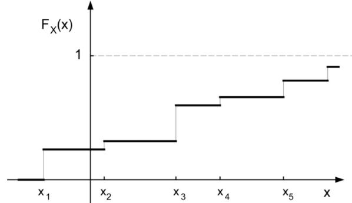

Se $X$ è discreta allora $F_X(x)$ è una **funzione costante a tratti**.

In particolare $X$ assumerà con probabilità diversa da zero un insieme di valori $x_k$ discreto.

Per calcolare la probabilità che una variabile aleatoria sia ad un certo livello $x$ sarà uguale alla somma dei "salti" tra gradini.

V.A. Continua 

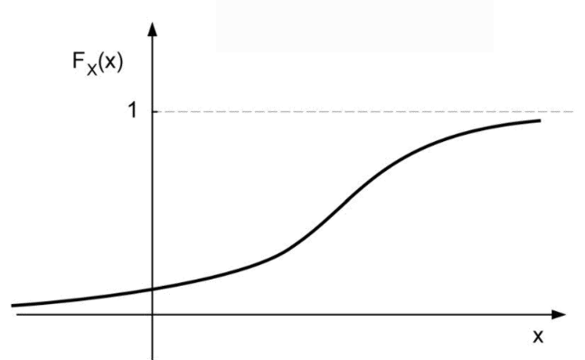

V.A. Mista

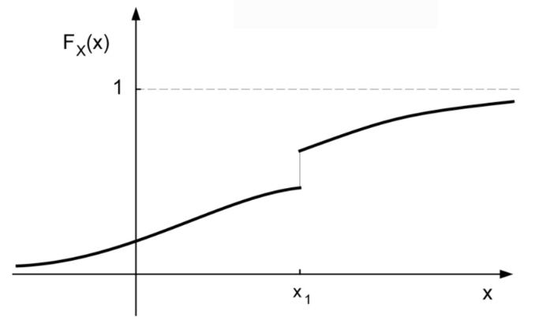

## 2.3. Variabili Aleatorie Discrete

> Una variabile aleatoria si dice _discreta_ se assume un numero finito o una infinità numerabile di valori distinti $x_1, x_2, ..., x_i, ...$
>
> Definiamo quindi la **_funzione massa di probabilità_**:
> $$
> 	\boxed{p_X(x) = P(\Set{X = x})}
> $$

Questa funzione è diversa da zero solo in $x = x_1, x_2, ..., x_i, ...$

Ad, esempio, il lancio di un dado non truccato avrà una funzione massa di probabilità:

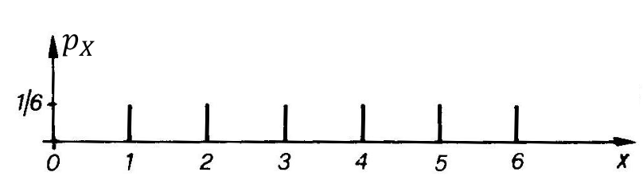

Poiché gli eventi $\Set{X = x_i}$ sono una partizione di $\Omega$:
$$
	\sum_i{p_X(x_i)} = \sum_i{P(\Set{X = x_i})} = 1
$$

Possiamo inoltre definire la **massa di probabilità** come il **_limite della frequenza relativa_**:
$$
	p_X(x) = P(\Set{X = x}) = \lim_{N\to+\infty}{n(x_i) \over N}
$$

Questo equivale a ripetere l'esperimento $N$ volte e, per ogni $x_i$, calcolare il numero di volte $n(x_i)$ in cui tale valore si è presentato.

Possiamo quindi definire la _frequenza di presentazione_, o _stima della massa di probabilità_:
$$
\hat{p}_X(x_i) = \frac{n(x_i)}{N}
$$

### 2.3.1. Variabili aleatorie di Bernoulli

La proprietà caratteristica delle variabili aleatorie, è che ad un dato esperimento è possibile associarne infinite.

Ad esempio considerando l'esperimento costituito dal lancio di un dado perfettamente simmetrico, possiamo:
1. Associare ad ogni faccia il suo valore numerico: &emsp; $p_X(i) = \frac{1}{6}$
2. Deffinire una variabile aleatoria $Y$ tale che $Y = \begin{cases}1 & \text{faccia: } 5,6 \\ 0 & \text{altrimenti}\end{cases}$

Nel secondo caso avremo che:
$$
\begin{align*}
	p_Y(1) &= P(Y=1) = P(X=5) + P(X=6) = \frac{1}{3} \\[0.5em]
	p_Y(0) &= P(Y=0) = 1- P(Y=1) = \frac{2}{3}
\end{align*}
$$

Se consideriamo un esperimento casuale che assume due valori possibili:
- Il valore $1$ con probabilità $p$
- Il valore $0$ con probabilità $1-p$

Definiamo questo tipo di variabile aleatoria come **_Variabilie Aleatoria di Bernoulli_**
$$
X \in Bernoulli(p)
$$

Se ripetiamo $N$ volte un esperimento aleatorio nel quale un certo evento favorevole $A$ si può presentare con probabilità $p$ in ciascuna prova indipendente, possiamo definire una variabile aleatoria $X$ il cui valore si identifica con il numero di volte in cui si verifica l’evento $A$ sul totale delle $N$ prove.

Questa è detta **numero di successi** ed è di tipo discreto e può assumere i valori $x_k = 0, 1, 2, ..., N$ con massa di probabilità:
$$
\begin{matrix}
	p_X(k) = P(\Set{X = k}) = \binom{N}{k}p^k(1-p)^{N-k} & {0 < p < 1 \atop k = 0, 1, ..., N}
\end{matrix}
$$

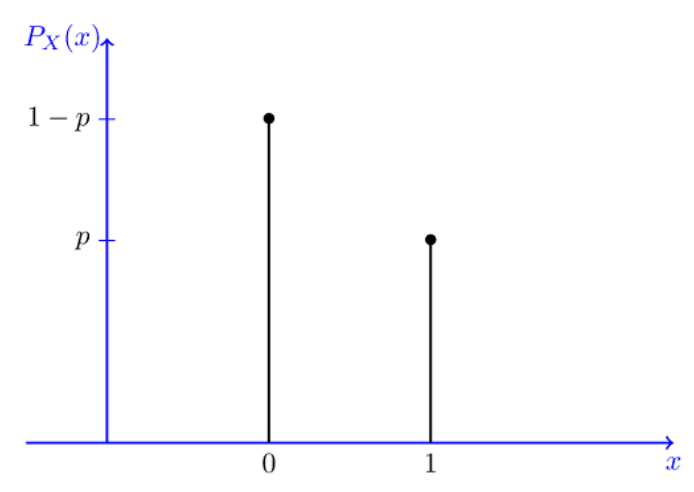

#### 2.3.1.1. Esercizio - Registro di 4 qubit

> Consideriamo un circuito quantistico su 4 qubit che a seguito della misura nella base computazionale più trovarsi in uno dei seguenti stati:
> - `0000` &emsp; $p  = 0.4$
> - `0011` &emsp; $p  = 0.1$
> - `1100` &emsp; $p  = 0.4$
> - `1111` &emsp; $p  = 0.1$
>
> Definiamo le seguenti variabile aleatorie discrete:
> - $Y$: valore del primo bit
> - $Z$: valore del terzo bit
> - $X$: numero di bit a 1
>
> Calcolare:
> 1. Massa di probabilità di $Y, Z, X$
> 1. La distribuzione di probabilità che seguono $Y$ e $Z$
> 2. La funzione di distribuzione di $X$

Proviamo a calcolare $p_Y(y)$ sia quando $y = 0$ che quando $y = 1$:
$$
\begin{align*}
	p_Y(0) &= P(\Set{Y = 0}) = P(\Set{0000 \cup 0011}) = P(0000) + P(0011) = 0.5 \\
	p_Y(1) &= 1 - p_Y(1) = 0.5
\end{align*}
$$

Possiamo quindi dire che:
$$
	Y \in Bernoulli(0.5)
$$

Calcoliamo adesso $p_Z(z)$ sia quando $z = 0$ che quando $z = 1$:
$$
\begin{align*}
	p_Z(0) &= P(\Set{Z = 0}) = P(\Set{0000 \cup 0011}) = P(0000) + P(1100) = 0.8 \\
	p_Z(1) &= 1 - p_Z(1) = 0.2
\end{align*}
$$

Possiamo quindi dire che:
$$
	Z \in Bernoulli(0.2)
$$

Infondo, calcoliamo $p_X(x)$ quando $x = 0,2,4$
$$
\begin{align*}
	p_X(0) &= P(\Set{X = 0}) = P(\Set{0000}) = P(0000) = 0.4 \\
	p_X(2) &= P(\Set{X = 2}) = P(\Set{0011 \cup 1100}) = P(0000) + P(1100) = 0.5 \\
	p_X(4) &= P(\Set{X = 4}) = P(\Set{1111}) = P(1111) = 0.1 \\
\end{align*}
$$

$X$ non è quindi una variabile aleatoria di _Bernoulli_, ma ha il seguente grafico:
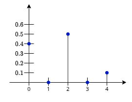

La Funzione di Distribuzione di $X$ è quindi la seguente:
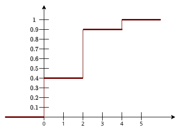

### 2.3.2. Vatiabili aleatorie binomiali

> Una variabile aleatoria $X \in B(p, N)$ è detta **_binomiale_** se:
> - È discreta
> - È definita per valori interi $0, 1, 2, ..., N$
> - Rispetta la seguente massa di probabilità:
> $$
> \begin{matrix}
> 	p_X(k) = P(\Set{X = k}) = \binom{N}{k} p^k(1-p)^{N-k} & {0 < p < 1 \atop k = 0, 1, 2, ..., N}
> \end{matrix}
> $$

<figure class="80">
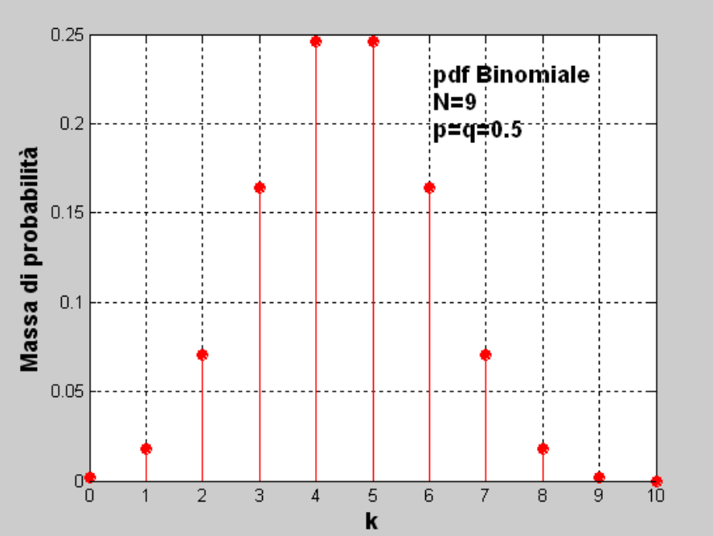
<figcaption>

Potrebbe essere la probabilità di avere una faccia per $k$ volte dopo aver lanciato una moneta non truccata $9$ volte.
</figcaption>
</figure>

### 2.3.3. Variabili aleatorie di Poisson

> Una variabile aleatoria $X \in P(\Lambda)$ è detta **_di Poisson_** di parametro $\Lambda > 0$ se:
> - È discreta
> - È definita per valori interi positivi
> - Rispetta la seguente massa di probabilità:
> $$
> \begin{matrix}
> 	p_X(k) = P(\Set{X = k}) = \frac{\Lambda^k}{k!}e^{-\Lambda} & k = 0, 1, 2, ...
> \end{matrix}
> $$

La condizione di normalizzazione della massa di probabilità in caso di v.a. di Poisson è:
$$
\sum_{k=0}^{+\infty}{p_X(k)} = e^{-\Lambda} \cdot \sum_{k=0}^{+\infty}{\frac{\Lambda^k}{k!}} = e^{-\Lambda} \cdot e^{\Lambda} = 1
$$

<figure class="80">
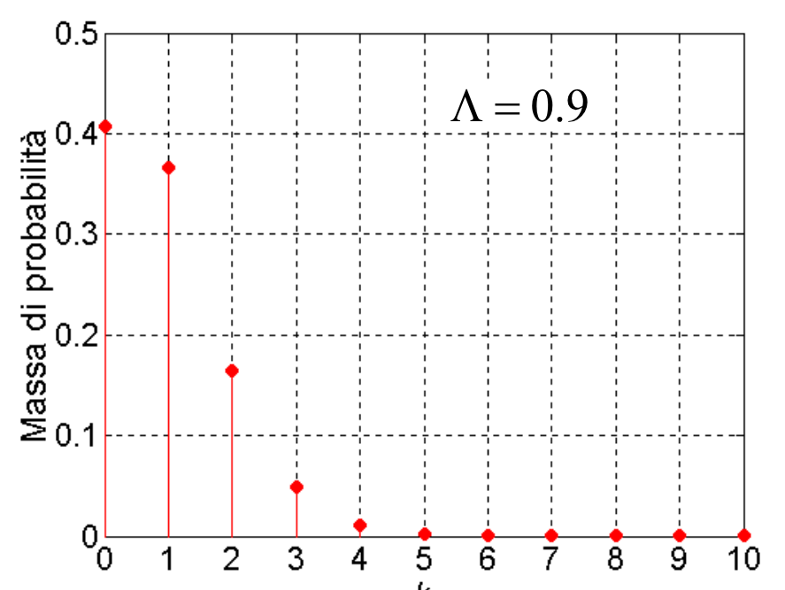
<figcaption>

Se $\Lambda < 1$, allora $\max{\bigl(p_X(k)\bigr)} = p_X(0)$
</figcaption>
</figure>

<figure class="80">

<figcaption>

Se $\Lambda \ge 1$, allora $\max{\bigl(p_X(k)\bigr)} = p_X(\lfloor k\rfloor)$
</figcaption>
</figure>

#### 2.3.3.1. Esercizio - Decadimento radioattivo

> Supponiamo di studiare una sostanza radioattiva a vita media molto lunga. Il numero di decadimenti per unità di tempo è schematizzabile come una variabile aleatoria di Poisson di parametro $\Lambda = 0.5$ decadimenti al secondo.
>
> **Calcolare la probabilità che l'intervallo di tempo intercorrente tra due decadimenti successivi superi un secondo**

Rappresentiamo il _numero di decadimenti in un secondo_ con la variabile aleatoria $X \in P(\Lambda = 0.5)$.

La probabilità che viene richiesta dall'esercizio, equivale a chiedere quanto il tempo tra due decadimenti in un secondo sia maggiore di $1$ secondo, ovvero quando $X = 0$.

L'esercizio è ora praticamente risolto:
$$
P(\Set{X = 0}) = p_X(k = 0) = e^{-\Lambda} \cdot \frac{\Lambda^0}{0!} = e^{-\Lambda} = e^{-0.5} \approx 0.6
$$

### 2.3.4. Funzione di Distribuzione

La funzione di distribuzione di probabilità di una variabile aleatoria è definita:
$$
\begin{align*}
	F_X(x) &= P(\Set{X \le x}) \\
		   &= \sum_{i : x_i \le x}{P(\Set{X = x_i})} = \sum_{i : x_i \le x}{p_X(x_i)} \\
		   &= \sum_i{P(\Set{X = x_i})}\cdot u(x-x_i) \\
		   &= p_X(x_i)\cdot u(x-x_i)
\end{align*}
$$

La funzione $u(x-x_i)$ rappresenta la **_funzione gradino_**, che ha discontinuità in $x = x_i$.

Deduciamo qiundi che se la $F_X(x)$ di una variabile discreta è nota, è possibile dedurre sia i valori assunti dalla v.a., sia le corrispondenti probabilità, permettendoci quindi di **_ricavare la massa di probabilità_**.

In particolare, data una _funzione a gradini_, i gradini **sono in corrispondenza degli $x_i$** della massa di probabilità.

#### 2.3.4.1. Esercizio - Lancio di 2 dadi

> Si lanciano due dadi non truccati, uno di colore verde e uno di colore rosso. Si definiscono due variabili aleratorie discrete $V$ e $R$, dove:
> - $V$: numero sulla faccia verso l’alto del dado verde
> - $R$: numero sulla faccia verso l’alto del dado rosso
>
> La massa di probabilità e la funzione distribuzione di V ed R sono quelle riportate nell'immagine a destra.
>
> **Ricavare la massa di probabilità delle variabili aleatorie S e D definite come segue**:
> $$
> \begin{cases}
> 	S = V + R \\
> 	D = V - R
> \end{cases}
> $$

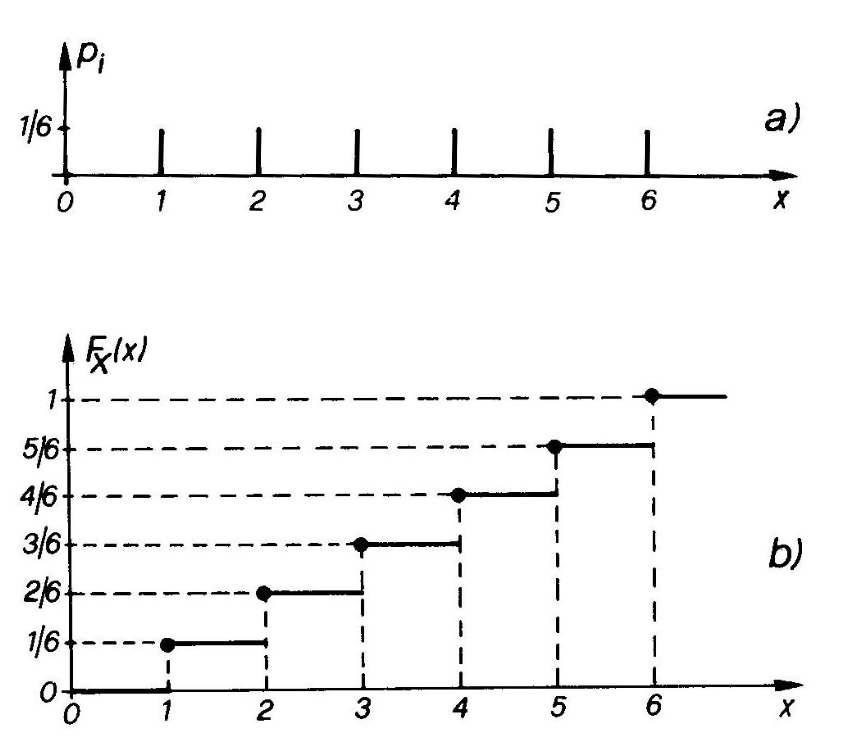

Possiamo considerare due assi cartesiani dove su uno vi sono gli esiti di $R$ mentre sull'altro quelli di $V$.

Facciamo rappresentare agli incroci la somma/differenza delle due faccie.

I valori che appariono rappresentano le $x_i$ nel diagramma della massa di probabilità. Il valore che questi assumono è rappresentato dal numero totale di volte in cui $x_i$ compare nella tabella.

|  V\R  |   `1`   |   `2`    |   `3`    |   `4`    |   `5`    |    `6`    |
| :---: | :-----: | :------: | :------: | :------: | :------: | :-------: |
|  `1`  | `2`/`0` | `3`/`-1` | `4`/`-2` | `5`/`-3` | `6`/`-4` | `7`/`-5`  |
|  `2`  | `3`/`1` | `4`/`0`  | `5`/`-1` | `6`/`-2` | `7`/`-3` | `8`/`-4`  |
|  `3`  | `4`/`2` | `5`/`1`  | `6`/`0`  | `7`/`-1` | `8`/`-2` | `9`/`-3`  |
|  `4`  | `5`/`3` | `6`/`2`  | `7`/`1`  | `8`/`0`  | `9`/`-1` | `10`/`-2` |
|  `5`  | `6`/`4` | `7`/`3`  | `8`/`2`  | `9`/`1`  | `10`/`0` | `11`/`-1` |
|  `6`  | `7`/`4` | `8`/`4`  | `9`/`3`  | `10`/`2` | `11`/`1` | `12`/`0`  |

La risposta è quindi la seguente:
<figure class="">
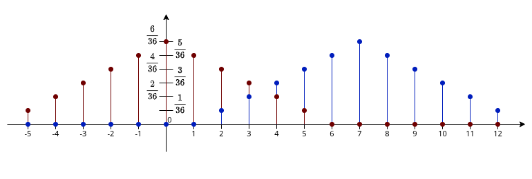
<figcaption>

Il colore blu rappresenta la massa di $S$, mentre il colore rosso rappresenta la massa di $D$.
</figcaption>
</figure>

## 2.4. Variabili Aleatorie Continue

Una variabile aleatoria si dice **continua** se può assumere una **_infinità di valori_**, ogniuno dei quali con **_probabilità nulla_**:
$$
\begin{matrix}
	P(\Set{X = x}) = 0, & \forall x
\end{matrix}
$$

In questo scenario di variabili continue, dove possiamo assumere un **infinità non numerabile** di possibili valori, possiamo vedere alcune proprietà della funzione di distribuzione.

La prima è che la funzione **_è continua_**:
$$
	F_X(x^+) = F_X(x^-)
$$

Abbiamo quindi un infinità di punti, ogniuno con probabilità nulla. Tuttavia, abbiamo che la probabilità che un valore si trovi in un intervallo **_non è nulla_**:
$$
\begin{align*}
P(x_1 < X \le x_2) &= P(x_1 \le X < x_2) \\
&= P(x_1 < X < x_2) \\
&= P(x_1 \le X \le x_2) \\
&= \boxed{F_X(x_2) - F_X(x_1)}
\end{align*}
$$

## 2.5. Densità di Probabilità

Vediamo quindi la **rappresentazione delle variabili aleatorie più utilizzata**:
> Se $F_X(x)$ è derivabile, si definisce **_densità di probabilità_** $(ddp)$ della variabile aleatoria $X$ la funzione
> $$
> \large
> \boxed{
> 	f_X(x) = {dF_X(x) \over dx}
> }
> $$

Questa densità di probabilità ha la proprietà che $f_X(x) \ge 0$, in quanto sappiamo che $F_X(x)$ è **crescente monotona**.

Inoltre, possiamo ricavare la funzione di distribuzione di probabilità:
$$
\large
	F_X(x) = \int_{-\infty}^{x}{f_X(\alpha)\;d\alpha}
$$

Di conseguenza abbiamo che:
$$
\begin{CD}
	{\int_{x_1}^{x_2}{f_X(\alpha)\;d\alpha} = F_X(x_2) - F_X(x_1)} \\
	@VVV \\
	{P(X \in I) = \int_I{f_X(\alpha)\;d\alpha}}
\end{CD}
$$

La proprietà di normalizzazione è ancora una volta rispettata:
$$
\int_{-\infty}^{\infty}{f_X(\alpha)\;d\alpha} = F_X(\infty) - F_X(-\infty) = 1
$$

Poiché sappiamo che $P(X = x) = 0$, ma che $P(I) \ne 0$, possiamo quindi prendere due punti **_molto vicini_**, ovvero $x_1 = x$ e $x_2 = x + dx$:
$$
\begin{CD}
	{P(x<X\le x + dx) = \int_{x}^{x+dx}{f_X(x)\;dx} \approx f_X(x)\cdot dx} \\
	@VVV \\
	\boxed{
		f_X(x) = \frac{P(x<X\le x+dx)}{dx}
	}
\end{CD}
$$

Perciò la _densità di probabilità_ rappresenta, al variare di $x$, che la variabile aleatoria $X$ assuma valori appartenenti all'intervallo infinitesimo $(x, x+dx)$ diviso l'ampiezza infinitesima $dx$ dell'intervallo.

Questa proprietà risulta particolarmente utile per **_misurare sperimentalmente le $ddp$_** di una variabile aleatoria passando alla _frequenza relativa_.

Se infatti ripetiamo l'esperimento $N$ volte, e contiamo il numero $\Delta n(x)$ di risultati per cui $x < X \le x + \Delta x$, otteniamo:
$$
f_X(x)\cdot \Delta x \cong P(x < X \le x + \Delta X) \cong \frac{\Delta n(x)}{N}
$$

Questa relazione è valida purché $\Delta x$ sia _sufficientemente piccolo_ e $N$ _sufficientemente grande_, ottenendo:
$$
f_X(x) \cong \frac{\Delta n(x)}{N \cdot \Delta x}
$$

## 2.6. Variabile Aleatoria Uniforme

> Una variabile aleatoria $X \in U(a, b)$ è detta **_uniforme nell'intervallo_** $(a,b)$, se la sua $ddp$ è **_costante_** in quell'intervallo.

Ad esempio, ipotiziamo la funzione:
$$
f_X(x) = \begin{cases}
	k & a \le x \le b \\
	0 & \text{altrove}
\end{cases}
$$

In questo caso abbiamo un valore  costante $k$ nell'intervallo. Affinché questa possa essere una _distribuzione di probabilità_ è necessario che:
$$
\begin{CD}
	{\int_{-\infty}^{+\infty}{f_X(x)\;dx} = \int_{a}^{b}{k\;dx} = 1} @>>> {k = \frac{1}{b-a}}
\end{CD}
$$

Per calcolare quindi la **funzione di distribuzione** in un punto $x \in [a,b]$:
$$
\begin{align*}
	F_X(x) &= \int_{-\infty}^{x}{f_X(\alpha)\;d\alpha} \\[0.7em]
		   &= 0 + \int_{a}^{x}{f_X(\alpha)\;d\alpha} \\[0.7em]
		   &= \frac{x}{b-a}\Biggr]_{a}^{x} \\[0.7em]
		   &= \frac{x-a}{b-a}
\end{align*}
$$

La variabile aleatoria uniforme è quindi rappresentata da:
$$
F_X(x) = \begin{cases}
	0 & x < a \\
	\frac{x-a}{b-a} & a \le x \le b \\
	1 & x > b
\end{cases}
$$

## 2.7. Variabile Aleatoria Esponenziale

Una variabile aleatoria $X \in Exp(\lambda)$ è detta di tipo **_esponenziale_** di parametro $\lambda$ se ha la seguente densità di probabilità:
$$
\LARGE
\boxed{
	f_X(x) = \frac{1}{\lambda} e^{-\frac{x}{\lambda}} \cdot u(x)
}
$$

La funzione di distribuzione di una variabile esponenziale è:
$$
\begin{align*}
	F_X(x) &= \int_{-\infty}^{x}{\frac{1}{\lambda} e^{-\frac{\alpha}{\lambda}} \cdot u(\alpha)\;d\alpha} \\[1.25em]
		   &= \begin{cases}
		   	0 & x < 0 \\[0.25em]
			0 + \int_{0}^{x}{\frac{1}{\lambda} e^{-\frac{\alpha}{\lambda}}\;d\alpha} & x \ge 0
		   \end{cases} \\[1.25em]
		   &= \bigl(1 - e^{-\frac{x}{\lambda}}\bigr)u(x)
\end{align*}
$$

<figure class="">
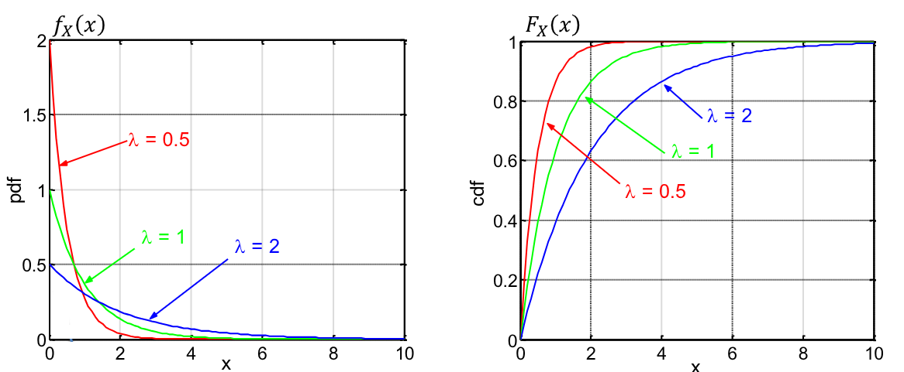
<figcaption>

In zero la densità di probabilità vale $\frac{1}{\lambda}$
</figcaption>
</figure>

## 2.8. Variabile Aleatoria Gaussiana

Una variabile aleatoria $X \in \cal{N}\mathnormal{(\eta, \sigma^2)}$ è detta **_Gaussiana_** o **_Normale_** di parametri $(\eta, \sigma^2)$ se la sua densità di probabilità è:
$$
\LARGE
\boxed{
	f_X(x) = \frac{1}{\sigma\sqrt{2\pi}}e^{-\frac{1}{2}\biggl(\frac{x-\eta}{\sigma}\biggr)^2} = \frac{1}{\sqrt{2\pi\sigma^2}}e^{-\frac{1}{2}\Biggl(\frac{(x-\eta)^2}{\sigma^2}\Biggr)}
}
$$

Vedremo che:
- Il parametro $\eta$ rappresenta il **valor medio**
- Il parametro $\sigma^2$ rappresenta la **varianza** o **indice di dispersione**

Tutte le funzioni di distribuzione di variabili aleatorie gaussiane **_non sono valutabili in forma chiusa_**. Per la risoluzione di problemi si calcola _numericamente_ o si trova _tabulata_.

<figure class="60">
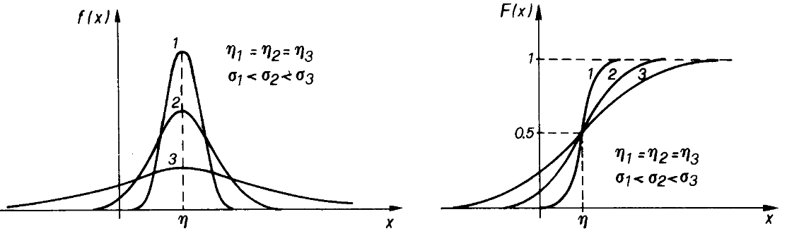
<figcaption>

Notiamo che la densità di probabilità è **simmetrica** rispetto alla retta $x = \eta$.
La funzione di distribuzione è invece **simmetrica centralmente** rispetto al punto $(\eta, 0.5)$
</figcaption>
</figure>

La variabile aleatoria $Z \in \cal{N}\mathnormal{(0,1)}$ si dice **_Variabile Aleatoria Gaussiana Standard_**:
$$
\Large
f_Z(z) = \frac{1}{\sqrt{2\pi}} \cdot e^{-\frac{z^2}{2}}
$$

In questo caso definiamo la funzione di distribuzione:
$$
\LARGE
\boxed{
	\Phi(z) := F_Z(z) = \frac{1}{\sqrt{2\pi}}\int_{-\infty}^{z}{e^{-\frac{\alpha^2}{2}}\;d\alpha}
}
$$

Definiamo inoltre **_Funzione $\mathbf{Q}$_**:
$$
\LARGE
\boxed{
	Q = 1 - \Phi(z) = \frac{1}{\sqrt{2\pi}}\int_{z}^{\infty}{e^{-\frac{\alpha^2}{2}}\;d\alpha}
}
$$

Sia la funzione $Q$ che la funzione $\Phi$ hanno la proprietà che:
$$
\begin{matrix}
	Q(z) = 1 - Q(-z) & & \Phi(z) = 1 - \Phi(-z)
\end{matrix}
$$

Ovvero, valori simmetrici di $z$ hanno valore complementare ad 1.

Avevamo visto in precedenza che il rumore di un sistema $\sigma$ influisce sulla probabilità di errore $P_e \propto Q\bigl(\frac{1}{\sigma}\bigr)$, in particolare:
- $\sigma \to 0$ produce $P_e \to 0$
- $\sigma \to \infty$ procuce $P_e \to 0.5$

Se abbiamo $X \in \cal{N}\mathnormal{(\eta, \sigma^2)}$ ricaviamo la funzione di distribuzione da quella della normale standard:
$$
\begin{align*}
	F_X(x) &= \frac{1}{\sigma\sqrt{2\pi}}\int_{-\infty}^{z}{e^{-\frac{1}{2}\bigl(\frac{\alpha-\eta}{\sigma}\bigr)^2}\;d\alpha} \\[1.25em]
	\text{Poniamo: } &y = \frac{\alpha - \eta}{\sigma} \rArr dy = \frac{d\alpha}{\sigma} \\[1.25em]
		&= \frac{1}{\sqrt{2\pi}}\int_{-\infty}^{\frac{x - \eta}{\sigma}}{e^{-\frac{y^2}{2}}\;dy} \\[1.25em]
		&= \Phi\Bigl(\frac{x - \eta}{\sigma}\Bigr) = 1 - Q\Bigl(\frac{x - \eta}{\sigma}\Bigr)
\end{align*}
$$

Questo ci permette di definire anche la probabilità:
$$
	P(X > \lambda) = 1 - F_X(\lambda) = Q\Bigl(\frac{\lambda - \eta}{\sigma}\Bigr)
$$

In generale possiamo seguire il seguente teorema:
> Data una variabile aleatoria Gaussiana $X$ di parametri $(\eta, \sigma^2)$, la probabilità associata ad un qualunque evento di intersse può essere calcolata mediante la funzione $\Phi(\cdot)$ oppure equivalentemente mediante la funzione $Q$:
> $$
> \begin{align*}
> 	P(a < X \le b) &= \int_{a}^{b}{f_X(\alpha)\;d\alpha} = F_X(b)-F_X(a) \\
> 				   &= \Phi\Bigl(\frac{b-\eta}{\sigma}\Bigr) - \Phi\Bigl(\frac{a-\eta}{\sigma}\Bigr) \\
> 				   &= Q\Bigl(\frac{a-\eta}{\sigma}\Bigr) - Q\Bigl(\frac{b-\eta}{\sigma}\Bigr) \\
> \end{align*}
> $$

La probabilità che una variabile aleatoria gaussiana sia all'esterno di un intervallo centrato in $\eta$ di larghezza $n$ deviazioni standard $\sigma$ (che equivale alla radice positiva della _varianza_) segue la seguente relazione:
$$
P(\vert X - \eta\vert  > n\sigma) = \int_{-\infty}^{\sigma - n\sigma}{f_X(\alpha)\;d\alpha} + \int_{\eta + n\sigma}^{+\infty}{f_X(\alpha)\;d\alpha} = 2Q(n) \qquad n = 1,2,3,...
$$

Alcuni valori sono:
$$
\begin{align*}
	P(\vert X - \eta\vert  > \sigma) &= 68.3\% \\
	P(\vert X - \eta\vert  > 2\sigma) &= 95.6\% \\
	P(\vert X - \eta\vert  > 3\sigma) &= 99.7\% \\
\end{align*}
$$

# 3. Densità di probabilità di variabili discrete e miste

Data una **variabile aleatoria discreta** $X$ che assume i valori $x_1, x_2, ..., x_i, ...$ con probabilità $p_X(x_i)$, si può scrivere la densità di probabilità mediante la funzione _delta di Dirac_:
$$
\begin{CD}
	{
		F_X(x) = \sum_i{p_X(x_i)u(x-x_i)}
	} \\
	@VVV \\
	{
		f_X(x) = \sum_i{p_X(x_i)\delta(x-x_i)}
	}
\end{CD}
$$

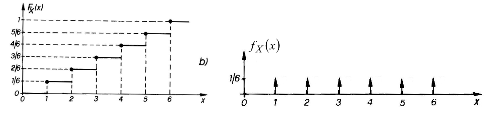

Possiamo quindi descrivere la seguente relazione per degli intervalli:
$$
	P(a < X \le b) = \int_{a}^{b}{f_X(x)\;dx} = \sum_i{\Biggl(p_X(x_i) \cdot \int_{a}^{b}{\delta(x-x_i)\;dx}\Biggr)}
$$

Qualora $a,b \ne x_i$ otteniamo semplicemente la **somma delle probabilità associate ai valori assunti all'interno dell'intervallo** $(a,b)$.

Se invece uno degli estremi, ad esempio $b$, coincide con un valore della variabile aleatoria abbiamo che:
$$
\begin{matrix}
	\int_{a}^{b^+}{f_X(x)\;dx} = P(a < X \le b) & \ne & \int_{a}^{b^-}{f_X(x)\;dx} = P(a < X < b)
\end{matrix}
$$

Questo perché nel primo caso si comprende nell'integrazione l'impulso $P(X=b)\delta(x-b)$, mentre nel secondo lo si esclude.

## 3.1. Variabili Aleatorie Miste

Una variabile aleatoria $X$ si dice **_mista_** se la funzione $F_X(x)$ è _discontinua ma non costante a tratti_.

In tal caso, la probabilità sul salto è data dalla differenza tra i valori $P(X = x_0) = P(X = x_0^+) - P(X = x_0^-)$, mentre sul 'intervallo continuo può assumere valori discreti con probabilità non nulla.

La proprietà di normalizzazione sulle variabili miste vale:
$$
1 = k_1 + \sum_{i}{k_{2,i}}
$$

Dove:
- $k_1$: è l'area sottesa agli intervalli dove $f_X(x) è continuna
- $K_{2,i}$: è l'area associata alle delte di _dirac_ presenti nella $f_X(x)$

# 4. Trasformazioni di una variabile aleatoria

Immaginiamo di avere una variabile aleatoria associata alla tensione  $V \in U[-1\;mV;1\;mV]$. in un circuito dove si trova un resistore $R = 100$ $\Omega$.

Posso quindi associare alla potenza erogata dal resistore un'altra variabile aleatoria $Y$ definità attraverso una **legge di trasformazione**:
$$
Y = g(V) = \frac{V^2}{R}
$$

In questo caso chiamiamo:
- $V$: **variabile aleatoria di partenza**
- $Y$: **variabile aleatoria esito della trasformazione**

Possiamo quindi essere interessati a studiare la dentità di probabilità e/o la funzione di distribuzione di $Y$ piuttosto di quella di $V$.

Formalmente:
> Dato uno spazio campione $\Omega$ e una variabile aleatoria $X$, definiamo una nuova relazione $g(\cdot)$, _funzione reale nella variabile reale_ $x$, che comprende nel suo dominio **tutti i possibili valori di** $X$.
>
> La funzione $g(\cdot)$ associa ad ogni valore di $x$ uno e un solo valore di $Y$, ma permette che più valori distinti $x_i, x_j$ possano dar luogo allo stesso valore di $Y$ $(g(x_i) = g(x_j))$

## 4.1. Metodo della funzione di Distribuzione

È un metodo che fornisce in modo diretto la **funzione di distribuzione della variabile aleatoria trasformata**.

Vediamo intanto la definizione della _funzione di distribuzione_ di $Y$:
$$
\begin{CD}
	\begin{matrix}
		F_Y(y) = P(Y \le y) = P[X \in \frak{J}\mathnormal{(y)}] & & \frak{J}\mathnormal{(y)} = {x : g(x) \le y}
	\end{matrix} \\
	@VVV \\
	F_Y(y) = \int_{\frak{J}\mathnormal{(y)}}{f_X(x)\;dx}
\end{CD}
$$

Ricavata la funzione di distribuzione otteniamo immediatamente la densità di probabilità per derivazione:
$$
f_Y(y) = {dF_Y(y) \over dy}
$$

Questo metodo è applicabile a variabili aleatoria continue, discrete e miste. Tuttavia esistono casi in cui è possibile ricavare la densità di probabilità in modo più semplice.

Infatti, se $Y$ è una variabile aleatoria discreta che assume i valori $y_1, y_2, ..., y_i, ...$ è spesso conveniente determinare direttamente la massa di probabilità $P(Y = y_k)$.

Se quindi anche la $X$ è una _variabile aleatoria discreta_, l'venento $\Set{g(X) = y_k}$ e l'unione di tutti gli eventi $\Set{X = x_i \vert  g(x_i) = y_k}$.
Ponendo $G(y_k) = \set{x_i : g(x_i) = y_k}$:
$$
	p_Y(y_k) = P(Y = y_k) = \sum_{G(y_k)}{P(X = x_i)} = \sum_{G(y_k)}{p_X(x_i)}
$$

Ad esempio:
> Se $Y = X^2$, vogliamo calcolare la probabilità che $Y = 4$, sapendo che $X$ è una variabile aleatori ternaria che può assumere valori $\Set{-2, 0, 2}$ con la stessa probabilità.

La soluzione è banale:
$$
	p_Y(4) = P(X = 2) + P(X = -2) = p_X(2) + p_X(-2) = \frac{2}{3}
$$

Questo ragionamento **_può essere esteso al caso in cui $X$ sia continua_**, a patto che $Y$ sia discreta.

Ad esmepio consideriamo la trasformazione _Hard Limiter_:
$$
	Y = g(x) = \operatorname{sgn}(x) = \begin{cases}
		1 & x > 0 \\
		0 & x = 0 \\
		-1 & x < 0
	\end{cases}
$$

In questo caso abbiamo che:
$$
\begin{align*}
	P(Y = -1) &= P(X < 0) = \int_{-\infty}^{0}{f_X(x)\;dx} = F_X(0) \\[0.75em]
	P(Y = 0) &= P(X = 0) = 0 \\[0.75em]
	P(Y = 1) &= P(X > 0) = \int_0^{+\infty}{f_X(x)\;dx} = 1 - F_X(0) \\[0.75em]
\end{align*}
$$

## 4.2. Teorema Fondamentale per la Trasformazione di una Variabile Aleatoria Continua

Se le variabili aleatorie $X$ e $Y = g(X)$ sono **_entrambe continue_**, è possibile esprimere _direttamente la_ funzione _densità di probabilità_ di $Y$ a mediante quella di $X$.

Gli eventi $\Set{y < Y \le y + dy}$ e $\Set{x < X \le x + dx}$ sono **uguali** poiché costituiti dagli stessi risultati.
Questo ci permette di dire che le **_loro probabilità sono uguali_**:
$$
	f_Y(y)\;dy = f_X(x)\;dx
$$

Essendo $dy = g'(x)dx$ e $x = g^{-1}(y)$ $otteniamo quindi:
$$
	f_Y(y) = \frac{f_X(x)}{\vert g'(x)\vert }
$$

Il valore assoluto è introdotto poiché la funzione $g(x)$ potrebbe essere **monotona decsrescente**, quindi con $g'(x) < 0$.

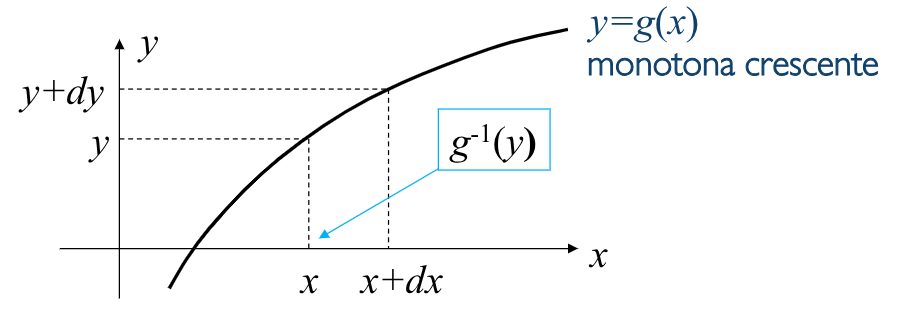

Se in generale $g(x)  fosse una **funzione continua non costante in alcun intervallo**, otterremmo tanti _eventi mutualmente esclusivi_ che si trasformano nel nostro evento quanti sono le soluzioni di $y = g(x)$.

In generale se abbiamo $K$ soluzioni:
$$
	\Set{y < Y \le y + dy} = \bigcup_{i=1}^{K}{\Set{x_i < X \le x_i dx_i}}
$$

Essendo quindi $dy = g'(x_i) dx_i$ per $i = 1,2,3,...$, otteniamo il **_Teorema Fondamentale per la Trasformazione di una Variabile Aleatoria Continua_**:
$$
\Large
\boxed{f_Y(y) = \sum_{i=1}^{K}{\frac{f_X(x_i)}{\vert g'(x_i)\vert }} \qquad \Set{x_i : g(x_i) = y}}
$$

Questa relazione ci fornisce anche un altra informazione.
Se infatti per un certo $y^\ast$ l'equazione $y = g(x)$ non ha soluzione, risulterà che $f_Y(y^\ast) = 0$.

# 5. Indici Caratteristici di una Distribuzione

La funzione di distribuzione, o la densità o la massa di probabilità, forniscono una _descrizione statistica compelta_ della variabile aleatoria $X$. Ovvero ci fornisono la massima informazione che si può avere sul comportamento statistico dei valori assunti da $X$.

In molti casi però non è possibile arrivare a una conoscenza così completa riguardo al problema aleatorio che trattiamo. Perciò, piuttosto che ricavare la _legge di disrtrbuzione_, ci accontentiamo di alcuni **indici caratteristici** che forniscono informazioni parziali sulla legge di distribuzione.

Alcuni indici, che altro non sono che _parametri statistici semplificati_, sono:
- **Valor Medio** o **Valor Atteso**
- **Varianza**
- **Valore Quadratico Medio**

## 5.1. Valore Medio

Il valore medio di una variabile aleatoria discreta è definito come:
$$
\large
\eta_X = E(X) = \sum_i{x_i \cdot p_X(x_i)}
$$

Il simbolo $E(\cdot)$ deriva da _Expectation_, e permette di fornire un'indicazione sulla posizione attorno alla quale si addensano i valori della $X$.

Questo operatore è **lineare**:
1. $E(g(X) +c) = E(g(X)) + c$
2. $E(cg(X)) = cE(g(X))$
3. $E(g(X) + h(X)) = E(g(X)) + E(h(X))$

Riassumendolo in un unica espressione:
$$
\large
E\Biggl(\sum_i{\alpha_ig_i(X)}\Biggr) = \sum_i{\alpha_i E(g_i(X))}
$$

Per questo motivo è detto **_indice di posizione_**, ed è compreso tra il _più piccolo_ e il _più grande_ valore assunto da $X$, potendo anche non coincidere con alcuno dei valori assunti da $X$.

Questa definizione coincide con una **_media pesata_**, infatti in questo caso specifico sappiamo che $\sum_i{p_X(x_i)} = 1$.

## 5.2. Varianza e Deviazione Standard

La _varianza_ e la _deviazione standard_ di una variabile aleatoria misurano lo **scostamento dei valori di $X$ dal suo valor medio**. Sono quindi **_indici di dispersione_**.

$$
\large
\begin{align*}
	\text{Varianza di } X: &\quad \sigma^2 = E\Bigl((X-\eta_X)^2\Bigr) = \sum_i{(x_i - \eta_X)^2p_X(x_i)} \\[1em]
	\text{Deviazione standard di } X : &\quad \sigma_X=\sqrt{\sigma_X^2} = \sqrt{\sum_i{(x_i - \eta_X)^2p_X(x_i)}}
\end{align*}
$$

La deviazione standard è una misura dello scostamento dei valori di $X$, e mantiene le stesse dimensioni fisiche di $X$.

## 5.3. Valore Quadratico Medio

Il valore quadratico medio di una variabile aleatoria rappresenta la **sua **potenza media statistica**:
$$
\Large
P_X = E\Bigl(X^2\Bigr) = \sum_{i}{x_i^2p_X(x_i)}
$$

Il valore quadratico medio e la varianza sono legati da una _semplice relazione_:
$$
\sigma_X^2 = E\Bigl((X-\eta_X)^2\Bigr) = E(X^2 - 2 \eta_X X + \eta_X^2) = E(X^2) - 2\eta_XE(X) + \eta_X2 = P_X - eta_X^2
$$

## 5.4. Definizioni per Variabili Aleatorie Continue

Nel caso di variabili aleatorie continue abbiamo le seguenti definizioni:
$$
\large
\begin{align*}
  \eta_X &= E(X) = \int_{-\infty}^{+\infty}{x\cdot f_X(x)\;dx} & \text{Valore medio di } X \\[1em]
  \sigma_X^2 &= E\Bigl((X-\eta_X)^2\Bigr) = \int_{-\infty}^{+\infty}{(x-\eta_X)^2 f_X(x)\;dx} & \text{Varianza di } X \\[1em]
  \sigma &= \sqrt{\sigma_X^2} = \sqrt{\int_{-\infty}^{+\infty}{(x-\eta_X)^2 f_X(x)\;dx}} & \text{Deviazione standard} \\[1em]
  P_X &= E(X^2) = \int_{-\infty}^{+\infty}{x^2 f_X(x)\;dx} & \text{Valor quadratico medio di } X
\end{align*}
$$

Per quanto riguarda la _varianza_, graficamente rappresenta quanto una funzione di distribuzione di probabilità è "allargata" attorno al valore atteso.
In particolare, date due funzioni $f_{X_1}(x)$ e $f_{X_2}(x)$ dove la prima è più "allargata" avremo che $\sigma_{X_2}^2 < \sigma_{X_1}^2$

Il valor medio ha invece la proprietà che su **funzioni pari** è nullo, infatti:
$$
\eta_X = \int_{-\infty}^{+\infty}{\overbrace{x}^{\text{dispari}}\underbrace{f_X(x)}_{\text{pari}}\;dx} = 0
$$

In generale se la _ddp_ ha **simmetria rispetto ad $x = a$**:
$$
\begin{CD}
{
  \eta_X = \int_{-\infty}^{+\infty}{(a-x)f_X(x)\;dx} = a \cdot 1 - \int_{-\infty}^{+\infty}{x f_X(x)\;dx} = 0
} \\
@VVV \\
{
  \eta_X = a
}
\end{CD}
$$

## 5.5. Teorema dell'Aspettazione

Se $Y = g(X)$ è possibile ricavare il valor medio di $Y$ direttamente dalla distribuzione di $X$.

Consideriamo il caso in cui $Y$ e $X$ siano variabili aleatorie discrete:
$$
\eta_Y = E(Y) = \sum_{k}{y_k P(Y = y_k)}
$$

Possiamo scrivere il primo termine di questa sommatoria come:
$$
y_1 P(Y = y_1) = y_1 \sum_{G(y_1)}{P(X=x_i)} = \sum_{G(y_1)}{g(x_i)P(X=x_i)}
$$

Dove la somma è estesa sull'insieme &emsp; $G(y_1) = \Set{x_i : g(x_i) = y_1}$.

Questo vale analogamente per tutti i termini della sommatoria, notando che $\Set{G(y_1), G(y_2), ..., G(y_n)}$ costituiscono una partizione di $\R$, si ottiene che $E(Y)$ può essere espressa coma:
$$
\Large
\boxed{
  E(Y) = E\Bigl(g(X)\Bigr) = \sum_i{g(x_i)P(X=x_i)}
}
$$

Possiamo notare come la _varianza_ non sia altro che un caso particolare di questa formula dove $g(X) = (X-\eta_X)^2$.

Questo teorema vale anche per variabili aleatorie continue:
$$
\Large
\boxed{
  E(Y) = E\Bigl(g(X)\Bigr) = \int_{-\infty}^{+\infty}{g(x_i)f_X(x)\;dx}
}
$$

## 5.6. Indici di Variabili Aleatorie Notevoli

### 5.6.1. Variabile Aleatoria Uniforme

Data $X\in U(a,b)$:
$$
f_X(x) = \begin{cases}
  \frac{1}{b-a} & a \le x \le b \\
  0 & \text{altrove}
\end{cases}
$$

Otteniamo che:
$$
\begin{align*}
	\eta_X = \int_{-\infty}^{+\infty}{xf_X(x)\;dx} &= \int_{b}^a{\frac{x}{b-a}\;dx} = \dots = \frac{a+b}{2} \\[1em]
	P_X = E(X^2) =  \int_{-\infty}^{+\infty}{x^2f_X(x)\;dx} &= \int_b^a{\frac{x^2}{b-a}\;dx} = \dots = \frac{a^2+ab+b^2}{3} \\[1em]
	\sigma_X^2 = P_X - \eta_X^2 &= \frac{a^2 + ab + b^2}{3} - \frac{(a+b)^2}{4} = \dots = \frac{(b-a)^2}{12}
\end{align*}
$$

### 5.6.2. Variabile Esponenziale

$$
\begin{align*}

\eta_X = \int_{-\infty}^{+\infty}{xf_X(x)\;dx} &= \dots = \lambda

\\[1em]

P_X = E(X^2) =  \int_{-\infty}^{+\infty}{x^2f_X(x)\;dx} &= \dots = 2\lambda^2

\\[1em]

\sigma_X^2 = P_X - \eta_X^2 &= \lambda^2

\end{align*}
$$

### 5.6.3. Variabile di Poisson

$$
\begin{align*}

\eta_X = \int_{-\infty}^{+\infty}{xf_X(x)\;dx} &= \dots = \Lambda

\\[1em]

P_X = E(X^2) =  \int_{-\infty}^{+\infty}{x^2f_X(x)\;dx} &= 2\Lambda^2

\\[1em]

\sigma_X^2 = P_X - \eta_X^2 &= \Lambda

\end{align*}
$$

### 5.6.4. Variabile Gaussiana

Calcoliamo innanzitutto la _Variabile Gaussiana Standard_:
$$
\begin{matrix}
	Z \in \cal{N}\mathnormal{(0, 1)} && f_Z(z) = \frac{1}{\sqrt{2\pi}}e^{-z^2/2}
\end{matrix}
$$

In questo caso abbiamo che:
$$
\begin{align*}
	E[Z] &= \eta_Z = 0 && \text{La funzione } f_Z(z) \text{ è pari} \\
	E[(Z-\eta_Z)^2] = E[Z^2] = \int_{-\infty}^{\infty}{z^2 \cdot \frac{1}{\sqrt{2\pi}}e^{-z^2/2}\;dz} = \dots = 1
\end{align*}
$$

Di conseguenza abbiamo dimostrato che $(\eta_z, \sigma_z^2) = (0, 1)$

Se lo volessimo fare per una generica variabile aleatoria gaussiana possiamo sfruttare le trasformazioni tra variabili aleatorie:
$$
\begin{matrix}
	X = \sigma_X \cdot Z + \eta_X && \sigma_X > 0
\end{matrix}
$$

Possiamo quindi utilizzare il teorema sulla distribuzione di probabilità nelle trasformazioni:
$$
\begin{matrix}
f_X(x) = \sum_{i=1}^{K}{\frac{f_Z(z_i)}{\vert g'(z_i)\vert }} && z_i = g'(x)
\end{matrix}
$$

Poiché la trasformazione è **lineare monotona**, ovvero &emsp; $\forall x, \exist! z \;\vert \;f(z) = x$, possiamo riassumere il teorema:
$$
\begin{CD}
	\underbrace{
		\begin{matrix}
			f_X(x) = \frac{f_Z(z_1)}{\vert g'(z_1)\vert } && z_1 = \frac{x - \eta_X}{\sigma_X}
		\end{matrix}
	} \\
	@VVV \\
	{
		f_X(x) = \frac{1}{\sigma_X} \cdot \frac{1}{\sqrt{2\pi}}e^{-\frac{(x-\eta_X)^2}{\sigma_X^2}\cdot \frac{1}{2}}
	} \\
	@VVV \\
	{
		f_X(x) = \frac{1}{\sqrt{2\pi\sigma_X^2}}e^{-\frac{(x-\eta_X)^2}{2\sigma_X^2}}
	}
\end{CD}
$$

A questo punto possiamo quindi calcolare il valor medio e la varianza di $X$:
$$
\begin{align*}
	E[X] &= E[\sigma_X \cdot Z + \eta_X] = \sigma_X \cdot E[Z] + \eta_X = \eta_X \\
	E[(X-\eta_X)^2] = E[(\sigma_X + Z)^2] = \sigma_X^2 \cdot E[Z^2] = \sigma_X^2
\end{align*}
$$

## 5.7. Teorema di Tchebycheff

> Data una qualsiasi variabile aleatoria $X$ con **varianza finita**:
$$
\begin{CD}
	\begin{matrix}
  	P(\vert X-\eta_X\vert  \ge k\sigma_X) \le \frac{1}{k^2} & \forall k > 1
	\end{matrix} \\
	@VVV \\
	{
	P(\eta_X - k\sigma_X \le X \le \eta_X + k \sigma_X) \ge 1 - \frac{1}{k^2}
	}
\end{CD}
$$

Il teorema stabilisce quindi un **limite inferiore** alla probabilità che la variabile aleatoria $X$ sia entro un intervallo _centrato attorno al valor medio_ e di ampiezza paria a _$2k$ volte la deviazione standard_, **indipendentemente dalla densità di probabilità**.

Se ad esempio scegliamo $k = 5$, vorrà dirre che la probabilità che $X$ stia entro $\pm 5$ volte la deviazione standard rispetto al valor medio è _almeno_ $1 - \frac{1}{25} = 0.96$

Se quindi abbiamo nota la deviazione standard, possiamo determinare un intervallo centrato nel valor medio e di ampiezza $2\varepsilon$ in cui il valore osservato della variabile aleatoria $X$ **cade probabilità molto elevata**:
$$
\begin{CD}
	\underbrace{
		\begin{CD}
			{\varepsilon = k\sigma_X} @>>> {\frac{1}{k^2} = \frac{\sigma_X^2}{\varepsilon^2}}
		\end{CD}
	} \\
	@VVV \\
	{
		P(\vert X - \eta_X\vert  \le \varepsilon) = P(\eta_X - \varepsilon \le X \le \eta_X + \varepsilon) \ge 1 - \frac{\sigma_X}{\varepsilon^2}
	}
\end{CD}
$$

Abbiamo messo quindi in evidenza che la probabilità che $X \in [\eta_X - \varepsilon, \eta_X + \varepsilon)$, se $\sigma_X \ll \varepsilon$, è _**molto ptossima all'unità**_.

# 6. Variabili Aleatorie Condizionate

La **funzione di distribuzione** della variabile aleatoria $X$, condizionata all'evento $C$, è definita come:
$$
	F_{X\vert C}(x\vert C) = P(X \le x\vert C) = \frac{P(X \le x,C)}{P(C)}
$$

Dove l'evento $\Set{X \le x,C}$ rappresenta **tutti i punti dello spazio campione** per cui $\Set{X(\omega) \le x}$ e $\Set{\omega \in C}$, ovvero l'evento $\Set{X \le x} \cap C$.

Queste variabili godono delle seguenti proprietà:
$$
\def\arraystretch{1.5}

\begin{matrix}
	0 \le F_{X\vert C} (x\vert C) \le 1 \\
	P(x_1 < X \le x_2 \vert  C) = F_{X\vert C}(x_2 \vert  C) - F_{X\vert C}(x_1\vert C) \\
	F_{X\vert C}(x_1\vert C) \le F_{X\vert C}(x_2\vert C) & x_1 < x_2 \\
	F_{X\vert C}(-\infty \vert  C) = 0 \\
	F_{X\vert C}(\infty \vert  C) = 1 \\
	F_{X\vert C}(x^+\vert C) = F_{X\vert C}(x\vert C)
\end{matrix}
$$

## 6.1. Assenza di Memoria delle Variabili Esponenziali

Data una variabile aleatoria $X \in Exp(\lambda)$:
$$
\begin{matrix}
	f_X(x) = \frac{1}{\lambda}e^{-x/\lambda}u(x) && F_X(x) = (1 - e^{-x/\lambda})u(x)
\end{matrix}
$$

Supponiamo di avere quindi un asse dei tempi $t$ e di avere una lampadina.

L'evento di _spegnimento per guasto della lampadina_ è rappresentato dalla variabile aleatoria $X$.

Se volessimo calcolare la probabilità che la lampadina si spenga solo dopo un istante $t_0$:
$$
\begin{align*}
	P(X > t_0)  &= 1 - P(X \le t_0) \\
				&= 1 - F_X(t_0) \\
				&= 1 - (1 - e^{-t_0/\lambda}) \\
				&= e^{-t_0/\lambda}
\end{align*}
$$

A questo punto possiamo calcolare la probabilità che, sapendo che la lampadina è accesa a $t_0$, qual è la probabilità che sia ancora accesa a $t_0 + \Delta_t$:
$$
\begin{align*}
P(X > t_0 + \Delta t \vert  X > t_0) &= \frac{P(X>t_0 + \Delta t) \cap (X > t_0)}{P(x>t_0)} \\
								&= \frac{P(X>t_0 + \Delta t)}{P(x>t_0)} \\
								&= \frac{e^{-(t_0 + \Delta t)/\lambda}}{e^{-t_0/\lambda}} \\
								&= e^{\Delta t/\lambda} = P(X > \Delta t) \\
\end{align*}
$$

Quello che notiamo è che sul guasto della lampadina sembra **non avere importanza quanto cosa è accaduto prima**.